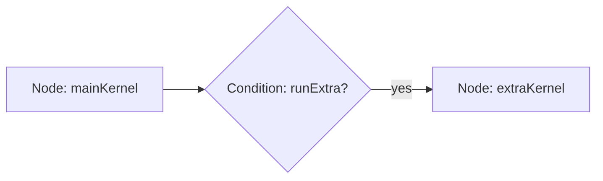
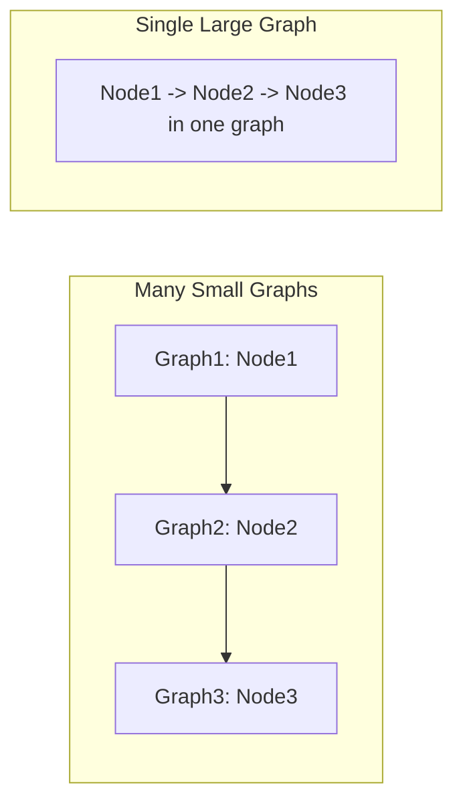
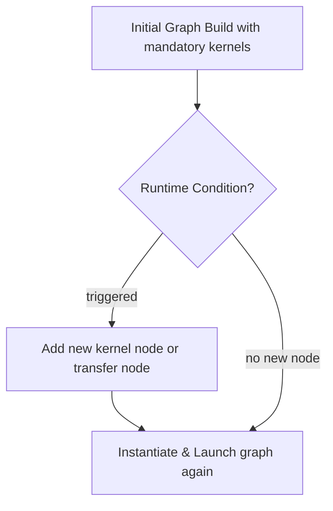

# Day 73: Dynamic Graph Launches

**Dynamic Graph Launches** allow you to construct and execute **CUDA graphs** at runtime based on changing conditions or adaptive algorithms. This approach can minimize overhead for large, repeated workflows, but creating **too many small graphs** can incur its own overhead, negating benefits. In this lesson, we explore how to **build and launch graphs dynamically**, discuss best practices to avoid oversubscription, and illustrate these concepts through **three different conceptual diagrams**. We also highlight the role of **Nsight** tools for analyzing graph overhead.

---

## Table of Contents
1. [Overview](#1-overview)  
2. [Why Dynamic Graph Launches?](#2-why-dynamic-graph-launches)  
3. [Implementation Approach](#3-implementation-approach)  
   - [a) Conditional Graph Building](#a-conditional-graph-building)  
   - [b) Instantiating & Reusing Graphs](#b-instantiating--reusing-graphs)  
   - [c) Minimizing Overhead](#c-minimizing-overhead)  
4. [Code Example: Runtime Graph Construction](#4-code-example-runtime-graph-construction)  
   - [Explanation & Comments](#explanation--comments)  
5. [Common Pitfalls & Oversubscription](#5-common-pitfalls--oversubscription)  
6. [Conceptual Diagrams](#6-conceptual-diagrams)  
   - [Diagram 1: Condition-Based Graph Building](#diagram-1-condition-based-graph-building)  
   - [Diagram 2: Multiple Small Graphs vs. One Large Graph](#diagram-2-multiple-small-graphs-vs-one-large-graph)  
   - [Diagram 3: Adaptive Expansion of a Graph at Runtime](#diagram-3-adaptive-expansion-of-a-graph-at-runtime)  
7. [References & Further Reading](#7-references--further-reading)  
8. [Conclusion](#8-conclusion)  
9. [Next Steps](#9-next-steps)

---

## 1. Overview
In **Day 73**, we tackle **dynamic graph launches**—where your code decides at runtime how to assemble and launch CUDA graphs. While static graphs are built once for repeated patterns, dynamic approaches can tailor the execution flow based on data-dependent decisions or advanced HPC pipelines. However, repeatedly building small graphs or frequently re-instantiating them can introduce overhead that undermines concurrency gains.

---

## 2. Why Dynamic Graph Launches?
1. **Adaptive Algorithms**: Some kernels might only be necessary under certain conditions, e.g., additional processing for outliers.  
2. **Data-Dependent Flows**: Graph nodes (kernels or memcopies) only become relevant if certain runtime checks pass, so the graph is built with the relevant nodes.  
3. **Reduced Boilerplate**: By capturing the entire pipeline in a graph at runtime, you avoid repeated low-level synchronization or event code.  

Despite these benefits:
- **Too Many Graphs**: Creating multiple small graphs can be more expensive than launching regular kernels if the overhead of graph creation/instantiation is repeated too often.  
- **Complex Dependencies**: The more you conditionally add or skip nodes, the more carefully you must manage node dependencies.

---

## 3. Implementation Approach

### a) Conditional Graph Building
- **Check Condition**: E.g., if a data batch requires an extra filtering kernel, add the corresponding node.  
- **API**: Use `cudaGraphAddKernelNode()`, `cudaGraphAddMemcpyNode()`, etc., conditionally depending on input arguments.

### b) Instantiating & Reusing Graphs
- **Graph Creation**: Building the graph each iteration can be costly. If conditions do not vary heavily, consider building once for each “pattern” of conditions or reusing partially.  
- **Instantiation**: `cudaGraphInstantiate()` compiles the graph into an executable form. If conditions remain stable across multiple runs, reuse the same graph rather than rebuilding.

### c) Minimizing Overhead
- **Batch Operations**: Instead of building a small graph per step, group multiple steps into a single larger graph, limiting how frequently you pay the instantiation cost.  
- **Nsight Tools**: Evaluate with Nsight to see if graph building or launching overhead is overshadowing potential gains.

---

## 4. Code Example: Runtime Graph Construction

Below is a code snippet illustrating how to build a **dynamic graph** at runtime depending on a condition that determines whether to run an “extraKernel.”

```cpp
// File: dynamic_graph_example.cu
#include <cuda_runtime.h>
#include <stdio.h>

__global__ void mainKernel(float* data, int N) {
    int idx = blockIdx.x * blockDim.x + threadIdx.x;
    if (idx < N) {
        data[idx] += 1.0f;
    }
}

__global__ void extraKernel(float* data, int N) {
    int idx = blockIdx.x * blockDim.x + threadIdx.x;
    if (idx < N) {
        data[idx] *= 2.0f;
    }
}

int main() {
    int N = 1 << 20; // 1 million
    size_t size = N * sizeof(float);

    // Condition that decides if we run extraKernel
    bool runExtra = true; // dynamic condition in real code

    float *d_data;
    cudaMalloc(&d_data, size);
    cudaMemset(d_data, 0, size);

    // Create a graph
    cudaGraph_t graph;
    cudaGraphCreate(&graph, 0);

    // Node 1: mainKernel
    cudaGraphNode_t nodeMain;
    cudaKernelNodeParams mainParams = {0};
    dim3 block(256), grid((N+255)/256);
    void* mainArgs[2] = {(void*)&d_data, (void*)&N};

    mainParams.func = (void*)mainKernel;
    mainParams.gridDim = grid;
    mainParams.blockDim = block;
    mainParams.sharedMemBytes = 0;
    mainParams.kernelParams = mainArgs;
    cudaGraphAddKernelNode(&nodeMain, graph, nullptr, 0, &mainParams);

    // Node 2 (conditional): extraKernel if runExtra is true
    cudaGraphNode_t nodeExtra;
    if(runExtra) {
        cudaKernelNodeParams extraParams = mainParams; // copy base config
        extraParams.func = (void*)extraKernel;
        cudaGraphAddKernelNode(&nodeExtra, graph, &nodeMain, 1, &extraParams);
    }

    // Instantiate
    cudaGraphExec_t graphExec;
    cudaGraphInstantiate(&graphExec, graph, NULL, NULL, 0);

    // Launch the graph
    cudaGraphLaunch(graphExec, 0);
    cudaDeviceSynchronize();

    // Cleanup
    cudaGraphExecDestroy(graphExec);
    cudaGraphDestroy(graph);
    cudaFree(d_data);

    return 0;
}
```

### Explanation & Comments

1. **runExtra Condition**: Decides whether to add `extraKernel` node or not.  
2. **Graph Node**: `mainKernel` is always added, `extraKernel` is conditionally added with a dependency on `nodeMain`.  
3. **Instantiation & Launch**: Once built, the graph runs whichever nodes were added. If `runExtra` was false, the graph only has `mainKernel`.  

---

## 5. Common Pitfalls & Oversubscription

- **Frequent Rebuilding**: If the condition changes every iteration, you might rebuild the graph for each iteration, incurring overhead. Consider building a small set of possible graphs or reusing.  
- **Missing Dependencies**: If you skip a kernel but later rely on its output, you must ensure the next node does not read incomplete data.  
- **Small Graph Overhead**: Creating many small graphs (e.g., 100s of times per second) can overshadow the advantage of minimized launch overhead.  
- **Forgetting Final Launch**: You must call `cudaGraphLaunch(...)` or your kernels will never run.

---

## 6. Conceptual Diagrams

We provide three different conceptual diagrams illustrating different dynamic graph usage scenarios.

### Diagram 1: Condition-Based Kernel Insertion


**Explanation**: Depending on the run-time condition, we add or skip the `extraKernel` node. The final graph may or may not contain that node.

---

### Diagram 2: Multiple Small Graphs vs. One Large Graph


**Explanation**:  
- Left side: building many small graphs might cause overhead each time.  
- Right side: a single larger graph merges operations, reducing repeated overhead.  

---

### Diagram 3: Adaptive Expansion of a Graph at Runtime


**Explanation**:  
- The graph is partially built. If a new condition emerges, we add nodes or edges, then re-instantiate.  
- A final re-launch runs the updated graph structure.

---

## 7. References & Further Reading

- [Nsight Documentation](https://docs.nvidia.com/nsight-systems/) – Analyzing concurrency and overhead for repeated or dynamic graph usage.  
- [CUDA C Programming Guide – Graph Best Practices](https://docs.nvidia.com/cuda/cuda-c-programming-guide/index.html#graphs) – Official documentation for building and launching CUDA graphs.  
- [NVIDIA Developer Blog – Advanced CUDA Graph Examples](https://developer.nvidia.com/blog/tag/cuda-graphs/) – Real-world HPC pipelines.

---

## 8. Conclusion

**Day 73** explores how to **dynamically build and launch CUDA graphs**. This approach is powerful for **data- or condition-dependent** HPC pipelines, but repeated small graph creation can overshadow potential performance gains. By carefully bundling operations and reusing or selectively adding nodes, you harness the efficiency of a single launch overhead while preserving flexibility for variable workflows. Tools like **Nsight Systems** help detect if overhead from dynamic graph creation is overshadowing concurrency benefits.

---

## 9. Next Steps

1. **Gather Patterns**: Identify common “flows” in your HPC or real-time app, build a small set of graphs for each scenario rather than constructing them from scratch each iteration.  
2. **Profile**: Use Nsight to see how often you build vs. launch the graph. If overhead is high, consider merging more operations into one graph.  
3. **Partial Reuse**: Evaluate advanced API calls to reconfigure existing graphs rather than discarding them each time.  
4. **Debug**: Ensure every graph node is correctly added and finalizing the graph with a proper launch is done – missing final steps can produce incomplete runs.  
5. **Extend**: Combine dynamic graph building with multi-GPU or multi-process (MPS) usage for large-scale HPC pipelines that adapt to real-time conditions.

```
