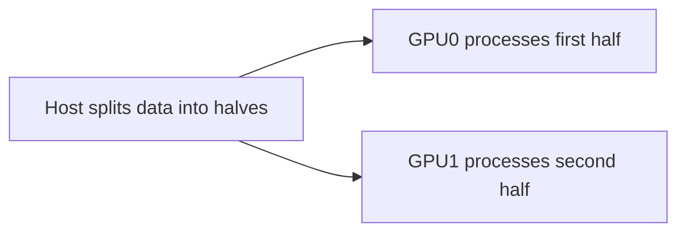
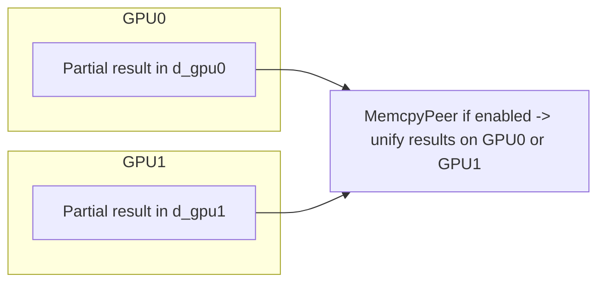
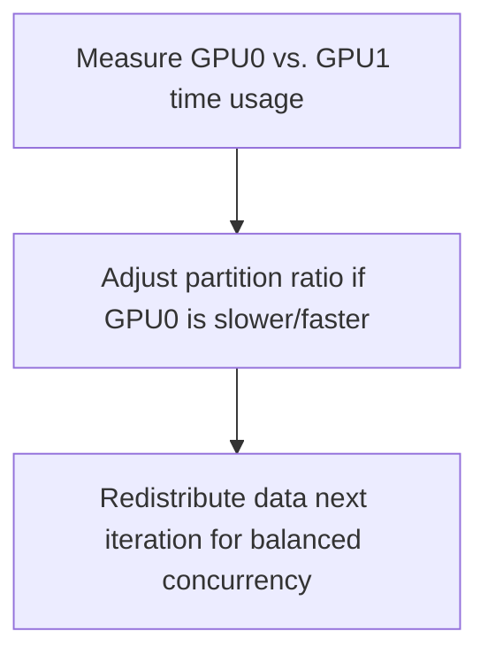

# Day 74: Multi-GPU Programming (Deeper Exploration)

Multi-GPU Programming involves **splitting workloads** across multiple GPUs to scale performance beyond the limits of a single device. However, this approach introduces complexities such as **load imbalance** (if the data split or partitioning strategy is uneven) and **inter-GPU communication** overhead. In **Day 74**, we expand on multi-GPU distribution patterns, concurrency models, and best practices to optimize HPC applications. We also provide **multiple conceptual diagrams** to illustrate how tasks and data might be shared across two GPUs.

---

## Table of Contents
1. [Overview](#1-overview)  
2. [Why Multi-GPU Programming?](#2-why-multi-gpu-programming)  
3. [Key Implementation Strategies](#3-key-implementation-strategies)  
   - [a) Data Decomposition](#a-data-decomposition)  
   - [b) Compute Partitioning](#b-compute-partitioning)  
   - [c) Peer-to-Peer (P2P) Access](#c-peer-to-peer-p2p-access)  
4. [Load Imbalance & Mitigation](#4-load-imbalance--mitigation)  
5. [Code Example: Splitting an HPC Task Between Two GPUs](#5-code-example-splitting-an-hpc-task-between-two-gpus)  
   - [Explanation & Comments](#explanation--comments)  
6. [Multiple Conceptual Diagrams](#6-multiple-conceptual-diagrams)  
   - [Diagram 1: Basic Multi-GPU Data Partition](#diagram-1-basic-multi-gpu-data-partition)  
   - [Diagram 2: Peer-to-Peer Merged Results](#diagram-2-peer-to-peer-merged-results)  
   - [Diagram 3: Adaptive Load Balancing Among Two GPUs](#diagram-3-adaptive-load-balancing-among-two-gpus)  
7. [References & Further Reading](#7-references--further-reading)  
8. [Conclusion](#8-conclusion)  
9. [Next Steps](#9-next-steps)

---

## 1. Overview

Single-GPU solutions can reach a performance wall for **very large data sets** or high-volume HPC tasks. **Multi-GPU** solutions distribute the workload—like sub-arrays, sub-matrices, or sub-graphs—across multiple devices. This can **massively increase throughput** if done correctly, but also introduces potential pitfalls: how to partition data, unify results, synchronize the GPUs, and handle potential **load imbalance**.

---

## 2. Why Multi-GPU Programming?

1. **Larger Memory Capacity**: Combining GPU memory from two or more devices may handle bigger data sets that don’t fit in a single GPU’s memory.  
2. **Increased Throughput**: Each GPU can process its portion of the data concurrently, often doubling or tripling performance.  
3. **Parallel Pipelines**: For real-time or streaming HPC tasks, one GPU can process batch N while another handles batch N+1, or partial merges can be done in **Peer-to-Peer** mode.

---

## 3. Key Implementation Strategies

### a) Data Decomposition
- **Range Splitting**: For a 1D array of size N, GPU0 processes `[0..(N/2)-1]` while GPU1 processes `[N/2..N-1]`.  
- **Tiling**: For 2D arrays/matrices, each GPU gets different sub-tiles.  
- **Graph Partitioning**: BFS or PageRank partitions the node sets or edges across GPUs.

### b) Compute Partitioning
- **Partial Computation**: Each GPU runs the same kernel code, but on separate data subsets.  
- **Pipeline**: GPU0 outputs partial results that are consumed by GPU1 (or vice versa), forming a multi-stage pipeline.

### c) Peer-to-Peer (P2P) Access
- **Direct Transfers**: When enabled, `cudaMemcpyPeerAsync` or direct memory reads can skip host staging.  
- **Limits**: Not all GPU pairs or PCIe topologies support P2P, requiring checks with `cudaDeviceCanAccessPeer`.

---

## 4. Load Imbalance & Mitigation

- **Unequal Data Splits**: If GPU0’s portion is more complex or has more “work,” it finishes later, leaving GPU1 idle.  
- **Adaptive Partitioning**: Dynamically measure each GPU’s load or run times, re-assign data chunks to achieve better concurrency.  
- **Overlapping**: If GPUs have to merge partial results, consider concurrency strategies or pipeline transitions to hide communication overhead.

---

## 5. Code Example: Splitting an HPC Task Between Two GPUs

Below is a simplified snippet distributing a large array’s computation between two GPUs. Each GPU doubles its sub-range. We then unify results on GPU0 via **P2P** if possible.

```cpp
// File: multi_gpu_split_example.cu
#include <cuda_runtime.h>
#include <stdio.h>

__global__ void doubleKernel(float *data, int size) {
    int idx = blockIdx.x * blockDim.x + threadIdx.x;
    if (idx < size) {
        data[idx] *= 2.0f;
    }
}

int main() {
    int deviceCount;
    cudaGetDeviceCount(&deviceCount);
    if (deviceCount < 2) {
        printf("Need at least 2 GPUs.\n");
        return 0;
    }

    int N = 2000000;
    size_t halfN = N / 2;
    size_t halfSize = halfN * sizeof(float);

    float *d_gpu0, *d_gpu1;
    cudaSetDevice(0);
    cudaMalloc(&d_gpu0, halfSize);
    cudaMemset(d_gpu0, 1, halfSize); // pretend data ~1

    cudaSetDevice(1);
    cudaMalloc(&d_gpu1, halfSize);
    cudaMemset(d_gpu1, 1, halfSize);

    // Launch kernel on GPU 0
    cudaSetDevice(0);
    doubleKernel<<<(halfN + 255)/256, 256>>>(d_gpu0, halfN);

    // Launch kernel on GPU 1
    cudaSetDevice(1);
    doubleKernel<<<(halfN + 255)/256, 256>>>(d_gpu1, halfN);

    // Check P2P for direct unify
    int canAccess01, canAccess10;
    cudaDeviceCanAccessPeer(&canAccess01, 0, 1);
    cudaDeviceCanAccessPeer(&canAccess10, 1, 0);
    if (canAccess01 && canAccess10) {
        cudaSetDevice(0);
        cudaDeviceEnablePeerAccess(1,0);
        cudaSetDevice(1);
        cudaDeviceEnablePeerAccess(0,0);

        // unify or gather results to GPU0
        float* d_combined;
        cudaSetDevice(0);
        cudaMalloc(&d_combined, N * sizeof(float));
        // copy GPU1 portion to second half
        cudaMemcpyPeer(d_combined + halfN, 0, d_gpu1, 1, halfSize);
        // copy GPU0 portion to first half
        cudaMemcpy(d_combined, d_gpu0, halfSize, cudaMemcpyDeviceToDevice);
        // optional: further kernel on d_combined
        cudaFree(d_combined);
    } else {
        // fallback: copy d_gpu1 to host, then to GPU0, etc.
    }

    // Sync and cleanup
    cudaSetDevice(0);
    cudaDeviceSynchronize();
    cudaFree(d_gpu0);

    cudaSetDevice(1);
    cudaDeviceSynchronize();
    cudaFree(d_gpu1);

    return 0;
}
```

### Explanation & Comments
1. **Device Selection**: GPU0 handles `[0..(N/2)-1]`, GPU1 handles `[N/2..N-1]`.  
2. **Kernel**: `doubleKernel` multiplies each sub-range by 2.  
3. **P2P**: If enabled, merges GPU1’s portion directly into GPU0’s memory. Otherwise, fallback to host.  
4. **Load Imbalance**: If each half does a similar load, it’s balanced. If not, consider splitting differently or measuring run times.

---

## 6. Multiple Conceptual Diagrams

Here are **three distinct diagrams** highlighting multi-GPU usage:

### Diagram 1: Basic Multi-GPU Data Partition


**Explanation**: The simplest approach is dividing data in halves. Each GPU runs the same kernel logic on separate data.

---

### Diagram 2: Peer-to-Peer Merged Results


**Explanation**: After each GPU completes partial computations, a direct P2P transfer merges them in a single device for final processing or output.

---

### Diagram 3: Adaptive Load Balancing Among Two GPUs


**Explanation**: If GPU0 finishes late (data is too big or more complex), shift more data to GPU1 for the next iteration, and vice versa. This helps achieve a balanced load across multiple GPUs.

---

## 7. References & Further Reading

- [Multi-GPU Programming](https://docs.nvidia.com/cuda/cuda-c-programming-guide/index.html#multiple-gpus) – Official CUDA documentation for multi-GPU techniques.  
- [NVIDIA Developer Blog – Multi-GPU HPC Case Studies](https://developer.nvidia.com/blog/tag/multi-gpu/) – Example HPC pipelines.  
- [Nsight Compute & Nsight Systems – Analyzing Multi-GPU Workloads](https://developer.nvidia.com/nsight-tools) – Tools for concurrency, profiling, and bottleneck identification.  
- [Gunrock or GScaling BFS – If Graph-based HPC or BFS expansions on multiple GPUs is needed](https://gunrock.github.io/)

---

## 8. Conclusion

**Day 74** underscores **multi-GPU programming** as a powerful scaling technique, distributing data or compute among multiple devices. The approach can dramatically boost performance for large HPC tasks or real-time pipelines, but **load imbalance** or **poor synchronization** can hamper potential gains. Carefully split data, enable P2P if available, and consider dynamic rebalancing if the workloads or complexities differ significantly.

---

## 9. Next Steps

1. **Check P2P Support**: If your system supports it, bypass the host for partial merges or pipeline transitions.  
2. **Monitor Load Balance**: If one GPU is consistently lagging, adapt partitioning or domain decomposition.  
3. **Profile**: Use Nsight Systems to confirm concurrency across GPUs, analyzing how data flows and where stalls occur.  
4. **Extend**: For more than two GPUs, generalize the approach to multiple devices, possibly using advanced libraries or frameworks for multi-GPU HPC.

Enjoy scaling your HPC solutions beyond a single GPU, harnessing multi-GPU concurrency to tackle large data sets or real-time workloads with higher throughput!
```
