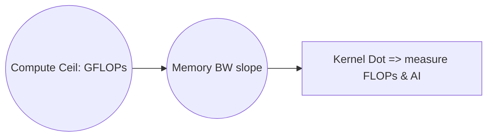
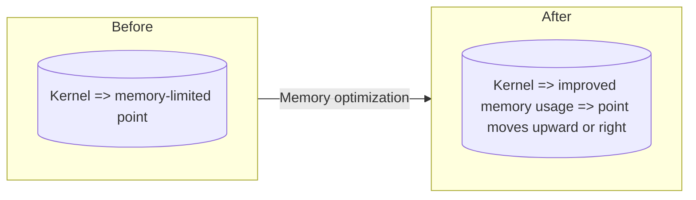

# Day 75: Performance Metrics & Roofline Analysis

A **Roofline Analysis** is a powerful technique to visualize and understand whether a GPU kernel is **memory-bound** or **compute-bound** by comparing measured performance (FLOPS, memory bandwidth) against hardware limits. By collecting **memory throughput** and **FLOPS** metrics, you can plot your kernel’s performance relative to theoretical maximums. However, **misreading the results**—e.g., assuming a memory-bound kernel is compute-bound—often leads to futile optimizations.

Below, we explore the fundamentals of the roofline model, describe how to collect relevant metrics, and illustrate these concepts with **multiple conceptual diagrams**. We also reference the [NVIDIA Roofline Analysis Blog](https://developer.nvidia.com/blog/tag/roofline/) for further insights.

---

## Table of Contents
1. [Overview](#1-overview)  
2. [What is the Roofline Model?](#2-what-is-the-roofline-model)  
3. [Collecting Performance Metrics](#3-collecting-performance-metrics)  
   - [a) FLOPS Measurement](#a-flops-measurement)  
   - [b) Memory Throughput](#b-memory-throughput)  
4. [Constructing a Roofline Chart](#4-constructing-a-roofline-chart)  
   - [a) Operational Intensity](#a-operational-intensity)  
   - [b) Plotting Kernel Performance](#b-plotting-kernel-performance)  
5. [Code Example: Gathering Metrics with Nsight Compute](#5-code-example-gathering-metrics-with-nsight-compute)  
   - [Explanation & Comments](#explanation--comments)  
6. [Common Pitfalls in Roofline Analysis](#6-common-pitfalls-in-roofline-analysis)  
7. [Multiple Conceptual Diagrams](#7-multiple-conceptual-diagrams)  
   - [Diagram 1: Basic Roofline Concept](#diagram-1-basic-roofline-concept)  
   - [Diagram 2: Locating Kernel on the Roofline](#diagram-2-locating-kernel-on-the-roofline)  
   - [Diagram 3: Shifting Kernel Performance with Optimizations](#diagram-3-shifting-kernel-performance-with-optimizations)  
8. [References & Further Reading](#8-references--further-reading)  
9. [Conclusion](#9-conclusion)  
10. [Next Steps](#10-next-steps)

---

## 1. Overview
In **Day 75**, we focus on how to **collect performance metrics** (FLOPS, memory bandwidth) and **chart them on a roofline** to determine if a kernel is memory-bound or compute-bound. By accurately locating your kernel on the roofline, you identify the limiting factor and tailor optimizations for either improving arithmetic intensity (if memory-bound) or improving math throughput (if compute-bound). Misinterpreting these results can lead to wasted effort—like unrolling loops further on a memory-bound kernel that’s actually starved of bandwidth, not compute resources.

---

## 2. What is the Roofline Model?
The **Roofline Model** is a visual performance model that relates:
- **Arithmetic Intensity** (FLOP/Byte) on the horizontal axis.  
- **Performance** (FLOPS) on the vertical axis.  
- **Memory Bandwidth Ceiling**: The “memory-bound” diagonal line.  
- **Compute Ceilings**: The horizontal lines representing maximum possible FLOPS on the device.

Your kernel’s measured performance is plotted with its operational intensity. If the point is near the memory-bound line, you should focus on data access optimizations. If it’s near the compute ceiling, you might optimize registers, ILP, or occupancy to fully exploit compute throughput.

---

## 3. Collecting Performance Metrics

### a) FLOPS Measurement
- **FP32 or FP64 ops**: Tools like Nsight Compute measure total floating-point operations executed, enabling you to compute GFLOPS.  
- **Hardware Counters**: Various counters track the number of instructions or the cycles the FP units are active.

### b) Memory Throughput
- **Bandwidth**: Nsight Compute or Nsight Systems can measure actual memory bytes read/written.  
- **Effective vs. Theoretical**: Compare measured throughput to the GPU’s stated maximum bandwidth to see how close you are to the memory “roof.”

---

## 4. Constructing a Roofline Chart

### a) Operational Intensity
1. **Arithmetic Intensity** (AI) = FLOPs / Bytes transferred.  
2. You measure the kernel’s total FLOPs and total bytes loaded/stored from global memory.

### b) Plotting Kernel Performance
1. **Plot** the kernel’s AI on the X-axis.  
2. **Plot** the kernel’s FLOPS on the Y-axis.  
3. The lines for memory-bound slope (bandwidth) and compute-bound horizontal lines (peak FLOPS) form the “roof.”

---

## 5. Code Example: Gathering Metrics with Nsight Compute

Below is a minimal snippet showing how you might **configure Nsight Compute** to gather performance metrics for a kernel. (This is not purely a code snippet, but a command-line approach.)

```bash
# Q5_roofline_nsight.sh
# Suppose we have a kernel in mmul.cu. We'll run Nsight Compute to gather metrics.

nv-nsight-cu-cli --metrics gld_throughput,gst_throughput,flop_count_dp,\
flop_count_sp --kernel-name "myKernel" ./myApp
```

### Explanation & Comments
- **`--metrics`**: We specify memory metrics (`gld_throughput`, `gst_throughput`) and floating-point ops (`flop_count_*`).  
- **Collecting**: After running, we parse the output to compute total FLOPS and memory bandwidth.  
- **Plot**: We feed these into a spreadsheet or script to compute AI (FLOPs/Byte) and measured FLOPS, then compare to theoretical device ceilings.

---

## 6. Common Pitfalls in Roofline Analysis

- **Inaccurate FLOPs Counting**: If you count only instructions from certain function scopes but ignore others (like library calls), you might mislabel the kernel’s arithmetic intensity.  
- **Ignoring Additional Memory**: Overheads from data in pinned host memory or smaller cached accesses can cause memory usage to differ from naive calculations.  
- **Over-Optimizing**: Attempting compute optimizations on a memory-limited kernel yields diminishing returns, or vice versa.  
- **Mixed-Precision**: If the kernel uses both FP32 and FP64, each has different hardware throughput. Distinguish carefully for accurate FLOP counting.

---

## 7. Multiple Conceptual Diagrams

### Diagram 1: Basic Roofline Concept



**Explanation**:  
- The vertical line is the device’s peak compute capability.  
- The diagonal slope is the memory bandwidth limit.  
- The kernel’s dot is placed according to its measured AI and performance, showing if it’s memory- or compute-bound.

---

### Diagram 2: Locating Kernel on the Roofline

```mermaid
flowchart TD
    A[Arithmetic Intensity (AI) on X-axis]
    B[Performance (GFLOPS) on Y-axis]

    subgraph Roofline
    D[Memory-bound slope line]
    E[Compute-bound horizontal line]
    end

    X[(Kernel's measured AI & GFLOPS)] --> Y[(Plot kernel point)]
    A --> B
    B --> D
    B --> E
```

**Explanation**:  
- We gather FLOPs and memory transfers to determine the kernel’s operational intensity.  
- The kernel’s actual GFLOPS is plotted, revealing if the point is near D (memory line) or E (compute line).

---

### Diagram 3: Shifting Kernel Performance with Optimizations



**Explanation**:  
- If the kernel is memory-limited, we reduce memory traffic or improve coalescing, moving it closer to the compute “roof.”  
- Alternatively, if it was compute-bound, we might unroll loops or raise occupancy to approach peak FLOPS.

---

## 8. References & Further Reading

- [NVIDIA Roofline Analysis Blog](https://developer.nvidia.com/blog/tag/roofline/)  
- [Nsight Compute Documentation](https://docs.nvidia.com/nsight-compute/)  
- [CUDA C Programming Guide: Performance Tools & Metrics](https://docs.nvidia.com/cuda/cuda-c-programming-guide/index.html#performance-tools-and-metrics)  
- [Roofline Model in HPC – Classic Literature from Berkeley](https://crd.lbl.gov/departments/computer-science/PARLAB/benchmarks/roofline/)

---

## 9. Conclusion

**Day 75** teaches how to **collect memory throughput and FLOPS** for your GPU kernel, then **plot** these values on a **roofline chart**. This analysis shows whether your kernel is memory-bound or compute-bound, steering your optimizations appropriately. However, if you misinterpret the kernel’s location—like trying compute optimizations on a memory-bound kernel—you can waste time with minimal performance gains. Tools like **Nsight Compute** help gather the raw data, while the roofline visually clarifies what your kernel truly needs for improvement.

---

## 10. Next Steps

1. **Collect Data**: Use Nsight or nvprof to measure total FLOPs, memory bandwidth for your main kernel.  
2. **Plot**: Construct a roofline chart: X-axis AI (FLOPs/Byte), Y-axis GFLOPS.  
3. **Analyze**: If the kernel is below the memory “roof,” optimize data movement (coalescing, pinned memory, or caching). If near the compute roof, optimize ILP, register usage, or occupancy.  
4. **Iterate**: Re-measure after each optimization to confirm you’re moving the kernel’s performance in the right direction.

```
