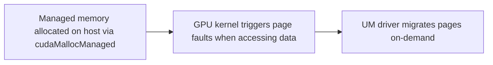
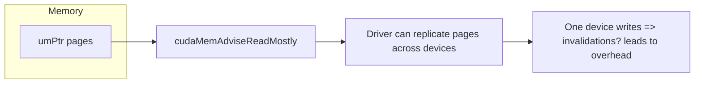

# Day 77: UM Advanced Topics (Prefetch, Advise)

**Unified Memory (UM)** simplifies development by allowing host and device to use the same pointer for data access. But beyond basic usage, UM provides advanced features—like **prefetching** data to a specific device and giving **advice** (via `cudaMemAdvise`) to the driver about access patterns. These features can significantly boost performance in multi-GPU or HPC workflows if used correctly. However, **incorrect prefetch sizes or misguided memory advice** can actually degrade performance.  

In Day 77, we take a **stepwise** approach to exploring **UM advanced topics**, illustrating the process with **multiple conceptual diagrams** to show how data moves and how the driver uses your memory hints.

---

## Table of Contents

1. [Overview](#1-overview)  
2. [Why Prefetch & Advise in Unified Memory?](#2-why-prefetch--advise-in-unified-memory)  
3. [Step-by-Step Implementation Guide](#3-step-by-step-implementation-guide)  
   - [a) UM Allocation & Basic Access](#a-um-allocation--basic-access)  
   - [b) Prefetching to Specific Devices](#b-prefetching-to-specific-devices)  
   - [c) Giving Memory Advice](#c-giving-memory-advice)  
4. [Code Example: UM Prefetch & Advise](#4-code-example-um-prefetch--advise)  
   - [Explanation & Comments](#explanation--comments)  
5. [Potential Pitfalls](#5-potential-pitfalls)  
6. [Multiple Conceptual Diagrams](#6-multiple-conceptual-diagrams)  
   - [Diagram 1: Basic UM Flow with No Prefetch](#diagram-1-basic-um-flow-with-no-prefetch)  
   - [Diagram 2: UM Prefetch to GPU X](#diagram-2-um-prefetch-to-gpu-x)  
   - [Diagram 3: Memory Advice Impact on Access Patterns](#diagram-3-memory-advice-impact-on-access-patterns)  
7. [References & Further Reading](#7-references--further-reading)  
8. [Conclusion](#8-conclusion)  
9. [Next Steps](#9-next-steps)

---

## 1. Overview

**Unified Memory** automatically migrates pages between host and device as needed, but dynamic page-faulting can be suboptimal for HPC tasks or multi-GPU systems. By **prefetching** data to the GPU you intend to use, you reduce page-fault overhead, ensuring data is local when kernels start. Similarly, **cudaMemAdvise** gives the driver hints about expected access patterns—e.g., read-mostly or data that’s preferentially located near a specific device. 

Ignoring advanced features can lead to unexpected page migrations at inopportune times, but using them incorrectly (like advising for read-mostly but repeatedly writing) can degrade performance or cause redundant migrations.

---

## 2. Why Prefetch & Advise in Unified Memory?

1. **Lower Page-Fault Overhead**: By explicitly **prefetching** data to a device, you avoid page faults during kernel startup, improving concurrency and performance.  
2. **Optimal Data Placement**: **cudaMemAdvise** can mark memory as read-mostly or accessed by a single GPU, letting the driver keep pages near the correct device.  
3. **Multi-GPU Efficiency**: In multi-GPU setups, prefetching or advising can reduce unnecessary inter-GPU page migrations.

---

## 3. Step-by-Step Implementation Guide

### a) UM Allocation & Basic Access
1. **Allocate**: `cudaMallocManaged(&ptr, size);`  
2. **Initialize**: The host writes or reads `ptr` directly; behind the scenes, the driver migrates pages as needed.  
3. **Simple Kernel**: The GPU page-faults on first access if pages are not already local.

### b) Prefetching to Specific Devices
1. **Check**: Decide which GPU will run the next kernel.  
2. **`cudaMemPrefetchAsync(ptr, size, device, stream)`**: Proactively bring pages local to `device`.  
3. **Launch Kernel**: Now the pages are already on the correct GPU, reducing runtime fault overhead.

### c) Giving Memory Advice
1. **`cudaMemAdvise(ptr, size, advice, device)`**: Provide hints like `cudaMemAdviseSetReadMostly` or `cudaMemAdviseSetPreferredLocation`.  
2. **Appropriate Usage**: If a data region is mostly read, marking it read-mostly avoids duplication of pages for writes.  
3. **Edge Cases**: If the device is set to `cudaMemAdviseSetPreferredLocation(device2)` but you actually do heavy writes on `device0`, you risk suboptimal migrations.

---

## 4. Code Example: UM Prefetch & Advise

Below is a simplified snippet demonstrating how to **prefetch** a managed array to GPU0, then set it as **read-mostly**:

```cpp
#include <cuda_runtime.h>
#include <stdio.h>

__global__ void processData(float* data, int N) {
    int idx = blockIdx.x * blockDim.x + threadIdx.x;
    if (idx < N) {
        data[idx] = data[idx] * 2.0f; // read and write
    }
}

int main() {
    int N = 1 << 20;
    size_t size = N * sizeof(float);

    // 1) Allocate managed memory
    float* umPtr;
    cudaMallocManaged(&umPtr, size);

    // Initialize on host
    for(int i=0; i<N; i++){
        umPtr[i] = (float)i;
    }

    int deviceId = 0;
    // 2) Prefetch to device 0
    cudaMemPrefetchAsync(umPtr, size, deviceId, 0);

    // 3) Provide memory advice: read-mostly for subsequent usage
    // But we also write in the kernel => this might conflict. 
    // For demonstration, let's do it anyway:
    cudaMemAdvise(umPtr, size, cudaMemAdviseSetReadMostly, deviceId);

    // Launch kernel on GPU0
    cudaSetDevice(deviceId);
    processData<<<(N+255)/256, 256>>>(umPtr, N);
    cudaDeviceSynchronize();

    // 4) Read back on host, or prefetch to host if needed
    cudaMemPrefetchAsync(umPtr, size, cudaCpuDeviceId, 0);
    cudaDeviceSynchronize();

    // Print sample
    printf("umPtr[0]=%f\n", umPtr[0]);

    // Cleanup
    cudaFree(umPtr);
    return 0;
}
```

### Explanation & Comments
1. **`cudaMallocManaged`**: Creates a UM pointer.  
2. **Prefetch**: `cudaMemPrefetchAsync(umPtr, size, 0, 0)` proactively moves pages to device 0.  
3. **`cudaMemAdviseSetReadMostly`**: Tells the driver that `umPtr` will mostly be read, so it can replicate pages across multiple devices if used by them, limiting write migrations. (We do some writes, so it’s partially contradictory, but it’s for demonstration.)  
4. **Kernel**: The GPU does read+write.  
5. **Host**: Optionally, prefetch data back to the CPU after GPU usage.

---

## 5. Potential Pitfalls

- **Incorrect Advice**: Marking memory as read-mostly if the kernel frequently writes can degrade performance or trigger extra invalidations.  
- **Chunk Size Mismatch**: If you prefetch only part of the data but your kernel accesses the entire range, page faults will occur for the rest.  
- **Multi-GPU Conflicts**: If two GPUs both set different preferences, frequent migrations might happen.  
- **Overhead**: Overusing `cudaMemPrefetchAsync` for small data sets or calling it repeatedly might overshadow the benefits.

---

## 6. Multiple Conceptual Diagrams

### Diagram 1: Basic UM Flow with No Prefetch


**Explanation**: Without prefetch or advice, data migrates lazily, leading to potential stalls on first access.

---

### Diagram 2: UM Prefetch to GPU X

```mermaid
flowchart TD
    A[Host: cudaMemPrefetchAsync(ptr, size, deviceX)]
    B[Driver proactively copies pages to deviceX local memory]
    C[Kernel on deviceX starts -> less page fault overhead]
    A --> B --> C
```
**Explanation**: By explicitly prefetching to `deviceX`, the kernel sees local pages from the start, avoiding page-fault overhead.

---

### Diagram 3: Memory Advice Impact on Access Patterns



**Explanation**: If a region is declared read-mostly, the driver may replicate the pages for multiple readers. But any writes from a device invalidates the replicate, requiring overhead.

---

## 7. References & Further Reading

- [CUDA Unified Memory Documentation](https://docs.nvidia.com/cuda/cuda-c-programming-guide/index.html#unified-memory)  
- [UM Memory Advise & Prefetch Examples in CUDA Samples](https://github.com/NVIDIA/cuda-samples)  
- [NVIDIA Developer Blog – UM Best Practices](https://developer.nvidia.com/blog/tag/unified-memory/)  
- [Nsight Tools – Visualizing Page Faults & Prefetch Efficacy](https://docs.nvidia.com/nsight-systems/)

---

## 8. Conclusion

**Day 77** highlights **advanced UM features** like **prefetch** and **cudaMemAdvise**. By prefetching data to the target device, you reduce runtime overhead from page faults. By advising the driver of memory usage patterns, you can optimize data placement and reduce unneeded page migrations. However, incorrect usage or mismatched preferences can degrade performance or cause extra overhead. For best results, carefully measure your HPC or multi-GPU pipeline to confirm that **prefetch and advise** align with real data access patterns.

---

## 9. Next Steps

1. **Profile**: Use Nsight Systems or Nsight Compute to track page-fault overhead, measuring improvements when prefetch is applied.  
2. **Tune**: Decide which arrays actually benefit from read-mostly or preferred location advice. If partial writes exist, be cautious.  
3. **Multi-GPU**: In multi-GPU setups, prefetch each UM region to the GPU that will mostly use it. If usage shifts frequently, evaluate if the overhead is worth it.  
4. **Chunking**: For very large arrays, consider partial prefetch or subdividing data so that only relevant chunks are proactively moved.  
5. **Validate**: If your kernel modifies data extensively, ensure your memory advice does not hamper concurrency or cause thrashing.

```
