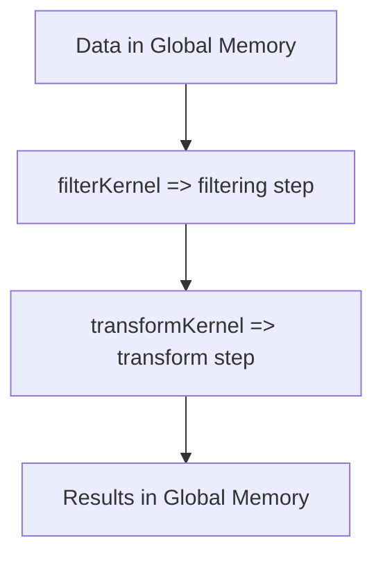
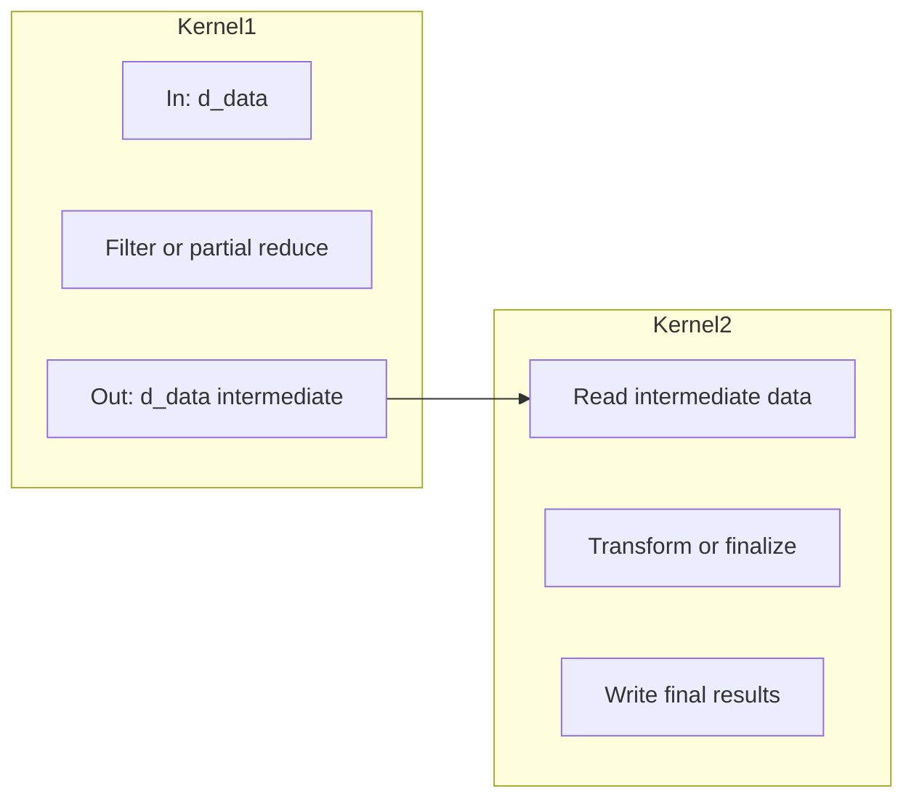

# Day 78: Large-Scale Projects – Modular Kernel Design

In large-scale CUDA projects, a single **monolithic kernel** can become unwieldy—difficult to debug, optimize, or maintain. Splitting a large operation into **multiple smaller, more manageable kernels** can simplify code and facilitate modular development. However, **too much fragmentation** can cause overhead from multiple kernel launches, reducing performance gains. Day 78 discusses **modular kernel design** in CUDA, emphasizing strategies for splitting kernels in a way that remains performant and maintainable.

---

## Table of Contents

1. [Overview](#1-overview)  
2. [Why Modular Kernel Design?](#2-why-modular-kernel-design)  
3. [Trade-Offs: Many Small Kernels vs. One Big Kernel](#3-trade-offs-many-small-kernels-vs-one-big-kernel)  
4. [Implementation Strategy](#4-implementation-strategy)  
   - [a) Identifying Sub-Kernels](#a-identifying-sub-kernels)  
   - [b) Managing Data Between Kernels](#b-managing-data-between-kernels)  
   - [c) Minimizing Launch Overhead](#c-minimizing-launch-overhead)  
5. [Code Example: Splitting an HPC Operation into Two Kernels](#5-code-example-splitting-an-hpc-operation-into-two-kernels)  
   - [Explanation & Comments](#explanation--comments)  
6. [Multiple Conceptual Diagrams](#6-multiple-conceptual-diagrams)  
   - [Diagram 1: Modular Kernel Flow](#diagram-1-modular-kernel-flow)  
   - [Diagram 2: Data Hand-Off Between Sub-Kernels](#diagram-2-data-hand-off-between-sub-kernels)  
7. [References & Further Reading](#7-references--further-reading)  
8. [Conclusion](#8-conclusion)  
9. [Next Steps](#9-next-steps)

---

## 1. Overview

**Modular kernel design** is about **breaking large, complex GPU operations** into smaller, specialized kernels. This approach:

- Improves readability and maintainability.
- Allows each sub-kernel to be independently optimized.
- Facilitates code reuse across different HPC pipelines.

However, **launch overhead** is non-negligible in CUDA. Splitting a single kernel into too many small launches can degrade performance, so a balance must be found.

---

## 2. Why Modular Kernel Design?

1. **Maintainability**: Large HPC tasks may have distinct steps (e.g., filtering → transform → reduce). Each step can become its own kernel, simplifying debugging.  
2. **Specialization**: Sub-kernels can focus on a narrower set of operations, often leading to better code optimization or easier concurrency strategies.  
3. **Reusability**: Common steps (like prefix sums, partial matrix transposes) can be placed in separate kernels, invoked from different HPC flows.

---

## 3. Trade-Offs: Many Small Kernels vs. One Big Kernel

- **Many Small Kernels**:  
  + Fine-grained modularization, easier to debug or reorder.  
  + Potential overhead from launching multiple kernels.  
  + Data must remain in GPU memory or be transferred if sub-kernels run in sequence.  
- **One Big Kernel**:  
  + Minimizes launch overhead.  
  + Potential for deeper register usage, complicated control flow, and large shared memory usage.  
  + Harder to maintain or debug if the code is monolithic.

**Guideline**: Keep sub-kernels logically separate but large enough to **amortize** kernel launch overhead, especially in HPC loops.

---

## 4. Implementation Strategy

### a) Identifying Sub-Kernels
1. **Analyze** the HPC pipeline.  
2. **Group** related operations into a cohesive kernel (e.g., a transformation kernel, a filtering kernel, a partial reduce kernel).  
3. **Balance**: If two steps have heavy data reuse, merging them into one kernel may reduce memory writes in between. If they’re distinct or can be run in parallel, separate kernels are beneficial.

### b) Managing Data Between Kernels
- **Global Memory**: Sub-kernel outputs are stored in arrays used as inputs by the next kernel.  
- **Streams & Overlap**: Potentially run sub-kernels in different streams if they operate on disjoint data.  
- **Shared Memory**: Typically local to a single kernel invocation, so the next kernel can’t reuse it directly unless the data is reloaded from global memory.

### c) Minimizing Launch Overhead
- **Batching**: If you run the same modular pipeline many times, consider using **CUDA Graphs** or parallelizing across multi-stream concurrency.  
- **Kernel Fusion**: If performance analysis shows that launching multiple small kernels is too costly, fuse them into fewer kernels while preserving partial modular logic with device functions.

---

## 5. Code Example: Splitting an HPC Operation into Two Kernels

Imagine an HPC pipeline that does two major steps:  
1. **Step1**: Filter data based on some condition.  
2. **Step2**: Transform the filtered results.

Below is a snippet splitting them into **two kernels**:

```cpp
// File: modular_kernels_example.cu

#include <cuda_runtime.h>
#include <stdio.h>

// Kernel 1: Filter data, zero out invalid entries
__global__ void filterKernel(float* data, int N, float threshold) {
    int idx = blockIdx.x * blockDim.x + threadIdx.x;
    if (idx < N) {
        if (data[idx] < threshold) {
            data[idx] = 0.0f; // mark invalid
        }
    }
}

// Kernel 2: Transform the data
__global__ void transformKernel(float* data, int N) {
    int idx = blockIdx.x * blockDim.x + threadIdx.x;
    if (idx < N) {
        // e.g., multiply non-zero entries by 2.0
        if (data[idx] != 0.0f) {
            data[idx] *= 2.0f;
        }
    }
}

int main() {
    int N = 1 << 20;
    size_t size = N * sizeof(float);

    float *d_data;
    cudaMalloc(&d_data, size);

    // Initialize or copy data
    // ...

    // Launch filterKernel
    dim3 block(256);
    dim3 grid((N + block.x - 1)/block.x);
    filterKernel<<<grid, block>>>(d_data, N, 0.5f);
    cudaDeviceSynchronize();

    // Launch transformKernel
    transformKernel<<<grid, block>>>(d_data, N);
    cudaDeviceSynchronize();

    // Next steps: copy back or run further sub-kernels
    cudaFree(d_data);
    return 0;
}
```

### Explanation & Comments
- **Kernels**: `filterKernel` zeroes out entries below `threshold`. Then `transformKernel` modifies the surviving data.  
- **Modularity**: Each kernel is simpler and more maintainable.  
- **Launch Overhead**: We have two kernel launches, but each operation is distinct. If they had extreme synergy (like heavy shared data reuse), you might consider merging them.

---

## 6. Multiple Conceptual Diagrams

### Diagram 1: Modular Kernel Flow


**Explanation**: The data is loaded once, sub-kernel operations are chained in sequence, storing intermediate results in global memory for the next kernel.

---

### Diagram 2: Data Hand-Off Between Sub-Kernels


**Explanation**: After **Kernel1** modifies `d_data`, **Kernel2** reuses the same array or a second array. Overhead occurs if the data must be reloaded from global memory, but each kernel is more maintainable.

---

## 7. References & Further Reading

- [CUDA C Best Practices Guide – “Modular Kernel Design”](https://docs.nvidia.com/cuda/cuda-c-best-practices-guide/index.html)  
- [NVIDIA Developer Blog – HPC Pipeline Examples](https://developer.nvidia.com/blog/tag/hpc/)  
- [Nsight Systems – Seeing Launch Overhead in Timelines](https://docs.nvidia.com/nsight-systems/)

---

## 8. Conclusion

**Day 78** focuses on **modular kernel design** for large-scale projects, splitting big HPC tasks into smaller, more manageable kernels. This strategy enhances maintainability and debugging but can introduce overhead from multiple kernel launches. Careful synergy between sub-kernels, reusing data in global memory, and possibly overlapping them with multi-stream concurrency can offset the overhead while retaining code clarity and maintainability.

---

## 9. Next Steps

1. **Partition**: Identify which parts of your HPC pipeline benefit from separate kernels vs. those that would be best fused.  
2. **Measure**: Evaluate kernel launch overhead in your pipeline. If the overhead is negligible compared to GPU compute time, modular design is feasible.  
3. **Profile**: Use Nsight Systems to confirm concurrency or see if short sub-kernels do not hide overhead.  
4. **Maintain**: Keep sub-kernels logically separate so each is easier to optimize or debug in isolation.  
5. **Extend**: Combine modular sub-kernels with advanced concurrency (multi-stream, multi-GPU) to scale HPC solutions effectively.

```
