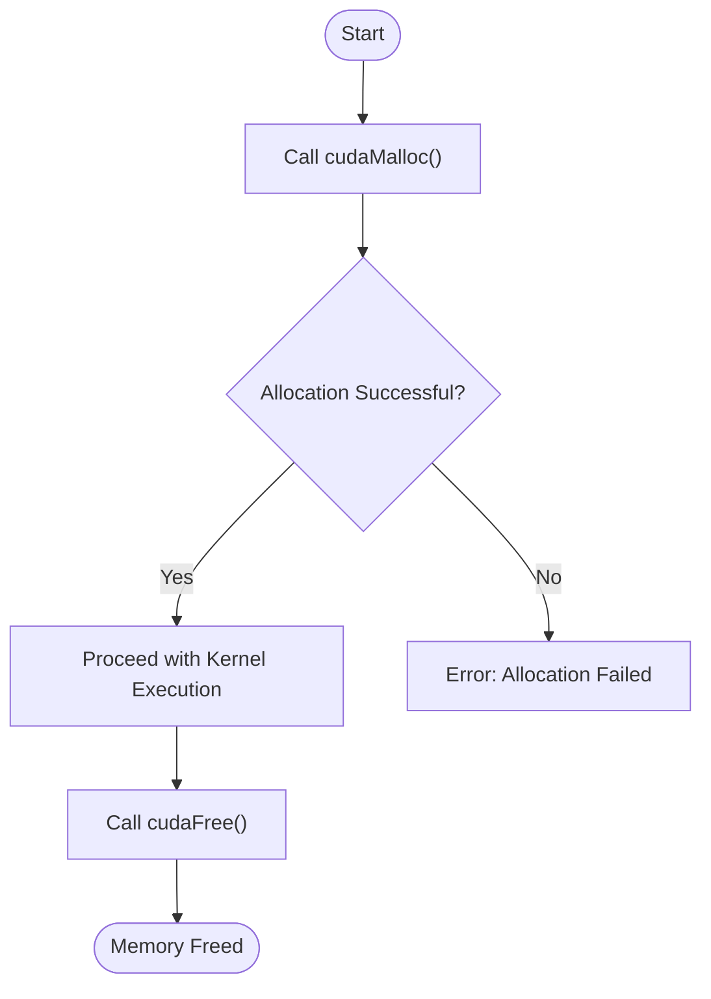
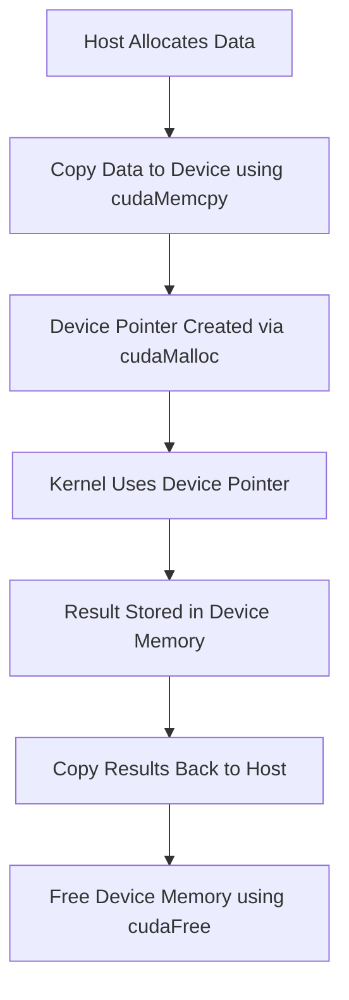

# Day 08: Memory Allocation & Pointers

Efficient memory management is critical in CUDA programming. In today’s lesson, we will focus on the proper allocation and deallocation of memory on the GPU using device pointers. We will cover how to use `cudaMalloc()` and `cudaFree()`, practice error checking, and discuss common pitfalls such as memory leaks due to forgetting to free device pointers.

---

## Table of Contents
1. [Overview](#1-overview)  
2. [Memory Allocation with cudaMalloc](#2-memory-allocation-with-cudamalloc)  
3. [Memory Deallocation with cudaFree](#3-memory-deallocation-with-cudafree)  
4. [Error Checking Best Practices](#4-error-checking-best-practices)  
5. [Common Pitfalls](#5-common-pitfalls)  
6. [Conceptual Diagrams](#6-conceptual-diagrams)  
7. [Practical Example](#7-practical-example)  
8. [Conclusion](#8-conclusion)  
9. [Next Steps](#9-next-steps)  

---

## 1. Overview
In CUDA, memory allocation on the device is performed using pointer-based functions. The two primary functions for dynamic memory management are:
- **`cudaMalloc()`**: Allocates memory on the GPU (device).
- **`cudaFree()`**: Frees previously allocated device memory.

Proper use of these functions is essential to avoid memory leaks and ensure that your application runs efficiently. Error checking after these calls is also critical to diagnose issues early in the development process.

---

## 2. Memory Allocation with cudaMalloc
`cudaMalloc()` is used to allocate memory on the device. Its prototype is:

```cpp
cudaError_t cudaMalloc(void **devPtr, size_t size);
```

- **Parameters:**
  - `devPtr`: A pointer to the allocated device memory.
  - `size`: The number of bytes to allocate.

**Example:**
```cpp
float *d_array;
size_t size = N * sizeof(float);
cudaError_t err = cudaMalloc((void**)&d_array, size);
if (err != cudaSuccess) {
    printf("Error in cudaMalloc: %s\n", cudaGetErrorString(err));
}
```

In this example, `d_array` is a device pointer to an array of floats, and memory for `N` floats is allocated on the GPU.

---

## 3. Memory Deallocation with cudaFree
`cudaFree()` is used to free memory that was previously allocated with `cudaMalloc()`. Its prototype is:

```cpp
cudaError_t cudaFree(void *devPtr);
```

- **Parameter:**
  - `devPtr`: The pointer to the memory to be freed.

**Example:**
```cpp
err = cudaFree(d_array);
if (err != cudaSuccess) {
    printf("Error in cudaFree: %s\n", cudaGetErrorString(err));
}
```

Always pair each `cudaMalloc()` call with a corresponding `cudaFree()` to prevent memory leaks.

---

## 4. Error Checking Best Practices
Robust error checking is essential in CUDA to ensure that memory allocation and deallocation are performed correctly. Always check the return value of CUDA API calls:

**Example:**
```cpp
cudaError_t err = cudaMalloc((void**)&d_array, size);
if (err != cudaSuccess) {
    fprintf(stderr, "Failed to allocate device memory (error code %s)!\n", cudaGetErrorString(err));
    exit(EXIT_FAILURE);
}
```

You can also check for errors after kernel launches by calling:
```cpp
err = cudaGetLastError();
if (err != cudaSuccess) {
    fprintf(stderr, "Kernel launch failed: %s\n", cudaGetErrorString(err));
}
```

---

## 5. Common Pitfalls
When working with device memory, be aware of these common pitfalls:

1. **Memory Leaks:**
   - **Problem:** Forgetting to call `cudaFree()` for every `cudaMalloc()` results in memory leaks.
   - **Solution:** Always ensure that every allocated pointer is freed when no longer needed.

2. **Mismatched Data Sizes:**
   - **Problem:** Incorrect size calculations in `cudaMalloc()` or `cudaMemcpy()` may lead to buffer overflows or under-allocations.
   - **Solution:** Use `sizeof(data_type)` multiplied by the number of elements to determine the correct allocation size.

3. **Ignoring Return Values:**
   - **Problem:** Not checking the return value of `cudaMalloc()`, `cudaMemcpy()`, or `cudaFree()` can mask errors.
   - **Solution:** Implement thorough error checking after each CUDA API call.

4. **Double Freeing Memory:**
   - **Problem:** Attempting to free the same memory twice can lead to undefined behavior.
   - **Solution:** Set device pointers to `NULL` after freeing them and track allocations carefully.

---

## 6. Conceptual Diagrams

### Diagram 1: Memory Allocation and Deallocation Flow

*Explanation:*  
- The flow starts with a call to `cudaMalloc()`.  
- If the allocation is successful, kernel execution proceeds.  
- After execution, `cudaFree()` is called to free the memory.  
- If the allocation fails, an error is reported.

### Diagram 2: Pointer Lifecycle on the Device

*Explanation:*  
- Data is first prepared on the host and then copied to the device.  
- The device pointer, allocated via `cudaMalloc()`, is used in the kernel for computation.  
- Results are copied back to the host, and the allocated device memory is then freed.

---

## 7. Practical Example
Below is a comprehensive code example that demonstrates the entire process: allocation, error checking, kernel execution, and deallocation.

### Example: Vector Addition with Error Checking
```cpp
#include <cuda_runtime.h>
#include <stdio.h>
#include <stdlib.h>

// CUDA Kernel for vector addition
__global__ void vectorAdd(const float *A, const float *B, float *C, int N) {
    int idx = threadIdx.x + blockIdx.x * blockDim.x;
    if (idx < N) {
        C[idx] = A[idx] + B[idx];
    }
}

int main() {
    int N = 1024;
    size_t size = N * sizeof(float);
    cudaError_t err;

    // Allocate host memory
    float *h_A = (float*)malloc(size);
    float *h_B = (float*)malloc(size);
    float *h_C = (float*)malloc(size);

    if (h_A == NULL || h_B == NULL || h_C == NULL) {
        fprintf(stderr, "Failed to allocate host vectors.\n");
        exit(EXIT_FAILURE);
    }

    // Initialize host arrays
    for (int i = 0; i < N; i++) {
        h_A[i] = i * 1.0f;
        h_B[i] = i * 2.0f;
    }

    // Allocate device memory
    float *d_A = NULL;
    float *d_B = NULL;
    float *d_C = NULL;
    err = cudaMalloc((void**)&d_A, size);
    if (err != cudaSuccess) {
        fprintf(stderr, "Failed to allocate device vector A (error code %s)!\n", cudaGetErrorString(err));
        exit(EXIT_FAILURE);
    }

    err = cudaMalloc((void**)&d_B, size);
    if (err != cudaSuccess) {
        fprintf(stderr, "Failed to allocate device vector B (error code %s)!\n", cudaGetErrorString(err));
        cudaFree(d_A);
        exit(EXIT_FAILURE);
    }

    err = cudaMalloc((void**)&d_C, size);
    if (err != cudaSuccess) {
        fprintf(stderr, "Failed to allocate device vector C (error code %s)!\n", cudaGetErrorString(err));
        cudaFree(d_A);
        cudaFree(d_B);
        exit(EXIT_FAILURE);
    }

    // Copy data from host to device
    err = cudaMemcpy(d_A, h_A, size, cudaMemcpyHostToDevice);
    if (err != cudaSuccess) {
        fprintf(stderr, "Failed to copy vector A from host to device (error code %s)!\n", cudaGetErrorString(err));
        exit(EXIT_FAILURE);
    }
    err = cudaMemcpy(d_B, h_B, size, cudaMemcpyHostToDevice);
    if (err != cudaSuccess) {
        fprintf(stderr, "Failed to copy vector B from host to device (error code %s)!\n", cudaGetErrorString(err));
        exit(EXIT_FAILURE);
    }

    // Launch the vector addition kernel
    int threadsPerBlock = 256;
    int blocksPerGrid = (N + threadsPerBlock - 1) / threadsPerBlock;
    vectorAdd<<<blocksPerGrid, threadsPerBlock>>>(d_A, d_B, d_C, N);

    // Check for kernel launch errors
    err = cudaGetLastError();
    if (err != cudaSuccess) {
        fprintf(stderr, "Failed to launch vectorAdd kernel (error code %s)!\n", cudaGetErrorString(err));
        exit(EXIT_FAILURE);
    }

    // Synchronize to ensure kernel completion
    err = cudaDeviceSynchronize();
    if (err != cudaSuccess) {
        fprintf(stderr, "cudaDeviceSynchronize returned error code %s after launching kernel!\n", cudaGetErrorString(err));
        exit(EXIT_FAILURE);
    }

    // Copy the result back to the host
    err = cudaMemcpy(h_C, d_C, size, cudaMemcpyDeviceToHost);
    if (err != cudaSuccess) {
        fprintf(stderr, "Failed to copy vector C from device to host (error code %s)!\n", cudaGetErrorString(err));
        exit(EXIT_FAILURE);
    }

    // Verify the result
    for (int i = 0; i < N; i++) {
        if (fabs(h_C[i] - (h_A[i] + h_B[i])) > 1e-5) {
            fprintf(stderr, "Result verification failed at element %d!\n", i);
            exit(EXIT_FAILURE);
        }
    }
    printf("Test PASSED\n");

    // Free device memory
    cudaFree(d_A);
    cudaFree(d_B);
    cudaFree(d_C);

    // Free host memory
    free(h_A);
    free(h_B);
    free(h_C);

    return 0;
}
```

*Explanation:*
- **Host Memory Allocation:** The host vectors are allocated using `malloc()`, with error checking.
- **Device Memory Allocation:** `cudaMalloc()` is used for device memory, with error checking after each call.
- **Data Transfer:** `cudaMemcpy()` transfers data between host and device, with error checking.
- **Kernel Launch and Synchronization:** The kernel is launched and errors are checked via `cudaGetLastError()` and `cudaDeviceSynchronize()`.
- **Result Verification:** The result is validated on the host.
- **Memory Deallocation:** Both device and host memory are freed appropriately.

---

## 8. Conclusion
In this lesson, you learned extensively about memory allocation and pointer management in CUDA. Key takeaways include:
- **Dynamic Allocation:** Using `cudaMalloc()` to allocate memory on the GPU.
- **Memory Deallocation:** The importance of using `cudaFree()` to prevent memory leaks.
- **Error Checking:** Always validate CUDA API calls to catch errors early.
- **Common Pitfalls:** Awareness of mismatched sizes and memory leaks.


---

## 9. Next Steps
In the upcoming lessons, we will:
- Explore advanced memory management techniques such as asynchronous data transfers.
- Dive deeper into the CUDA memory hierarchy with a focus on shared and constant memory.
- Study more complex error handling and profiling tools to optimize your CUDA applications further.

Stay tuned as you continue your journey into the world of GPU programming!
```
