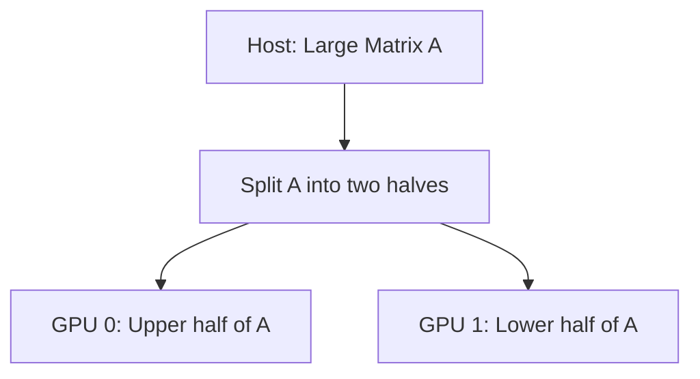
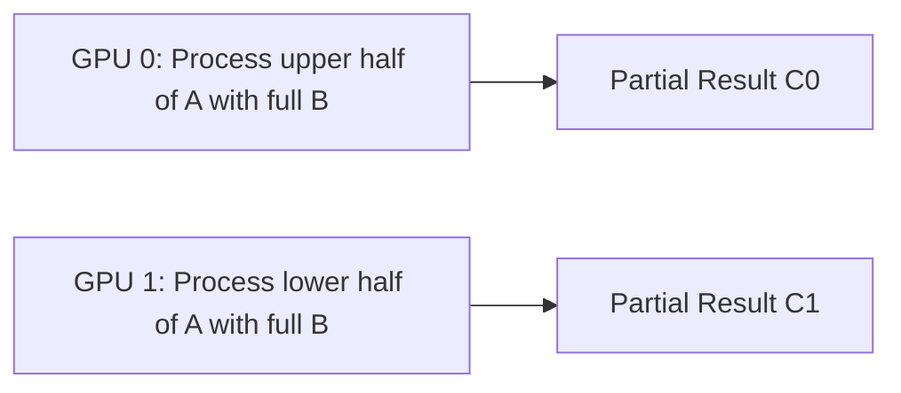
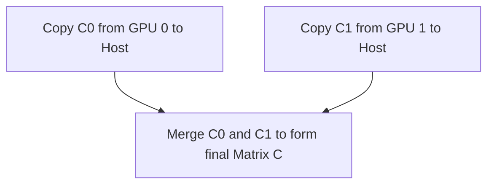

# Capstone Project #4: Multi-GPU Matrix Multiply

In this project, we tackle a classic HPC challenge—performing matrix multiplication on very large matrices that exceed the capacity or performance limits of a single GPU. We split the large matrix multiplication task across **two GPUs**, where each GPU computes a portion of the result. This approach requires careful data partitioning, synchronization, and, if needed, inter-GPU communication to combine partial results.

---

## Table of Contents

1. [Overview](#1-overview)  
2. [Problem Statement & Goals](#2-problem-statement--goals)  
3. [Background](#3-background)  
   - [a) Multi-GPU Programming Concepts](#a-multi-gpu-programming-concepts)  
   - [b) Matrix Partitioning Strategies](#b-matrix-partitioning-strategies)  
4. [Implementation Steps](#4-implementation-steps)  
   - [a) Data Partitioning](#a-data-partitioning)  
   - [b) Kernel Execution on Multiple GPUs](#b-kernel-execution-on-multiple-gpus)  
   - [c) Combining Partial Results](#c-combining-partial-results)  
5. [Code Example](#5-code-example)  
   - [Explanation & Comments](#explanation--comments)  
6. [Conceptual Diagrams](#6-conceptual-diagrams)  
   - [Diagram 1: Data Partitioning Flow](#diagram-1-data-partitioning-flow)  
   - [Diagram 2: Multi-GPU Execution Flow](#diagram-2-multi-gpu-execution-flow)  
   - [Diagram 3: Final Result Merging](#diagram-3-final-result-merging)  
7. [Performance Considerations & Pitfalls](#7-performance-considerations--pitfalls)  
8. [References & Further Reading](#8-references--further-reading)  
9. [Conclusion](#9-conclusion)  
10. [Next Steps](#10-next-steps)

---

## 1. Overview

Multi-GPU programming allows us to leverage more than one GPU to process large datasets. In this capstone project, we implement a matrix multiplication where a large matrix is split across two GPUs. Each GPU handles part of the computation, and their partial results are merged to produce the final output. This project demonstrates how to design, implement, and optimize multi-GPU applications, ensuring that the workload is balanced and that data transfers are minimized.

---

## 2. Problem Statement & Goals

- **Problem**: Multiply two large matrices (A and B) using two GPUs.  
- **Goals**:
  - Partition matrices across two GPUs.
  - Compute partial results concurrently.
  - Merge partial results to obtain the final matrix C.
  - Ensure load balance and minimal inter-GPU communication overhead.

---

## 3. Background

### a) Multi-GPU Programming Concepts
- **Data Partitioning**: Split matrices such that each GPU processes a subset (e.g., splitting by rows or columns).
- **Peer-to-Peer (P2P) Communication**: Use direct GPU-to-GPU data transfers when available, bypassing the host.
- **Synchronization**: Ensure kernels on different GPUs finish their tasks before merging results.

### b) Matrix Partitioning Strategies
- **Row-wise Partitioning**: Divide the result matrix by rows; GPU0 computes the upper half, and GPU1 computes the lower half.
- **Column-wise Partitioning**: Alternatively, split by columns depending on memory layout and kernel design.
- **Block-wise Partitioning**: For very large matrices, a more granular split might be used, though this increases complexity.

---

## 4. Implementation Steps

### a) Data Partitioning
1. **Split Matrix A**: For row-wise partitioning, assign the first half of A to GPU0 and the second half to GPU1.
2. **Replicate Matrix B**: Both GPUs require the full matrix B to compute their respective sub-matrices.

### b) Kernel Execution on Multiple GPUs
1. **Launch Kernel on GPU0**: Compute partial result for rows [0, N/2).
2. **Launch Kernel on GPU1**: Compute partial result for rows [N/2, N).
3. **Use Similar Kernels**: Both GPUs run the same matrix multiplication kernel but with different offsets and dimensions.

### c) Combining Partial Results
1. **Merge Partial Results**: If the partial results reside on separate GPUs, use P2P transfers (if supported) to consolidate them on one GPU, or copy results to the host for final merging.
2. **Synchronization**: Ensure that both GPUs have completed their computations before merging.

---

## 5. Code Example

Below is a simplified example of a multi-GPU matrix multiplication using row-wise partitioning. For simplicity, error checking and detailed memory initialization are omitted.

```cpp
// File: multi_gpu_matrix_mul.cu
#include <cuda_runtime.h>
#include <stdio.h>

#define IDX2C(i,j,ld) (((j)*(ld))+(i))

// Simple matrix multiplication kernel for a submatrix
__global__ void matrixMulKernel(const float* A, const float* B, float* C, 
                                int M, int N, int K, int rowOffset) {
    int row = blockIdx.y * blockDim.y + threadIdx.y + rowOffset;
    int col = blockIdx.x * blockDim.x + threadIdx.x;
    if (row < M && col < K) {
        float sum = 0.0f;
        for (int i = 0; i < N; i++) {
            sum += A[IDX2C(row, i, M)] * B[IDX2C(i, col, N)];
        }
        C[IDX2C(row, col, M)] = sum;
    }
}

int main() {
    // Matrix dimensions: A is MxN, B is NxK, C is MxK.
    int M = 1024, N = 1024, K = 1024;
    size_t sizeA = M * N * sizeof(float);
    size_t sizeB = N * K * sizeof(float);
    size_t sizeC = M * K * sizeof(float);

    // Host allocations (omitted initialization for brevity)
    float *h_A = (float*)malloc(sizeA);
    float *h_B = (float*)malloc(sizeB);
    float *h_C = (float*)malloc(sizeC);

    // Initialize h_A, h_B (omitted)

    // Set up device memory for 2 GPUs
    float *d_A0, *d_C0; // GPU 0 will handle rows 0 to M/2
    float *d_A1, *d_C1; // GPU 1 will handle rows M/2 to M
    float *d_B;        // B is needed in full on both GPUs

    int M_half = M / 2;
    size_t sizeA0 = M_half * N * sizeof(float);
    size_t sizeA1 = (M - M_half) * N * sizeof(float);
    size_t sizeC0 = M_half * K * sizeof(float);
    size_t sizeC1 = (M - M_half) * K * sizeof(float);

    // Allocate on GPU 0
    cudaSetDevice(0);
    cudaMalloc(&d_A0, sizeA0);
    cudaMalloc(&d_C0, sizeC0);
    cudaMalloc(&d_B, sizeB); // B allocated on GPU 0

    // Allocate on GPU 1
    cudaSetDevice(1);
    cudaMalloc(&d_A1, sizeA1);
    cudaMalloc(&d_C1, sizeC1);
    // For B, enable P2P or duplicate B on GPU 1
    cudaMalloc(&d_B, sizeB); // or use cudaMemcpyPeer if P2P enabled

    // Copy data: Partition A between GPUs
    // Copy first half of A to GPU 0
    cudaSetDevice(0);
    cudaMemcpy(d_A0, h_A, sizeA0, cudaMemcpyHostToDevice);
    // Copy second half of A to GPU 1
    cudaSetDevice(1);
    cudaMemcpy(d_A1, h_A + M_half * N, sizeA1, cudaMemcpyHostToDevice);
    // Copy B to both GPUs (for simplicity, copy separately)
    cudaSetDevice(0);
    cudaMemcpy(d_B, h_B, sizeB, cudaMemcpyHostToDevice);
    cudaSetDevice(1);
    cudaMemcpy(d_B, h_B, sizeB, cudaMemcpyHostToDevice);

    // Define kernel launch parameters
    dim3 block(16, 16);
    dim3 grid0((K + block.x - 1) / block.x, (M_half + block.y - 1) / block.y);
    dim3 grid1((K + block.x - 1) / block.x, ((M - M_half) + block.y - 1) / block.y);

    // Launch kernels on both GPUs
    cudaSetDevice(0);
    matrixMulKernel<<<grid0, block>>>(d_A0, d_B, d_C0, M, N, K, 0);
    cudaSetDevice(1);
    matrixMulKernel<<<grid1, block>>>(d_A1, d_B, d_C1, M, N, K, M_half);

    // Synchronize both GPUs
    cudaSetDevice(0);
    cudaDeviceSynchronize();
    cudaSetDevice(1);
    cudaDeviceSynchronize();

    // Merge results: Option 1: Use P2P if supported, else copy to host and combine
    // For simplicity, we copy both halves back to host and then combine
    cudaSetDevice(0);
    cudaMemcpy(h_C, d_C0, sizeC0, cudaMemcpyDeviceToHost);
    cudaSetDevice(1);
    cudaMemcpy(h_C + M_half * K, d_C1, sizeC1, cudaMemcpyDeviceToHost);

    // (Optionally, verify h_C correctness)

    // Cleanup
    cudaSetDevice(0);
    cudaFree(d_A0);
    cudaFree(d_C0);
    cudaFree(d_B);
    cudaSetDevice(1);
    cudaFree(d_A1);
    cudaFree(d_C1);
    free(h_A);
    free(h_B);
    free(h_C);

    return 0;
}
```

### Explanation & Comments

- **Data Partitioning**:  
  Matrix A is split into two parts: the upper half is sent to GPU 0, and the lower half to GPU 1.  
- **Kernel Launch**:  
  Each GPU runs the same matrix multiplication kernel (`matrixMulKernel`) on its assigned rows. An additional parameter (`rowOffset`) ensures that each kernel writes to the correct location in the output matrix C.  
- **Matrix B**:  
  Both GPUs require the full matrix B. This can be duplicated or shared using P2P if available.  
- **Result Merging**:  
  After computation, the partial results from both GPUs are copied back to the host and concatenated to form the final matrix C.  
- **Synchronization**:  
  Each device is synchronized after kernel execution before data is copied back.

---

## 6. Multiple Conceptual Diagrams

### Diagram 1: Data Partitioning Flow



**Explanation**:  
- The host divides matrix A into two partitions, one for each GPU.

---

### Diagram 2: Multi-GPU Execution Flow



**Explanation**:  
- Each GPU processes its portion of A concurrently, using the full matrix B.  
- The results are stored in separate buffers (C0 on GPU 0 and C1 on GPU 1).

---

### Diagram 3: Final Result Merging



**Explanation**:  
- After processing, the partial results are copied back to the host and merged to produce the final output matrix.

---

## 7. References & Further Reading

- [CUDA C Programming Guide – Multiple GPUs](https://docs.nvidia.com/cuda/cuda-c-programming-guide/index.html#multiple-gpus)  
- [Nsight Systems & Compute Tools](https://docs.nvidia.com/nsight-systems/)  
- [NVIDIA Developer Blog – Multi-GPU HPC Case Studies](https://developer.nvidia.com/blog/tag/multi-gpu/)  
- [CUDA Best Practices Guide](https://docs.nvidia.com/cuda/cuda-c-best-practices-guide/index.html)

---

## 8. Conclusion

Capstone Project #4 demonstrates the **power of multi-GPU programming** by splitting a large matrix multiplication task across two GPUs. With careful data partitioning, kernel execution, and result merging, you can achieve significant performance gains. However, ensuring load balance and minimizing inter-device data transfers (via P2P) are key challenges that must be addressed for optimal performance.

---

## 9. Next Steps

1. **Implement P2P**: Investigate enabling peer-to-peer transfers to merge results directly between GPUs, bypassing the host.  
2. **Load Balancing**: Profile your application and adjust the data partitioning strategy if one GPU consistently takes longer.  
3. **Extend to More GPUs**: Scale the design to more than two GPUs for even larger matrices.  
4. **Optimize Kernels**: Tune the matrix multiplication kernel (e.g., using shared memory tiling) for each GPU to maximize throughput. 5. **Profile**: Use Nsight Systems to analyze the multi-GPU pipeline and identify bottlenecks in data transfer or synchronization.

```
