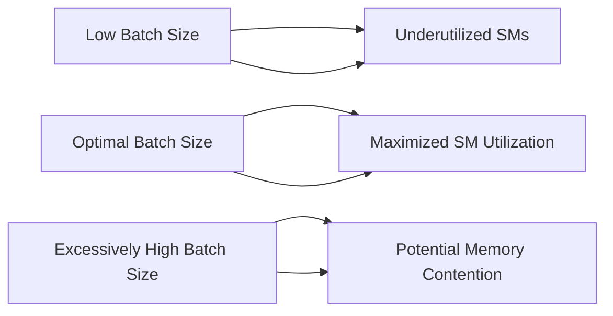
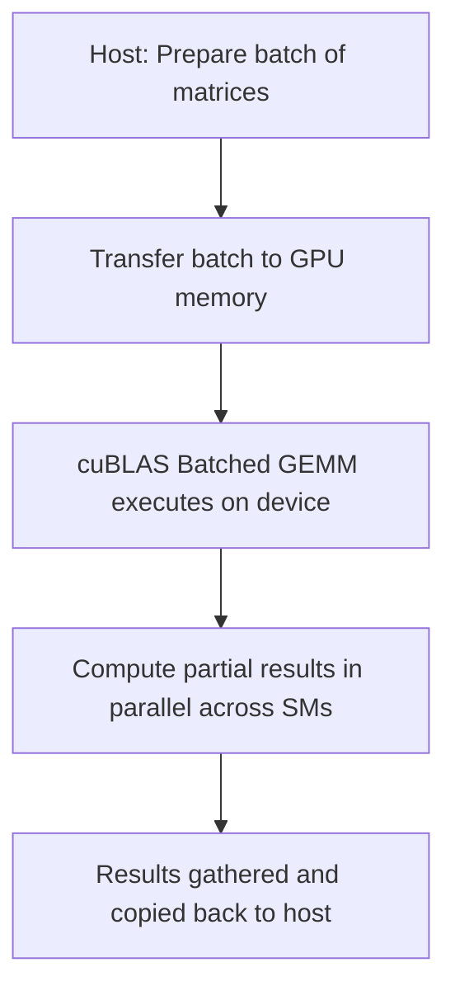

# Day 82: Large-Scale Batch Processing

In high-performance computing and deep learning, it's common to perform a large number of small matrix multiplications. Rather than launching each multiplication as a separate kernel—which incurs significant overhead—**batched operations** allow you to process many matrix multiplications in parallel with a single API call. On NVIDIA GPUs, the **cuBLAS batched GEMM** routine is designed to efficiently perform these operations. However, selecting an inappropriate batch size can lead to underutilized Streaming Multiprocessors (SMs) and reduced performance.

---

## Table of Contents

1. [Overview](#1-overview)  
2. [Background: Batched GEMM](#2-background-batched-gemm)  
3. [Why Use Batched Operations?](#3-why-use-batched-operations)  
4. [Challenges: The Impact of Batch Size](#4-challenges-the-impact-of-batch-size)  
5. [Implementation Steps](#5-implementation-steps)  
   - [a) Setting Up Data Structures](#a-setting-up-data-structures)  
   - [b) Calling cuBLAS Batched GEMM](#b-calling-cublas-batched-gemm)  
   - [c) Tuning Batch Size](#c-tuning-batch-size)  
6. [Code Example: Batched GEMM](#6-code-example-batched-gemm)  
7. [Conceptual Diagrams](#7-conceptual-diagrams)  
   - [Diagram 1: Batched GEMM Overview](#diagram-1-batched-gemm-overview)  
   - [Diagram 2: Data Flow in Batched Processing](#diagram-2-data-flow-in-batched-processing)  
   - [Diagram 3: Impact of Incorrect Batch Sizes](#diagram-3-impact-of-incorrect-batch-sizes)  
8. [References & Further Reading](#8-references--further-reading)  
9. [Conclusion](#9-conclusion)  
10. [Next Steps](#10-next-steps)

---

## 1. Overview

Large-scale batch processing with cuBLAS batched GEMM allows you to multiply many pairs of small matrices concurrently. This approach minimizes kernel launch overhead and maximizes GPU utilization by grouping similar operations. However, if batch sizes are not chosen appropriately, many SMs may remain idle, leading to suboptimal performance.

---

## 2. Background: Batched GEMM

- **Batched GEMM**: A routine provided by cuBLAS that performs multiple general matrix-matrix multiplications (GEMM) in parallel.
- **Use Case**: Frequently used in deep learning, signal processing, and scientific computing when dealing with many small matrix multiplications.
- **cuBLAS API**: Functions like `cublasSgemmBatched()` and `cublasGemmBatchedEx()` offer support for various precisions and data layouts.

---

## 3. Why Use Batched Operations?

- **Reduced Overhead**: Launching a single batched operation is much more efficient than issuing thousands of individual kernel calls.
- **Increased Throughput**: Consolidates work into a single API call, leading to better resource utilization.
- **Simplified Programming**: Handles arrays of pointers to matrices, which simplifies managing multiple small GEMMs.

---

## 4. Challenges: The Impact of Batch Size

- **Underutilization**: Too few matrices in a batch may not generate enough parallel work, leaving many SMs idle.
- **Excessive Batch Size**: Conversely, extremely high batch counts can incur management overhead or memory pressure.
- **Tuning**: Finding the optimal batch size is critical—this depends on the specific GPU architecture, kernel resource usage, and problem size.

---

## 5. Implementation Steps

### a) Setting Up Data Structures
- Allocate arrays for matrices A, B, and C.
- Create an array of pointers on the device, each pointing to a small matrix.
- Ensure that matrices are stored in contiguous memory if possible to maximize memory coalescing.

### b) Calling cuBLAS Batched GEMM
- Initialize the cuBLAS handle.
- Use `cublasSgemmBatched()` (for FP32) or another precision variant to launch the batched GEMM.
- Pass the array of pointers along with the batch count.

### c) Tuning Batch Size
- Experiment with different batch sizes to find the optimal balance.
- Use profiling tools like Nsight Systems or Nsight Compute to observe SM utilization and memory throughput.
- Adjust the number of matrices per batch to ensure high occupancy without overwhelming the GPU’s memory subsystem.

---

## 6. Code Example: Batched GEMM

Below is a simplified example that demonstrates how to set up and launch a batched GEMM operation using cuBLAS. This example assumes that you have pre-allocated and initialized your matrices.

```cpp
// File: batched_gemm_example.cu
#include <cuda_runtime.h>
#include <cublas_v2.h>
#include <stdio.h>

#define IDX2C(i,j,ld) (((j)*(ld))+(i))

// Error checking macro for cuBLAS calls
#define CUBLAS_CHECK(call)                                   \
    do {                                                     \
        cublasStatus_t err = call;                           \
        if (err != CUBLAS_STATUS_SUCCESS) {                  \
            printf("cuBLAS error %d at line %d\n", err, __LINE__); \
            exit(EXIT_FAILURE);                              \
        }                                                    \
    } while(0)

int main() {
    // Matrix dimensions: assume A is MxK, B is KxN, and C is MxN.
    int M = 64, K = 64, N = 64;
    int batchSize = 1000; // Number of small GEMMs in the batch

    size_t sizeA = M * K * sizeof(float);
    size_t sizeB = K * N * sizeof(float);
    size_t sizeC = M * N * sizeof(float);

    // Allocate host memory for one matrix and then replicate for batch processing
    float* h_A = (float*)malloc(sizeA * batchSize);
    float* h_B = (float*)malloc(sizeB * batchSize);
    float* h_C = (float*)malloc(sizeC * batchSize);

    // Initialize matrices (omitted: fill with meaningful data)
    for (int i = 0; i < batchSize * M * K; i++) h_A[i] = 1.0f;
    for (int i = 0; i < batchSize * K * N; i++) h_B[i] = 2.0f;
    for (int i = 0; i < batchSize * M * N; i++) h_C[i] = 0.0f;

    // Allocate device memory for each matrix in the batch
    float **d_Aarray, **d_Barray, **d_Carray;
    cudaMalloc((void**)&d_Aarray, batchSize * sizeof(float*));
    cudaMalloc((void**)&d_Barray, batchSize * sizeof(float*));
    cudaMalloc((void**)&d_Carray, batchSize * sizeof(float*));

    // Allocate one big chunk per matrix type on device
    float *d_A, *d_B, *d_C;
    cudaMalloc((void**)&d_A, sizeA * batchSize);
    cudaMalloc((void**)&d_B, sizeB * batchSize);
    cudaMalloc((void**)&d_C, sizeC * batchSize);

    // Copy host data to device chunks
    cudaMemcpy(d_A, h_A, sizeA * batchSize, cudaMemcpyHostToDevice);
    cudaMemcpy(d_B, h_B, sizeB * batchSize, cudaMemcpyHostToDevice);

    // Set up device pointers for each batched GEMM
    float **h_Aptrs = (float**)malloc(batchSize * sizeof(float*));
    float **h_Bptrs = (float**)malloc(batchSize * sizeof(float*));
    float **h_Cptrs = (float**)malloc(batchSize * sizeof(float*));
    for (int i = 0; i < batchSize; i++) {
        h_Aptrs[i] = d_A + i * M * K;
        h_Bptrs[i] = d_B + i * K * N;
        h_Cptrs[i] = d_C + i * M * N;
    }
    cudaMemcpy(d_Aarray, h_Aptrs, batchSize * sizeof(float*), cudaMemcpyHostToDevice);
    cudaMemcpy(d_Barray, h_Bptrs, batchSize * sizeof(float*), cudaMemcpyHostToDevice);
    cudaMemcpy(d_Carray, h_Cptrs, batchSize * sizeof(float*), cudaMemcpyHostToDevice);

    // Create cuBLAS handle
    cublasHandle_t handle;
    CUBLAS_CHECK(cublasCreate(&handle));

    // Set up parameters for batched GEMM: C = alpha*A*B + beta*C
    float alpha = 1.0f, beta = 0.0f;
    
    // Launch batched GEMM for FP32 matrices
    CUBLAS_CHECK(cublasSgemmBatched(handle,
                                    CUBLAS_OP_N, CUBLAS_OP_N,
                                    M, N, K,
                                    &alpha,
                                    (const float**)d_Aarray, M,
                                    (const float**)d_Barray, K,
                                    &beta,
                                    d_Carray, M,
                                    batchSize));

    // Copy results back to host
    cudaMemcpy(h_C, d_C, sizeC * batchSize, cudaMemcpyDeviceToHost);

    // Print a sample result
    printf("Sample h_C[0] = %f\n", h_C[0]);

    // Cleanup
    free(h_A); free(h_B); free(h_C);
    free(h_Aptrs); free(h_Bptrs); free(h_Cptrs);
    cudaFree(d_A); cudaFree(d_B); cudaFree(d_C);
    cudaFree(d_Aarray); cudaFree(d_Barray); cudaFree(d_Carray);
    CUBLAS_CHECK(cublasDestroy(handle));
    return 0;
}
```

### Explanation & Comments

- **Batched GEMM Setup**:  
  - **Host Allocation**: We allocate memory for a batch of matrices for A, B, and C.
  - **Device Memory**: Instead of launching many small kernels, we allocate one large chunk for each type and build arrays of pointers (one for each matrix in the batch).
  - **Data Transfer**: Data is copied to the device in bulk.
  - **cuBLAS Batched GEMM**: We call `cublasSgemmBatched()` to perform all multiplications in one API call.
- **Batch Size Tuning**:  
  - The `batchSize` parameter is crucial: if too small, SMs may be idle; if too large, resource contention or memory pressure may occur.
- **Result Merging**:  
  - The partial results are stored in `d_C` and then copied back to host memory for verification.

---

## 7. Multiple Conceptual Diagrams

### Diagram 1: Batched GEMM Data Flow


**Explanation**:  
- Host prepares batch data, which is transferred to the device.  
- Device pointer arrays index each small matrix for batched GEMM.  
- The result is computed and then copied back.

---

### Diagram 2: Impact of Batch Size on SM Utilization



**Explanation**:  
- The diagram illustrates that there is an optimal batch size that balances kernel overhead and SM utilization.  
- Too few or too many batches can lead to performance degradation.

---

### Diagram 3: End-to-End Multi-GPU Batch Processing



**Explanation**:  
- This diagram shows a complete cycle from host data preparation to device execution and final result gathering.  
- The parallel execution of the batched GEMM fully utilizes available SMs when the batch size is well-tuned.

---

## 8. References & Further Reading

- [cuBLAS Documentation – Batched GEMM](https://docs.nvidia.com/cuda/cublas/index.html)  
- [CUDA C Programming Guide – Multiple GPUs](https://docs.nvidia.com/cuda/cuda-c-programming-guide/index.html#multiple-gpus)  
- [NVIDIA Roofline Analysis Blog](https://developer.nvidia.com/blog/tag/roofline/)  
- [Nsight Systems – Performance Analysis](https://docs.nvidia.com/nsight-systems/)

---

## 9. Conclusion

Large-scale batch processing using cuBLAS batched GEMM can significantly accelerate the computation of many small matrix multiplications by reducing kernel launch overhead and maximizing SM utilization. However, selecting the correct batch size is critical—too small, and SMs remain idle; too large, and resource contention may occur. By dynamically tuning the batch size based on workload and device characteristics, you can achieve near-optimal performance across a range of HPC and deep learning tasks.

---

## 10. Next Steps

1. **Benchmark Batch Sizes**: Experiment with different batch sizes to determine the optimal configuration for your application.  
2. **Profile Performance**: Use Nsight Systems to visualize SM utilization and memory throughput during batched GEMM execution.  
3. **Optimize Memory Layout**: Ensure matrices are stored contiguously and aligned for maximum bandwidth.  
4. **Extend to Multi-GPU**: Scale the batched approach to multi-GPU systems if the dataset or computation requires even greater throughput.  
5. **Integrate with Other Workloads**: Combine batched GEMM with other batched operations (e.g., convolutions, reductions) to build complete end-to-end HPC pipelines.

```
