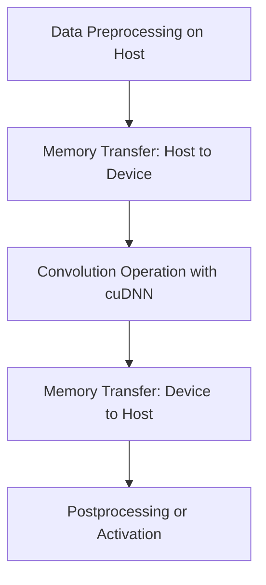

# Day 83: External Libraries (cuDNN, etc.)

Integrating external libraries like **cuDNN** into your CUDA projects can drastically accelerate deep learning workloads by leveraging highly optimized primitives for neural network operations. In this lesson, we demonstrate how to integrate a small neural network (NN) layer using cuDNN, discuss best practices for managing library dependencies, and address potential pitfalls such as version mismatches that can lead to runtime errors. This guide is based on recommendations from the [cuDNN Library User Guide](https://docs.nvidia.com/cuda/cudnn/index.html).

---

## Table of Contents

1. [Overview](#1-overview)  
2. [Introduction to cuDNN](#2-introduction-to-cudnn)  
3. [Why Use External Libraries like cuDNN?](#3-why-use-external-libraries-like-cudnn)  
4. [Key Challenges & Pitfalls](#4-key-challenges--pitfalls)  
   - [a) Version Mismatches](#a-version-mismatches)  
   - [b) API Changes and Deprecations](#b-api-changes-and-deprecations)  
5. [Implementation Approach](#5-implementation-approach)  
   - [a) Setup & Environment](#a-setup--environment)  
   - [b) Integrating a Small NN Layer](#b-integrating-a-small-nn-layer)  
   - [c) Error Handling and Debugging](#c-error-handling-and-debugging)  
6. [Code Example: A Convolutional Layer Using cuDNN](#6-code-example-a-convolutional-layer-using-cudnn)  
   - [Explanation & Comments](#explanation--comments)  
7. [Conceptual Diagrams](#7-conceptual-diagrams)  
   - [Diagram 1: cuDNN Integration Flow](#diagram-1-cudnn-integration-flow)  
   - [Diagram 2: Dependency Management and Version Check](#diagram-2-dependency-management-and-version-check)  
   - [Diagram 3: NN Layer Data Flow](#diagram-3-nn-layer-data-flow)  
8. [References & Further Reading](#8-references--further-reading)  
9. [Conclusion](#9-conclusion)  
10. [Next Steps](#10-next-steps)

---

## 1. Overview

Using external libraries such as **cuDNN** can greatly simplify and optimize the implementation of neural network layers on CUDA-enabled GPUs. cuDNN offers a set of highly optimized routines for operations like convolutions, pooling, activation functions, and more. In this lesson, we integrate a small NN layer (a convolutional layer) using cuDNN, highlighting the importance of proper library version management and robust error handling.

---

## 2. Introduction to cuDNN

cuDNN (CUDA Deep Neural Network library) is a GPU-accelerated library for deep neural networks that provides optimized implementations for many standard operations in deep learning. It supports:
- Convolutional Neural Networks (CNNs)
- Recurrent Neural Networks (RNNs)
- Normalization layers and activation functions

Its performance benefits stem from the use of Tensor Cores and carefully tuned algorithms that adapt to different GPU architectures.

---

## 3. Why Use External Libraries like cuDNN?

- **Performance**: cuDNN routines are highly optimized for speed and efficiency, often outperforming custom implementations.
- **Simplicity**: These libraries abstract complex operations, allowing developers to focus on higher-level algorithm design.
- **Portability**: cuDNN is maintained by NVIDIA, ensuring that the latest hardware features are supported with minimal changes to your code.
- **Best Practices**: Leveraging a well-tested library reduces the risk of errors that can occur with hand-written kernels.

---

## 4. Key Challenges & Pitfalls

### a) Version Mismatches
- **Issue**: Using a cuDNN version incompatible with your CUDA Toolkit or GPU drivers can result in runtime errors.
- **Best Practice**: Always verify the cuDNN version against the [CUDA Toolkit Release Notes](https://docs.nvidia.com/cuda/cuda-toolkit-release-notes/index.html) and ensure compatibility with your target hardware.

### b) API Changes and Deprecations
- **Issue**: cuDNN APIs may change between versions, potentially breaking legacy code.
- **Best Practice**: Regularly review the cuDNN documentation and update your code to accommodate any deprecated functions or new API paradigms.

---

## 5. Implementation Approach

### a) Setup & Environment
- **Install cuDNN**: Ensure that the correct version of cuDNN is installed and that environment variables (e.g., `LD_LIBRARY_PATH`) are correctly set.
- **Verify Compatibility**: Use `cudaGetDeviceProperties` and check cuDNN version via API calls if necessary.

### b) Integrating a Small NN Layer
- **Layer Selection**: For this example, we will implement a basic **convolutional layer**.
- **cuDNN Handle**: Create and initialize a cuDNN handle.
- **Tensor Descriptors**: Define descriptors for the input, filter, and output tensors.
- **Algorithm Selection**: Use cuDNN functions to choose the best convolution algorithm.
- **Workspace Management**: Allocate any necessary temporary workspace.

### c) Error Handling and Debugging
- **Check Return Codes**: Always check the return status of cuDNN calls using error-checking macros.
- **Profiling**: Use Nsight Systems/Compute to profile performance and ensure that operations run as expected.

---

## 6. Code Example: A Convolutional Layer Using cuDNN

Below is a simplified example demonstrating how to integrate a convolutional layer using cuDNN. This example focuses on key steps and is commented extensively.

```cpp
// File: cudnn_conv_layer.cu

#include <cudnn.h>
#include <cuda_runtime.h>
#include <stdio.h>

// Error checking macro for cuDNN calls
#define CUDNN_CHECK(status) \
    if (status != CUDNN_STATUS_SUCCESS) { \
        printf("cuDNN error: %s at line %d\n", cudnnGetErrorString(status), __LINE__); \
        exit(EXIT_FAILURE); \
    }

int main() {
    // Create cuDNN handle
    cudnnHandle_t cudnn;
    CUDNN_CHECK(cudnnCreate(&cudnn));

    // Tensor dimensions
    int N = 1, C = 3, H = 224, W = 224;  // Batch size, Channels, Height, Width
    int K = 64, R = 3, S = 3;            // Number of filters, filter height, filter width

    // Allocate input, filter, and output tensors in unified memory for simplicity
    float *d_input, *d_filter, *d_output;
    size_t inputSize = N * C * H * W * sizeof(float);
    size_t filterSize = K * C * R * S * sizeof(float);
    // Output dimensions calculation (assuming stride=1, padding=1)
    int outH = H, outW = W;
    size_t outputSize = N * K * outH * outW * sizeof(float);

    cudaMalloc(&d_input, inputSize);
    cudaMalloc(&d_filter, filterSize);
    cudaMalloc(&d_output, outputSize);

    // Initialize input and filter data (omitted for brevity)

    // Create tensor descriptors for input, filter, and output
    cudnnTensorDescriptor_t inputDesc, outputDesc;
    cudnnFilterDescriptor_t filterDesc;
    cudnnConvolutionDescriptor_t convDesc;

    CUDNN_CHECK(cudnnCreateTensorDescriptor(&inputDesc));
    CUDNN_CHECK(cudnnCreateFilterDescriptor(&filterDesc));
    CUDNN_CHECK(cudnnCreateTensorDescriptor(&outputDesc));
    CUDNN_CHECK(cudnnCreateConvolutionDescriptor(&convDesc));

    // Set tensor descriptors
    CUDNN_CHECK(cudnnSetTensor4dDescriptor(inputDesc,
                                           CUDNN_TENSOR_NCHW,
                                           CUDNN_DATA_FLOAT,
                                           N, C, H, W));
    CUDNN_CHECK(cudnnSetFilter4dDescriptor(filterDesc,
                                           CUDNN_DATA_FLOAT,
                                           CUDNN_TENSOR_NCHW,
                                           K, C, R, S));
    // Set convolution descriptor (stride=1, padding=1)
    CUDNN_CHECK(cudnnSetConvolution2dDescriptor(convDesc,
                                                1, 1, // pad height, pad width
                                                1, 1, // stride height, stride width
                                                1, 1, // dilation height, dilation width
                                                CUDNN_CROSS_CORRELATION,
                                                CUDNN_DATA_FLOAT));

    // Determine output dimensions
    int outN, outC, outHComputed, outWComputed;
    CUDNN_CHECK(cudnnGetConvolution2dForwardOutputDim(convDesc,
                                                      inputDesc,
                                                      filterDesc,
                                                      &outN, &outC, &outHComputed, &outWComputed));
    // Set output tensor descriptor
    CUDNN_CHECK(cudnnSetTensor4dDescriptor(outputDesc,
                                           CUDNN_TENSOR_NCHW,
                                           CUDNN_DATA_FLOAT,
                                           outN, outC, outHComputed, outWComputed));

    // Choose convolution algorithm
    cudnnConvolutionFwdAlgo_t algo;
    CUDNN_CHECK(cudnnGetConvolutionForwardAlgorithm(cudnn,
                                                    inputDesc,
                                                    filterDesc,
                                                    convDesc,
                                                    outputDesc,
                                                    CUDNN_CONVOLUTION_FWD_PREFER_FASTEST,
                                                    0,
                                                    &algo));

    // Allocate workspace
    size_t workspaceSize = 0;
    CUDNN_CHECK(cudnnGetConvolutionForwardWorkspaceSize(cudnn,
                                                        inputDesc,
                                                        filterDesc,
                                                        convDesc,
                                                        outputDesc,
                                                        algo,
                                                        &workspaceSize));
    void *d_workspace = nullptr;
    cudaMalloc(&d_workspace, workspaceSize);

    // Execute the convolution: C = alpha*A * B + beta*C
    float alpha = 1.0f, beta = 0.0f;
    CUDNN_CHECK(cudnnConvolutionForward(cudnn,
                                        &alpha,
                                        inputDesc, d_input,
                                        filterDesc, d_filter,
                                        convDesc, algo,
                                        d_workspace, workspaceSize,
                                        &beta,
                                        outputDesc, d_output));

    cudaDeviceSynchronize();

    // Optionally, copy result back to host and verify (omitted for brevity)

    // Cleanup
    cudaFree(d_workspace);
    cudaFree(d_input);
    cudaFree(d_filter);
    cudaFree(d_output);
    cudnnDestroyTensorDescriptor(inputDesc);
    cudnnDestroyTensorDescriptor(outputDesc);
    cudnnDestroyFilterDescriptor(filterDesc);
    cudnnDestroyConvolutionDescriptor(convDesc);
    cudnnDestroy(cudnn);

    return 0;
}
```

### Explanation & Comments

- **cuDNN Handle & Descriptors**:  
  - A cuDNN handle is created to manage cuDNN operations.
  - Tensor descriptors for the input, filter, and output are set up using `cudnnSetTensor4dDescriptor` and `cudnnSetFilter4dDescriptor`.
  - The convolution descriptor is configured with padding, stride, and dilation parameters.
  
- **Output Dimension Calculation**:  
  The function `cudnnGetConvolution2dForwardOutputDim` computes the dimensions of the output tensor based on the convolution parameters.
  
- **Algorithm Selection & Workspace Allocation**:  
  The best available convolution algorithm is chosen using `cudnnGetConvolutionForwardAlgorithm`, and the required workspace size is determined.
  
- **Convolution Execution**:  
  The convolution operation is performed with `cudnnConvolutionForward`, applying the operation \( C = \alpha \times (A * B) + \beta \times C \).
  
- **Error Handling**:  
  Each cuDNN call is wrapped with an error-checking macro (`CUDNN_CHECK`) to capture potential runtime errors.

---

## 7. Multiple Conceptual Diagrams

### Diagram 1: Mixed Precision Data Flow in cuDNN (Generalized)

```mermaid
flowchart LR
    A[Host: Prepare Input, Filter Data (FP32)]
    B[Convert to FP16 if necessary]
    C[Transfer Data to Device Memory]
    D[cuDNN Convolution Operation using Tensor Cores]
    E[Accumulate Partial Sums in FP32]
    F[Output Data (FP32 or FP16)]
    A --> B
    B --> C
    C --> D
    D --> E
    E --> F
```

**Explanation**:  
- The input and filter data are prepared and potentially converted to half precision for Tensor Core usage.
- The cuDNN convolution operation is performed on the GPU, with internal accumulation in higher precision.
- The final output is generated, which can be used for subsequent processing.

---

### Diagram 2: cuDNN Convolution Graph

```mermaid
flowchart TD
    A[Input Tensor Descriptor]
    B[Filter Tensor Descriptor]
    C[Convolution Descriptor (pad, stride, dilation)]
    D[Output Tensor Descriptor]
    E[cuDNN ConvolutionForward Algorithm]
    F[Workspace Allocation]
    G[Kernel Execution]
    
    A --> C
    B --> C
    C --> D
    D --> E
    E --> F
    F --> G
```

**Explanation**:  
- The diagram outlines the setup of tensor and convolution descriptors, followed by algorithm selection and workspace allocation.
- The convolution is then executed, illustrating the dependencies between these components.

---

### Diagram 3: Performance & Memory Flow in a Convolutional NN Layer



**Explanation**:  
- This diagram represents a typical NN layer: data is preprocessed and transferred to the GPU, processed via a cuDNN convolution, and then transferred back for further operations.
- Emphasizes that each step must be optimized to ensure overall pipeline performance.

---

## 8. References & Further Reading

- [CUDA C Programming Guide – Tensor Core Programming](https://docs.nvidia.com/cuda/cuda-c-programming-guide/index.html#tensor-core-programming)  
- [cuDNN Library User Guide](https://docs.nvidia.com/cuda/cudnn/index.html)  
- [NVIDIA Developer Blog – Mixed Precision](https://developer.nvidia.com/blog/tag/mixed-precision/)  
- [Nsight Systems – Performance Analysis](https://docs.nvidia.com/nsight-systems/)

---

## 9. Conclusion

**Day 83** demonstrates the power of **mixed precision** and **Tensor Cores** via cuDNN to accelerate neural network operations, particularly convolution. By carefully converting data to FP16 for faster computation while preserving numerical stability with FP32 accumulation, you can achieve significant performance improvements. However, precision trade-offs must be managed carefully to avoid breaking accuracy. Leveraging cuDNN's optimized APIs and following best practices for data alignment, descriptor setup, and error checking ensures that your neural network layers are both fast and reliable.

---

## 10. Next Steps

1. **Benchmark**: Compare the performance of your mixed precision convolution layer against a full FP32 implementation.
2. **Experiment**: Test with different matrix sizes and batch configurations to observe the impact on throughput and accuracy.
3. **Profile**: Use Nsight Compute to analyze Tensor Core utilization and identify bottlenecks.
4. **Expand**: Integrate additional NN layers (e.g., pooling, activation) using cuDNN to build a complete deep learning model.
5. **Validate Accuracy**: Run tests to ensure that mixed precision does not degrade your model’s overall accuracy beyond acceptable limits.

```
