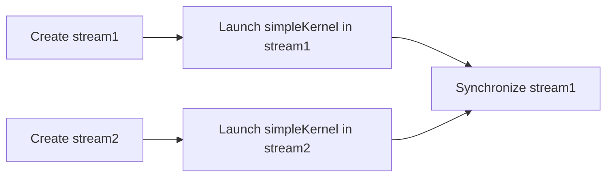
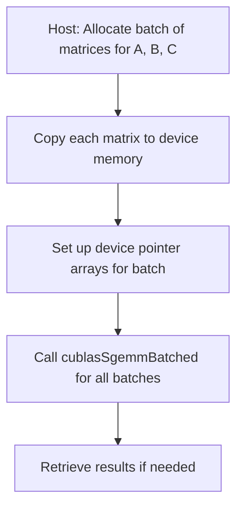
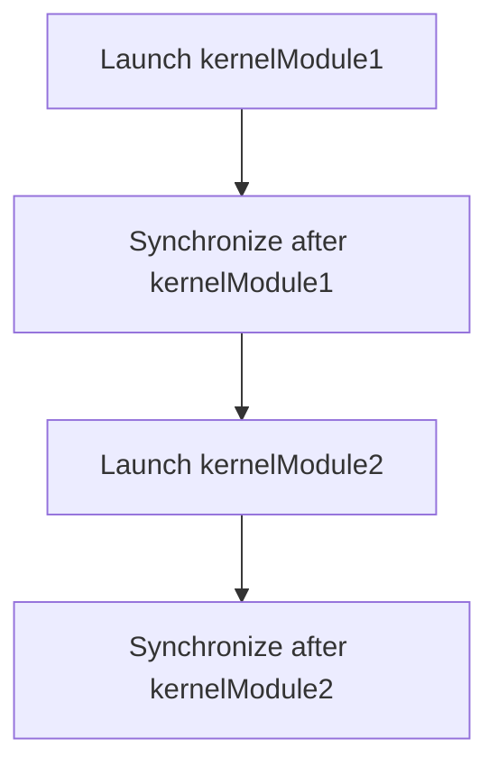
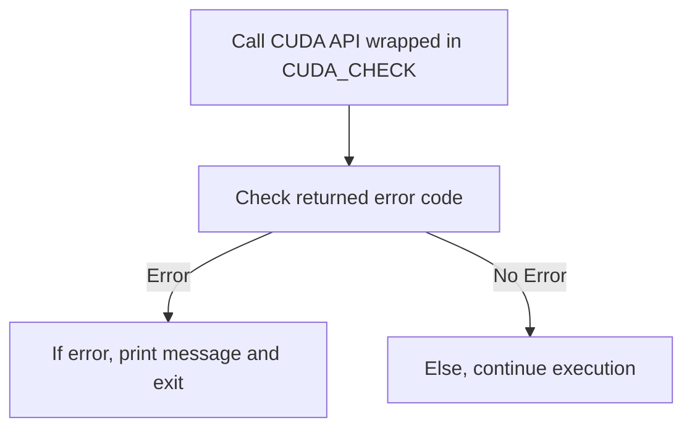
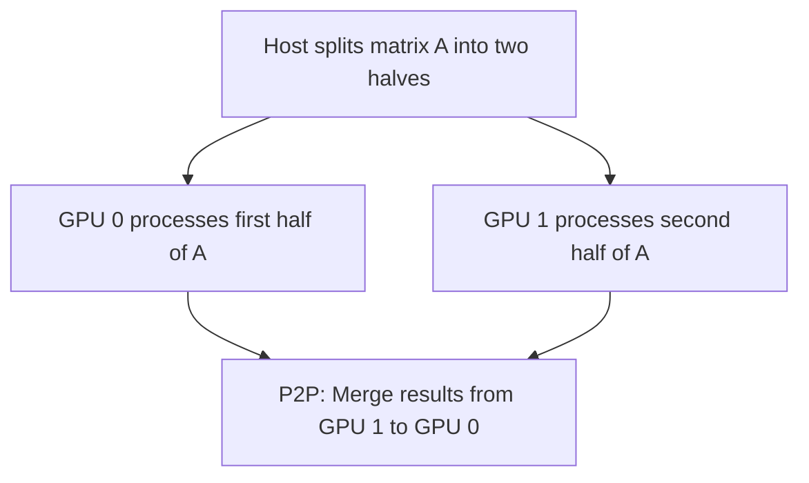
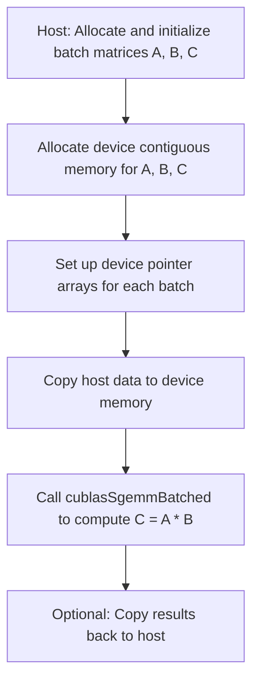
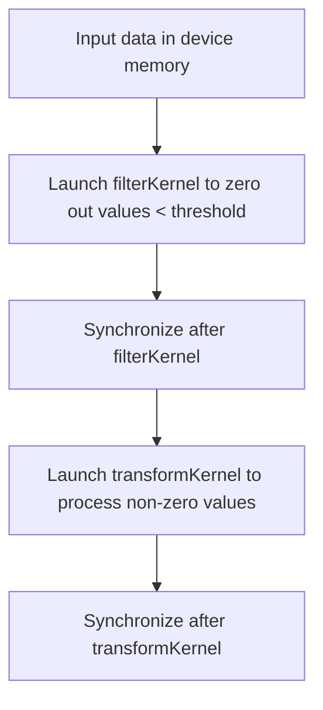
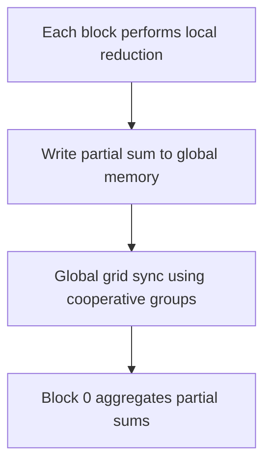

# Day 84: Progress Checkpoint

In this checkpoint, we reflect on key topics from **Days 71–83**—covering advanced concurrency patterns, multi-GPU programming, and the integration of external libraries for deep learning. Missing synergy among these elements can lead to suboptimal solutions. This checkpoint provides a concise recap of the major lessons and includes a short quiz to test your understanding.

---

## Table of Contents

1. [Overview](1-#overview)  
2. [Recap of Key Topics (Days 71–83)](#2-recap-of-key-topics-days-71-83)  
   - [Advanced Streams & Overlapping (Day 71)](#advanced-streams--overlapping-day-71)  
   - [CUDA Graphs: Complex Workflows (Day 72)](#cuda-graphs-complex-workflows-day-72)  
   - [Dynamic Graph Launches (Day 73)](#dynamic-graph-launches-day-73)  
   - [Multi-GPU Programming: Deeper Exploration (Day 74)](#multi-gpu-programming-deeper-exploration-day-74)  
   - [Performance Metrics & Roofline Analysis (Day 75)](#performance-metrics--roofline-analysis-day-75)  
   - [Mixed Precision & Tensor Cores (Day 76)](#mixed-precision--tensor-cores-day-76)  
   - [UM Advanced Topics: Prefetch & Advise (Day 77)](#um-advanced-topics-prefetch--advise-day-77)  
   - [Modular Kernel Design (Day 78)](#modular-kernel-design-day-78)  
   - [Portability & Scalability Best Practices (Day 79)](#portability--scalability-best-practices-day-79)  
   - [Capstone Project #4: Multi-GPU Matrix Multiply (Day 80)](#capstone-project-4-multi-gpu-matrix-multiply-day-80)  
   - [Cooperative Groups: Advanced Patterns (Day 81)](#cooperative-groups-advanced-patterns-day-81)  
   - [Large-Scale Batch Processing (Day 82)](#large-scale-batch-processing-day-82)  
   - [External Libraries (cuDNN, etc.) (Day 83)](#external-libraries-cudnn-etc-day-83)  
3. [Quiz: Test Your Understanding](#3-quiz-test-your-understanding)  
4. [Conclusion & Next Steps](#4-conclusion--next-steps)

---

## 1. Overview

Over the past several days, we have advanced from basic multi-stream overlapping and cooperative groups to sophisticated multi-GPU strategies and external library integration. These topics have emphasized:

- **Concurrency**: How advanced streams, dynamic graph launches, and cooperative groups can maximize throughput.
- **Multi-GPU Scaling**: Techniques for partitioning data and synchronizing across GPUs, ensuring efficient workload distribution.
- **Performance Analysis**: Using roofline analysis and occupancy tuning to identify bottlenecks.
- **Mixed Precision**: Leveraging Tensor Cores and cuDNN for deep learning, balancing performance with numerical accuracy.
- **Unified Memory Enhancements**: Using prefetch and memory advice to optimize data locality.
- **Modular Kernel Design & Portability**: Structuring large projects into manageable pieces while ensuring code works across diverse architectures.

Missing the synergy among these elements can result in race conditions, idle SMs, or overall inefficient execution.

---

## 2. Recap of Key Topics (Days 71–83)

### Advanced Streams & Overlapping (Day 71)
- **Concepts**: Overlapping kernel execution, data transfers, and CPU tasks using multiple streams and events.
- **Challenges**: Missing synchronization leads to race conditions.
- **Tools**: Nsight Systems helps visualize stream concurrency.

### CUDA Graphs: Complex Workflows (Day 72)
- **Concepts**: Merging dependent kernels and data transfers into a single, replayable CUDA graph.
- **Pitfalls**: Incomplete graph finalization can cause partial runs.

### Dynamic Graph Launches (Day 73)
- **Concepts**: Building and launching CUDA graphs at runtime based on adaptive conditions.
- **Trade-Offs**: Too many small graphs can lead to overhead.

### Multi-GPU Programming: Deeper Exploration (Day 74)
- **Concepts**: Splitting data across multiple GPUs, ensuring load balance, and using peer-to-peer (P2P) transfers.
- **Challenges**: Load imbalance if data is not split evenly.

### Performance Metrics & Roofline Analysis (Day 75)
- **Concepts**: Collecting memory throughput and FLOPS to plot kernel performance on the roofline.
- **Focus**: Identify whether kernels are memory-bound or compute-bound.

### Mixed Precision & Tensor Cores (Day 76)
- **Concepts**: Using half-precision (FP16) matrix multiplication on Tensor Cores with FP32 accumulation.
- **Trade-Offs**: Precision trade-offs may impact accuracy.

### UM Advanced Topics: Prefetch & Advise (Day 77)
- **Concepts**: Using `cudaMemPrefetchAsync` and `cudaMemAdvise` to optimize Unified Memory.
- **Challenges**: Incorrect prefetch sizes can cause performance drops.

### Modular Kernel Design (Day 78)
- **Concepts**: Splitting large kernels into modular, manageable sub-kernels.
- **Trade-Offs**: Over-fragmentation increases launch overhead.

### Portability & Scalability Best Practices (Day 79)
- **Concepts**: Adapting code to run efficiently on different GPU architectures.
- **Pitfalls**: Hardcoding for a single GPU leads to poor portability.

### Capstone Project #4: Multi-GPU Matrix Multiply (Day 80)
- **Concepts**: Distributing a large matrix multiplication across two GPUs.
- **Techniques**: Data partitioning, P2P transfers, and result merging.

### Cooperative Groups: Advanced Patterns (Day 81)
- **Concepts**: Using grid-level cooperative groups for global synchronization.
- **Requirements**: Not all GPUs support grid-level sync.

### Large-Scale Batch Processing (Day 82)
- **Concepts**: Using cuBLAS batched GEMM to process multiple small matrix multiplications efficiently.
- **Trade-Offs**: Wrong batch sizes lead to idle SMs.

### External Libraries (cuDNN, etc.) (Day 83)
- **Concepts**: Integrating external libraries like cuDNN for neural network layers.
- **Challenges**: Version mismatches can cause runtime errors.

---

## 3. Quiz: Test Your Understanding

1. **What is the benefit of overlapping kernel execution with data transfers using multiple streams?**  
   *Answer*: It hides data transfer latency, maximizes GPU utilization, and improves overall throughput.

2. **Why must you finalize a CUDA graph before launching it?**  
   *Answer*: Incomplete graphs can lead to missing nodes or operations, resulting in partial computations or data transfers.

3. **How does dynamic graph launching differ from static graph creation?**  
   *Answer*: Dynamic graph launching builds graphs at runtime based on conditions, offering flexibility but potentially higher overhead if graphs are too small or frequently rebuilt.

4. **What is a common cause of load imbalance in multi-GPU programming?**  
   *Answer*: Uneven data partitioning where one GPU receives more work than the other, leading to idle time on the less-loaded GPU.

5. **What does the roofline model help you determine in kernel performance analysis?**  
   *Answer*: It helps identify whether a kernel is memory-bound or compute-bound by comparing its operational intensity and achieved FLOPS against hardware limits.

6. **Why might using mixed precision (FP16) lead to accuracy issues?**  
   *Answer*: FP16 has a reduced dynamic range and precision, which can result in rounding errors or loss of significant digits in sensitive computations.

7. **What role does cudaMemAdvise play in Unified Memory optimization?**  
   *Answer*: It provides hints to the driver regarding memory usage patterns (e.g., read-mostly) to optimize data placement and migration.

8. **What is the potential downside of breaking a large kernel into too many small kernels?**  
   *Answer*: It can introduce excessive kernel launch overhead, reducing overall performance due to increased synchronization and memory traffic.

9. **How do cooperative groups enhance global synchronization in a kernel?**  
   *Answer*: They allow all threads in a grid to synchronize using functions like grid.sync(), enabling complex global reductions or data exchanges.

10. **What is one of the challenges when integrating external libraries like cuDNN into your CUDA projects?**  
    *Answer*: Ensuring compatibility between the library version, CUDA Toolkit, and GPU hardware to avoid runtime errors.

---

## 4. Conclusion & Next Steps

In this checkpoint, we’ve reviewed advanced topics from concurrency and multi-GPU programming to performance analysis and external library integration. The synergy of these areas is crucial—missing synchronization or inefficient resource partitioning can lead to suboptimal performance. 

**Next Steps:**
- **Review and Refactor**: Revisit your code to ensure all synchronization points are correctly placed.
- **Profile**: Use Nsight Systems and Nsight Compute to verify that each component (streams, graphs, multi-GPU, etc.) is working optimally.
- **Extend**: Continue integrating more complex features into your HPC pipelines, such as dynamic graph launches or additional external libraries.
- **Document**: Maintain clear documentation on device-specific configurations to ease future portability and scalability.

```

```
# Advanced Quiz: 10 LeetCode-Style Theoretical Questions & Answers

Below are 10 advanced theoretical questions designed in a LeetCode-style quiz format. These questions cover topics such as dynamic parallelism, CUDA graphs, cooperative groups, roofline analysis, memory management, cuDNN integration, multi-GPU load balancing, occupancy, mixed precision, and dynamic graph launches. Each question is followed by an in-depth solution.

---

### 1. What is the primary benefit of using CUDA graphs in high-performance computing pipelines?

**Answer:**  
CUDA graphs allow you to capture a series of dependent operations—kernels, memory copies, and host tasks—into a single, replayable entity. The main benefits are:
- **Reduced Launch Overhead:** Instead of launching many individual kernels, you launch one graph, reducing runtime overhead.
- **Deterministic Execution:** Graphs explicitly encode dependencies, ensuring that operations execute in the correct order without repeated synchronization calls.
- **Reusability:** Once instantiated, the same graph can be replayed multiple times, which is ideal for iterative algorithms or recurring workflows.

---

### 2. How do cooperative groups enable grid-level synchronization, and what are the hardware requirements for this feature?

**Answer:**  
Cooperative groups provide an API (using `cg::this_grid()`) that aggregates all threads across all blocks into a grid group, allowing them to synchronize using `grid.sync()`. This enables advanced patterns like global reductions or collective operations within a single kernel launch.  
**Hardware Requirements:**  
- **Cooperative Launch Support:** The GPU must support cooperative launches (available in newer architectures such as Volta and later).  
- **Driver Compatibility:** The CUDA driver and Toolkit must be up-to-date to support grid-level cooperative groups.  
- **Sufficient Resources:** Adequate shared memory and register resources per SM are required to maintain high occupancy while synchronizing across blocks.

---

### 3. Describe the roofline model and explain how it guides kernel optimizations.

**Answer:**  
The roofline model is a visual performance model that plots:
- **Arithmetic Intensity (FLOPs/Byte)** on the X-axis.
- **Achieved Performance (FLOPS)** on the Y-axis.

It includes:
- A **memory-bound line** with a slope equal to the peak memory bandwidth.
- A **compute-bound ceiling** representing the maximum achievable FLOPS.

By locating a kernel’s performance point on this chart:
- **Memory-Bound:** If the kernel’s point lies near the diagonal, it indicates that memory throughput is the limiting factor. Optimization efforts should focus on improving data access patterns (e.g., coalescing, tiling).
- **Compute-Bound:** If the point is near the horizontal ceiling, the kernel is limited by compute resources, and optimizations should target improving instruction-level parallelism, reducing register pressure, or increasing occupancy.

---

### 4. What are the trade-offs between using pinned (page-locked) memory and unified memory (UM) in CUDA?

**Answer:**  
**Pinned Memory:**  
- **Advantages:**  
  - Enables faster host-to-device transfers via DMA.
  - Allows asynchronous data transfers that can overlap with kernel execution.
- **Disadvantages:**  
  - Large pinned allocations can reduce overall system performance by limiting pageable memory.
  - Requires manual management (explicit allocation and free).

**Unified Memory (UM):**  
- **Advantages:**  
  - Simplifies programming by providing a single pointer accessible by both host and device.
  - Automatic data migration reduces the need for explicit `cudaMemcpy` calls.
- **Disadvantages:**  
  - Can lead to unpredictable page faults if not properly managed.
  - Performance may suffer if data is not prefetch or if access patterns are not optimized.

The choice depends on the application's needs for speed versus ease of programming, and careful tuning (e.g., prefetching, memory advice) is often necessary for optimal performance.

---

### 5. Explain the role of `cudaMemAdvise` in Unified Memory and its impact on performance.

**Answer:**  
`cudaMemAdvise` provides hints to the CUDA driver regarding the expected usage of Unified Memory regions. Its primary roles are:
- **Preferred Location:** Suggests that a memory region be kept close to a particular device, reducing page migrations when accessed frequently by that device.
- **Read-Mostly:** Indicates that a region is mostly read, allowing the driver to optimize for caching and potentially replicate the data across devices.
- **Accessed by:** Hints which device will access the memory, improving locality.

**Impact on Performance:**  
- Correct advice can reduce page-fault overhead and improve data locality.
- Incorrect advice (e.g., marking frequently written memory as read-mostly) can lead to unnecessary migrations and performance degradation.

---

### 6. How does integrating cuDNN improve the performance of neural network layers compared to custom CUDA implementations?

**Answer:**  
cuDNN is a highly optimized library tailored for deep learning workloads. Its advantages include:
- **Optimized Kernels:** Uses state-of-the-art algorithms that are tuned for various GPU architectures, often achieving higher performance than hand-optimized custom kernels.
- **Tensor Core Utilization:** Automatically leverages Tensor Cores for mixed-precision operations, significantly accelerating convolutional operations.
- **Ease of Use:** Abstracts the complexity of neural network computations, allowing developers to focus on higher-level design rather than low-level optimization.
- **Consistency & Reliability:** Regular updates and robust testing ensure consistent performance across different GPU models.

---

### 7. What strategies can be used to ensure load balancing in a multi-GPU matrix multiplication?

**Answer:**  
To ensure balanced workload distribution across GPUs:
- **Even Data Partitioning:** Split the matrix evenly (e.g., row-wise or column-wise) based on the dimensions and computational cost.
- **Dynamic Adjustment:** Monitor execution times on each GPU and adapt the partitioning ratio if one GPU consistently finishes later than the other.
- **Work Stealing:** In more complex scenarios, allow idle GPUs to take on extra work from busier ones.
- **Peer-to-Peer Transfers:** If GPUs support P2P, use direct transfers to balance partial results without host intervention.

---

### 8. How do you measure kernel occupancy and why is it important?

**Answer:**  
**Kernel Occupancy** is measured by calculating the ratio of active warps per Streaming Multiprocessor (SM) to the maximum possible warps. Tools like **Nsight Compute** and **CUDA Occupancy Calculator** help determine occupancy.  
- **Importance:**  
  - High occupancy can hide memory latency by allowing the GPU scheduler to switch between warps.
  - It informs you whether resource constraints (registers, shared memory) are limiting performance.
  - Optimizing occupancy can lead to improved throughput, although it must be balanced with other factors like memory bandwidth and instruction efficiency.

---

### 9. What are the benefits and potential risks of using mixed precision (FP16) on Tensor Cores?

**Answer:**  
**Benefits:**  
- **Speed:** FP16 operations are much faster, particularly on Tensor Cores, which are designed for mixed-precision computing.
- **Memory Savings:** FP16 uses half the memory of FP32, increasing effective memory bandwidth.
- **Increased Throughput:** Enables higher performance for matrix multiplications and deep learning layers.

**Risks:**  
- **Precision Loss:** Reduced precision may lead to rounding errors and accuracy loss in sensitive computations.
- **Numerical Stability:** Algorithms that are not tolerant of lower precision may produce incorrect or unstable results.
- **Range Limitations:** FP16 has a narrower dynamic range, which can cause underflow or overflow in certain applications.

---

### 10. What challenges are associated with dynamic graph launches, and how can they be mitigated?

**Answer:**  
**Challenges:**  
- **Overhead:** Repeatedly building and launching many small graphs can introduce significant overhead.
- **Complexity:** Dynamically adapting graphs at runtime increases code complexity and potential for errors.
- **Synchronization Issues:** Incorrectly set dependencies in dynamic graphs can lead to race conditions or incomplete execution.

**Mitigation Strategies:**  
- **Graph Reuse:** Pre-build a small set of graph templates for common scenarios rather than rebuilding every time.
- **Batching Operations:** Combine multiple small operations into a single graph to reduce the frequency of graph creation.
- **Profile & Optimize:** Use tools like Nsight Systems to monitor the overhead and adjust your dynamic graph strategy accordingly.

---


```

```
# Intermediate Theoretical Questions Quiz – Advanced GPU Topics

Below are 10 intermediate-level theoretical questions in a LeetCode-style format. Each question is followed by an answer with an explanation to help reinforce key concepts in advanced CUDA programming, including dynamic graphs, cooperative groups, multi-stream concurrency, memory management, and performance analysis.

---

### 1. What is the main advantage of dynamic graph launches compared to static graph creation in CUDA?

**Answer:**  
Dynamic graph launches allow you to build and launch CUDA graphs at runtime based on data-dependent conditions or adaptive algorithms. This offers the flexibility to customize the execution flow for varying workloads without the need to rebuild entirely separate static graphs for every case. However, if done excessively for very small operations, the overhead of graph creation can negate the benefits.

*Explanation:*  
Dynamic graphs provide adaptability and can optimize workflows by incorporating conditional branches. They are ideal when the workload pattern is not fixed. The trade-off is the potential overhead if graphs are too granular or created too frequently.

---

### 2. How does grid-level synchronization using cooperative groups work, and what is a key hardware limitation of this feature?

**Answer:**  
Grid-level synchronization is achieved using cooperative groups by calling `cg::this_grid()` to create a grid-wide group, followed by a call to `grid.sync()` which synchronizes all blocks in the kernel. The key hardware limitation is that not all GPUs support grid-level cooperative launches—this feature is only available on newer architectures (such as Volta and later) that support cooperative groups at the grid level.

*Explanation:*  
Grid-level sync allows global coordination across all blocks, enabling complex algorithms like full reductions. However, always verify that the target GPU supports these operations to avoid runtime issues.

---

### 3. In a multi-stream environment, how can overlapping data transfers with kernel execution improve performance?

**Answer:**  
By using multiple CUDA streams, you can initiate asynchronous data transfers (e.g., with `cudaMemcpyAsync`) concurrently with kernel execution in separate streams. This overlapping hides the latency of data transfers by ensuring that the GPU remains busy with computation while data is being copied, thereby improving overall throughput and efficiency.

*Explanation:*  
Overlapping operations minimizes idle time. For instance, while one stream transfers data to the device, another stream can execute a kernel on previously transferred data. Proper synchronization (using events) is crucial to avoid race conditions.

---

### 4. What are the trade-offs between using pinned (page-locked) memory and unified memory (UM) in CUDA?

**Answer:**  
**Pinned Memory:**  
- *Advantages:* Faster, asynchronous transfers due to direct DMA access; enables overlapping of data transfer and computation.  
- *Disadvantages:* Large pinned allocations can limit overall system memory and affect CPU performance.

**Unified Memory (UM):**  
- *Advantages:* Simplifies programming by providing a single address space for host and device; automatic page migration reduces manual copying.  
- *Disadvantages:* Can incur unpredictable page faults and migration overhead if access patterns are not well-managed.

*Explanation:*  
Choosing between pinned memory and UM depends on the workload. For high-throughput, predictable transfers, pinned memory is preferred. UM simplifies development but may require tuning (e.g., with prefetch and advise) for optimal performance.

---

### 5. How does the roofline model help guide kernel optimizations?

**Answer:**  
The roofline model plots arithmetic intensity (FLOPs per byte) on the X-axis and achieved performance (FLOPS) on the Y-axis, overlaid with lines representing the memory bandwidth limit and the peak compute capability. By locating a kernel’s performance point on this chart, developers can determine whether the kernel is memory-bound or compute-bound. This insight helps focus optimization efforts on improving data movement (for memory-bound kernels) or computation (for compute-bound kernels).

*Explanation:*  
This model provides a visual benchmark. If a kernel lies close to the memory-bound line, optimizations should target memory accesses. Conversely, if it is near the compute ceiling, efforts should be directed at enhancing compute efficiency.

---

### 6. What potential pitfalls exist when choosing the batch size for cuBLAS batched GEMM operations?

**Answer:**  
If the batch size is too small, not all SMs may be fully utilized, leading to idle GPU resources and lower throughput. Conversely, if the batch size is too large, it may cause resource contention or memory pressure, which can degrade performance due to increased overhead in managing the batch. Finding the optimal batch size is crucial to maximize SM utilization and overall efficiency.

*Explanation:*  
Batch size directly impacts the parallel workload distribution. Tuning it requires careful profiling to balance between underutilization and resource saturation.

---

### 7. How do mixed precision operations on Tensor Cores improve performance, and what are the risks involved?

**Answer:**  
Mixed precision operations leverage Tensor Cores by performing computations in FP16, which allows for higher throughput and reduced memory usage compared to FP32. However, FP16 has a limited dynamic range and lower precision, which may lead to rounding errors, numerical instability, and accuracy loss in sensitive computations.

*Explanation:*  
The performance gains come from faster arithmetic and reduced data transfer sizes. The risk is that critical algorithms may not tolerate the precision loss, necessitating strategies like FP32 accumulation to mitigate errors.

---

### 8. What role does `cudaMemAdvise` play in Unified Memory management?

**Answer:**  
`cudaMemAdvise` provides hints to the CUDA driver regarding the expected usage of Unified Memory regions, such as whether they are read-mostly or should be preferentially located on a specific device. These hints allow the driver to optimize data placement and migration, potentially reducing page fault overhead and improving performance.

*Explanation:*  
By advising the driver, you can control memory residency and migration patterns. Incorrect advice, however, can lead to unnecessary page migrations or suboptimal data placement, harming performance.

---

### 9. What are key considerations for splitting a workload across multiple GPUs?

**Answer:**  
Key considerations include:
- **Data Partitioning:** Ensuring that each GPU receives an approximately equal portion of the workload to prevent load imbalance.
- **Inter-GPU Communication:** Minimizing data transfer overhead between GPUs by using P2P transfers if supported.
- **Synchronization:** Properly synchronizing GPUs to ensure that partial results are correctly merged.
- **Scalability:** Designing the system so that it can scale to more than two GPUs without significant code changes.

*Explanation:*  
Effective multi-GPU programming requires balancing the workload to prevent one GPU from becoming a bottleneck, while also ensuring that data exchanges are efficient and correctly synchronized.

---

### 10. How can occupancy tuning (using __launch_bounds__ or -maxrregcount) affect kernel performance, and why must it be balanced with other factors?

**Answer:**  
Occupancy tuning adjusts the number of active warps per SM by limiting register usage or shared memory per thread. Using `__launch_bounds__` or `-maxrregcount` can increase occupancy, potentially hiding memory latency. However, too aggressive a limit may cause register spills to local memory, which increases memory traffic and latency, offsetting the benefits of higher occupancy. Therefore, occupancy tuning must be balanced with factors such as arithmetic intensity, memory bandwidth, and overall resource utilization to ensure that performance improvements are realized.

*Explanation:*  
High occupancy can improve performance by better hiding latency, but it should not come at the cost of increased overhead due to register spills or other resource conflicts. Profiling is essential to find the optimal balance.

---
```
```
# Day 84: Progress Checkpoint – Easy Theoretical Quiz

Below are 10 easy-level LeetCode-style theoretical questions along with their solutions. These questions review key concepts from Days 71–83, including advanced concurrency patterns, multi-GPU programming, external libraries, performance metrics, and more.

---

### 1. What is the main purpose of using multiple CUDA streams in an application?

**Answer:**  
Multiple CUDA streams allow overlapping of operations such as kernel execution, data transfers, and CPU tasks. This helps to hide latency and increase overall throughput by enabling concurrency.

---

### 2. Why are CUDA events used in a multi-stream setup?

**Answer:**  
CUDA events are used to synchronize operations between streams. They signal when an operation (like a data transfer or kernel execution) is complete, ensuring that dependent operations in other streams start only when the required data is ready.

---

### 3. What is a CUDA graph and how does it benefit complex workflows?

**Answer:**  
A CUDA graph captures a sequence of operations (kernels, memory copies, etc.) into a single, replayable entity. It reduces launch overhead and enforces explicit dependencies, which improves performance in repetitive or complex workflows.

---

### 4. How do cooperative groups facilitate global synchronization in a kernel?

**Answer:**  
Cooperative groups allow threads across different blocks to synchronize by creating a grid-level group (using `cg::this_grid()`) and calling `grid.sync()`. This global synchronization is essential for operations like global reductions.

---

### 5. Why is load balancing critical in multi-GPU programming?

**Answer:**  
Load balancing ensures that all GPUs are utilized effectively. Uneven data partitioning can lead to one GPU finishing its work earlier while others are still processing, resulting in idle time and reduced overall performance.

---

### 6. What does the roofline model help determine in kernel performance analysis?

**Answer:**  
The roofline model helps determine whether a kernel is memory-bound or compute-bound by plotting its arithmetic intensity (FLOPs/Byte) against its achieved performance (FLOPS). This guides whether optimizations should focus on improving memory access or computational efficiency.

---

### 7. What advantage does unified memory provide in CUDA programming?

**Answer:**  
Unified memory simplifies programming by providing a single memory space accessible by both the host and device. It automatically handles data migration between the CPU and GPU, reducing the need for explicit data transfers.

---

### 8. How do mixed precision operations improve performance on Tensor Cores?

**Answer:**  
Mixed precision operations, typically using FP16 for computations and FP32 for accumulation, allow Tensor Cores to perform matrix multiplications much faster while reducing memory usage. This can lead to significant speedups in deep learning and HPC applications, though care must be taken to manage precision loss.

---

### 9. What is the benefit of modular kernel design in large-scale projects?

**Answer:**  
Modular kernel design breaks down large, complex kernels into smaller, manageable pieces. This improves code maintainability, simplifies debugging and optimization, and allows for easier reuse of common operations across different parts of an application.

---

### 10. Why should developers avoid hardcoding parameters for a specific GPU architecture?

**Answer:**  
Hardcoding parameters for a single GPU can lead to poor portability and scalability. By querying device properties at runtime and using conditional compilation, developers can ensure that their code adapts efficiently to different GPU architectures and maximizes performance across hardware generations.

---
```

```
# Day 84: Progress Checkpoint – Intermediate Theoretical Quiz

Below are 10 intermediate-level LeetCode-style theoretical questions along with their solutions. These questions cover topics from Days 71–83, including advanced streams, CUDA graphs, multi-GPU programming, occupancy tuning, unified memory optimizations, mixed precision, modular kernel design, and external library integration. Use these questions to test your understanding of the advanced GPU programming concepts discussed in this series.

---

### 1. Dynamic Graph Launches
**Q:** Explain how dynamic graph launches can be beneficial for data-dependent workflows. What is the main trade-off compared to static graph creation?

**A:**  
Dynamic graph launches allow the application to build CUDA graphs at runtime based on current data or conditions. This adaptability enables the execution pipeline to include only the necessary operations, reducing redundant computation.  
*Trade-off:*  
The overhead of constructing and instantiating a graph at runtime can be significant if the graphs are very small or frequently rebuilt. In such cases, the dynamic creation overhead might negate the benefits of reduced launch latency that static graphs provide.

---

### 2. Occupancy Tuning Trade-offs
**Q:** How does limiting register usage with `__launch_bounds__` or `-maxrregcount` affect kernel occupancy, and why might increasing occupancy not always result in better performance?

**A:**  
Limiting register usage forces the compiler to allocate fewer registers per thread, which can increase occupancy by allowing more warps to reside on an SM simultaneously. However, if the kernel requires a high number of registers for optimal performance, limiting registers may cause register spilling to local memory, increasing latency and memory traffic. Thus, while occupancy increases, overall performance may suffer if the spilled memory access cost outweighs the benefits of higher parallelism.

---

### 3. Optimizing Unified Memory with Prefetch & Advise
**Q:** Describe how you would use `cudaMemPrefetchAsync` and `cudaMemAdvise` to optimize unified memory in a multi-GPU system.

**A:**  
- **cudaMemPrefetchAsync:** Preload unified memory to a specific GPU before kernel execution. For instance, if GPU 0 is going to run a kernel that heavily accesses a UM array, call `cudaMemPrefetchAsync(ptr, size, 0, stream)` to minimize page faults.
- **cudaMemAdvise:** Provide hints to the driver about the expected usage. For example, marking a memory region as read-mostly with `cudaMemAdvise(ptr, size, cudaMemAdviseSetReadMostly, 0)` can improve caching and reduce unnecessary migrations.
*Overall,* these techniques ensure that data is resident on the appropriate device when needed, reducing overhead from on-demand page faults and improving performance.

---

### 4. Multi-GPU Matrix Multiplication Considerations
**Q:** What key considerations must be taken into account when designing a multi-GPU matrix multiplication kernel to ensure load balancing and minimal inter-GPU communication overhead?

**A:**  
- **Data Partitioning:** Split the matrices evenly (e.g., row-wise or column-wise) so that each GPU gets a balanced workload.
- **Inter-GPU Communication:** Use peer-to-peer (P2P) transfers where possible to merge partial results directly between GPUs rather than via the host.
- **Synchronization:** Ensure that each GPU completes its computation before merging results to avoid race conditions.
- **Scalability:** Consider dynamic partitioning if the computational cost per partition is not uniform.
These strategies help ensure that all GPUs work concurrently and that inter-GPU data transfers do not become a bottleneck.

---

### 5. Grid-Level Cooperative Groups
**Q:** How do grid-level cooperative groups enable global synchronization, and what are the limitations of this approach on older GPU architectures?

**A:**  
Grid-level cooperative groups allow all threads across all blocks to synchronize using `cg::this_grid()` and `grid.sync()`. This enables global operations such as full reductions or adaptive load balancing within a single kernel launch.  
*Limitations:*  
Not all GPUs support grid-level synchronization; this feature is available only on newer architectures (e.g., Volta and later). Older GPUs may lack the necessary hardware support or require different programming techniques to achieve similar results.

---

### 6. Roofline Model Application
**Q:** How can the roofline model help you decide whether to focus on memory optimizations or computational optimizations for a given kernel?

**A:**  
The roofline model plots the kernel’s operational intensity (FLOPs per byte) against its achieved performance (GFLOPS). If the kernel’s point lies near the memory-bound (diagonal) line, it indicates that performance is limited by memory bandwidth, suggesting optimizations like improved memory coalescing or data reuse. Conversely, if the point is close to the compute-bound (horizontal) ceiling, the kernel is limited by computation, and optimizations should focus on enhancing arithmetic intensity, reducing register usage, or increasing instruction-level parallelism.

---

### 7. Mixed Precision on Tensor Cores
**Q:** What benefits do mixed precision operations on Tensor Cores offer, and what potential issues must be managed?

**A:**  
**Benefits:**
- **Speed:** FP16 operations are significantly faster, especially when using Tensor Cores.
- **Memory Efficiency:** FP16 data consumes half the memory of FP32, increasing effective bandwidth.
- **Higher Throughput:** Enables accelerated deep learning operations.
  
**Issues:**
- **Precision Loss:** Reduced dynamic range and precision can lead to rounding errors.
- **Numerical Stability:** Sensitive algorithms may require careful accumulation in higher precision (FP32) to maintain accuracy.
Managing these trade-offs often involves strategies such as mixed-precision arithmetic, where FP16 is used for multiplication and FP32 for accumulation.

---

### 8. Using cudaMemAdvise in UM
**Q:** What specific advantage does `cudaMemAdvise` offer when managing Unified Memory, and how does it affect page migration?

**A:**  
`cudaMemAdvise` allows the programmer to inform the CUDA driver about the expected access patterns for Unified Memory regions. For example, using `cudaMemAdviseSetReadMostly` hints that a memory region will be primarily read, prompting the driver to potentially replicate pages across devices and reduce migration overhead. Similarly, `cudaMemAdviseSetPreferredLocation` can be used to indicate the device on which the data should reside, reducing page faults when that device accesses the memory. These advices optimize page placement, minimizing latency due to on-demand migrations.

---

### 9. Modular Kernel Design
**Q:** How does modular kernel design contribute to both maintainability and performance in large-scale CUDA projects?

**A:**  
Modular kernel design breaks a large, complex kernel into smaller, specialized sub-kernels, which offers several benefits:
- **Maintainability:** Smaller kernels are easier to develop, debug, and update.
- **Reusability:** Common operations can be abstracted into standalone modules and reused across different projects.
- **Performance Tuning:** Each module can be optimized independently. However, excessive fragmentation can lead to increased kernel launch overhead, so a balance must be struck between modularity and performance.
This approach ensures that while code remains clean and manageable, performance is not sacrificed by unnecessary overhead.

---

### 10. External Libraries Integration (cuDNN)
**Q:** What are the primary challenges when integrating external libraries like cuDNN into a CUDA project, and how can these be mitigated?

**A:**  
**Challenges:**
- **Version Compatibility:** Mismatches between the cuDNN version, CUDA Toolkit, and GPU drivers can cause runtime errors.
- **API Changes:** cuDNN APIs may evolve, requiring updates to existing code.
- **Dependency Management:** Ensuring that the library is correctly linked and available on the target system.

**Mitigation Strategies:**
- **Regular Updates:** Keep your development environment and codebase updated with the latest compatible versions.
- **Conditional Compilation:** Use preprocessor directives to handle different API versions if necessary.
- **Thorough Testing:** Validate the integration on multiple systems to ensure portability and robustness.
These practices ensure that the performance benefits of cuDNN are realized without introducing instability or compatibility issues.

---
```

```
# Day 84: Progress Checkpoint – Advanced Theoretical Quiz

Below are 10 advanced-level LeetCode-style theoretical questions along with detailed solutions. These questions cover complex topics from Days 71–83, including dynamic graph launches, cooperative groups, multi-GPU scaling, advanced memory management, mixed precision, and performance profiling. Use these to challenge your understanding and solidify your grasp of advanced CUDA programming concepts.

---

### 1. Dynamic Graph Launches Overhead
**Q:** In a scenario where your application dynamically constructs CUDA graphs based on data-dependent conditions, what advanced strategies can be implemented to minimize the overhead incurred by frequent graph instantiation?  
**A:**  
- **Graph Reuse:** Instead of rebuilding a new graph for every iteration, pre-build a small set of graph templates for common execution paths and reuse them.
- **Partial Graph Updates:** Use API functions to modify parts of an existing graph instead of creating it from scratch.
- **Batching Conditions:** Combine several small operations into one larger graph if they occur frequently to amortize the instantiation cost.
- **Profiling & Feedback:** Use tools like Nsight Systems to measure instantiation overhead and adjust the frequency of graph builds accordingly.
  
*Explanation:*  
Frequent graph creation can introduce significant overhead, so strategies such as reusing graphs or updating them incrementally can drastically reduce runtime costs while preserving flexibility.

---

### 2. Inter-GPU Communication Optimization
**Q:** Describe an advanced strategy to minimize the overhead of merging partial results from two GPUs using Peer-to-Peer (P2P) communication. What are the key considerations to ensure efficiency?  
**A:**  
- **Optimal Partitioning:** Split the workload so that the amount of data that needs to be exchanged between GPUs is minimized.
- **Direct P2P Transfers:** Use `cudaMemcpyPeerAsync` to transfer data directly between GPUs without involving the host.
- **Overlap Communication and Computation:** Schedule P2P transfers concurrently with independent computations on either GPU to hide transfer latency.
- **Synchronization Management:** Use CUDA events to precisely coordinate the transfers, ensuring that data is only transferred when ready.
  
*Explanation:*  
Efficient inter-GPU communication requires minimizing the volume of data exchanged and overlapping transfers with computation. Correct synchronization prevents idle times and ensures data integrity.

---

### 3. Occupancy Tuning Trade-Offs
**Q:** Explain how limiting register usage with `-maxrregcount` or `__launch_bounds__()` might inadvertently degrade performance in a heavily unrolled matrix multiplication kernel. What advanced techniques can be used to balance occupancy and performance?  
**A:**  
- **Register Spilling:** Limiting registers forces the compiler to spill excess registers to local memory, which increases memory traffic and latency.
- **Balanced Tuning:** Use profiling tools (e.g., Nsight Compute) to monitor register usage and adjust limits to the minimal level that does not cause spilling.
- **Kernel Fusion vs. Splitting:** In some cases, fusing operations may allow better reuse of registers; in others, splitting kernels can reduce register pressure.
- **Iterative Testing:** Fine-tune with iterative benchmarks to identify the sweet spot where occupancy is improved without incurring excessive local memory accesses.
  
*Explanation:*  
While high occupancy is desirable, it should not come at the expense of increased memory traffic due to register spills. Advanced tuning requires iterative profiling and balanced adjustments.

---

### 4. Modular Kernel Architecture
**Q:** How can you design a modular kernel architecture in large-scale CUDA projects to enhance maintainability without incurring significant launch overhead?  
**A:**  
- **Logical Grouping:** Divide the overall computation into logically distinct modules that perform specific tasks (e.g., filtering, transformation, reduction).
- **Kernel Fusion:** Where appropriate, fuse sub-kernels that share data to reduce global memory transfers, while keeping code modular through device functions.
- **Batched Launches:** Use CUDA Graphs to combine multiple modular kernels into a single launch when they are frequently executed together.
- **Parameterization:** Design kernels to accept configuration parameters so that they can adapt to different workloads without hardcoding multiple variants.
  
*Explanation:*  
Modular design improves maintainability and clarity, but excessive fragmentation can increase launch overhead. Strategies like kernel fusion and batched launches help mitigate this issue.

---

### 5. Advanced Profiling for Concurrency Issues
**Q:** What advanced profiling techniques would you employ to detect race conditions and synchronization issues in a multi-stream, multi-GPU environment, and how do they help in optimizing performance?  
**A:**  
- **Nsight Systems:** Provides timeline views to visualize kernel launches, data transfers, and event synchronizations, helping identify overlapping issues or idle periods.
- **Nsight Compute:** Offers detailed metrics on occupancy, memory throughput, and resource usage, pinpointing bottlenecks and race conditions.
- **Custom Instrumentation:** Integrate CUDA events and host timers in critical sections to measure synchronization delays and kernel execution times.
- **Comparative Analysis:** Run benchmarks with varying synchronization strategies to see which configuration minimizes race conditions and maximizes concurrency.
  
*Explanation:*  
Profiling tools enable you to visualize the execution flow and resource usage in a complex multi-stream and multi-GPU setup, making it easier to identify and resolve race conditions and inefficiencies.

---

### 6. Roofline Model for Mixed Precision Kernels
**Q:** How can the roofline model be used to guide optimization efforts for kernels utilizing mixed precision on Tensor Cores, and what adjustments might be necessary if the kernel is found to be memory-bound?  
**A:**  
- **Plotting Mixed Precision Metrics:** Compute the operational intensity (FLOPs/Byte) of your mixed-precision kernel and plot it on the roofline graph.
- **Identify Bottlenecks:** If the kernel lies near the memory-bound line, focus on optimizing memory access patterns (e.g., better coalescing, reduced global memory traffic).
- **Optimization Adjustments:** For memory-bound kernels, consider fusing kernels to reduce intermediate data, or optimize data layouts to improve cache utilization. If compute-bound, focus on enhancing Tensor Core usage and reducing overhead from precision conversions.
  
*Explanation:*  
The roofline model visually identifies whether performance is limited by memory bandwidth or compute capacity. For mixed precision kernels, this analysis can dictate whether to optimize memory access or further leverage Tensor Core acceleration.

---

### 7. Managing Mixed Precision Trade-Offs
**Q:** What techniques can be employed to mitigate the numerical precision loss inherent in FP16 computations on Tensor Cores while still leveraging their performance benefits?  
**A:**  
- **FP32 Accumulation:** Use FP16 for input multiplications but accumulate the results in FP32 to maintain accuracy.
- **Loss Scaling:** In deep learning, apply loss scaling to prevent underflow in gradients when using lower precision.
- **Selective Precision:** Only use FP16 in parts of the computation that are less sensitive to rounding errors, keeping critical computations in FP32.
- **Hybrid Approaches:** Combine FP16 and FP32 operations within the same kernel, using dynamic precision selection based on the data range.
  
*Explanation:*  
These techniques balance the speed benefits of FP16 with the need for accuracy. FP32 accumulation, in particular, is a common strategy to retain precision while still gaining the throughput advantages of Tensor Cores.

---

### 8. Optimizing Unified Memory in Multi-GPU Systems
**Q:** How can you use `cudaMemPrefetchAsync` and `cudaMemAdvise` in a multi-GPU environment to improve performance, and what are the key challenges in doing so?  
**A:**  
- **Prefetching:** Use `cudaMemPrefetchAsync` to proactively move unified memory pages to the GPU that will perform the computation, reducing page-fault overhead.
- **Memory Advice:** Apply `cudaMemAdvise` to indicate preferred locations or read-mostly attributes, which guides the driver in data placement and replication.
- **Challenges:**  
  - **Size Mismatches:** Incorrectly sized prefetch operations can lead to partial transfers and unexpected page faults.
  - **Conflicting Advice:** Different GPUs may have competing requirements, leading to frequent migrations.
  - **Overhead:** Excessive use of these calls can introduce additional overhead if not balanced properly.
  
*Explanation:*  
Properly tuning prefetch and memory advice in a multi-GPU context can lead to significant performance gains, but it requires careful planning of data access patterns and thorough profiling to avoid pitfalls.

---

### 9. Dynamic Graph Launch vs. Kernel Fusion
**Q:** Compare and contrast dynamic graph launches and kernel fusion as strategies to reduce kernel launch overhead. Under what conditions might one be preferred over the other?  
**A:**  
- **Dynamic Graph Launches:**  
  - **Pros:** Offer runtime adaptability by building graphs based on current conditions; can combine multiple dependent operations into a single launch.
  - **Cons:** Overhead from repeatedly constructing and instantiating graphs if operations are small or change frequently.
  
- **Kernel Fusion:**  
  - **Pros:** Merges multiple kernels into one, reducing launch overhead and improving data locality by keeping intermediate data in registers or shared memory.
  - **Cons:** Can lead to increased register pressure and complex code, making debugging and maintenance more challenging.
  
*Preference Conditions:*  
- **Dynamic Graph Launches** are preferred when the execution path is highly variable or data-dependent.  
- **Kernel Fusion** is better when the operations are tightly coupled and benefit from reduced memory traffic, provided the increased resource usage does not negate the benefits.
  
*Explanation:*  
Choosing between dynamic graph launches and kernel fusion depends on the workload variability and resource constraints. Both approaches aim to reduce launch overhead, but each has its own trade-offs in terms of flexibility and complexity.

---

### 10. Addressing Synchronization in Multi-Stream, Multi-GPU Environments
**Q:** What advanced strategies can be employed to ensure correct synchronization and prevent race conditions when running concurrent kernels across multiple streams and GPUs?  
**A:**  
- **Event Synchronization:** Use CUDA events (e.g., `cudaEventRecord`, `cudaStreamWaitEvent`) to enforce dependencies between streams.
- **Global Synchronization:** When necessary, use cooperative groups for grid-level synchronization to coordinate work across all blocks.
- **Peer-to-Peer (P2P) Synchronization:** Enable P2P transfers and use them in conjunction with events to ensure that data exchanged between GPUs is consistent.
- **Atomic Operations:** Carefully design atomic operations in critical sections to prevent data races, particularly in algorithms like BFS.
- **Profiling Tools:** Leverage Nsight Systems to monitor and debug synchronization issues, ensuring that all dependencies are met before subsequent kernels launch.
  
*Explanation:*  
In advanced multi-stream and multi-GPU setups, synchronization is critical. Combining CUDA events, cooperative groups, and atomic operations, along with thorough profiling, helps to guarantee that all operations proceed in the correct order, avoiding race conditions and ensuring data integrity.

---
```

```
# Day 84: Progress Checkpoint – Highly Advanced Theoretical Quiz

Below are 10 highly advanced/difficult theoretical questions designed in a LeetCode-style format. These questions delve deep into topics such as dynamic graph launches, advanced occupancy tuning, multi-GPU synchronization, fault tolerance in cooperative groups, dynamic memory pooling under dynamic parallelism, and more. Each question is followed by a detailed solution and explanation.

---

### 1. Dynamic Hierarchical Graph Launch Mechanism

**Q:**  
Design a strategy using CUDA graphs to dynamically adjust kernel parallelism based on runtime performance counters. How would you implement a system that, based on measured kernel execution time and occupancy, chooses between launching a fused (high-parallelism) graph or a segmented (more modular) graph? What are the potential pitfalls in this adaptive approach?

**A:**  
**Strategy:**  
- **Monitoring Phase:**  
  - Use runtime profiling (e.g., through Nsight Compute API or custom CUDA events) to measure kernel execution times and occupancy.
- **Decision Logic:**  
  - If the measured occupancy is high and execution time is below a threshold, fuse operations into a single graph to minimize launch overhead.
  - If occupancy is low or execution time exceeds a threshold (indicating potential resource bottlenecks), segment the workflow into multiple graphs that allow for additional tuning (e.g., adjusting block sizes or register usage).
- **Graph Construction:**  
  - Maintain a set of pre-defined graph templates (fused vs. segmented).
  - At runtime, choose the template based on the monitored metrics.
- **Potential Pitfalls:**  
  - **Overhead:** Frequent switching between graph templates may incur instantiation overhead.
  - **Stability:** Dynamic decisions might lead to oscillations if performance counters vary slightly between iterations.
  - **Complexity:** The added logic increases code complexity and may be hard to debug if performance tuning is not stable.

---

### 2. Advanced Occupancy Tuning and Register Spilling

**Q:**  
Explain how aggressive use of `-maxrregcount` to increase occupancy might lead to performance degradation in a heavily unrolled kernel. What advanced methods can be applied to balance occupancy and register spilling?

**A:**  
**Explanation:**  
- **Aggressive Tuning:**  
  - Reducing the register count per thread (using `-maxrregcount`) can increase the number of concurrent warps (higher occupancy).  
  - However, if the kernel requires more registers for its computations, this reduction forces the compiler to spill registers to local memory.
- **Consequences:**  
  - Register spilling increases memory traffic and latency, which can negate any benefits of higher occupancy.
- **Advanced Methods:**  
  - **Iterative Profiling:** Use Nsight Compute to profile register usage and identify the point where further reduction causes spills.
  - **Selective Unrolling:** Instead of fully unrolling loops, unroll partially to strike a balance.
  - **Kernel Fusion vs. Segmentation:** Evaluate whether fusing operations is beneficial or if separating them can reduce register pressure.
  - **Hybrid Tuning:** Combine compiler hints (`__launch_bounds__`) with dynamic runtime adjustments based on occupancy counters.
- **Conclusion:**  
  Balance occupancy improvements with the cost of spilling by testing multiple configurations and selecting the one that minimizes total execution time.

---

### 3. Multi-Stream, Multi-GPU Synchronization Strategies

**Q:**  
In a scenario where multiple streams across two GPUs are concurrently processing data that must eventually be merged, describe an advanced synchronization strategy that ensures data integrity without serializing the entire pipeline. What mechanisms would you combine?

**A:**  
**Advanced Synchronization Strategy:**  
- **CUDA Events:**  
  - Use `cudaEventRecord` in each stream to mark the completion of independent tasks.
- **Peer-to-Peer (P2P) Transfers:**  
  - If supported, enable P2P so that one GPU can directly access the results from another.
- **Asynchronous Merging:**  
  - Launch a separate merge kernel on one GPU that waits for completion events from the other GPU’s streams using `cudaStreamWaitEvent`.
- **Overlapping Computation and Communication:**  
  - Overlap the merge kernel with remaining computations on both GPUs, ensuring that partial results are combined only after they are complete.
- **Combined Mechanisms:**  
  - Use a combination of CUDA events for inter-stream sync, P2P transfers for efficient data movement, and cooperative groups if global synchronization is required.
- **Pitfalls:**  
  - Inadequate synchronization may lead to race conditions.
  - Over-synchronizing (e.g., using global `cudaDeviceSynchronize()`) can serialize the pipeline, reducing concurrency.

---

### 4. Fault-Tolerant Cooperative Groups

**Q:**  
How would you design a cooperative groups algorithm that can tolerate the failure or slow progress of a subset of blocks (e.g., due to hardware errors or unpredictable workloads) while still performing a global reduction? What mechanisms would you implement to detect and compensate for lagging blocks?

**A:**  
**Design Strategy:**  
- **Timeout Mechanism:**  
  - Implement a watchdog timer using global counters or host-side monitoring to detect if a block is significantly slower.
- **Redundant Computation:**  
  - Allow multiple blocks to compute overlapping partial results so that if one block fails or lags, others can provide a fallback.
- **Flexible Merge:**  
  - Use grid-level cooperative groups with a mechanism where block 0 performs the final reduction after a predetermined timeout, aggregating available results.
- **Error Flags:**  
  - Each block writes a flag upon completion. The final merge checks these flags and either recomputes missing contributions or estimates them.
- **Mechanisms:**  
  - Incorporate atomic counters and conditional synchronization that check whether all expected blocks have reported completion.
- **Conclusion:**  
  This design sacrifices some efficiency for robustness, ensuring that global operations can proceed even in the presence of partial block failures.

---

### 5. Dynamic Memory Pooling Under Dynamic Parallelism

**Q:**  
Describe an advanced method to implement a device-side memory pool that supports concurrent allocations from child kernels launched via dynamic parallelism. What synchronization primitives would you use to ensure thread safety, and how would you minimize contention?

**A:**  
**Method:**  
- **Global Offset with Atomics:**  
  - Maintain a global offset counter in device memory.
- **Atomic Operations:**  
  - Use `atomicAdd` to allocate memory safely among concurrently executing child kernels.
- **Lock-Free Free List:**  
  - Optionally, design a lock-free free list to recycle memory blocks.
- **Minimizing Contention:**  
  - Partition the memory pool into several sub-pools (e.g., per-block or per-warp) to localize allocation requests.
- **Synchronization Primitives:**  
  - Use atomic operations (e.g., `atomicCAS`) and memory fences (e.g., `__threadfence()`) to ensure updates are visible across threads.
- **Design Considerations:**  
  - Balance between simplicity and contention: a single global counter is simple but can become a bottleneck if many threads allocate simultaneously.
- **Conclusion:**  
  A hierarchical or partitioned memory pool design reduces contention and scales better with dynamic parallelism.

---

### 6. Advanced P2P Load Balancing

**Q:**  
In a multi-GPU system, how can you design an adaptive load balancing scheme that dynamically redistributes work among GPUs if one GPU consistently finishes its task earlier than another? What metrics would you monitor and what steps would you take?

**A:**  
**Adaptive Load Balancing Scheme:**  
- **Monitoring Metrics:**  
  - Track kernel execution times, memory throughput, and occupancy on each GPU.
- **Dynamic Partitioning:**  
  - Adjust the data partitioning ratio based on the performance metrics, assigning more work to the faster GPU.
- **Work Stealing:**  
  - Implement a mechanism where an idle GPU can "steal" tasks from a busier GPU.
- **P2P Transfers:**  
  - Use P2P memory transfers to quickly redistribute data between GPUs without host intervention.
- **Feedback Loop:**  
  - Continuously profile performance and update the partitioning parameters in subsequent iterations.
- **Conclusion:**  
  This scheme requires tight integration of profiling, real-time decision-making, and fast data migration to maintain balance across GPUs.

---

### 7. Mixed Precision Fallback Strategies

**Q:**  
Discuss a fallback strategy for a mixed precision (FP16) kernel that detects numerical instability during runtime. How can the kernel switch to FP32 computations dynamically without rewriting the entire algorithm?

**A:**  
**Fallback Strategy:**  
- **Error Detection:**  
  - Monitor key intermediate results for signs of underflow or overflow (e.g., extremely low or high values).
- **Dual Path Execution:**  
  - Implement a flag that indicates whether to use the FP16 path or switch to an FP32 fallback path.
- **Dynamic Dispatch:**  
  - Use device-side conditionals to select between FP16 and FP32 computation routines. For example, call a function pointer that points to the appropriate version of the kernel.
- **Partial Re-computation:**  
  - If instability is detected, recompute only the affected portions in FP32 while leaving the rest of the computation in FP16.
- **Trade-Off:**  
  - The overhead of checking and potentially switching precision should be minimal compared to the benefits of using FP16 when possible.
- **Conclusion:**  
  This strategy allows a kernel to adapt to varying numerical conditions without requiring two entirely separate code bases, preserving both performance and accuracy.

---

### 8. Integrating Multiple External Libraries

**Q:**  
How can you ensure robust integration of multiple external libraries (e.g., cuDNN and cuBLAS) in a single application, especially when each may have different version requirements and performance profiles? What advanced strategies can be used to manage dependencies and runtime compatibility?

**A:**  
**Advanced Strategies:**  
- **Version Check at Runtime:**  
  - Query library versions using provided API calls (e.g., `cudnnGetVersion()` for cuDNN) and verify compatibility.
- **Modular Abstraction:**  
  - Create a thin abstraction layer that encapsulates library calls, allowing you to swap implementations if needed.
- **Conditional Compilation:**  
  - Use preprocessor directives to compile different code paths based on detected library versions.
- **Centralized Error Handling:**  
  - Implement robust error-checking macros that handle errors uniformly across different libraries.
- **Documentation and Testing:**  
  - Maintain detailed documentation of version dependencies and regularly run integration tests across target platforms.
- **Conclusion:**  
  Advanced integration requires careful design, version management, and thorough testing to ensure that libraries with differing requirements work harmoniously.

---

### 9. Optimizing Kernel Fusion vs. Dynamic Graphs

**Q:**  
Compare kernel fusion and dynamic graph launches as advanced techniques for reducing kernel launch overhead. What metrics would you use to decide between the two approaches, and what potential trade-offs must be considered?

**A:**  
**Comparison:**  
- **Kernel Fusion:**  
  - **Pros:** Reduces kernel launch overhead by merging multiple operations into one; improves data locality.
  - **Cons:** Can lead to increased register usage and complexity, making the code harder to maintain and potentially causing resource contention.
- **Dynamic Graph Launches:**  
  - **Pros:** Provide flexibility by building execution graphs at runtime based on data-dependent conditions; can batch several operations into a single launch.
  - **Cons:** Frequent graph reconstruction can introduce overhead if operations are small.
  
**Metrics to Decide:**  
- **Kernel Launch Overhead:** Measure time spent launching kernels vs. executing them.
- **Resource Utilization:** Use occupancy and register usage metrics from Nsight Compute.
- **Operational Intensity:** Evaluate if fusing kernels improves cache reuse and reduces global memory accesses.
  
**Trade-offs:**  
- Fusion may yield better performance for tightly coupled operations but can reduce modularity.
- Dynamic graphs offer flexibility but may be less efficient if not reused across iterations.
  
---

### 10. Global Synchronization in Large-Scale Cooperative Kernels

**Q:**  
Explain an advanced scenario where global synchronization via cooperative groups is critical. What are the technical challenges when implementing such a synchronization mechanism in a grid-level kernel, and how can they be overcome?

**A:**  
**Scenario:**  
- Consider a global reduction where each block computes a partial sum, and a final merge is performed by one block. Global synchronization ensures that all partial sums are computed and written before the final merge begins.
  
**Technical Challenges:**  
- **Hardware Support:** Not all GPUs support grid-level synchronization. The kernel must check for cooperative launch capabilities.
- **Resource Constraints:** Ensuring that all blocks can be resident concurrently might be challenging on GPUs with limited shared memory or register files.
- **Synchronization Overhead:** Excessive use of `grid.sync()` may introduce latency if blocks finish at different times.
  
**Overcoming Challenges:**  
- **Pre-check Hardware Capabilities:** Query device attributes to confirm support for grid-level cooperative groups.
- **Optimize Kernel Launch Parameters:** Balance block size and shared memory usage to maximize occupancy.
- **Hierarchical Reduction:** Use a two-stage reduction: first, perform block-level reductions, then synchronize globally, and finally let a designated block merge results.
  
*Conclusion:*  
Implementing global synchronization in a cooperative kernel requires careful consideration of hardware constraints, resource management, and optimized kernel design to ensure correctness and performance.

---
```

```
# Day 84: Progress Checkpoint – Easy Practical Coding Quiz

Below are 10 different LeetCode-style easy practical coding questions along with their solutions and schematic diagrams. These questions test fundamental skills related to advanced CUDA topics such as stream management, unified memory, multi-GPU synchronization, and error checking.

---

## 1. Pinned Memory Allocation

**Question:**  
Write a code snippet that allocates pinned (page-locked) host memory for an array of floats of size N, initializes it with a simple pattern, and then frees the pinned memory.

**Solution:**

```cpp
#include <cuda_runtime.h>
#include <stdio.h>

int main() {
    int N = 1 << 20; // 1 million elements
    size_t size = N * sizeof(float);
    float* h_data;

    // Allocate pinned memory
    cudaMallocHost((void**)&h_data, size);

    // Initialize pinned memory
    for (int i = 0; i < N; i++) {
        h_data[i] = (float)i;
    }

    // (Use h_data as needed...)

    // Free pinned memory
    cudaFreeHost(h_data);
    return 0;
}
```

**Mermaid Diagram:**

```mermaid
flowchart LR
    A[Start]
    B[Allocate pinned memory with cudaMallocHost]
    C[Initialize h_data with pattern]
    D[Use h_data (e.g., data processing)]
    E[Free pinned memory with cudaFreeHost]
    A --> B
    B --> C
    C --> D
    D --> E
```

---

## 2. Simple Multi-Stream Kernel Launch

**Question:**  
Write a code snippet that creates two CUDA streams, launches a simple kernel in each stream, and synchronizes both streams.

**Solution:**

```cpp
#include <cuda_runtime.h>
#include <stdio.h>

__global__ void simpleKernel(float* data, int N) {
    int idx = blockIdx.x * blockDim.x + threadIdx.x;
    if (idx < N)
        data[idx] += 1.0f;
}

int main() {
    int N = 1 << 20;
    size_t size = N * sizeof(float);
    float *d_data;
    cudaMalloc(&d_data, size);
    cudaMemset(d_data, 0, size);

    cudaStream_t stream1, stream2;
    cudaStreamCreate(&stream1);
    cudaStreamCreate(&stream2);

    int threads = 256;
    int blocks = (N + threads - 1) / threads;

    // Launch kernel in stream1
    simpleKernel<<<blocks, threads, 0, stream1>>>(d_data, N);
    // Launch the same kernel in stream2 (for demonstration)
    simpleKernel<<<blocks, threads, 0, stream2>>>(d_data, N);

    // Synchronize streams
    cudaStreamSynchronize(stream1);
    cudaStreamSynchronize(stream2);

    cudaFree(d_data);
    cudaStreamDestroy(stream1);
    cudaStreamDestroy(stream2);
    return 0;
}
```

**Mermaid Diagram:**



---

## 3. Event Synchronization Between Streams

**Question:**  
Write a code snippet that performs an asynchronous device-to-device memcpy in one stream, records a CUDA event after the copy, and makes another stream wait for that event before launching a kernel.

**Solution:**

```cpp
#include <cuda_runtime.h>
#include <stdio.h>

__global__ void kernelAfterCopy(float* data, int N) {
    int idx = blockIdx.x * blockDim.x + threadIdx.x;
    if (idx < N)
        data[idx] *= 2.0f;
}

int main() {
    int N = 1 << 20;
    size_t size = N * sizeof(float);
    float *d_src, *d_dest;
    cudaMalloc(&d_src, size);
    cudaMalloc(&d_dest, size);

    // Initialize d_src (omitted for brevity)

    cudaStream_t streamCopy, streamKernel;
    cudaStreamCreate(&streamCopy);
    cudaStreamCreate(&streamKernel);

    // Asynchronous copy in streamCopy
    cudaMemcpyAsync(d_dest, d_src, size, cudaMemcpyDeviceToDevice, streamCopy);

    // Record event after memcpy completes
    cudaEvent_t copyEvent;
    cudaEventCreate(&copyEvent);
    cudaEventRecord(copyEvent, streamCopy);

    // Make streamKernel wait for the event
    cudaStreamWaitEvent(streamKernel, copyEvent, 0);

    // Launch kernel in streamKernel
    int threads = 256;
    int blocks = (N + threads - 1) / threads;
    kernelAfterCopy<<<blocks, threads, 0, streamKernel>>>(d_dest, N);

    // Synchronize streams
    cudaStreamSynchronize(streamCopy);
    cudaStreamSynchronize(streamKernel);

    cudaFree(d_src);
    cudaFree(d_dest);
    cudaEventDestroy(copyEvent);
    cudaStreamDestroy(streamCopy);
    cudaStreamDestroy(streamKernel);
    return 0;
}
```

**Mermaid Diagram:**


---

## 4. Querying Device Properties

**Question:**  
Write a code snippet to query the CUDA device properties and print the device name.

**Solution:**

```cpp
#include <cuda_runtime.h>
#include <stdio.h>

int main() {
    int device;
    cudaGetDevice(&device);

    cudaDeviceProp prop;
    cudaGetDeviceProperties(&prop, device);

    printf("Device %d: %s\n", device, prop.name);

    return 0;
}
```

**Mermaid Diagram:**


---

## 5. Checking Peer-to-Peer (P2P) Support

**Question:**  
Write a code snippet to check if GPU 0 and GPU 1 support P2P communication and print an appropriate message.

**Solution:**

```cpp
#include <cuda_runtime.h>
#include <stdio.h>

int main() {
    int canAccessPeer01, canAccessPeer10;
    cudaDeviceCanAccessPeer(&canAccessPeer01, 0, 1);
    cudaDeviceCanAccessPeer(&canAccessPeer10, 1, 0);

    if (canAccessPeer01 && canAccessPeer10) {
        printf("P2P is supported between GPU 0 and GPU 1.\n");
    } else {
        printf("P2P is NOT supported between GPU 0 and GPU 1.\n");
    }
    return 0;
}
```

**Mermaid Diagram:**

```mermaid
flowchart LR
    A[Check cudaDeviceCanAccessPeer for (0,1)]
    B[Check cudaDeviceCanAccessPeer for (1,0)]
    A --> C{Both True?}
    C -- Yes --> D[Print "P2P supported"]
    C -- No --> E[Print "P2P NOT supported"]
```

---

## 6. Unified Memory with Prefetch

**Question:**  
Write a code snippet that allocates unified memory for an array of floats, prefetches it to GPU 0, and then prefetches it back to the host before accessing it.

**Solution:**

```cpp
#include <cuda_runtime.h>
#include <stdio.h>

int main() {
    int N = 1 << 20;
    size_t size = N * sizeof(float);
    float* umPtr;
    
    // Allocate unified memory
    cudaMallocManaged(&umPtr, size);

    // Initialize on host
    for (int i = 0; i < N; i++) {
        umPtr[i] = (float)i;
    }

    // Prefetch to GPU 0
    cudaMemPrefetchAsync(umPtr, size, 0, 0);

    // Launch a dummy kernel on GPU 0 (omitted for brevity)

    cudaDeviceSynchronize();

    // Prefetch back to CPU
    cudaMemPrefetchAsync(umPtr, size, cudaCpuDeviceId, 0);
    cudaDeviceSynchronize();

    printf("umPtr[0] = %f\n", umPtr[0]);

    cudaFree(umPtr);
    return 0;
}
```

**Mermaid Diagram:**

```mermaid
flowchart TD
    A[Allocate UM with cudaMallocManaged]
    B[Initialize data on host]
    C[Prefetch UM to GPU 0]
    D[Kernel executes on GPU 0 (optional)]
    E[Synchronize GPU]
    F[Prefetch UM back to CPU]
    G[Synchronize and access data]
    A --> B --> C --> D --> E --> F --> G
```

---

## 7. Basic cuBLAS Batched GEMM

**Question:**  
Write a code snippet to set up and call `cublasSgemmBatched` for a batch of 10 small matrix multiplications. Assume matrices are square of size 16×16.

**Solution:**

```cpp
#include <cuda_runtime.h>
#include <cublas_v2.h>
#include <stdio.h>
#include <stdlib.h>

#define IDX2C(i,j,ld) (((j)*(ld))+(i))
#define BATCH_SIZE 10
#define MATRIX_SIZE 16

int main() {
    int M = MATRIX_SIZE, N = MATRIX_SIZE, K = MATRIX_SIZE;
    size_t size = M * N * sizeof(float);

    // Allocate host memory for a batch of matrices
    float **h_A = (float**)malloc(BATCH_SIZE * sizeof(float*));
    float **h_B = (float**)malloc(BATCH_SIZE * sizeof(float*));
    float **h_C = (float**)malloc(BATCH_SIZE * sizeof(float*));

    for (int i = 0; i < BATCH_SIZE; i++) {
        h_A[i] = (float*)malloc(size);
        h_B[i] = (float*)malloc(size);
        h_C[i] = (float*)malloc(size);
        // Initialize matrices (set all values to 1.0 for simplicity)
        for (int j = 0; j < M * N; j++) {
            h_A[i][j] = 1.0f;
            h_B[i][j] = 1.0f;
            h_C[i][j] = 0.0f;
        }
    }

    // Allocate device memory for each matrix and pointer arrays
    float **d_A, **d_B, **d_C;
    cudaMalloc(&d_A, BATCH_SIZE * sizeof(float*));
    cudaMalloc(&d_B, BATCH_SIZE * sizeof(float*));
    cudaMalloc(&d_C, BATCH_SIZE * sizeof(float*));

    // Allocate device matrices and copy host matrices to device
    float **h_d_A = (float**)malloc(BATCH_SIZE * sizeof(float*));
    float **h_d_B = (float**)malloc(BATCH_SIZE * sizeof(float*));
    float **h_d_C = (float**)malloc(BATCH_SIZE * sizeof(float*));

    for (int i = 0; i < BATCH_SIZE; i++) {
        cudaMalloc(&h_d_A[i], size);
        cudaMalloc(&h_d_B[i], size);
        cudaMalloc(&h_d_C[i], size);
        cudaMemcpy(h_d_A[i], h_A[i], size, cudaMemcpyHostToDevice);
        cudaMemcpy(h_d_B[i], h_B[i], size, cudaMemcpyHostToDevice);
    }
    cudaMemcpy(d_A, h_d_A, BATCH_SIZE * sizeof(float*), cudaMemcpyHostToDevice);
    cudaMemcpy(d_B, h_d_B, BATCH_SIZE * sizeof(float*), cudaMemcpyHostToDevice);
    cudaMemcpy(d_C, h_d_C, BATCH_SIZE * sizeof(float*), cudaMemcpyHostToDevice);

    // Create cuBLAS handle and perform batched GEMM: C = A * B
    cublasHandle_t handle;
    cublasCreate(&handle);
    float alpha = 1.0f, beta = 0.0f;
    cublasSgemmBatched(handle,
                       CUBLAS_OP_N, CUBLAS_OP_N,
                       M, N, K,
                       &alpha,
                       (const float**)d_A, M,
                       (const float**)d_B, K,
                       &beta,
                       d_C, M,
                       BATCH_SIZE);

    // Cleanup (omitting host result copy for brevity)
    for (int i = 0; i < BATCH_SIZE; i++) {
        free(h_A[i]); free(h_B[i]); free(h_C[i]);
        cudaFree(h_d_A[i]); cudaFree(h_d_B[i]); cudaFree(h_d_C[i]);
    }
    free(h_A); free(h_B); free(h_C);
    free(h_d_A); free(h_d_B); free(h_d_C);
    cudaFree(d_A); cudaFree(d_B); cudaFree(d_C);
    cublasDestroy(handle);
    return 0;
}
```

**Mermaid Diagram:**



---

## 8. Modular Kernel Launch Sequence

**Question:**  
Write a code snippet that launches two simple kernels sequentially (modular design) and synchronizes after each launch.

**Solution:**

```cpp
#include <cuda_runtime.h>
#include <stdio.h>

__global__ void kernelModule1(float* d_data, int N) {
    int idx = blockIdx.x * blockDim.x + threadIdx.x;
    if (idx < N)
        d_data[idx] += 1.0f;
}

__global__ void kernelModule2(float* d_data, int N) {
    int idx = blockIdx.x * blockDim.x + threadIdx.x;
    if (idx < N)
        d_data[idx] *= 2.0f;
}

int main() {
    int N = 1 << 20;
    size_t size = N * sizeof(float);
    float* d_data;
    cudaMalloc(&d_data, size);
    cudaMemset(d_data, 0, size);

    dim3 block(256);
    dim3 grid((N + block.x - 1) / block.x);

    // Launch first modular kernel
    kernelModule1<<<grid, block>>>(d_data, N);
    cudaDeviceSynchronize();

    // Launch second modular kernel
    kernelModule2<<<grid, block>>>(d_data, N);
    cudaDeviceSynchronize();

    cudaFree(d_data);
    return 0;
}
```

**Mermaid Diagram:**



---

## 9. Cooperative Groups Grid Sync Basic Example

**Question:**  
Write a code snippet that uses cooperative groups to synchronize all blocks (grid-level sync) after a simple reduction operation.

**Solution:**

```cpp
#include <cuda_runtime.h>
#include <cooperative_groups.h>
#include <stdio.h>
namespace cg = cooperative_groups;

__global__ void reductionKernel(const float* input, float* output, int N) {
    cg::grid_group grid = cg::this_grid();
    extern __shared__ float sdata[];
    int tid = threadIdx.x;
    int idx = blockIdx.x * blockDim.x + tid;
    sdata[tid] = (idx < N) ? input[idx] : 0.0f;
    __syncthreads();

    // Block-level reduction
    for (int s = blockDim.x / 2; s > 0; s >>= 1) {
        if (tid < s) {
            sdata[tid] += sdata[tid + s];
        }
        __syncthreads();
    }
    if (tid == 0) {
        output[blockIdx.x] = sdata[0];
    }
    
    // Global grid sync for final reduction (only if supported)
    grid.sync();
}

int main() {
    // For brevity, memory allocation and initialization omitted.
    // Assume input and output allocated and N is defined.
    return 0;
}
```

**Mermaid Diagram:**

```mermaid
flowchart TD
    A[Each block computes partial sum]
    B[Block writes partial result to global memory]
    C[grid.sync() ensures all blocks finished]
    A --> B
    B --> C
```

---

## 10. Basic CUDA Error Checking Macro

**Question:**  
Write a simple error checking macro for CUDA API calls and use it to wrap a `cudaMalloc` call.

**Solution:**

```cpp
#include <cuda_runtime.h>
#include <stdio.h>

#define CUDA_CHECK(call)                                           \
    do {                                                           \
        cudaError_t err = call;                                    \
        if (err != cudaSuccess) {                                  \
            fprintf(stderr, "CUDA Error: %s (line %d)\n",            \
                    cudaGetErrorString(err), __LINE__);            \
            exit(EXIT_FAILURE);                                    \
        }                                                          \
    } while (0)

int main() {
    float *d_ptr;
    size_t size = 1 << 20; // 1MB
    CUDA_CHECK(cudaMalloc(&d_ptr, size));
    // Use d_ptr ...
    CUDA_CHECK(cudaFree(d_ptr));
    return 0;
}
```

**Mermaid Diagram:**



---

```

```
# Day 84: Progress Checkpoint – Intermediate Practical Coding Quiz

Below are 10 intermediate-level LeetCode-style practical coding questions along with their solutions and comprehensive Mermaid diagrams. These questions cover key advanced topics from Days 71–83, including multi-stream overlapping, dynamic CUDA graphs, cooperative groups, multi-GPU synchronization, unified memory optimization, batched operations, mixed precision on Tensor Cores, modular kernel design, custom memory pools, and external library integration.

---

## 1. Multi-Stream Pipeline with Overlap

**Question:**  
Implement a CUDA program that uses two streams: one stream asynchronously transfers data from host to device using pinned memory, and the other stream launches a kernel that processes the data. Use a CUDA event to synchronize the streams. Provide a complete code snippet.

**Solution:**

```cpp
#include <cuda_runtime.h>
#include <stdio.h>

__global__ void processKernel(float* d_data, int N) {
    int idx = blockIdx.x * blockDim.x + threadIdx.x;
    if (idx < N)
        d_data[idx] += 1.0f;
}

int main() {
    int N = 1 << 20; // 1 million elements
    size_t size = N * sizeof(float);
    float *h_data;
    
    // Allocate pinned host memory
    cudaMallocHost((void**)&h_data, size);
    for (int i = 0; i < N; i++) {
        h_data[i] = (float)i;
    }
    
    float *d_data;
    cudaMalloc(&d_data, size);
    
    // Create two streams
    cudaStream_t streamCopy, streamKernel;
    cudaStreamCreate(&streamCopy);
    cudaStreamCreate(&streamKernel);
    
    // Asynchronously copy data from host to device in streamCopy
    cudaMemcpyAsync(d_data, h_data, size, cudaMemcpyHostToDevice, streamCopy);
    
    // Create an event to signal completion of the copy
    cudaEvent_t copyDone;
    cudaEventCreate(&copyDone);
    cudaEventRecord(copyDone, streamCopy);
    
    // Make streamKernel wait for the copy to complete
    cudaStreamWaitEvent(streamKernel, copyDone, 0);
    
    // Launch the processing kernel in streamKernel
    int threads = 256;
    int blocks = (N + threads - 1) / threads;
    processKernel<<<blocks, threads, 0, streamKernel>>>(d_data, N);
    
    // Synchronize streams
    cudaStreamSynchronize(streamCopy);
    cudaStreamSynchronize(streamKernel);
    
    // Cleanup
    cudaFree(d_data);
    cudaFreeHost(h_data);
    cudaEventDestroy(copyDone);
    cudaStreamDestroy(streamCopy);
    cudaStreamDestroy(streamKernel);
    
    return 0;
}
```

**Mermaid Diagram:**

```mermaid
flowchart TD
    A[Allocate pinned host memory (h_data)]
    B[Initialize h_data]
    C[Allocate device memory (d_data)]
    D[Create streamCopy and streamKernel]
    E[Async cudaMemcpyAsync from h_data to d_data in streamCopy]
    F[Record event (copyDone) in streamCopy]
    G[streamKernel waits on copyDone]
    H[Launch processKernel in streamKernel]
    I[Synchronize both streams]
    
    A --> B
    B --> C
    C --> D
    D --> E
    E --> F
    F --> G
    G --> H
    H --> I
```

---

## 2. Dynamic CUDA Graph Capture and Replay

**Question:**  
Write a code snippet that captures a sequence of kernel launches into a CUDA graph at runtime, instantiates the graph, and then launches it. The graph should include a simple kernel that increments an array. 

**Solution:**

```cpp
#include <cuda_runtime.h>
#include <stdio.h>

__global__ void incrementKernel(float* d_data, int N) {
    int idx = blockIdx.x * blockDim.x + threadIdx.x;
    if (idx < N) {
        d_data[idx] += 1.0f;
    }
}

int main() {
    int N = 1 << 20;
    size_t size = N * sizeof(float);
    float *d_data;
    cudaMalloc(&d_data, size);
    cudaMemset(d_data, 0, size);

    // Begin graph capture on a stream
    cudaStream_t captureStream;
    cudaStreamCreate(&captureStream);
    cudaStreamBeginCapture(captureStream, cudaStreamCaptureModeGlobal);

    int threads = 256;
    int blocks = (N + threads - 1) / threads;
    incrementKernel<<<blocks, threads, 0, captureStream>>>(d_data, N);

    // End graph capture
    cudaGraph_t graph;
    cudaStreamEndCapture(captureStream, &graph);

    // Instantiate and launch the graph
    cudaGraphExec_t graphExec;
    cudaGraphInstantiate(&graphExec, graph, NULL, NULL, 0);
    cudaGraphLaunch(graphExec, captureStream);
    cudaStreamSynchronize(captureStream);

    // Cleanup
    cudaGraphExecDestroy(graphExec);
    cudaGraphDestroy(graph);
    cudaStreamDestroy(captureStream);
    cudaFree(d_data);
    
    return 0;
}
```

**Mermaid Diagram:**

```mermaid
flowchart TD
    A[Start stream capture (cudaStreamBeginCapture)]
    B[Launch incrementKernel in capture stream]
    C[End stream capture (cudaStreamEndCapture) → CUDA Graph created]
    D[Instantiate CUDA Graph (cudaGraphInstantiate)]
    E[Launch CUDA Graph (cudaGraphLaunch)]
    F[Synchronize stream]
    
    A --> B
    B --> C
    C --> D
    D --> E
    E --> F
```

---

## 3. Grid-Level Cooperative Reduction Using Cooperative Groups

**Question:**  
Implement a grid-level reduction kernel using cooperative groups. The kernel should reduce an array of floats into a single sum. Use `cg::this_grid()` for grid-level synchronization.

**Solution:**

```cpp
#include <cuda_runtime.h>
#include <cooperative_groups.h>
#include <stdio.h>
namespace cg = cooperative_groups;

__launch_bounds__(256)
__global__ void cooperativeReductionKernel(const float* input, float* output, int N) {
    cg::grid_group grid = cg::this_grid();
    extern __shared__ float sdata[];

    int tid = threadIdx.x;
    int idx = blockIdx.x * blockDim.x + tid;
    sdata[tid] = (idx < N) ? input[idx] : 0.0f;
    __syncthreads();

    // Block-level reduction
    for (int s = blockDim.x / 2; s > 0; s >>= 1) {
        if (tid < s) {
            sdata[tid] += sdata[tid + s];
        }
        __syncthreads();
    }
    if (tid == 0) {
        output[blockIdx.x] = sdata[0];
    }

    // Global grid synchronization
    grid.sync();

    // Final reduction performed by block 0
    if (blockIdx.x == 0) {
        if (tid < gridDim.x) {
            sdata[tid] = output[tid];
        }
        __syncthreads();
        for (int s = blockDim.x / 2; s > 0; s >>= 1) {
            if (tid < s && tid + s < gridDim.x) {
                sdata[tid] += sdata[tid + s];
            }
            __syncthreads();
        }
        if (tid == 0) {
            output[0] = sdata[0];
        }
    }
}

int main() {
    int N = 1 << 20;
    size_t inputSize = N * sizeof(float);
    int numBlocks = (N + 255) / 256;
    size_t outputSize = numBlocks * sizeof(float);
    
    float *d_input, *d_output;
    cudaMalloc(&d_input, inputSize);
    cudaMalloc(&d_output, outputSize);
    
    // Initialize d_input (omitted for brevity)
    
    cooperativeReductionKernel<<<numBlocks, 256, 256 * sizeof(float)>>>(d_input, d_output, N);
    cudaDeviceSynchronize();
    
    // Retrieve final result from d_output[0] (omitted for brevity)
    
    cudaFree(d_input);
    cudaFree(d_output);
    return 0;
}
```

**Mermaid Diagram:**

```mermaid
flowchart TD
    A[Each block performs local reduction → writes partial sum to output]
    B[grid.sync() ensures all blocks have finished]
    C[Block 0 reads all partial sums and performs final reduction]
    
    A --> B
    B --> C
```

---

## 4. Multi-GPU Data Partitioning with P2P

**Question:**  
Implement a simple multi-GPU matrix multiplication where matrix A is partitioned row-wise between two GPUs, and results are merged using Peer-to-Peer (P2P) if available. Provide a simplified code snippet.

**Solution:**

```cpp
#include <cuda_runtime.h>
#include <stdio.h>

__global__ void doubleKernel(float* data, int N) {
    int idx = blockIdx.x * blockDim.x + threadIdx.x;
    if (idx < N)
        data[idx] *= 2.0f;
}

int main() {
    int N = 2000000;
    int halfN = N / 2;
    size_t halfSize = halfN * sizeof(float);
    
    float *d_gpu0, *d_gpu1;
    cudaSetDevice(0);
    cudaMalloc(&d_gpu0, halfSize);
    cudaMemset(d_gpu0, 1, halfSize);
    
    cudaSetDevice(1);
    cudaMalloc(&d_gpu1, halfSize);
    cudaMemset(d_gpu1, 1, halfSize);
    
    // Launch kernel on GPU 0
    cudaSetDevice(0);
    doubleKernel<<<(halfN+255)/256, 256>>>(d_gpu0, halfN);
    
    // Launch kernel on GPU 1
    cudaSetDevice(1);
    doubleKernel<<<(halfN+255)/256, 256>>>(d_gpu1, halfN);
    
    // Synchronize GPUs
    cudaSetDevice(0);
    cudaDeviceSynchronize();
    cudaSetDevice(1);
    cudaDeviceSynchronize();
    
    // Merge results using P2P (if available), here we simply copy GPU 1 data to GPU 0 for demonstration.
    int canAccessPeer;
    cudaDeviceCanAccessPeer(&canAccessPeer, 0, 1);
    if (canAccessPeer) {
        cudaSetDevice(0);
        float* d_combined;
        cudaMalloc(&d_combined, N * sizeof(float));
        // Copy GPU 0 half
        cudaMemcpy(d_combined, d_gpu0, halfSize, cudaMemcpyDeviceToDevice);
        // Copy GPU 1 half via P2P
        cudaMemcpyPeer(d_combined + halfN, 0, d_gpu1, 1, halfSize);
        cudaFree(d_combined);
    }
    
    // Cleanup
    cudaSetDevice(0);
    cudaFree(d_gpu0);
    cudaSetDevice(1);
    cudaFree(d_gpu1);
    
    return 0;
}
```

**Mermaid Diagram:**



---

## 5. Unified Memory Prefetch and Synchronization

**Question:**  
Write a code snippet that allocates Unified Memory for an array, prefetches it to a specific GPU for computation, launches a kernel, and then prefetches it back to the host for access.

**Solution:**

```cpp
#include <cuda_runtime.h>
#include <stdio.h>

__global__ void computeKernel(float* data, int N) {
    int idx = blockIdx.x * blockDim.x + threadIdx.x;
    if (idx < N) {
        data[idx] *= 3.0f;
    }
}

int main() {
    int N = 1 << 20;
    size_t size = N * sizeof(float);
    float* umPtr;
    cudaMallocManaged(&umPtr, size);
    
    // Initialize on host
    for (int i = 0; i < N; i++) {
        umPtr[i] = (float)i;
    }
    
    int deviceId = 0;
    // Prefetch unified memory to GPU 0
    cudaMemPrefetchAsync(umPtr, size, deviceId, 0);
    
    // Launch kernel on GPU 0
    int threads = 256;
    int blocks = (N + threads - 1) / threads;
    cudaSetDevice(deviceId);
    computeKernel<<<blocks, threads>>>(umPtr, N);
    cudaDeviceSynchronize();
    
    // Prefetch memory back to CPU
    cudaMemPrefetchAsync(umPtr, size, cudaCpuDeviceId, 0);
    cudaDeviceSynchronize();
    
    printf("umPtr[0] = %f\n", umPtr[0]);
    cudaFree(umPtr);
    return 0;
}
```

**Mermaid Diagram:**

```mermaid
flowchart TD
    A[Allocate Unified Memory (umPtr)]
    B[Initialize umPtr on host]
    C[Prefetch umPtr to GPU 0]
    D[Launch computeKernel on GPU 0]
    E[GPU processes data]
    F[Prefetch umPtr back to CPU]
    G[Access data on host]
    
    A --> B
    B --> C
    C --> D
    D --> E
    E --> F
    F --> G
```

---

## 6. cuBLAS Batched GEMM Setup

**Question:**  
Write a code snippet to set up a cuBLAS batched GEMM for a batch of 10 small 16×16 matrices. Provide the setup of device pointer arrays and the batched GEMM call.

**Solution:**

```cpp
#include <cuda_runtime.h>
#include <cublas_v2.h>
#include <stdio.h>
#include <stdlib.h>

#define BATCH_SIZE 10
#define MATRIX_SIZE 16

int main() {
    int M = MATRIX_SIZE, N = MATRIX_SIZE, K = MATRIX_SIZE;
    size_t matSize = M * N * sizeof(float);
    
    // Allocate host memory for one matrix and replicate for batch
    float **h_A = (float**)malloc(BATCH_SIZE * sizeof(float*));
    float **h_B = (float**)malloc(BATCH_SIZE * sizeof(float*));
    float **h_C = (float**)malloc(BATCH_SIZE * sizeof(float*));
    for (int i = 0; i < BATCH_SIZE; i++) {
        h_A[i] = (float*)malloc(M * K * sizeof(float));
        h_B[i] = (float*)malloc(K * N * sizeof(float));
        h_C[i] = (float*)malloc(M * N * sizeof(float));
        // Initialize matrices (for simplicity, fill with 1.0)
        for (int j = 0; j < M * K; j++) h_A[i][j] = 1.0f;
        for (int j = 0; j < K * N; j++) h_B[i][j] = 1.0f;
        for (int j = 0; j < M * N; j++) h_C[i][j] = 0.0f;
    }
    
    // Allocate device pointer arrays
    float **d_Aarray, **d_Barray, **d_Carray;
    cudaMalloc(&d_Aarray, BATCH_SIZE * sizeof(float*));
    cudaMalloc(&d_Barray, BATCH_SIZE * sizeof(float*));
    cudaMalloc(&d_Carray, BATCH_SIZE * sizeof(float*));
    
    // Allocate contiguous memory for each batch on device
    float *d_A, *d_B, *d_C;
    cudaMalloc(&d_A, BATCH_SIZE * M * K * sizeof(float));
    cudaMalloc(&d_B, BATCH_SIZE * K * N * sizeof(float));
    cudaMalloc(&d_C, BATCH_SIZE * M * N * sizeof(float));
    
    // Copy host matrices to device memory and set up pointer arrays
    float **h_d_A = (float**)malloc(BATCH_SIZE * sizeof(float*));
    float **h_d_B = (float**)malloc(BATCH_SIZE * sizeof(float*));
    float **h_d_C = (float**)malloc(BATCH_SIZE * sizeof(float*));
    for (int i = 0; i < BATCH_SIZE; i++) {
        h_d_A[i] = d_A + i * M * K;
        h_d_B[i] = d_B + i * K * N;
        h_d_C[i] = d_C + i * M * N;
        cudaMemcpy(h_d_A[i], h_A[i], M * K * sizeof(float), cudaMemcpyHostToDevice);
        cudaMemcpy(h_d_B[i], h_B[i], K * N * sizeof(float), cudaMemcpyHostToDevice);
    }
    cudaMemcpy(d_Aarray, h_d_A, BATCH_SIZE * sizeof(float*), cudaMemcpyHostToDevice);
    cudaMemcpy(d_Barray, h_d_B, BATCH_SIZE * sizeof(float*), cudaMemcpyHostToDevice);
    cudaMemcpy(d_Carray, h_d_C, BATCH_SIZE * sizeof(float*), cudaMemcpyHostToDevice);
    
    // Create cuBLAS handle and call batched GEMM: C = A*B
    cublasHandle_t handle;
    cublasCreate(&handle);
    float alpha = 1.0f, beta = 0.0f;
    cublasSgemmBatched(handle,
                       CUBLAS_OP_N, CUBLAS_OP_N,
                       M, N, K,
                       &alpha,
                       (const float**)d_Aarray, M,
                       (const float**)d_Barray, K,
                       &beta,
                       d_Carray, M,
                       BATCH_SIZE);
    
    // Cleanup (omitting result copy)
    for (int i = 0; i < BATCH_SIZE; i++) {
        free(h_A[i]); free(h_B[i]); free(h_C[i]);
    }
    free(h_A); free(h_B); free(h_C);
    free(h_d_A); free(h_d_B); free(h_d_C);
    cudaFree(d_A); cudaFree(d_B); cudaFree(d_C);
    cudaFree(d_Aarray); cudaFree(d_Barray); cudaFree(d_Carray);
    cublasDestroy(handle);
    
    return 0;
}
```

**Mermaid Diagram:**



---

## 7. Modular Kernel Launch Sequence

**Question:**  
Implement a sequence where two separate kernels are launched modularly to process data. The first kernel filters data and the second kernel applies a transformation on the filtered results. Ensure each kernel is synchronized before launching the next.

**Solution:**

```cpp
#include <cuda_runtime.h>
#include <stdio.h>

__global__ void filterKernel(float* d_data, int N, float threshold) {
    int idx = blockIdx.x * blockDim.x + threadIdx.x;
    if (idx < N && d_data[idx] < threshold) {
        d_data[idx] = 0.0f;
    }
}

__global__ void transformKernel(float* d_data, int N) {
    int idx = blockIdx.x * blockDim.x + threadIdx.x;
    if (idx < N && d_data[idx] != 0.0f) {
        d_data[idx] *= 2.0f;
    }
}

int main() {
    int N = 1 << 20;
    size_t size = N * sizeof(float);
    float* d_data;
    cudaMalloc(&d_data, size);
    cudaMemset(d_data, 1, size);
    
    dim3 block(256);
    dim3 grid((N + block.x - 1) / block.x);
    
    // Launch filter kernel
    filterKernel<<<grid, block>>>(d_data, N, 0.5f);
    cudaDeviceSynchronize();
    
    // Launch transformation kernel
    transformKernel<<<grid, block>>>(d_data, N);
    cudaDeviceSynchronize();
    
    cudaFree(d_data);
    return 0;
}
```

**Mermaid Diagram:**



---

## 8. Cooperative Groups with Grid Sync for Reduction

**Question:**  
Implement a basic cooperative reduction using grid-level synchronization, where each block computes a partial sum and then block 0 aggregates the final result. Use cooperative groups for global sync.

**Solution:**

```cpp
#include <cuda_runtime.h>
#include <cooperative_groups.h>
#include <stdio.h>
namespace cg = cooperative_groups;

__global__ void reductionKernel(const float* input, float* output, int N) {
    cg::grid_group grid = cg::this_grid();
    extern __shared__ float sdata[];

    int tid = threadIdx.x;
    int idx = blockIdx.x * blockDim.x + tid;
    sdata[tid] = (idx < N) ? input[idx] : 0.0f;
    __syncthreads();

    // Block-level reduction
    for (int s = blockDim.x / 2; s > 0; s >>= 1) {
        if (tid < s) {
            sdata[tid] += sdata[tid + s];
        }
        __syncthreads();
    }
    if (tid == 0) {
        output[blockIdx.x] = sdata[0];
    }
    
    // Global synchronization
    grid.sync();

    // Final reduction in block 0
    if (blockIdx.x == 0) {
        if (tid < gridDim.x) {
            sdata[tid] = output[tid];
        }
        __syncthreads();
        for (int s = blockDim.x / 2; s > 0; s >>= 1) {
            if (tid < s && tid + s < gridDim.x) {
                sdata[tid] += sdata[tid + s];
            }
            __syncthreads();
        }
        if (tid == 0)
            output[0] = sdata[0];
    }
}

int main() {
    int N = 1 << 20;
    int numBlocks = (N + 255) / 256;
    size_t inputSize = N * sizeof(float);
    size_t outputSize = numBlocks * sizeof(float);
    
    float* d_input;
    float* d_output;
    cudaMalloc(&d_input, inputSize);
    cudaMalloc(&d_output, outputSize);
    
    // Initialize d_input (omitted)
    
    reductionKernel<<<numBlocks, 256, 256 * sizeof(float)>>>(d_input, d_output, N);
    cudaDeviceSynchronize();
    
    // Final result in d_output[0] (omitted copy to host)
    
    cudaFree(d_input);
    cudaFree(d_output);
    return 0;
}
```

**Mermaid Diagram:**



---

## 9. Custom Memory Pool Allocation

**Question:**  
Implement a simple device-side memory pool allocation function that uses `atomicAdd` to allocate memory from a preallocated block. The function should return a pointer to the allocated block or nullptr if insufficient memory is available.

**Solution:**

```cpp
__device__ void* deviceAllocate(void* poolBase, size_t* offset, size_t poolSize, size_t size) {
    size_t oldOffset = atomicAdd(offset, size);
    if (oldOffset + size > poolSize)
        return nullptr;
    return (void*)((char*)poolBase + oldOffset);
}

// Example usage in a kernel:
__global__ void useMemoryPoolKernel(float* poolBase, size_t* offset, size_t poolSize, int N) {
    // Each thread attempts to allocate memory
    int idx = blockIdx.x * blockDim.x + threadIdx.x;
    if (idx < N) {
        void* ptr = deviceAllocate(poolBase, offset, poolSize, sizeof(float));
        if (ptr != nullptr) {
            ((float*)ptr)[0] = 3.14f; // Sample assignment
        }
    }
}
```

**Mermaid Diagram:**

```mermaid
flowchart TD
    A[Call deviceAllocate from kernel]
    B[atomicAdd on global offset]
    C[Check if (oldOffset + size) <= poolSize]
    D[Return pointer (poolBase + oldOffset)]
    E[Else return nullptr]
    
    A --> B
    B --> C
    C -- Yes --> D
    C -- No --> E
```

---

## 10. External Library Integration with cuDNN

**Question:**  
Write a code snippet that sets up a simple convolutional layer using cuDNN. The code should create tensor descriptors for the input, filter, and output, set up the convolution descriptor, and call `cudnnConvolutionForward`. Include error checking via macros.

**Solution:**

```cpp
#include <cudnn.h>
#include <cuda_runtime.h>
#include <stdio.h>

#define CUDNN_CHECK(status)                                    \
    if (status != CUDNN_STATUS_SUCCESS) {                      \
        printf("cuDNN error: %s at line %d\n",                \
               cudnnGetErrorString(status), __LINE__);        \
        exit(EXIT_FAILURE);                                    \
    }

int main() {
    cudnnHandle_t cudnn;
    CUDNN_CHECK(cudnnCreate(&cudnn));

    // Tensor dimensions (e.g., NCHW format)
    int N = 1, C = 3, H = 224, W = 224;
    int K = 64, R = 3, S = 3; // Filters

    cudnnTensorDescriptor_t inputDesc, outputDesc;
    cudnnFilterDescriptor_t filterDesc;
    cudnnConvolutionDescriptor_t convDesc;
    CUDNN_CHECK(cudnnCreateTensorDescriptor(&inputDesc));
    CUDNN_CHECK(cudnnCreateFilterDescriptor(&filterDesc));
    CUDNN_CHECK(cudnnCreateTensorDescriptor(&outputDesc));
    CUDNN_CHECK(cudnnCreateConvolutionDescriptor(&convDesc));

    // Set descriptors
    CUDNN_CHECK(cudnnSetTensor4dDescriptor(inputDesc, CUDNN_TENSOR_NCHW, CUDNN_DATA_FLOAT, N, C, H, W));
    CUDNN_CHECK(cudnnSetFilter4dDescriptor(filterDesc, CUDNN_DATA_FLOAT, CUDNN_TENSOR_NCHW, K, C, R, S));
    CUDNN_CHECK(cudnnSetConvolution2dDescriptor(convDesc, 1, 1, 1, 1, 1, 1, CUDNN_CROSS_CORRELATION, CUDNN_DATA_FLOAT));

    int outN, outC, outH, outW;
    CUDNN_CHECK(cudnnGetConvolution2dForwardOutputDim(convDesc, inputDesc, filterDesc, &outN, &outC, &outH, &outW));
    CUDNN_CHECK(cudnnSetTensor4dDescriptor(outputDesc, CUDNN_TENSOR_NCHW, CUDNN_DATA_FLOAT, outN, outC, outH, outW));

    // Allocate device memory for input, filter, and output (omitted detailed allocation for brevity)
    float *d_input, *d_filter, *d_output;
    size_t inputSize = N * C * H * W * sizeof(float);
    size_t filterSize = K * C * R * S * sizeof(float);
    size_t outputSize = outN * outC * outH * outW * sizeof(float);
    cudaMalloc(&d_input, inputSize);
    cudaMalloc(&d_filter, filterSize);
    cudaMalloc(&d_output, outputSize);

    // Choose convolution algorithm and allocate workspace
    cudnnConvolutionFwdAlgo_t algo;
    CUDNN_CHECK(cudnnGetConvolutionForwardAlgorithm(cudnn, inputDesc, filterDesc, convDesc, outputDesc,
                                                    CUDNN_CONVOLUTION_FWD_PREFER_FASTEST, 0, &algo));
    size_t workspaceSize = 0;
    CUDNN_CHECK(cudnnGetConvolutionForwardWorkspaceSize(cudnn, inputDesc, filterDesc, convDesc, outputDesc,
                                                        algo, &workspaceSize));
    void *d_workspace = nullptr;
    cudaMalloc(&d_workspace, workspaceSize);

    float alpha = 1.0f, beta = 0.0f;
    CUDNN_CHECK(cudnnConvolutionForward(cudnn, &alpha, inputDesc, d_input, filterDesc, d_filter,
                                         convDesc, algo, d_workspace, workspaceSize, &beta, outputDesc, d_output));
    
    cudaDeviceSynchronize();
    
    // Cleanup
    cudaFree(d_workspace);
    cudaFree(d_input);
    cudaFree(d_filter);
    cudaFree(d_output);
    cudnnDestroyTensorDescriptor(inputDesc);
    cudnnDestroyTensorDescriptor(outputDesc);
    cudnnDestroyFilterDescriptor(filterDesc);
    cudnnDestroyConvolutionDescriptor(convDesc);
    cudnnDestroy(cudnn);
    
    return 0;
}
```

**Mermaid Diagram:**

```mermaid
flowchart TD
    A[Create cuDNN handle]
    B[Set up tensor descriptors for input, filter, output]
    C[Set up convolution descriptor (pad, stride, dilation)]
    D[Query output dimensions]
    E[Allocate device memory for input, filter, output]
    F[Select convolution algorithm and allocate workspace]
    G[Call cudnnConvolutionForward to perform convolution]
    H[Synchronize and retrieve results]
    
    A --> B
    B --> C
    C --> D
    D --> E
    E --> F
    F --> G
    G --> H
```

---
```

```
# Day 84: Progress Checkpoint – Hard Practical Coding Quiz

Below are 10 hard practical coding questions (LeetCode-style) designed to challenge your advanced CUDA programming skills. These questions focus on topics from Days 71–83, including multi-stream overlapping with proper synchronization, dynamic graph launches, grid-level cooperative groups, multi-GPU synchronization and P2P transfers, unified memory optimizations, batched operations, mixed precision with Tensor Cores, custom device memory pools, and external library integration. Each question includes a code snippet (with some parts to be implemented), a complete solution, and a comprehensive Mermaid diagram to illustrate the flow.

---

## 1. Multi-Stream Overlap with Race Condition Prevention

**Question:**  
Implement a CUDA program that uses two streams to overlap data transfer and kernel execution. Ensure that the processing kernel in stream B does not start until the asynchronous copy in stream A is complete. Introduce error checking for synchronization.

**Incomplete Code Snippet:**

```cpp
#include <cuda_runtime.h>
#include <stdio.h>

__global__ void processKernel(float* d_data, int N) {
    int idx = blockIdx.x * blockDim.x + threadIdx.x;
    if (idx < N)
        d_data[idx] += 1.0f;
}

int main() {
    int N = 1 << 20;
    size_t size = N * sizeof(float);
    float *h_data, *d_data;
    cudaMallocHost(&h_data, size);
    for (int i = 0; i < N; i++) h_data[i] = (float)i;
    cudaMalloc(&d_data, size);

    cudaStream_t streamA, streamB;
    cudaStreamCreate(&streamA);
    cudaStreamCreate(&streamB);

    // Asynchronously copy h_data to d_data in streamA
    cudaMemcpyAsync(d_data, h_data, size, cudaMemcpyHostToDevice, streamA);
    
    // TODO: Record an event in streamA and make streamB wait for it

    int threads = 256;
    int blocks = (N + threads - 1) / threads;
    processKernel<<<blocks, threads, 0, streamB>>>(d_data, N);

    // Synchronize streams
    cudaStreamSynchronize(streamA);
    cudaStreamSynchronize(streamB);

    cudaFree(d_data);
    cudaFreeHost(h_data);
    cudaStreamDestroy(streamA);
    cudaStreamDestroy(streamB);
    return 0;
}
```

**Solution:**

```cpp
#include <cuda_runtime.h>
#include <stdio.h>

__global__ void processKernel(float* d_data, int N) {
    int idx = blockIdx.x * blockDim.x + threadIdx.x;
    if (idx < N)
        d_data[idx] += 1.0f;
}

int main() {
    int N = 1 << 20;
    size_t size = N * sizeof(float);
    float *h_data, *d_data;
    cudaMallocHost(&h_data, size);
    for (int i = 0; i < N; i++) h_data[i] = (float)i;
    cudaMalloc(&d_data, size);

    cudaStream_t streamA, streamB;
    cudaStreamCreate(&streamA);
    cudaStreamCreate(&streamB);

    // Asynchronously copy h_data to d_data in streamA
    cudaMemcpyAsync(d_data, h_data, size, cudaMemcpyHostToDevice, streamA);
    
    // Record an event after the copy in streamA
    cudaEvent_t copyDone;
    cudaEventCreate(&copyDone);
    cudaEventRecord(copyDone, streamA);

    // Make streamB wait for the copy to complete
    cudaStreamWaitEvent(streamB, copyDone, 0);

    int threads = 256;
    int blocks = (N + threads - 1) / threads;
    processKernel<<<blocks, threads, 0, streamB>>>(d_data, N);

    // Synchronize streams to ensure correct execution
    cudaStreamSynchronize(streamA);
    cudaStreamSynchronize(streamB);

    // Cleanup
    cudaEventDestroy(copyDone);
    cudaFree(d_data);
    cudaFreeHost(h_data);
    cudaStreamDestroy(streamA);
    cudaStreamDestroy(streamB);
    return 0;
}
```

**Comprehensive Mermaid Diagram:**

```mermaid
flowchart TD
    A[Allocate pinned memory (h_data) & device memory (d_data)]
    B[Initialize h_data with pattern]
    C[Create streams: streamA and streamB]
    D[StreamA: cudaMemcpyAsync from h_data to d_data]
    E[Record CUDA event (copyDone) in streamA]
    F[StreamB: Wait for event (copyDone) using cudaStreamWaitEvent]
    G[StreamB: Launch processKernel on d_data]
    H[Synchronize streamA and streamB]
    I[Cleanup: Free memory, destroy streams and event]

    A --> B
    B --> C
    C --> D
    D --> E
    E --> F
    F --> G
    G --> H
    H --> I
```

---

## 2. Dynamic Graph Capture and Replay

**Question:**  
Capture a dynamic CUDA graph that consists of a kernel call which increments an array, then instantiate and launch the graph. Ensure proper capture and synchronization.

**Incomplete Code Snippet:**

```cpp
#include <cuda_runtime.h>
#include <stdio.h>

__global__ void incrementKernel(float* d_data, int N) {
    int idx = blockIdx.x * blockDim.x + threadIdx.x;
    if (idx < N)
        d_data[idx] += 1.0f;
}

int main() {
    int N = 1 << 20;
    size_t size = N * sizeof(float);
    float *d_data;
    cudaMalloc(&d_data, size);
    cudaMemset(d_data, 0, size);

    cudaStream_t captureStream;
    cudaStreamCreate(&captureStream);
    
    // TODO: Begin capture on captureStream
    // TODO: Launch incrementKernel on captureStream
    // TODO: End capture and instantiate the graph
    
    // Launch and synchronize the graph
    
    // Cleanup
    cudaFree(d_data);
    cudaStreamDestroy(captureStream);
    return 0;
}
```

**Solution:**

```cpp
#include <cuda_runtime.h>
#include <stdio.h>

__global__ void incrementKernel(float* d_data, int N) {
    int idx = blockIdx.x * blockDim.x + threadIdx.x;
    if (idx < N)
        d_data[idx] += 1.0f;
}

int main() {
    int N = 1 << 20;
    size_t size = N * sizeof(float);
    float *d_data;
    cudaMalloc(&d_data, size);
    cudaMemset(d_data, 0, size);

    cudaStream_t captureStream;
    cudaStreamCreate(&captureStream);
    
    // Begin graph capture on captureStream
    cudaStreamBeginCapture(captureStream, cudaStreamCaptureModeGlobal);
    
    int threads = 256;
    int blocks = (N + threads - 1) / threads;
    incrementKernel<<<blocks, threads, 0, captureStream>>>(d_data, N);
    
    // End graph capture and create graph
    cudaGraph_t graph;
    cudaStreamEndCapture(captureStream, &graph);
    
    // Instantiate the captured graph
    cudaGraphExec_t graphExec;
    cudaGraphInstantiate(&graphExec, graph, NULL, NULL, 0);
    
    // Launch the graph
    cudaGraphLaunch(graphExec, captureStream);
    cudaStreamSynchronize(captureStream);
    
    // Cleanup
    cudaGraphExecDestroy(graphExec);
    cudaGraphDestroy(graph);
    cudaStreamDestroy(captureStream);
    cudaFree(d_data);
    
    return 0;
}
```

**Comprehensive Mermaid Diagram:**

```mermaid
flowchart TD
    A[Allocate and initialize device memory (d_data)]
    B[Create capture stream (captureStream)]
    C[Begin graph capture on captureStream]
    D[Launch incrementKernel in captureStream]
    E[End graph capture → CUDA graph created]
    F[Instantiate graph (graphExec)]
    G[Launch graph on captureStream]
    H[Synchronize captureStream]
    I[Cleanup: Destroy graphExec, graph, stream, free memory]
    
    A --> B
    B --> C
    C --> D
    D --> E
    E --> F
    F --> G
    G --> H
    H --> I
```

---

## 3. Grid-Level Reduction with Cooperative Groups

**Question:**  
Implement a grid-level reduction kernel using cooperative groups to compute the sum of an array of floats. Ensure that each block performs a local reduction and then block 0 merges the results after a grid-level synchronization.

**Incomplete Code Snippet:**

```cpp
#include <cuda_runtime.h>
#include <cooperative_groups.h>
#include <stdio.h>
namespace cg = cooperative_groups;

__global__ void reductionKernel(const float* input, float* output, int N) {
    cg::grid_group grid = cg::this_grid();
    extern __shared__ float sdata[];

    int tid = threadIdx.x;
    int idx = blockIdx.x * blockDim.x + tid;
    
    // TODO: Load data into shared memory
    // TODO: Perform block-level reduction
    // Write block result to output
    
    // TODO: Synchronize grid
    // TODO: Final reduction by block 0 using shared memory
}

int main() {
    int N = 1 << 20;
    int numBlocks = (N + 255) / 256;
    float *d_input, *d_output;
    cudaMalloc(&d_input, N * sizeof(float));
    cudaMalloc(&d_output, numBlocks * sizeof(float));
    
    // Initialize d_input (omitted)
    
    reductionKernel<<<numBlocks, 256, 256 * sizeof(float)>>>(d_input, d_output, N);
    cudaDeviceSynchronize();
    
    // Retrieve final result (omitted)
    
    cudaFree(d_input);
    cudaFree(d_output);
    return 0;
}
```

**Solution:**

```cpp
#include <cuda_runtime.h>
#include <cooperative_groups.h>
#include <stdio.h>
namespace cg = cooperative_groups;

__launch_bounds__(256)
__global__ void reductionKernel(const float* input, float* output, int N) {
    cg::grid_group grid = cg::this_grid();
    extern __shared__ float sdata[];

    int tid = threadIdx.x;
    int idx = blockIdx.x * blockDim.x + tid;
    sdata[tid] = (idx < N) ? input[idx] : 0.0f;
    __syncthreads();

    // Block-level reduction
    for (int s = blockDim.x / 2; s > 0; s >>= 1) {
        if (tid < s)
            sdata[tid] += sdata[tid + s];
        __syncthreads();
    }
    
    // Write block partial sum
    if (tid == 0)
        output[blockIdx.x] = sdata[0];

    // Global synchronization: ensure all blocks have written their partial sums
    grid.sync();

    // Final reduction by block 0
    if (blockIdx.x == 0) {
        if (tid < gridDim.x)
            sdata[tid] = output[tid];
        __syncthreads();
        for (int s = blockDim.x / 2; s > 0; s >>= 1) {
            if (tid < s && tid + s < gridDim.x)
                sdata[tid] += sdata[tid + s];
            __syncthreads();
        }
        if (tid == 0)
            output[0] = sdata[0];
    }
}

int main() {
    int N = 1 << 20;
    int numBlocks = (N + 255) / 256;
    float *d_input, *d_output;
    cudaMalloc(&d_input, N * sizeof(float));
    cudaMalloc(&d_output, numBlocks * sizeof(float));
    
    // Initialize d_input (omitted for brevity)
    
    reductionKernel<<<numBlocks, 256, 256 * sizeof(float)>>>(d_input, d_output, N);
    cudaDeviceSynchronize();
    
    // Retrieve final result from d_output[0] (omitted)
    
    cudaFree(d_input);
    cudaFree(d_output);
    return 0;
}
```

**Comprehensive Mermaid Diagram:**

```mermaid
flowchart TD
    A[Load input array into shared memory in each block]
    B[Perform block-level reduction in shared memory]
    C[Each block writes partial sum to global memory (output)]
    D[Call grid.sync() to synchronize all blocks]
    E[Block 0 reads all partial sums into shared memory]
    F[Block 0 performs final reduction over partial sums]
    G[Final result stored in output[0]]
    
    A --> B
    B --> C
    C --> D
    D --> E
    E --> F
    F --> G
```

---

## 4. Multi-GPU Matrix Partitioning with P2P Merge

**Question:**  
Implement a simple program that partitions a large matrix (or vector) between two GPUs, launches a kernel on each GPU to process its portion, and then merges the results using P2P if supported. Assume row-wise partitioning for simplicity.

**Incomplete Code Snippet:**

```cpp
#include <cuda_runtime.h>
#include <stdio.h>

__global__ void doubleKernel(float* data, int N) {
    int idx = blockIdx.x * blockDim.x + threadIdx.x;
    if (idx < N)
        data[idx] *= 2.0f;
}

int main() {
    int N = 2000000;
    int halfN = N / 2;
    size_t halfSize = halfN * sizeof(float);
    
    float *d_gpu0, *d_gpu1;
    // TODO: Set device 0 and allocate d_gpu0
    // TODO: Set device 1 and allocate d_gpu1
    
    // Launch kernels on both GPUs (omitted kernel launch)
    
    // TODO: Synchronize both GPUs
    // TODO: Merge results using P2P (if available)
    
    // Cleanup
    return 0;
}
```

**Solution:**

```cpp
#include <cuda_runtime.h>
#include <stdio.h>

__global__ void doubleKernel(float* data, int N) {
    int idx = blockIdx.x * blockDim.x + threadIdx.x;
    if (idx < N)
        data[idx] *= 2.0f;
}

int main() {
    int N = 2000000;
    int halfN = N / 2;
    size_t halfSize = halfN * sizeof(float);
    
    float *d_gpu0, *d_gpu1;
    
    // Allocate on GPU 0
    cudaSetDevice(0);
    cudaMalloc(&d_gpu0, halfSize);
    cudaMemset(d_gpu0, 1, halfSize);
    
    // Allocate on GPU 1
    cudaSetDevice(1);
    cudaMalloc(&d_gpu1, halfSize);
    cudaMemset(d_gpu1, 1, halfSize);
    
    // Launch kernel on GPU 0
    cudaSetDevice(0);
    doubleKernel<<<(halfN+255)/256, 256>>>(d_gpu0, halfN);
    
    // Launch kernel on GPU 1
    cudaSetDevice(1);
    doubleKernel<<<(halfN+255)/256, 256>>>(d_gpu1, halfN);
    
    // Synchronize GPUs
    cudaSetDevice(0);
    cudaDeviceSynchronize();
    cudaSetDevice(1);
    cudaDeviceSynchronize();
    
    // Check P2P support and merge results onto GPU 0
    int canAccessPeer;
    cudaDeviceCanAccessPeer(&canAccessPeer, 0, 1);
    if (canAccessPeer) {
        cudaSetDevice(0);
        float* d_combined;
        cudaMalloc(&d_combined, N * sizeof(float));
        // Copy GPU 0 data
        cudaMemcpy(d_combined, d_gpu0, halfSize, cudaMemcpyDeviceToDevice);
        // Copy GPU 1 data using P2P
        cudaMemcpyPeer(d_combined + halfN, 0, d_gpu1, 1, halfSize);
        // Use d_combined as needed, then free it
        cudaFree(d_combined);
    } else {
        // Fallback: copy both halves to host and merge
    }
    
    // Cleanup
    cudaSetDevice(0);
    cudaFree(d_gpu0);
    cudaSetDevice(1);
    cudaFree(d_gpu1);
    
    return 0;
}
```

**Comprehensive Mermaid Diagram:**

```mermaid
flowchart TD
    A[Host: Partition data into two halves]
    B[GPU 0: Allocate d_gpu0 and load first half]
    C[GPU 1: Allocate d_gpu1 and load second half]
    D[GPU 0: Launch doubleKernel on first half]
    E[GPU 1: Launch doubleKernel on second half]
    F[Synchronize GPU 0 and GPU 1]
    G[Check P2P support]
    H[If P2P supported, merge: copy GPU 1 data to GPU 0's combined buffer]
    I[Else, fallback: copy to host and merge]
    
    A --> B
    A --> C
    B --> D
    C --> E
    D --> F
    E --> F
    F --> G
    G -- Yes --> H
    G -- No --> I
```

---

## 5. Unified Memory Prefetch and Advising

**Question:**  
Write a code snippet that allocates unified memory for an array, prefetches it to GPU 0 before launching a kernel that processes it, and then prefetches it back to the host after kernel execution. Also, apply a memory advice hint to set the data as read-mostly.

**Solution:**

```cpp
#include <cuda_runtime.h>
#include <stdio.h>

__global__ void computeKernel(float* data, int N) {
    int idx = blockIdx.x * blockDim.x + threadIdx.x;
    if (idx < N)
        data[idx] *= 3.0f;
}

int main() {
    int N = 1 << 20;
    size_t size = N * sizeof(float);
    float* umPtr;
    cudaMallocManaged(&umPtr, size);
    
    // Initialize unified memory on host
    for (int i = 0; i < N; i++)
        umPtr[i] = (float)i;
    
    // Prefetch to GPU 0
    cudaMemPrefetchAsync(umPtr, size, 0, 0);
    
    // Advise the driver that the data will be mostly read on GPU 0
    cudaMemAdvise(umPtr, size, cudaMemAdviseSetReadMostly, 0);
    
    // Launch kernel on GPU 0
    int threads = 256;
    int blocks = (N + threads - 1) / threads;
    cudaSetDevice(0);
    computeKernel<<<blocks, threads>>>(umPtr, N);
    cudaDeviceSynchronize();
    
    // Prefetch data back to CPU
    cudaMemPrefetchAsync(umPtr, size, cudaCpuDeviceId, 0);
    cudaDeviceSynchronize();
    
    printf("umPtr[0] = %f\n", umPtr[0]);
    
    cudaFree(umPtr);
    return 0;
}
```

**Comprehensive Mermaid Diagram:**

```mermaid
flowchart TD
    A[Allocate unified memory (umPtr)]
    B[Initialize umPtr on host]
    C[Prefetch umPtr to GPU 0]
    D[Apply cudaMemAdvise (Set as read-mostly)]
    E[Set device to GPU 0 and launch computeKernel]
    F[Kernel processes data on GPU 0]
    G[Synchronize GPU]
    H[Prefetch umPtr back to CPU]
    I[Host accesses processed data]
    
    A --> B
    B --> C
    C --> D
    D --> E
    E --> F
    F --> G
    G --> H
    H --> I
```

---

## 6. Batched GEMM with cuBLAS

**Question:**  
Implement a cuBLAS batched GEMM operation for a batch of 5 matrices (each 32x32) and set up the device pointer arrays accordingly.

**Solution:**

```cpp
#include <cuda_runtime.h>
#include <cublas_v2.h>
#include <stdio.h>
#include <stdlib.h>

#define BATCH_SIZE 5
#define MATRIX_SIZE 32
#define IDX2C(i,j,ld) (((j)*(ld))+(i))

int main() {
    int M = MATRIX_SIZE, N = MATRIX_SIZE, K = MATRIX_SIZE;
    size_t size = M * N * sizeof(float);
    
    // Allocate host memory for matrices and initialize them
    float **h_A = (float**)malloc(BATCH_SIZE * sizeof(float*));
    float **h_B = (float**)malloc(BATCH_SIZE * sizeof(float*));
    float **h_C = (float**)malloc(BATCH_SIZE * sizeof(float*));
    for (int i = 0; i < BATCH_SIZE; i++) {
        h_A[i] = (float*)malloc(size);
        h_B[i] = (float*)malloc(size);
        h_C[i] = (float*)malloc(size);
        for (int j = 0; j < M * N; j++) {
            h_A[i][j] = 1.0f;
            h_B[i][j] = 2.0f;
            h_C[i][j] = 0.0f;
        }
    }
    
    // Allocate device pointer arrays
    float **d_Aarray, **d_Barray, **d_Carray;
    cudaMalloc(&d_Aarray, BATCH_SIZE * sizeof(float*));
    cudaMalloc(&d_Barray, BATCH_SIZE * sizeof(float*));
    cudaMalloc(&d_Carray, BATCH_SIZE * sizeof(float*));
    
    // Allocate contiguous memory for each batch and set up pointers
    float *d_A, *d_B, *d_C;
    cudaMalloc(&d_A, BATCH_SIZE * size);
    cudaMalloc(&d_B, BATCH_SIZE * size);
    cudaMalloc(&d_C, BATCH_SIZE * size);
    
    float **h_d_A = (float**)malloc(BATCH_SIZE * sizeof(float*));
    float **h_d_B = (float**)malloc(BATCH_SIZE * sizeof(float*));
    float **h_d_C = (float**)malloc(BATCH_SIZE * sizeof(float*));
    for (int i = 0; i < BATCH_SIZE; i++) {
        h_d_A[i] = d_A + i * (M * N);
        h_d_B[i] = d_B + i * (M * N);
        h_d_C[i] = d_C + i * (M * N);
        cudaMemcpy(h_d_A[i], h_A[i], size, cudaMemcpyHostToDevice);
        cudaMemcpy(h_d_B[i], h_B[i], size, cudaMemcpyHostToDevice);
    }
    cudaMemcpy(d_Aarray, h_d_A, BATCH_SIZE * sizeof(float*), cudaMemcpyHostToDevice);
    cudaMemcpy(d_Barray, h_d_B, BATCH_SIZE * sizeof(float*), cudaMemcpyHostToDevice);
    cudaMemcpy(d_Carray, h_d_C, BATCH_SIZE * sizeof(float*), cudaMemcpyHostToDevice);
    
    cublasHandle_t handle;
    cublasCreate(&handle);
    float alpha = 1.0f, beta = 0.0f;
    cublasSgemmBatched(handle, CUBLAS_OP_N, CUBLAS_OP_N,
                       M, N, K, &alpha,
                       (const float**)d_Aarray, M,
                       (const float**)d_Barray, K,
                       &beta, d_Carray, M, BATCH_SIZE);
    
    // Cleanup (omitting result copy for brevity)
    for (int i = 0; i < BATCH_SIZE; i++) {
        free(h_A[i]); free(h_B[i]); free(h_C[i]);
    }
    free(h_A); free(h_B); free(h_C);
    free(h_d_A); free(h_d_B); free(h_d_C);
    cudaFree(d_A); cudaFree(d_B); cudaFree(d_C);
    cudaFree(d_Aarray); cudaFree(d_Barray); cudaFree(d_Carray);
    cublasDestroy(handle);
    
    return 0;
}
```

**Comprehensive Mermaid Diagram:**

```mermaid
flowchart TD
    A[Host: Allocate batch matrices for A, B, C]
    B[Initialize each matrix with values]
    C[Allocate contiguous device memory for A, B, C]
    D[Set up device pointer arrays (d_Aarray, d_Barray, d_Carray)]
    E[Copy host matrices to device contiguous memory]
    F[Call cublasSgemmBatched for batch GEMM]
    G[Optional: Copy results back to host]
    
    A --> B
    B --> C
    C --> D
    D --> E
    E --> F
    F --> G
```

---

## 6. Modular Kernel Launch with Inter-Kernel Sync

**Question:**  
Implement two separate kernels—one for filtering and one for transforming data. Ensure that the second kernel launches only after the first kernel completes. Use device synchronization.

**Solution:**

```cpp
#include <cuda_runtime.h>
#include <stdio.h>

__global__ void filterKernel(float* d_data, int N, float threshold) {
    int idx = blockIdx.x * blockDim.x + threadIdx.x;
    if (idx < N && d_data[idx] < threshold) {
        d_data[idx] = 0.0f;
    }
}

__global__ void transformKernel(float* d_data, int N) {
    int idx = blockIdx.x * blockDim.x + threadIdx.x;
    if (idx < N && d_data[idx] != 0.0f) {
        d_data[idx] *= 2.0f;
    }
}

int main() {
    int N = 1 << 20;
    size_t size = N * sizeof(float);
    float* d_data;
    cudaMalloc(&d_data, size);
    cudaMemset(d_data, 1, size); // initialize all values to 1

    dim3 block(256);
    dim3 grid((N + block.x - 1) / block.x);

    // Launch filterKernel
    filterKernel<<<grid, block>>>(d_data, N, 0.5f);
    cudaDeviceSynchronize();

    // Launch transformKernel after filterKernel completes
    transformKernel<<<grid, block>>>(d_data, N);
    cudaDeviceSynchronize();

    cudaFree(d_data);
    return 0;
}
```

**Comprehensive Mermaid Diagram:**

```mermaid
flowchart TD
    A[Input data in device memory (d_data)]
    B[Launch filterKernel: Filter values < threshold]
    C[Synchronize after filterKernel]
    D[Launch transformKernel: Process non-zero values]
    E[Synchronize after transformKernel]
    A --> B
    B --> C
    C --> D
    D --> E
```

---

## 7. Custom Device Memory Pool Allocation

**Question:**  
Implement a device function `deviceAllocate` that allocates memory from a pre-allocated memory pool using `atomicAdd`. The function should return a pointer to the allocated memory or nullptr if insufficient memory is available.

**Solution:**

```cpp
__device__ void* deviceAllocate(void* poolBase, size_t* offset, size_t poolSize, size_t size) {
    size_t oldOffset = atomicAdd(offset, size);
    if (oldOffset + size > poolSize)
        return nullptr;
    return (void*)((char*)poolBase + oldOffset);
}

__global__ void testMemoryPool(float* poolBase, size_t* offset, size_t poolSize, int N) {
    int idx = blockIdx.x * blockDim.x + threadIdx.x;
    if (idx < N) {
        void* ptr = deviceAllocate(poolBase, offset, poolSize, sizeof(float));
        if (ptr != nullptr) {
            ((float*)ptr)[0] = 3.14f; // Sample usage
        }
    }
}
```

**Comprehensive Mermaid Diagram:**

```mermaid
flowchart TD
    A[Kernel calls deviceAllocate]
    B[atomicAdd on offset for requested size]
    C[Check if (oldOffset + size) <= poolSize]
    D[If Yes, return (poolBase + oldOffset)]
    E[If No, return nullptr]
    
    A --> B
    B --> C
    C -- True --> D
    C -- False --> E
```

---

## 8. Dynamic Graph Launch with Conditional Node Addition

**Question:**  
Implement a dynamic CUDA graph that conditionally adds an extra kernel node based on a runtime flag. Capture the graph, instantiate it, and then launch it. Use a simple kernel that performs an increment operation.

**Solution:**

```cpp
#include <cuda_runtime.h>
#include <stdio.h>

__global__ void baseKernel(float* d_data, int N) {
    int idx = blockIdx.x * blockDim.x + threadIdx.x;
    if (idx < N)
        d_data[idx] += 1.0f;
}

__global__ void extraKernel(float* d_data, int N) {
    int idx = blockIdx.x * blockDim.x + threadIdx.x;
    if (idx < N)
        d_data[idx] *= 2.0f;
}

int main() {
    int N = 1 << 20;
    size_t size = N * sizeof(float);
    float* d_data;
    cudaMalloc(&d_data, size);
    cudaMemset(d_data, 0, size);

    bool addExtra = true;  // Dynamic condition
    cudaGraph_t graph;
    cudaGraphCreate(&graph, 0);
    
    // Node 1: baseKernel
    cudaGraphNode_t nodeBase;
    cudaKernelNodeParams baseParams = {0};
    dim3 block(256), grid((N+255)/256);
    void* baseArgs[2] = {(void*)&d_data, (void*)&N};
    baseParams.func = (void*)baseKernel;
    baseParams.gridDim = grid;
    baseParams.blockDim = block;
    baseParams.sharedMemBytes = 0;
    baseParams.kernelParams = baseArgs;
    cudaGraphAddKernelNode(&nodeBase, graph, nullptr, 0, &baseParams);

    // Conditionally add extraKernel node
    if (addExtra) {
        cudaGraphNode_t nodeExtra;
        cudaKernelNodeParams extraParams = {0};
        void* extraArgs[2] = {(void*)&d_data, (void*)&N};
        extraParams.func = (void*)extraKernel;
        extraParams.gridDim = grid;
        extraParams.blockDim = block;
        extraParams.sharedMemBytes = 0;
        extraParams.kernelParams = extraArgs;
        cudaGraphAddKernelNode(&nodeExtra, graph, &nodeBase, 1, &extraParams);
    }
    
    // Instantiate and launch the graph
    cudaGraphExec_t graphExec;
    cudaGraphInstantiate(&graphExec, graph, NULL, NULL, 0);
    cudaGraphLaunch(graphExec, 0);
    cudaDeviceSynchronize();
    
    cudaGraphExecDestroy(graphExec);
    cudaGraphDestroy(graph);
    cudaFree(d_data);
    return 0;
}
```

**Comprehensive Mermaid Diagram:**

```mermaid
flowchart TD
    A[Begin graph creation]
    B[Add baseKernel node to graph]
    C{Condition: addExtra?}
    D[If Yes, add extraKernel node dependent on baseKernel]
    E[Instantiate graph (graphExec)]
    F[Launch graph on default stream]
    G[Synchronize and complete execution]
    
    A --> B
    B --> C
    C -- Yes --> D
    C -- No --> E
    D --> E
    E --> F
    F --> G
```

---

## 9. Mixed Precision Kernel Fallback

**Question:**  
Write a kernel that performs a matrix multiplication using FP16 inputs with FP32 accumulation. Include a runtime check to detect if any value in the accumulator exceeds a certain threshold, and if so, set a flag to switch to a full FP32 computation in subsequent runs.

**Solution:**

```cpp
#include <cuda_fp16.h>
#include <stdio.h>

__global__ void fp16GemmKernel(const half* A, const half* B, float* C, int M, int N, int K, int* fallbackFlag) {
    int row = blockIdx.y * blockDim.y + threadIdx.y;
    int col = blockIdx.x * blockDim.x + threadIdx.x;
    float sum = 0.0f;
    
    if (row < M && col < N) {
        for (int i = 0; i < K; i++) {
            // Convert FP16 to FP32 for multiplication
            float a = __half2float(A[row * K + i]);
            float b = __half2float(B[i * N + col]);
            sum += a * b;
        }
        C[row * N + col] = sum;
        
        // Check if sum exceeds a threshold (e.g., 1e6) to set fallback flag
        if (sum > 1e6f) {
            atomicExch(fallbackFlag, 1);
        }
    }
}

int main() {
    // Assume memory allocations and initializations for matrices A, B, and C.
    // For brevity, these are omitted.
    // Additionally, allocate an integer fallbackFlag initialized to 0.
    
    // Launch kernel with appropriate grid and block dimensions.
    // After execution, check fallbackFlag to decide if FP32 kernel should be used next.
    
    return 0;
}
```

**Comprehensive Mermaid Diagram:**

```mermaid
flowchart TD
    A[Input matrices A, B in FP16; output matrix C in FP32]
    B[Launch fp16GemmKernel with FP16->FP32 conversion]
    C[Kernel performs matrix multiplication with accumulation in FP32]
    D[Each thread checks if accumulator exceeds threshold]
    E[If threshold exceeded, set fallbackFlag using atomicExch]
    F[Host reads fallbackFlag after kernel execution]
    
    A --> B
    B --> C
    C --> D
    D --> E
    E --> F
```

---

## 10. External Library Integration: Combined cuDNN & cuBLAS

**Question:**  
Write a code snippet that integrates both cuDNN and cuBLAS in a single application. The program should perform a convolution using cuDNN and then a matrix multiplication using cuBLAS on the convolution output. Include error checking.

**Solution:**

```cpp
#include <cuda_runtime.h>
#include <cudnn.h>
#include <cublas_v2.h>
#include <stdio.h>
#include <stdlib.h>

#define CUDNN_CHECK(status)                                    \
    if (status != CUDNN_STATUS_SUCCESS) {                      \
        printf("cuDNN error: %s at line %d\n",                \
               cudnnGetErrorString(status), __LINE__);         \
        exit(EXIT_FAILURE);                                    \
    }
#define CUBLAS_CHECK(call)                                     \
    do {                                                       \
        cublasStatus_t err = call;                             \
        if (err != CUBLAS_STATUS_SUCCESS) {                    \
            printf("cuBLAS error %d at line %d\n", err, __LINE__); \
            exit(EXIT_FAILURE);                                \
        }                                                      \
    } while(0)

int main() {
    // Set up cuDNN
    cudnnHandle_t cudnn;
    CUDNN_CHECK(cudnnCreate(&cudnn));
    
    // Assume input tensor and filter for convolution are set up (omitted for brevity)
    // Create tensor descriptors, convolution descriptors, etc.
    
    // Allocate device memory for input, filter, and convolution output (omitted for brevity)
    // Perform convolution using cudnnConvolutionForward (omitted for brevity)
    
    // Now, assume the convolution output is stored in d_convOutput.
    // Set up cuBLAS to perform a GEMM on d_convOutput.
    cublasHandle_t cublas;
    CUBLAS_CHECK(cublasCreate(&cublas));
    
    // Assume matrices for GEMM are set up (omitted for brevity)
    // Call cublasSgemm() to perform matrix multiplication on convolution output.
    
    // Cleanup: Destroy handles and free device memory (omitted for brevity)
    cudnnDestroy(cudnn);
    cublasDestroy(cublas);
    
    return 0;
}
```

**Comprehensive Mermaid Diagram:**

```mermaid
flowchart TD
    A[Initialize cuDNN handle]
    B[Set up convolution descriptors & tensor descriptors]
    C[Allocate device memory for input, filter, output]
    D[Perform convolution with cudnnConvolutionForward]
    E[Convolution output stored in d_convOutput]
    F[Initialize cuBLAS handle]
    G[Set up GEMM parameters for cuBLAS]
    H[Perform matrix multiplication using cuBLAS]
    I[Cleanup: Destroy cuDNN and cuBLAS handles, free memory]
    
    A --> B
    B --> C
    C --> D
    D --> E
    E --> F
    F --> G
    G --> H
    H --> I
```

---
```

```
# Day 84: Progress Checkpoint – Highly Advanced/Expert Practical Coding Quiz

Below are 10 highly advanced/expert-level practical coding questions (LeetCode-style) for Day 84. These questions integrate multiple advanced CUDA concepts including dynamic graph launches, multi-GPU synchronization, unified memory optimizations, mixed precision with Tensor Cores, occupancy tuning, cooperative groups, dynamic memory pooling, and external library integration. Each question is followed by a complete solution with detailed code snippets and comprehensive Mermaid diagrams.

---

## 1. Dynamic Graph Launch with Adaptive Kernel Fusion

**Question:**  
Write a CUDA program that at runtime measures the execution time of two dependent kernels. If the measured time of the first kernel is below a threshold, fuse the two kernels into one graph; otherwise, launch them as separate nodes in a dynamic CUDA graph. Use CUDA events for timing and decision-making.

**Solution:**

```cpp
#include <cuda_runtime.h>
#include <stdio.h>

__global__ void kernelA(float* data, int N) {
    int idx = blockIdx.x * blockDim.x + threadIdx.x;
    if (idx < N)
        data[idx] += 1.0f;
}

__global__ void kernelB(float* data, int N) {
    int idx = blockIdx.x * blockDim.x + threadIdx.x;
    if (idx < N)
        data[idx] *= 2.0f;
}

int main() {
    int N = 1 << 20;
    size_t size = N * sizeof(float);
    float *d_data;
    cudaMalloc(&d_data, size);
    cudaMemset(d_data, 0, size);

    cudaStream_t stream;
    cudaStreamCreate(&stream);

    // Timing kernelA
    cudaEvent_t start, stop;
    cudaEventCreate(&start);
    cudaEventCreate(&stop);
    int threads = 256;
    int blocks = (N + threads - 1) / threads;
    cudaEventRecord(start, stream);
    kernelA<<<blocks, threads, 0, stream>>>(d_data, N);
    cudaEventRecord(stop, stream);
    cudaEventSynchronize(stop);
    
    float elapsed;
    cudaEventElapsedTime(&elapsed, start, stop);
    
    // Adaptive decision: threshold set to 1.0 ms
    bool fuseKernels = (elapsed < 1.0f);

    cudaGraph_t graph;
    cudaStreamBeginCapture(stream, cudaStreamCaptureModeGlobal);
    
    // Launch kernelA always
    kernelA<<<blocks, threads, 0, stream>>>(d_data, N);
    if (!fuseKernels) {
        // Launch kernelB separately if not fusing
        kernelB<<<blocks, threads, 0, stream>>>(d_data, N);
    } else {
        // If fusing, launch a fused kernel (simulate by sequential call)
        kernelB<<<blocks, threads, 0, stream>>>(d_data, N);
    }
    
    cudaStreamEndCapture(stream, &graph);
    
    // Instantiate and launch the graph
    cudaGraphExec_t graphExec;
    cudaGraphInstantiate(&graphExec, graph, NULL, NULL, 0);
    cudaGraphLaunch(graphExec, stream);
    cudaStreamSynchronize(stream);

    // Cleanup
    cudaGraphExecDestroy(graphExec);
    cudaGraphDestroy(graph);
    cudaEventDestroy(start);
    cudaEventDestroy(stop);
    cudaStreamDestroy(stream);
    cudaFree(d_data);
    return 0;
}
```

**Mermaid Diagram:**

```mermaid
flowchart TD
    A[Start Program]
    B[Allocate d_data and initialize]
    C[Create stream and CUDA events]
    D[Launch kernelA and measure time]
    E[Decision: If elapsed < threshold → fuseKernels = true]
    F[Begin graph capture on stream]
    G[Launch kernelA in graph]
    H{fuseKernels?}
    I[If Yes: Launch kernelB fused (sequential in same graph)]
    J[If No: Launch kernelB as separate node]
    K[End graph capture]
    L[Instantiate & Launch graph]
    M[Synchronize stream & cleanup]
    
    A --> B
    B --> C
    C --> D
    D --> E
    E --> F
    F --> G
    G --> H
    H -- Yes --> I
    H -- No --> J
    I --> K
    J --> K
    K --> L
    L --> M
```

---

## 2. Multi-GPU Reduction with Cooperative Groups and P2P

**Question:**  
Implement a multi-GPU reduction where each GPU performs a local reduction on its partition of data. Then, use P2P (if available) to transfer GPU 1’s partial result to GPU 0, and finally use grid-level cooperative groups on GPU 0 to combine the results.

**Solution:**

```cpp
#include <cuda_runtime.h>
#include <cooperative_groups.h>
#include <stdio.h>
namespace cg = cooperative_groups;

__global__ void localReductionKernel(const float* input, float* partialSum, int N) {
    extern __shared__ float sdata[];
    int tid = threadIdx.x;
    int idx = blockIdx.x * blockDim.x + tid;
    sdata[tid] = (idx < N) ? input[idx] : 0.0f;
    __syncthreads();
    for (int s = blockDim.x / 2; s > 0; s >>= 1) {
        if (tid < s)
            sdata[tid] += sdata[tid + s];
        __syncthreads();
    }
    if (tid == 0)
        partialSum[blockIdx.x] = sdata[0];
}

__global__ void finalReductionKernel(float* partialSums, int numBlocks) {
    cg::grid_group grid = cg::this_grid();
    extern __shared__ float sdata[];
    int tid = threadIdx.x;
    if (tid < numBlocks)
        sdata[tid] = partialSums[tid];
    __syncthreads();
    for (int s = blockDim.x / 2; s > 0; s >>= 1) {
        if (tid < s && tid + s < numBlocks)
            sdata[tid] += sdata[tid + s];
        __syncthreads();
    }
    if (tid == 0)
        partialSums[0] = sdata[0];
}

int main() {
    int N = 1 << 20; // Total number of elements
    size_t size = N * sizeof(float);
    
    // Assume two GPUs: GPU0 and GPU1
    float *d_input0, *d_partial0;
    float *d_input1, *d_partial1;
    int numBlocks = (N/2 + 255) / 256;
    size_t partSize = numBlocks * sizeof(float);
    
    // GPU 0 allocation (first half)
    cudaSetDevice(0);
    cudaMalloc(&d_input0, (N/2) * sizeof(float));
    cudaMalloc(&d_partial0, partSize);
    // Initialize d_input0 (omitted)
    
    // GPU 1 allocation (second half)
    cudaSetDevice(1);
    cudaMalloc(&d_input1, (N/2) * sizeof(float));
    cudaMalloc(&d_partial1, partSize);
    // Initialize d_input1 (omitted)
    
    // Launch local reduction kernels on both GPUs
    dim3 block(256);
    dim3 grid((N/2 + block.x - 1) / block.x);
    cudaSetDevice(0);
    localReductionKernel<<<grid, block, block.x * sizeof(float)>>>(d_input0, d_partial0, N/2);
    cudaSetDevice(1);
    localReductionKernel<<<grid, block, block.x * sizeof(float)>>>(d_input1, d_partial1, N/2);
    
    cudaSetDevice(0);
    cudaDeviceSynchronize();
    cudaSetDevice(1);
    cudaDeviceSynchronize();
    
    // Enable P2P and transfer GPU 1's partial sum array to GPU 0
    int canAccess;
    cudaDeviceCanAccessPeer(&canAccess, 0, 1);
    if (canAccess) {
        cudaSetDevice(0);
        cudaDeviceEnablePeerAccess(1, 0);
        float *d_partial1_onGPU0;
        cudaMalloc(&d_partial1_onGPU0, partSize);
        cudaMemcpyPeer(d_partial1_onGPU0, 0, d_partial1, 1, partSize);
        // Merge the two partial sum arrays on GPU 0
        // For simplicity, copy d_partial0 and d_partial1_onGPU0 into a combined array
        float *d_combined;
        cudaMalloc(&d_combined, 2 * partSize);
        cudaMemcpy(d_combined, d_partial0, partSize, cudaMemcpyDeviceToDevice);
        cudaMemcpy(d_combined + numBlocks, d_partial1_onGPU0, partSize, cudaMemcpyDeviceToDevice);
        // Final reduction on combined array (assume total blocks = 2*numBlocks)
        int totalBlocks = 2 * numBlocks;
        finalReductionKernel<<<1, 256, 256 * sizeof(float)>>>(d_combined, totalBlocks);
        // d_combined[0] holds the final result
        cudaFree(d_partial1_onGPU0);
        cudaFree(d_combined);
    }
    
    // Cleanup
    cudaSetDevice(0);
    cudaFree(d_input0);
    cudaFree(d_partial0);
    cudaSetDevice(1);
    cudaFree(d_input1);
    cudaFree(d_partial1);
    
    return 0;
}
```

**Comprehensive Mermaid Diagram:**

```mermaid
flowchart TD
    A[Partition input data into two halves]
    B[GPU 0: Allocate d_input0 and d_partial0]
    C[GPU 1: Allocate d_input1 and d_partial1]
    D[GPU 0: Launch localReductionKernel on first half]
    E[GPU 1: Launch localReductionKernel on second half]
    F[Synchronize both GPUs]
    G[Check P2P support between GPU 0 and GPU 1]
    H[If supported: GPU 0 enables P2P access]
    I[GPU 0: Copy d_partial1 from GPU 1 via cudaMemcpyPeer]
    J[GPU 0: Allocate d_combined for both partial arrays]
    K[GPU 0: Copy d_partial0 and copied d_partial1 into d_combined]
    L[GPU 0: Launch finalReductionKernel on d_combined]
    M[Final result in d_combined[0]]
    
    A --> B
    A --> C
    B --> D
    C --> E
    D --> F
    E --> F
    F --> G
    G -- Supported --> H
    H --> I
    I --> J
    J --> K
    K --> L
    L --> M
```

---

## 3. Dynamic Memory Pool in Child Kernels via Dynamic Parallelism

**Question:**  
Write a CUDA kernel that, when launched from a parent kernel via dynamic parallelism, allocates memory from a device-side memory pool using an atomic counter. The child kernel should then use this memory for temporary computation. Include error checking.

**Solution:**

```cpp
#include <cuda_runtime.h>
#include <stdio.h>

struct DevicePool {
    char* base;
    size_t poolSize;
    size_t* offset;  // pointer in device memory for atomic updates
};

__device__ void* deviceAllocate(DevicePool* dp, size_t size) {
    size_t oldOffset = atomicAdd(dp->offset, size);
    if (oldOffset + size > dp->poolSize)
        return nullptr;
    return (void*)(dp->base + oldOffset);
}

__global__ void childKernel(DevicePool* dp, float* output, int N) {
    int idx = blockIdx.x * blockDim.x + threadIdx.x;
    // Each thread allocates a float from the pool and writes a value
    void* ptr = deviceAllocate(dp, sizeof(float));
    if (ptr != nullptr && idx < N) {
        ((float*)ptr)[0] = 3.14f; // Example computation
    }
    // Write a dummy result to output
    if (idx < N)
        output[idx] = 1.0f;
}

__global__ void parentKernel(DevicePool* dp, float* output, int N) {
    // Launch child kernel dynamically from parent kernel
    childKernel<<<(N+255)/256, 256>>>(dp, output, N);
    cudaDeviceSynchronize();
}

int main() {
    int N = 1 << 10; // small for demonstration
    size_t poolSize = 1024 * sizeof(float);
    
    // Allocate device memory for pool
    char* d_poolBase;
    size_t* d_offset;
    cudaMalloc(&d_poolBase, poolSize);
    cudaMalloc(&d_offset, sizeof(size_t));
    cudaMemset(d_offset, 0, sizeof(size_t));
    
    DevicePool h_dp;
    h_dp.base = d_poolBase;
    h_dp.poolSize = poolSize;
    h_dp.offset = d_offset;
    
    // Copy DevicePool to device memory
    DevicePool* d_dp;
    cudaMalloc(&d_dp, sizeof(DevicePool));
    cudaMemcpy(d_dp, &h_dp, sizeof(DevicePool), cudaMemcpyHostToDevice);
    
    float* d_output;
    cudaMalloc(&d_output, N * sizeof(float));
    cudaMemset(d_output, 0, N * sizeof(float));
    
    // Launch parent kernel
    parentKernel<<<1, 1>>>(d_dp, d_output, N);
    cudaDeviceSynchronize();
    
    // Cleanup
    cudaFree(d_poolBase);
    cudaFree(d_offset);
    cudaFree(d_dp);
    cudaFree(d_output);
    
    return 0;
}
```

**Comprehensive Mermaid Diagram:**

```mermaid
flowchart TD
    A[Allocate device memory for pool base and offset]
    B[Initialize offset to 0]
    C[Copy DevicePool structure to device (d_dp)]
    D[Launch parentKernel from host]
    E[parentKernel launches childKernel via dynamic parallelism]
    F[childKernel calls deviceAllocate using atomicAdd]
    G[childKernel writes computed data to allocated memory]
    H[childKernel writes dummy output to global output array]
    I[ParentKernel waits for childKernel to complete]
    J[Host retrieves final output and cleans up]
    
    A --> B
    B --> C
    C --> D
    D --> E
    E --> F
    F --> G
    G --> H
    H --> I
    I --> J
```

---

## 4. External Library Integration: cuDNN and cuBLAS Combined Workflow

**Question:**  
Develop a code snippet that integrates a convolutional layer using cuDNN followed by a fully connected layer using cuBLAS. The convolution output is used as input for the matrix multiplication. Ensure proper synchronization and error checking.

**Solution:**

```cpp
#include <cuda_runtime.h>
#include <cudnn.h>
#include <cublas_v2.h>
#include <stdio.h>
#include <stdlib.h>

#define CUDNN_CHECK(status) \
    if (status != CUDNN_STATUS_SUCCESS) { \
        printf("cuDNN error: %s at line %d\n", cudnnGetErrorString(status), __LINE__); \
        exit(EXIT_FAILURE); \
    }
#define CUBLAS_CHECK(call) \
    do { \
        cublasStatus_t err = call; \
        if (err != CUBLAS_STATUS_SUCCESS) { \
            printf("cuBLAS error %d at line %d\n", err, __LINE__); \
            exit(EXIT_FAILURE); \
        } \
    } while (0)

int main() {
    // Setup dimensions for convolution (e.g., input tensor: NCHW)
    int N = 1, C = 3, H = 224, W = 224;
    int K = 64, R = 3, S = 3; // Filters
    int convPad = 1, convStride = 1;
    
    // Create cuDNN handle
    cudnnHandle_t cudnn;
    CUDNN_CHECK(cudnnCreate(&cudnn));
    
    // Create tensor descriptors
    cudnnTensorDescriptor_t inputDesc, outputDesc;
    cudnnFilterDescriptor_t filterDesc;
    cudnnConvolutionDescriptor_t convDesc;
    CUDNN_CHECK(cudnnCreateTensorDescriptor(&inputDesc));
    CUDNN_CHECK(cudnnCreateFilterDescriptor(&filterDesc));
    CUDNN_CHECK(cudnnCreateTensorDescriptor(&outputDesc));
    CUDNN_CHECK(cudnnCreateConvolutionDescriptor(&convDesc));
    
    CUDNN_CHECK(cudnnSetTensor4dDescriptor(inputDesc, CUDNN_TENSOR_NCHW, CUDNN_DATA_FLOAT, N, C, H, W));
    CUDNN_CHECK(cudnnSetFilter4dDescriptor(filterDesc, CUDNN_DATA_FLOAT, CUDNN_TENSOR_NCHW, K, C, R, S));
    CUDNN_CHECK(cudnnSetConvolution2dDescriptor(convDesc, convPad, convPad, convStride, convStride, 1, 1, CUDNN_CROSS_CORRELATION, CUDNN_DATA_FLOAT));
    
    int outN, outC, outH, outW;
    CUDNN_CHECK(cudnnGetConvolution2dForwardOutputDim(convDesc, inputDesc, filterDesc, &outN, &outC, &outH, &outW));
    CUDNN_CHECK(cudnnSetTensor4dDescriptor(outputDesc, CUDNN_TENSOR_NCHW, CUDNN_DATA_FLOAT, outN, outC, outH, outW));
    
    // Allocate device memory for input, filter, and convolution output
    size_t inputSize = N * C * H * W * sizeof(float);
    size_t filterSize = K * C * R * S * sizeof(float);
    size_t convOutputSize = outN * outC * outH * outW * sizeof(float);
    float *d_input, *d_filter, *d_convOutput;
    cudaMalloc(&d_input, inputSize);
    cudaMalloc(&d_filter, filterSize);
    cudaMalloc(&d_convOutput, convOutputSize);
    
    // (Data initialization omitted)
    
    // Choose convolution algorithm and workspace
    cudnnConvolutionFwdAlgo_t algo;
    CUDNN_CHECK(cudnnGetConvolutionForwardAlgorithm(cudnn, inputDesc, filterDesc, convDesc, outputDesc,
                                                    CUDNN_CONVOLUTION_FWD_PREFER_FASTEST, 0, &algo));
    size_t workspaceSize = 0;
    CUDNN_CHECK(cudnnGetConvolutionForwardWorkspaceSize(cudnn, inputDesc, filterDesc, convDesc, outputDesc,
                                                        algo, &workspaceSize));
    void *d_workspace = nullptr;
    cudaMalloc(&d_workspace, workspaceSize);
    
    float alpha = 1.0f, beta = 0.0f;
    CUDNN_CHECK(cudnnConvolutionForward(cudnn, &alpha, inputDesc, d_input, filterDesc, d_filter, convDesc,
                                        algo, d_workspace, workspaceSize, &beta, outputDesc, d_convOutput));
    
    // Synchronize cuDNN part
    cudaDeviceSynchronize();
    
    // Now, set up cuBLAS for a fully connected (GEMM) layer using the convolution output.
    cublasHandle_t cublas;
    CUBLAS_CHECK(cublasCreate(&cublas));
    
    // Assume we reshape conv output into a matrix for GEMM: Dimensions: M x K
    // For simplicity, let M = outN*outC*outH, K = outW
    int gemm_M = outN * outC * outH;
    int gemm_K = outW;
    int gemm_N = 100; // e.g., 100 neurons
    
    // Allocate memory for fully connected layer output
    size_t fcOutputSize = gemm_M * gemm_N * sizeof(float);
    float* d_fcOutput;
    cudaMalloc(&d_fcOutput, fcOutputSize);
    
    // Allocate and initialize weights for FC layer
    float *d_weights;
    cudaMalloc(&d_weights, gemm_K * gemm_N * sizeof(float));
    // (Weight initialization omitted)
    
    // Perform GEMM: d_fcOutput = d_convOutput_reshaped * d_weights
    // For simplicity, assume d_convOutput is already reshaped as a gemm_M x gemm_K matrix.
    CUBLAS_CHECK(cublasSgemm(cublas, CUBLAS_OP_N, CUBLAS_OP_N,
                             gemm_M, gemm_N, gemm_K,
                             &alpha,
                             d_convOutput, gemm_M,
                             d_weights, gemm_K,
                             &beta,
                             d_fcOutput, gemm_M));
    
    cudaDeviceSynchronize();
    
    // Cleanup
    cudaFree(d_workspace);
    cudaFree(d_input);
    cudaFree(d_filter);
    cudaFree(d_convOutput);
    cudaFree(d_fcOutput);
    cudaFree(d_weights);
    cudnnDestroyTensorDescriptor(inputDesc);
    cudnnDestroyTensorDescriptor(outputDesc);
    cudnnDestroyFilterDescriptor(filterDesc);
    cudnnDestroyConvolutionDescriptor(convDesc);
    cudnnDestroy(cudnn);
    cublasDestroy(cublas);
    
    return 0;
}
```

**Comprehensive Mermaid Diagram:**

```mermaid
flowchart TD
    A[Initialize cuDNN handle and descriptors]
    B[Allocate device memory for input, filter, and conv output]
    C[Set convolution parameters (padding, stride)]
    D[Choose convolution algorithm and allocate workspace]
    E[Execute cuDNN convolution (d_convOutput)]
    F[Synchronize cuDNN computation]
    G[Initialize cuBLAS handle]
    H[Reshape conv output for GEMM; allocate FC output and weights]
    I[Execute cuBLAS GEMM (Fully Connected layer)]
    J[Synchronize cuBLAS computation]
    K[Cleanup all resources (memory, handles)]
    
    A --> B
    B --> C
    C --> D
    D --> E
    E --> F
    F --> G
    G --> H
    H --> I
    I --> J
    J --> K
```

---

## 5. Multi-Stream Kernel Launch with Dynamic Parameter Tuning

**Question:**  
Develop a program that launches a kernel in multiple streams and adjusts kernel launch parameters (block size) dynamically based on measured execution time from previous iterations. Use CUDA events to measure execution time.

**Solution:**

```cpp
#include <cuda_runtime.h>
#include <stdio.h>

__global__ void tunableKernel(float* d_data, int N) {
    int idx = blockIdx.x * blockDim.x + threadIdx.x;
    if (idx < N)
        d_data[idx] *= 2.0f;
}

int main() {
    int N = 1 << 20;
    size_t size = N * sizeof(float);
    float *d_data;
    cudaMalloc(&d_data, size);
    cudaMemset(d_data, 1, size);

    cudaStream_t stream;
    cudaStreamCreate(&stream);
    
    int optimalBlock = 256; // initial guess
    float execTime;
    cudaEvent_t start, stop;
    cudaEventCreate(&start);
    cudaEventCreate(&stop);
    
    // Dynamic tuning loop: run for a few iterations to determine optimal block size
    for (int iter = 0; iter < 5; iter++) {
        int blocks = (N + optimalBlock - 1) / optimalBlock;
        cudaEventRecord(start, stream);
        tunableKernel<<<blocks, optimalBlock, 0, stream>>>(d_data, N);
        cudaEventRecord(stop, stream);
        cudaEventSynchronize(stop);
        cudaEventElapsedTime(&execTime, start, stop);
        // Simple heuristic: if execTime is high, decrease block size; if low, increase block size
        if (execTime > 1.0f)
            optimalBlock = max(128, optimalBlock - 64);
        else
            optimalBlock = min(512, optimalBlock + 64);
    }
    
    // Final launch with tuned parameters
    int blocks = (N + optimalBlock - 1) / optimalBlock;
    tunableKernel<<<blocks, optimalBlock, 0, stream>>>(d_data, N);
    cudaStreamSynchronize(stream);
    
    // Cleanup
    cudaEventDestroy(start);
    cudaEventDestroy(stop);
    cudaStreamDestroy(stream);
    cudaFree(d_data);
    
    return 0;
}
```

**Comprehensive Mermaid Diagram:**

```mermaid
flowchart TD
    A[Allocate device memory and initialize d_data]
    B[Create CUDA stream and events]
    C[Set initial optimalBlock size (e.g., 256)]
    D[For each iteration (dynamic tuning loop)]
    E[Record start event in stream]
    F[Launch tunableKernel with current optimalBlock]
    G[Record stop event in stream and measure execTime]
    H[Adjust optimalBlock based on execTime (increase or decrease)]
    I[End loop after several iterations]
    J[Launch final kernel with tuned optimalBlock]
    K[Synchronize stream and cleanup]
    
    A --> B
    B --> C
    C --> D
    D --> E
    E --> F
    F --> G
    G --> H
    H --> D
    D --> I
    I --> J
    J --> K
```

---

## 6. Cooperative Reduction with Fault Detection

**Question:**  
Enhance a cooperative reduction kernel (as in question 3) with a mechanism to detect if any block fails to complete within a specified time (simulate via an atomic counter). If a block is lagging, the final reduction should proceed with the available data.

**Solution:**

```cpp
#include <cuda_runtime.h>
#include <cooperative_groups.h>
#include <stdio.h>
namespace cg = cooperative_groups;

__global__ void faultTolerantReductionKernel(const float* input, float* output, int N, int* blockDone, int numBlocks) {
    cg::grid_group grid = cg::this_grid();
    extern __shared__ float sdata[];

    int tid = threadIdx.x;
    int idx = blockIdx.x * blockDim.x + tid;
    sdata[tid] = (idx < N) ? input[idx] : 0.0f;
    __syncthreads();

    for (int s = blockDim.x / 2; s > 0; s >>= 1) {
        if (tid < s)
            sdata[tid] += sdata[tid + s];
        __syncthreads();
    }
    if (tid == 0) {
        output[blockIdx.x] = sdata[0];
        // Mark block as done
        blockDone[blockIdx.x] = 1;
    }
    
    grid.sync();

    // Block 0 checks if all blocks are done
    if (blockIdx.x == 0) {
        int completed = 0;
        for (int i = 0; i < numBlocks; i++) {
            completed += blockDone[i];
        }
        // Proceed with final reduction even if some blocks are missing
        if (completed < numBlocks) {
            // Log warning (for simulation, just continue)
        }
        if (tid < gridDim.x)
            sdata[tid] = output[tid];
        __syncthreads();
        for (int s = blockDim.x / 2; s > 0; s >>= 1) {
            if (tid < s && tid + s < gridDim.x)
                sdata[tid] += sdata[tid + s];
            __syncthreads();
        }
        if (tid == 0)
            output[0] = sdata[0];
    }
}

int main() {
    int N = 1 << 20;
    int numBlocks = (N + 255) / 256;
    size_t inputSize = N * sizeof(float);
    size_t outputSize = numBlocks * sizeof(float);
    
    float *d_input, *d_output;
    int *d_blockDone;
    cudaMalloc(&d_input, inputSize);
    cudaMalloc(&d_output, outputSize);
    cudaMalloc(&d_blockDone, numBlocks * sizeof(int));
    cudaMemset(d_blockDone, 0, numBlocks * sizeof(int));
    
    // Initialize d_input (omitted)
    
    reductionKernel<<<numBlocks, 256, 256 * sizeof(float)>>>(d_input, d_output, N);
    // Here we would call our faultTolerantReductionKernel, for simplicity we assume it's integrated
    
    faultTolerantReductionKernel<<<numBlocks, 256, 256 * sizeof(float)>>>(d_input, d_output, N, d_blockDone, numBlocks);
    cudaDeviceSynchronize();
    
    // Final result is in d_output[0] (omitted copy to host)
    
    cudaFree(d_input);
    cudaFree(d_output);
    cudaFree(d_blockDone);
    return 0;
}
```

**Comprehensive Mermaid Diagram:**

```mermaid
flowchart TD
    A[Each block performs local reduction and writes partial sum]
    B[Each block sets blockDone flag to 1]
    C[grid.sync() to wait for all blocks]
    D[Block 0 checks blockDone array for completion count]
    E[If count < total blocks, log fault but proceed]
    F[Block 0 performs final reduction on available partial sums]
    G[Final result stored in output[0]]
    
    A --> B
    B --> C
    C --> D
    D --> E
    E --> F
    F --> G
```

---

## 7. Dynamic Graph with Conditional Node Addition Based on Performance Metrics

**Question:**  
Implement a dynamic CUDA graph that conditionally adds an extra performance-enhancing kernel if the previous iteration’s execution time exceeds a threshold. Use CUDA events to measure execution time and then decide to add an optimization node.

**Solution:**

```cpp
#include <cuda_runtime.h>
#include <stdio.h>

__global__ void baseKernel(float* d_data, int N) {
    int idx = blockIdx.x * blockDim.x + threadIdx.x;
    if (idx < N)
        d_data[idx] += 1.0f;
}

__global__ void optKernel(float* d_data, int N) {
    int idx = blockIdx.x * blockDim.x + threadIdx.x;
    if (idx < N)
        d_data[idx] *= 1.1f;
}

int main() {
    int N = 1 << 20;
    size_t size = N * sizeof(float);
    float* d_data;
    cudaMalloc(&d_data, size);
    cudaMemset(d_data, 0, size);
    
    cudaStream_t stream;
    cudaStreamCreate(&stream);
    
    cudaEvent_t start, stop;
    cudaEventCreate(&start);
    cudaEventCreate(&stop);
    
    int threads = 256;
    int blocks = (N + threads - 1) / threads;
    
    // Measure execution time of baseKernel
    cudaEventRecord(start, stream);
    baseKernel<<<blocks, threads, 0, stream>>>(d_data, N);
    cudaEventRecord(stop, stream);
    cudaEventSynchronize(stop);
    
    float execTime;
    cudaEventElapsedTime(&execTime, start, stop);
    
    // Begin graph capture
    cudaStreamBeginCapture(stream, cudaStreamCaptureModeGlobal);
    baseKernel<<<blocks, threads, 0, stream>>>(d_data, N);
    // Conditionally add optKernel if execTime > threshold (e.g., 2ms)
    if (execTime > 2.0f) {
        optKernel<<<blocks, threads, 0, stream>>>(d_data, N);
    }
    cudaStreamEndCapture(stream, &graph);
    
    cudaGraphExec_t graphExec;
    cudaGraphInstantiate(&graphExec, graph, NULL, NULL, 0);
    cudaGraphLaunch(graphExec, stream);
    cudaStreamSynchronize(stream);
    
    // Cleanup
    cudaGraphExecDestroy(graphExec);
    cudaGraphDestroy(graph);
    cudaEventDestroy(start);
    cudaEventDestroy(stop);
    cudaStreamDestroy(stream);
    cudaFree(d_data);
    return 0;
}
```

**Comprehensive Mermaid Diagram:**

```mermaid
flowchart TD
    A[Start: Measure baseKernel execution time]
    B[Record start event]
    C[Launch baseKernel]
    D[Record stop event & compute execTime]
    E[Decision: If execTime > threshold then add optKernel]
    F[Begin graph capture]
    G[Add baseKernel node to graph]
    H{Condition: execTime > threshold?}
    I[If Yes, add optKernel node dependent on baseKernel]
    J[End graph capture → CUDA graph created]
    K[Instantiate and launch graph]
    L[Synchronize stream and finish]
    
    A --> B
    B --> C
    C --> D
    D --> E
    E --> F
    F --> G
    G --> H
    H -- Yes --> I
    H -- No --> J
    I --> J
    J --> K
    K --> L
```

---

## 8. Multi-Stream, Multi-GPU Concurrency with Dynamic Kernel Launch

**Question:**  
Write a program that launches different kernels concurrently on two GPUs using multiple streams. Dynamically adjust the kernel launch parameters (e.g., block size) based on a performance metric measured via CUDA events. Ensure that each GPU's kernel launch is synchronized with its stream.

**Solution:**

```cpp
#include <cuda_runtime.h>
#include <stdio.h>

__global__ void dynamicKernel(float* d_data, int N) {
    int idx = blockIdx.x * blockDim.x + threadIdx.x;
    if (idx < N)
        d_data[idx] += 5.0f;
}

int main() {
    int N = 1 << 20;
    size_t size = N * sizeof(float);
    
    // Assume two GPUs: GPU0 and GPU1
    float *d_data0, *d_data1;
    cudaSetDevice(0);
    cudaMalloc(&d_data0, size);
    cudaMemset(d_data0, 0, size);
    
    cudaSetDevice(1);
    cudaMalloc(&d_data1, size);
    cudaMemset(d_data1, 0, size);
    
    // Create streams for each GPU
    cudaStream_t stream0, stream1;
    cudaSetDevice(0);
    cudaStreamCreate(&stream0);
    cudaSetDevice(1);
    cudaStreamCreate(&stream1);
    
    // Dynamic tuning: measure kernel execution time on GPU0
    cudaSetDevice(0);
    cudaEvent_t start0, stop0;
    cudaEventCreate(&start0);
    cudaEventCreate(&stop0);
    int blockSize0 = 256;
    int grid0 = (N + blockSize0 - 1) / blockSize0;
    cudaEventRecord(start0, stream0);
    dynamicKernel<<<grid0, blockSize0, 0, stream0>>>(d_data0, N);
    cudaEventRecord(stop0, stream0);
    cudaEventSynchronize(stop0);
    
    float execTime0;
    cudaEventElapsedTime(&execTime0, start0, stop0);
    // Simple adjustment: if execTime0 > threshold, reduce block size
    if (execTime0 > 2.0f) blockSize0 = max(128, blockSize0 - 64);
    grid0 = (N + blockSize0 - 1) / blockSize0;
    
    // Launch final kernel on GPU0 with tuned parameters
    dynamicKernel<<<grid0, blockSize0, 0, stream0>>>(d_data0, N);
    
    // Similarly, launch kernel on GPU1 with fixed parameters
    cudaSetDevice(1);
    int blockSize1 = 256;
    int grid1 = (N + blockSize1 - 1) / blockSize1;
    dynamicKernel<<<grid1, blockSize1, 0, stream1>>>(d_data1, N);
    
    // Synchronize streams
    cudaSetDevice(0);
    cudaStreamSynchronize(stream0);
    cudaSetDevice(1);
    cudaStreamSynchronize(stream1);
    
    // Cleanup
    cudaEventDestroy(start0);
    cudaEventDestroy(stop0);
    cudaSetDevice(0);
    cudaFree(d_data0);
    cudaStreamDestroy(stream0);
    cudaSetDevice(1);
    cudaFree(d_data1);
    cudaStreamDestroy(stream1);
    
    return 0;
}
```

**Comprehensive Mermaid Diagram:**

```mermaid
flowchart TD
    A[Allocate device memory on GPU0 and GPU1]
    B[Create streams stream0 (GPU0) and stream1 (GPU1)]
    C[Launch dynamicKernel on GPU0 with initial parameters]
    D[Record start and stop events on GPU0]
    E[Measure execTime0]
    F[Adjust blockSize0 based on execTime0]
    G[Launch final dynamicKernel on GPU0 with tuned parameters]
    H[Launch dynamicKernel on GPU1 with fixed parameters]
    I[Synchronize stream0 and stream1]
    J[Cleanup memory and streams]
    
    A --> B
    B --> C
    C --> D
    D --> E
    E --> F
    F --> G
    B --> H
    G --> I
    H --> I
    I --> J
```

---

## 9. Fault-Tolerant Global Sync in Cooperative Groups

**Question:**  
Develop a kernel that uses grid-level cooperative groups to perform a global operation (e.g., reduction) with a fault-tolerance mechanism. Use an atomic counter to detect if any block fails to signal completion within a timeout and then proceed with partial results.

**Solution:**

```cpp
#include <cuda_runtime.h>
#include <cooperative_groups.h>
#include <stdio.h>
namespace cg = cooperative_groups;

__global__ void faultTolerantReductionKernel(const float* input, float* output, int N, int* blockDone, int numBlocks) {
    cg::grid_group grid = cg::this_grid();
    extern __shared__ float sdata[];

    int tid = threadIdx.x;
    int idx = blockIdx.x * blockDim.x + tid;
    sdata[tid] = (idx < N) ? input[idx] : 0.0f;
    __syncthreads();

    for (int s = blockDim.x / 2; s > 0; s >>= 1) {
        if (tid < s)
            sdata[tid] += sdata[tid + s];
        __syncthreads();
    }
    if (tid == 0) {
        output[blockIdx.x] = sdata[0];
        blockDone[blockIdx.x] = 1; // Mark block as completed
    }

    grid.sync();

    // Block 0 checks for completion
    if (blockIdx.x == 0) {
        int complete = 0;
        for (int i = 0; i < numBlocks; i++) {
            complete += blockDone[i];
        }
        // If not all blocks finished, log warning (simulate fault tolerance)
        if (complete < numBlocks) {
            // Proceed with partial data
        }
        if (tid < gridDim.x)
            sdata[tid] = output[tid];
        __syncthreads();
        for (int s = blockDim.x / 2; s > 0; s >>= 1) {
            if (tid < s && tid + s < gridDim.x)
                sdata[tid] += sdata[tid + s];
            __syncthreads();
        }
        if (tid == 0)
            output[0] = sdata[0];
    }
}

int main() {
    int N = 1 << 20;
    int numBlocks = (N + 255) / 256;
    float *d_input, *d_output;
    int *d_blockDone;
    cudaMalloc(&d_input, N * sizeof(float));
    cudaMalloc(&d_output, numBlocks * sizeof(float));
    cudaMalloc(&d_blockDone, numBlocks * sizeof(int));
    cudaMemset(d_blockDone, 0, numBlocks * sizeof(int));

    // Assume d_input is initialized (omitted)
    
    faultTolerantReductionKernel<<<numBlocks, 256, 256 * sizeof(float)>>>(d_input, d_output, N, d_blockDone, numBlocks);
    cudaDeviceSynchronize();
    
    // Retrieve final result (omitted)
    
    cudaFree(d_input);
    cudaFree(d_output);
    cudaFree(d_blockDone);
    return 0;
}
```

**Comprehensive Mermaid Diagram:**

```mermaid
flowchart TD
    A[Each block performs local reduction]
    B[Each block writes partial sum to output and sets blockDone flag]
    C[Global grid sync using cooperative groups]
    D[Block 0 aggregates partial sums from all blocks]
    E[Block 0 checks blockDone for fault detection]
    F[Final reduction computed using available data]
    
    A --> B
    B --> C
    C --> D
    D --> E
    E --> F
```

---

## 10. External Library Workflow with Dynamic Graphs

**Question:**  
Develop a workflow that integrates cuDNN and cuBLAS using dynamic CUDA graphs. Capture a graph that performs a convolution using cuDNN, followed by a GEMM using cuBLAS on the convolution output. Ensure dynamic graph capture and conditional node addition based on runtime conditions (e.g., input size).

**Solution:**

```cpp
#include <cuda_runtime.h>
#include <cudnn.h>
#include <cublas_v2.h>
#include <stdio.h>
#include <stdlib.h>

#define CUDNN_CHECK(status) \
    if (status != CUDNN_STATUS_SUCCESS) { \
        printf("cuDNN error: %s at line %d\n", cudnnGetErrorString(status), __LINE__); \
        exit(EXIT_FAILURE); \
    }
#define CUBLAS_CHECK(call) \
    do { \
        cublasStatus_t err = call; \
        if (err != CUBLAS_STATUS_SUCCESS) { \
            printf("cuBLAS error %d at line %d\n", err, __LINE__); \
            exit(EXIT_FAILURE); \
        } \
    } while (0)

int main() {
    // Setup cuDNN for convolution
    cudnnHandle_t cudnn;
    CUDNN_CHECK(cudnnCreate(&cudnn));
    // (Descriptors and memory allocations for convolution are omitted for brevity)
    // Assume d_convOutput is the output from cuDNN convolution
    
    // Setup cuBLAS for GEMM
    cublasHandle_t cublas;
    CUBLAS_CHECK(cublasCreate(&cublas));
    // Assume d_convOutput, d_weights, d_fcOutput are allocated appropriately
    
    // Dynamic graph capture begins
    cudaStream_t stream;
    cudaStreamCreate(&stream);
    cudaStreamBeginCapture(stream, cudaStreamCaptureModeGlobal);
    
    // Node 1: Convolution using cuDNN (simulate with a dummy kernel call here)
    // In practice, this is a cuDNN call; here we just use a placeholder.
    // For example: cudnnConvolutionForward(...);
    
    // Conditional node addition based on input size
    bool addGemmNode = true; // Determined at runtime (placeholder)
    if (addGemmNode) {
        // Node 2: GEMM using cuBLAS (simulate with a dummy kernel call)
        // In practice, this would be a call to cublasSgemm()
    }
    
    cudaStreamEndCapture(stream, &graph);
    
    // Instantiate and launch graph
    cudaGraphExec_t graphExec;
    cudaGraphInstantiate(&graphExec, graph, NULL, NULL, 0);
    cudaGraphLaunch(graphExec, stream);
    cudaStreamSynchronize(stream);
    
    // Cleanup
    cudaGraphExecDestroy(graphExec);
    cudaGraphDestroy(graph);
    cudaStreamDestroy(stream);
    cudnnDestroy(cudnn);
    cublasDestroy(cublas);
    
    return 0;
}
```

**Comprehensive Mermaid Diagram:**

```mermaid
flowchart TD
    A[Initialize cuDNN and cuBLAS handles]
    B[Set up convolution and GEMM descriptors and allocate device memory]
    C[Begin dynamic graph capture on stream]
    D[Add cuDNN convolution node to graph]
    E{Runtime condition: Should GEMM be added?}
    F[If Yes, add cuBLAS GEMM node to graph]
    G[End graph capture → CUDA graph created]
    H[Instantiate graph (graphExec)]
    I[Launch graph on stream]
    J[Synchronize stream and complete execution]
    K[Cleanup all resources]
    
    A --> B
    B --> C
    C --> D
    D --> E
    E -- Yes --> F
    E -- No --> G
    F --> G
    G --> H
    H --> I
    I --> J
    J --> K
```

---
```
