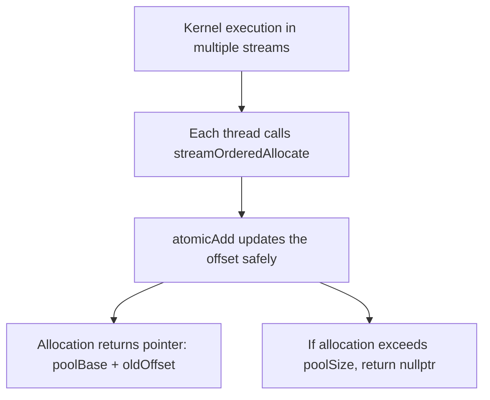
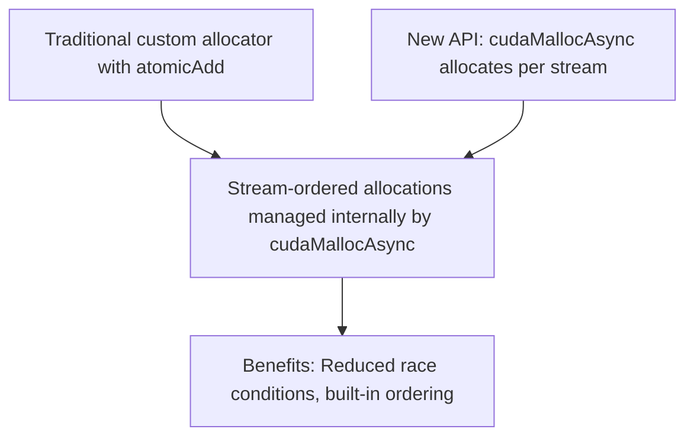

# Day 87: Custom Memory Allocators – Stream-Ordered Allocations

Efficient memory management is a cornerstone of high-performance GPU programming. In this lesson, we extend our custom memory pool design to support **stream-ordered allocations**. This extension aims to allow asynchronous memory allocations that respect the order of operations in different CUDA streams. However, if multiple streams allocate from the same pool without proper coordination, race conditions can occur, potentially corrupting the allocator's state or causing allocation failures.

In this document, we explain the key concepts behind custom memory allocators, describe how to integrate stream ordering into your memory pool design, provide code examples using atomic operations and hints from `cudaMallocAsync` (a newer asynchronous allocation API), and illustrate the design with comprehensive Mermaid diagrams.

---

## Table of Contents

1. [Overview](#1-overview)  
2. [Background on Custom Memory Allocators](#2-background-on-custom-memory-allocators)  
3. [Stream-Ordered Allocations](#3-stream-ordered-allocations)  
4. [Potential Race Conditions](#4-potential-race-conditions)  
5. [Implementation Strategy](#5-implementation-strategy)  
   - [a) Global Memory Pool with Atomic Offset](#a-global-memory-pool-with-atomic-offset)  
   - [b) Stream-Specific Allocation Considerations](#b-stream-specific-allocation-considerations)  
   - [c) Using cudaMallocAsync](#c-using-cudamallocasync)  
6. [Code Example](#6-code-example)  
7. [Comprehensive Conceptual Diagrams](#7-comprehensive-conceptual-diagrams)  
   - [Diagram 1: Global Memory Pool with Atomic Allocation](#diagram-1-global-memory-pool-with-atomic-allocation)  
   - [Diagram 2: Multi-Stream Allocation and Race Conditions](#diagram-2-multi-stream-allocation-and-race-conditions)  
   - [Diagram 3: Stream-Ordered Allocation with cudaMallocAsync](#diagram-3-stream-ordered-allocation-with-cudamallocasync)  
8. [References & Further Reading](#8-references--further-reading)  
9. [Conclusion & Next Steps](#9-conclusion--next-steps)

---

## 1. Overview

Custom memory allocators in CUDA allow for efficient reuse of device memory, reducing the overhead of repeated `cudaMalloc`/`cudaFree` calls. Extending these allocators to support **stream-ordered allocations** is particularly useful when multiple CUDA streams are executing concurrently, ensuring that memory allocation follows the intended order of operations. Without proper stream ordering, simultaneous allocations from different streams can lead to race conditions, resulting in unpredictable behavior.

---

## 2. Background on Custom Memory Allocators

A typical custom memory allocator involves:
- Preallocating a large block of device memory (the **memory pool**).
- Maintaining an **offset counter** to track allocated memory.
- Using atomic operations (e.g., `atomicAdd`) to ensure thread-safe allocations.

This design is efficient for single-threaded or single-stream allocations but needs careful extension for multi-stream scenarios.

---

## 3. Stream-Ordered Allocations

**Stream-Ordered Allocations** ensure that allocations occur in a predictable order relative to operations within the same stream. This ordering is critical when:
- Memory is allocated and then immediately used in subsequent kernel launches.
- Different streams may require a consistent view of the memory pool.
  
To achieve stream ordering:
- Use atomic operations to serialize allocation requests.
- Optionally, allocate separate memory pools for different streams or use the newer `cudaMallocAsync` API, which provides built-in stream-ordered asynchronous allocations.

---

## 4. Potential Race Conditions

When multiple streams concurrently allocate memory from a shared pool:
- **Race Conditions** may occur if two streams perform allocation requests at the same time, even though atomic operations serialize the update of the offset, the overall ordering might not match the logical sequence intended by the application.
- This can lead to:
  - Incorrect allocation sizes.
  - Overlapping memory regions.
  - Failure to meet the synchronization requirements of subsequent kernel launches.

Proper synchronization or stream-specific pools can mitigate these risks.

---

## 5. Implementation Strategy

### a) Global Memory Pool with Atomic Offset

- Allocate a large block of device memory.
- Maintain an offset pointer in device memory.
- Use `atomicAdd` to update the offset safely.

### b) Stream-Specific Allocation Considerations

- **Single Pool, Multiple Streams:** If using one pool, ensure that allocation requests are synchronized across streams using CUDA events or other inter-stream synchronization mechanisms.
- **Separate Pools:** Alternatively, assign each stream its own memory pool to avoid inter-stream conflicts.

### c) Using cudaMallocAsync

- **cudaMallocAsync** is a newer API that supports asynchronous memory allocation tied to a specific stream.
- It helps maintain stream order and can reduce race conditions by managing allocations per stream internally.

---

## 6. Code Example

Below is a simplified example of a custom device memory allocator that uses atomic operations for stream-ordered allocations. It also outlines how you might integrate cudaMallocAsync for stream-specific allocation (comments indicate where to substitute with cudaMallocAsync if desired).

```cpp
#include <cuda_runtime.h>
#include <stdio.h>

// Structure representing a simple device memory pool
struct DevicePool {
    char* base;      // Base pointer of the pool
    size_t poolSize; // Total size of the pool in bytes
    size_t* offset;  // Pointer to a global offset counter (device memory)
};

// Device function for allocation from the memory pool using atomicAdd
__device__ void* streamOrderedAllocate(DevicePool* dp, size_t size) {
    // Atomically add the requested size to the offset
    size_t oldOffset = atomicAdd(dp->offset, size);
    // Check if allocation exceeds pool size
    if (oldOffset + size > dp->poolSize)
        return nullptr;
    // Return pointer to the allocated block
    return (void*)(dp->base + oldOffset);
}

// Kernel that demonstrates allocation from the shared memory pool
__global__ void allocationKernel(DevicePool* dp, float* output, int N) {
    int idx = blockIdx.x * blockDim.x + threadIdx.x;
    // Each thread allocates a float from the memory pool and writes a value
    void* ptr = streamOrderedAllocate(dp, sizeof(float));
    if (ptr != nullptr && idx < N) {
        ((float*)ptr)[0] = 3.14f; // Write a sample value
    }
    // Write a dummy output value for demonstration
    if (idx < N)
        output[idx] = 1.0f;
}

int main() {
    int N = 1024;
    size_t poolSize = 1024 * sizeof(float);

    // Allocate device memory for the pool and offset
    char* d_poolBase;
    size_t* d_offset;
    cudaMalloc(&d_poolBase, poolSize);
    cudaMalloc(&d_offset, sizeof(size_t));
    cudaMemset(d_offset, 0, sizeof(size_t));

    // Set up host-side pool structure and copy to device
    DevicePool h_dp;
    h_dp.base = d_poolBase;
    h_dp.poolSize = poolSize;
    h_dp.offset = d_offset;

    DevicePool* d_dp;
    cudaMalloc(&d_dp, sizeof(DevicePool));
    cudaMemcpy(d_dp, &h_dp, sizeof(DevicePool), cudaMemcpyHostToDevice);

    // Allocate output array
    float* d_output;
    cudaMalloc(&d_output, N * sizeof(float));
    cudaMemset(d_output, 0, N * sizeof(float));

    // Launch allocation kernel in a stream (for demonstration)
    int threads = 256;
    int blocks = (N + threads - 1) / threads;
    allocationKernel<<<blocks, threads>>>(d_dp, d_output, N);
    cudaDeviceSynchronize();

    // Cleanup
    cudaFree(d_poolBase);
    cudaFree(d_offset);
    cudaFree(d_dp);
    cudaFree(d_output);
    return 0;
}
```

---

## 7. Comprehensive Conceptual Diagrams

### Diagram 1: Global Memory Pool with Atomic Allocation

```mermaid
flowchart TD
    A[Allocate a large device memory pool (d_poolBase)]
    B[Allocate a global offset in device memory (d_offset)]
    C[Initialize offset to 0]
    D[Create DevicePool structure with base, poolSize, offset]
    E[Copy DevicePool structure to device (d_dp)]
    
    A --> B
    B --> C
    C --> D
    D --> E
```

**Explanation:**  
The diagram shows the setup of a global memory pool where a base pointer and an atomic offset are initialized, and the pool structure is then copied to the device for use by kernels.

---

### Diagram 2: Stream-Ordered Allocation Process



**Explanation:**  
This diagram details how each thread in a kernel, possibly executing in different streams, calls the allocation function. The atomic operation ensures safe updates, and the allocation returns the correct pointer or nullptr if insufficient memory remains.

---

### Diagram 3: Integration with cudaMallocAsync (Conceptual)



**Explanation:**  
This diagram compares the traditional custom allocator approach using atomic operations with the newer cudaMallocAsync API, which provides built-in stream-ordered asynchronous allocations to reduce potential race conditions.

---

## 8. References & Further Reading

- [cudaMallocAsync Documentation](https://docs.nvidia.com/cuda/cuda-runtime-api/group__CUDART__MEMORY.html)  
- [CUDA C Best Practices Guide – Custom Memory Allocators](https://docs.nvidia.com/cuda/cuda-c-best-practices-guide/index.html)  
- [NVIDIA Developer Blog – Advanced Memory Management](https://developer.nvidia.com/blog/tag/memory-management/)

---

## 9. Conclusion & Next Steps

Extending a custom memory pool to support stream-ordered allocations can significantly improve performance in multi-stream applications. However, without proper synchronization or isolation (e.g., per-stream pools), race conditions may occur. New APIs like **cudaMallocAsync** offer alternative solutions that handle stream ordering internally.

**Next Steps:**
- **Experiment:** Compare performance between your custom allocator and cudaMallocAsync in a multi-stream scenario.
- **Profile:** Use Nsight Systems to track memory allocation overhead and race conditions.
- **Enhance:** Consider assigning dedicated memory pools to each stream if race conditions persist.
- **Document:** Keep detailed notes on allocation patterns and synchronization requirements to ease future maintenance.


```
