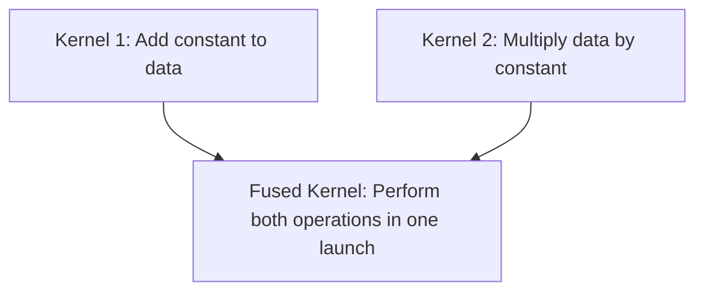
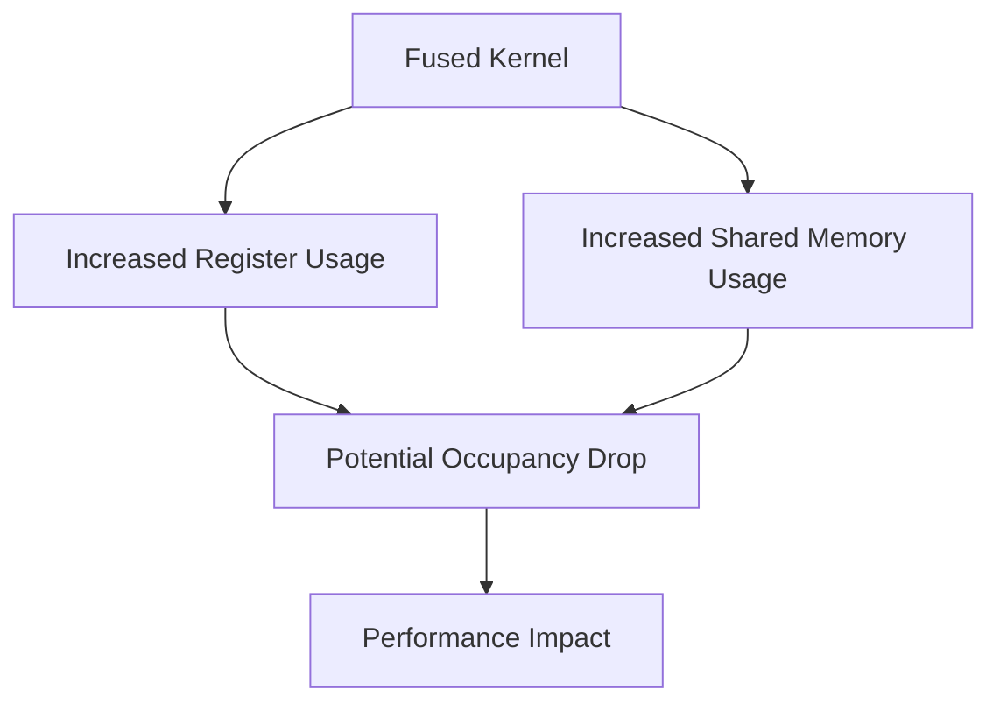

# Day 88: Kernel Fusion & Loop Fusion

In high-performance GPU programming, minimizing kernel launch overhead is crucial. **Kernel Fusion** and **Loop Fusion** are techniques used to merge multiple small kernels (or loops within a kernel) into a single, larger kernel. This approach reduces launch overhead and can improve data locality. However, overly fused kernels may exceed register or shared memory limits, which can in turn reduce performance. In this lesson, we discuss the benefits and trade-offs of kernel and loop fusion, provide implementation guidelines, and illustrate the concepts with code examples and comprehensive conceptual diagrams.

---

## Table of Contents

1. [Overview](#1-overview)  
2. [What is Kernel Fusion?](#2-what-is-kernel-fusion)  
3. [What is Loop Fusion?](#3-what-is-loop-fusion)  
4. [Benefits and Trade-Offs](#4-benefits-and-trade-offs)  
5. [Implementation Guidelines](#5-implementation-guidelines)  
   - [a) Choosing Fusion Candidates](#a-choosing-fusion-candidates)  
   - [b) Managing Resource Limits](#b-managing-resource-limits)  
6. [Code Example: Fused Kernel for Data Processing](#6-code-example-fused-kernel-for-data-processing)  
7. [Conceptual Diagrams](#7-conceptual-diagrams)  
   - [Diagram 1: Kernel Fusion Overview](#diagram-1-kernel-fusion-overview)  
   - [Diagram 2: Loop Fusion Within a Kernel](#diagram-2-loop-fusion-within-a-kernel)  
   - [Diagram 3: Resource Constraints in Fused Kernels](#diagram-3-resource-constraints-in-fused-kernels)  
8. [References & Further Reading](#8-references--further-reading)  
9. [Conclusion & Next Steps](#9-conclusion--next-steps)

---

## 1. Overview

Kernel fusion and loop fusion are optimization strategies aimed at reducing the overhead of launching multiple small kernels or executing multiple loops separately. By merging these operations, we can decrease latency, improve data reuse, and better utilize GPU resources. However, one must be cautious; merging too many operations into a single kernel can lead to high register pressure and shared memory usage, potentially throttling performance.

---

## 2. What is Kernel Fusion?

**Kernel Fusion** involves combining two or more small kernels into a single kernel launch. This fusion can:
- Reduce the overhead associated with multiple kernel launches.
- Increase data locality by keeping data in registers or shared memory between operations.
- Simplify scheduling since fewer kernel invocations are required.

---

## 3. What is Loop Fusion?

**Loop Fusion** is a technique applied within a single kernel where multiple loops that iterate over the same data are combined into one loop. This fusion:
- Reduces the overhead of repeated loop setup.
- Can improve cache performance and data reuse.
- Minimizes redundant memory accesses when multiple operations use the same data.

---

## 4. Benefits and Trade-Offs

**Benefits:**
- **Reduced Launch Overhead:** Merging multiple kernels into one decreases the overhead associated with launching kernels on the GPU.
- **Improved Data Locality:** Fused kernels can keep intermediate results in fast registers or shared memory, reducing global memory accesses.
- **Simplified Synchronization:** Fewer kernel launches mean fewer synchronization points and reduced global memory traffic.

**Trade-Offs:**
- **Increased Register and Shared Memory Usage:** Fusing kernels can increase resource demands, potentially lowering occupancy if too many registers or shared memory is required.
- **Complexity in Tuning:** Fused kernels may be more complex to optimize because the optimal configuration for one part of the code may conflict with another.
- **Debugging Challenges:** Larger kernels can be harder to debug due to their increased complexity.

---

## 5. Implementation Guidelines

### a) Choosing Fusion Candidates

- **Data Dependency:** Only fuse kernels or loops that have data dependencies or that operate on the same data set.
- **Independent Operations:** Ensure that the fused operations do not require separate synchronization that might be better handled individually.
- **Resource Impact:** Estimate the impact on registers and shared memory before fusion. Use profiling tools to check occupancy.

### b) Managing Resource Limits

- **Monitor Register Usage:** Use compiler flags (e.g., `-maxrregcount`) and profiling tools (Nsight Compute) to monitor register usage.
- **Shared Memory Optimization:** Optimize shared memory usage by reusing buffers and avoiding unnecessary allocations.
- **Balance Fusion Depth:** Experiment with partial fusion if full fusion results in resource saturation.

---

## 6. Code Example: Fused Kernel for Data Processing

The following example demonstrates fusing two small kernels: one that adds a constant to an array and another that multiplies the array by a constant. This fused kernel performs both operations in a single kernel launch.

```cpp
#include <cuda_runtime.h>
#include <stdio.h>

__global__ void fusedKernel(float* data, int N, float addVal, float mulVal) {
    int idx = blockIdx.x * blockDim.x + threadIdx.x;
    if (idx < N) {
        // First operation: add a constant
        float temp = data[idx] + addVal;
        // Second operation: multiply by a constant
        data[idx] = temp * mulVal;
    }
}

int main() {
    int N = 1 << 20; // 1 million elements
    size_t size = N * sizeof(float);
    float *d_data;
    cudaMalloc(&d_data, size);

    // Initialize data on device (for simplicity, using cudaMemset)
    cudaMemset(d_data, 1, size);  // Note: This sets bytes to 1, not floats. For proper initialization, a kernel or host copy is preferred.

    int threads = 256;
    int blocks = (N + threads - 1) / threads;
    float addVal = 2.0f, mulVal = 3.0f;
    fusedKernel<<<blocks, threads>>>(d_data, N, addVal, mulVal);
    cudaDeviceSynchronize();

    // Cleanup
    cudaFree(d_data);
    return 0;
}
```

---

## 7. Comprehensive Conceptual Diagrams

### Diagram 1: Kernel Fusion Overview



**Explanation:**  
This diagram shows how two separate kernels (addition and multiplication) are merged into one fused kernel, reducing the overhead of two separate launches.

---

### Diagram 2: Impact of Loop Fusion

```mermaid
flowchart LR
    A[Loop 1: Process array element-by-element (Operation A)]
    B[Loop 2: Process the same array (Operation B)]
    C[Fused Loop: Combine Operation A and B in one loop iteration]
    
    A --> C
    B --> C
```

**Explanation:**  
This diagram illustrates loop fusion, where two loops that iterate over the same array are combined into a single loop. This reduces loop overhead and improves data locality.

---

### Diagram 3: Resource Constraints in Fused Kernels



**Explanation:**  
This diagram highlights the potential downside of kernel fusion: as the fused kernel becomes larger, it uses more registers and shared memory. This can reduce occupancy (the number of concurrent warps) and negatively impact performance if resource limits are exceeded.

---

## 8. References & Further Reading

- [CUDA C Best Practices Guide – Kernel Fusion](https://docs.nvidia.com/cuda/cuda-c-best-practices-guide/index.html#kernel-fusion)
- [Nsight Compute Documentation](https://docs.nvidia.com/nsight-compute/)
- [NVIDIA Developer Blog – Optimizing CUDA Kernels](https://developer.nvidia.com/blog/)

---

## 9. Conclusion & Next Steps

Kernel fusion and loop fusion are powerful techniques for reducing kernel launch overhead and improving data locality. However, they must be balanced against the risk of exceeding register or shared memory limits, which can reduce occupancy and overall performance. Profiling and iterative tuning are essential to find the optimal balance for your specific application.

**Next Steps:**
- **Profile your kernels** using Nsight Compute to measure resource usage.
- **Experiment with partial fusion** if full fusion leads to resource contention.
- **Iterate and tune** your kernel parameters to maximize both ILP and occupancy.
- **Document your optimizations** to build a knowledge base for future projects.

```
