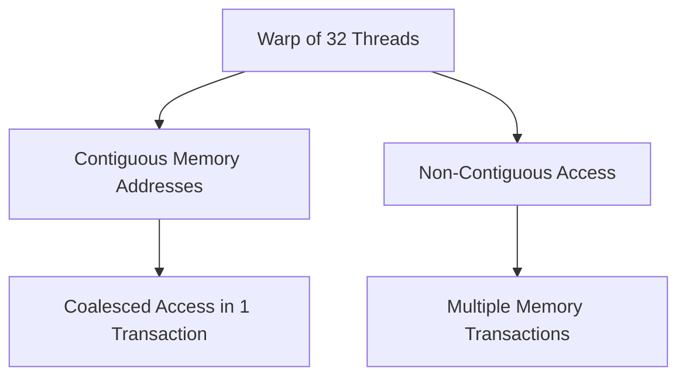
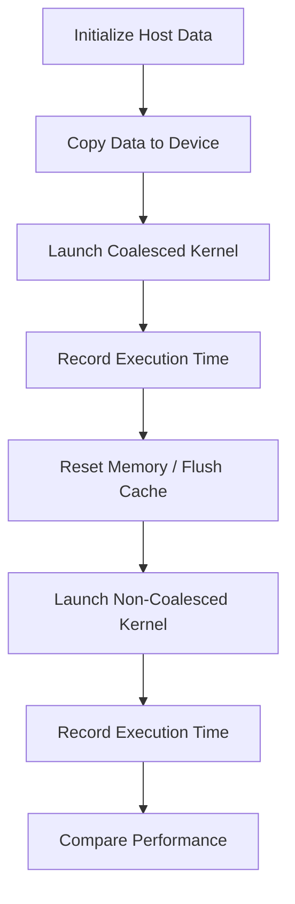

# Day 09: Memory Alignment & Coalescing

Optimizing memory accesses is crucial for high-performance CUDA applications. On Day 09, we explore **Memory Alignment & Coalescing**—techniques to ensure that global memory accesses are efficient. In this lesson, you will learn how coalesced memory accesses improve performance compared to non-coalesced (non-contiguous) patterns. We will benchmark both approaches in a kernel, discuss common pitfalls, and provide practical exercises and diagrams to help you grasp the concepts.

## Table of Contents
- [Overview](#1-overview)
- [Memory Alignment & Coalescing: Concepts](#2-memory-alignment--coalescing-concepts)
- [Benchmarking Coalesced vs. Non-Coalesced Access](#3-benchmarking-coalesced-vs-non-coalesced-access)
- [Practical Exercise: Kernel Benchmarking](#4-practical-exercise-kernel-benchmarking)
- [Debugging Pitfalls and Best Practices](#5-debugging-pitfalls-and-best-practices)
- [Conceptual Diagrams](#6-conceptual-diagrams)
- [References & Further Reading](#7-references--further-reading)
- [Conclusion](#8-conclusion)
- [Next Steps](#9-next-steps)

---

## 1. Overview

Global memory accesses in CUDA are most efficient when threads in a warp access contiguous memory addresses—a process known as **memory coalescing**. When threads access memory non-contiguously, memory transactions become inefficient, leading to a severe performance penalty. In this lesson, we will:

- Define memory alignment and coalescing.
- Explain how coalesced memory accesses improve throughput.
- Benchmark the performance difference between coalesced and non-coalesced memory accesses.
- Highlight common pitfalls and debugging strategies.

---

## 2. Memory Alignment & Coalescing: Concepts

### Memory Alignment

Memory alignment means that data is stored in memory at addresses that are multiples of the data size or cache line size. Proper alignment:

- **Ensures Efficient Access:** Aligned data is fetched in fewer memory transactions.
- **Reduces Overhead:** Misaligned accesses might require multiple memory transactions.

### Memory Coalescing

Memory coalescing occurs when threads in a warp (usually 32 threads) access contiguous memory addresses in a single transaction. Key points include:

- **Coalesced Access:** If the memory requests of a warp fall into one or a few contiguous blocks, the GPU can combine (coalesce) them into a single memory transaction.
- **Non-Coalesced Access:** When memory accesses are scattered, the GPU must perform multiple memory transactions, which degrades performance.

*Practical Impact:*  
Non-contiguous access patterns hurt performance significantly. Benchmarking these access patterns will demonstrate a stark difference in throughput.

---

## 3. Benchmarking Coalesced vs. Non-Coalesced Access

To illustrate the performance impact, we will compare two kernels:

- **Coalesced Kernel:** Threads access elements in contiguous order.
- **Non-Coalesced Kernel:** Threads access elements with a stride, causing scattered (non-contiguous) accesses.

### Coalesced Access Example

In a coalesced memory access scenario, thread `i` reads the element at index `i` of an array.

**Access Pattern:**  
- Thread 0 -> A[0]  
- Thread 1 -> A[1]  
- ...  
- Thread 31 -> A[31]

### Non-Coalesced Access Example

In a non-coalesced access scenario, threads might access data with a stride larger than one, e.g., thread `i` accesses the element at index `(i * stride) % N`.

**Access Pattern (stride = 2):**  
- Thread 0 -> A[0]  
- Thread 1 -> A[2]  
- ...  
- Thread 31 -> A[62 % N]

---

## 4. Practical Exercise: Kernel Benchmarking

In this exercise, you will implement two kernels—one that exhibits coalesced memory access and one that does not—and measure their performance. To ensure a fair comparison:

- Both kernels perform the same number of memory operations (using modulo in the non-coalesced kernel).
- Cache effects are mitigated to isolate memory access performance.

We provide two implementation options:

### Option 1: Two Separate Programs

#### Program 1: Coalesced Kernel Benchmark

```cpp
#include <cuda_runtime.h>
#include <stdio.h>

// Kernel with coalesced memory access
__global__ void coalescedKernel(const float *input, float *output, int N) {
    int idx = threadIdx.x + blockIdx.x * blockDim.x;
    if (idx < N) {
        output[idx] = input[idx] * 2.0f;
    }
}

int main() {
    int N = 1 << 20; // 1M elements
    size_t size = N * sizeof(float);
    cudaError_t err;

    // Allocate host memory
    float *h_input = (float*)malloc(size);
    float *h_output = (float*)malloc(size);

    // Initialize host array
    for (int i = 0; i < N; i++) {
        h_input[i] = 1.0f;
    }

    // Allocate device memory
    float *d_input, *d_output;
    err = cudaMalloc((void**)&d_input, size);
    if (err != cudaSuccess) { fprintf(stderr, "Error: %s\n", cudaGetErrorString(err)); exit(EXIT_FAILURE); }
    err = cudaMalloc((void**)&d_output, size);
    if (err != cudaSuccess) { fprintf(stderr, "Error: %s\n", cudaGetErrorString(err)); exit(EXIT_FAILURE); }

    // Copy input data to device
    cudaMemcpy(d_input, h_input, size, cudaMemcpyHostToDevice);

    // Configure kernel execution
    int threadsPerBlock = 256;
    int blocksPerGrid = (N + threadsPerBlock - 1) / threadsPerBlock;

    // Benchmark coalesced kernel
    cudaEvent_t start, stop;
    cudaEventCreate(&start);
    cudaEventCreate(&stop);
    cudaEventRecord(start);
    coalescedKernel<<<blocksPerGrid, threadsPerBlock>>>(d_input, d_output, N);
    cudaEventRecord(stop);
    cudaEventSynchronize(stop);
    float milliseconds = 0;
    cudaEventElapsedTime(&milliseconds, start, stop);

    // Print result
    printf("Coalesced Kernel Time: %f ms\n", milliseconds);

    // Cleanup
    cudaFree(d_input);
    cudaFree(d_output);
    free(h_input);
    free(h_output);
    cudaEventDestroy(start);
    cudaEventDestroy(stop);

    return 0;
}
```

#### Program 2: Non-Coalesced Kernel Benchmark

```cpp
#include <cuda_runtime.h>
#include <stdio.h>

// Kernel with non-coalesced memory access
__global__ void nonCoalescedKernel(const float *input, float *output, int N, int stride) {
    int idx = threadIdx.x + blockIdx.x * blockDim.x;
    if (idx < N) {
        int index = (idx * stride) % N; // Wrap around to match workload
        output[index] = input[index] * 2.0f;
    }
}

int main() {
    int N = 1 << 20; // 1M elements
    size_t size = N * sizeof(float);
    cudaError_t err;

    // Allocate host memory
    float *h_input = (float*)malloc(size);
    float *h_output = (float*)malloc(size);

    // Initialize host array
    for (int i = 0; i < N; i++) {
        h_input[i] = 1.0f;
    }

    // Allocate device memory
    float *d_input, *d_output;
    err = cudaMalloc((void**)&d_input, size);
    if (err != cudaSuccess) { fprintf(stderr, "Error: %s\n", cudaGetErrorString(err)); exit(EXIT_FAILURE); }
    err = cudaMalloc((void**)&d_output, size);
    if (err != cudaSuccess) { fprintf(stderr, "Error: %s\n", cudaGetErrorString(err)); exit(EXIT_FAILURE); }

    // Copy input data to device
    cudaMemcpy(d_input, h_input, size, cudaMemcpyHostToDevice);

    // Configure kernel execution
    int threadsPerBlock = 256;
    int blocksPerGrid = (N + threadsPerBlock - 1) / threadsPerBlock;
    int stride = 2;

    // Benchmark non-coalesced kernel
    cudaEvent_t start, stop;
    cudaEventCreate(&start);
    cudaEventCreate(&stop);
    cudaEventRecord(start);
    nonCoalescedKernel<<<blocksPerGrid, threadsPerBlock>>>(d_input, d_output, N, stride);
    cudaEventRecord(stop);
    cudaEventSynchronize(stop);
    float milliseconds = 0;
    cudaEventElapsedTime(&milliseconds, start, stop);

    // Print result
    printf("Non-Coalesced Kernel Time (stride=%d): %f ms\n", stride, milliseconds);

    // Cleanup
    cudaFree(d_input);
    cudaFree(d_output);
    free(h_input);
    free(h_output);
    cudaEventDestroy(start);
    cudaEventDestroy(stop);

    return 0;
}
```

**Explanation for Option 1:**  
Two separate programs ensure complete isolation between kernel runs, avoiding cache interference and guaranteeing accurate benchmarking results. The non-coalesced kernel uses `(idx * stride) % N` to maintain the same workload as the coalesced kernel, ensuring a fair comparison focused on memory access patterns.

Compile and run each program independently, for example:  
```bash
nvcc -o coalesced_benchmark coalesced_benchmark.cu && ./coalesced_benchmark  
nvcc -o noncoalesced_benchmark noncoalesced_benchmark.cu && ./noncoalesced_benchmark
```

### Option 2: Single Program with Cache Isolation

```cpp
#include <cuda_runtime.h>
#include <stdio.h>

// Dummy kernel to flush cache
__global__ void dummyKernel(float *data, int N) {
    int idx = threadIdx.x + blockIdx.x * blockDim.x;
    if (idx < N) {
        data[idx] = 0.0f; // Simple write to evict cache lines
    }
}

// Kernel with coalesced memory access
__global__ void coalescedKernel(const float *input, float *output, int N) {
    int idx = threadIdx.x + blockIdx.x * blockDim.x;
    if (idx < N) {
        output[idx] = input[idx] * 2.0f;
    }
}

// Kernel with non-coalesced memory access
__global__ void nonCoalescedKernel(const float *input, float *output, int N, int stride) {
    int idx = threadIdx.x + blockIdx.x * blockDim.x;
    if (idx < N) {
        int index = (idx * stride) % N; // Wrap around to match workload
        output[index] = input[index] * 2.0f;
    }
}

int main() {
    int N = 1 << 20; // 1M elements
    size_t size = N * sizeof(float);
    cudaError_t err;

    // Allocate host memory
    float *h_input = (float*)malloc(size);
    float *h_output = (float*)malloc(size);

    // Initialize host array
    for (int i = 0; i < N; i++) {
        h_input[i] = 1.0f;
    }

    // Allocate device memory
    float *d_input, *d_output, *d_dummy;
    err = cudaMalloc((void**)&d_input, size);
    if (err != cudaSuccess) { fprintf(stderr, "Error: %s\n", cudaGetErrorString(err)); exit(EXIT_FAILURE); }
    err = cudaMalloc((void**)&d_output, size);
    if (err != cudaSuccess) { fprintf(stderr, "Error: %s\n", cudaGetErrorString(err)); exit(EXIT_FAILURE); }
    err = cudaMalloc((void**)&d_dummy, size); // For cache flushing
    if (err != cudaSuccess) { fprintf(stderr, "Error: %s\n", cudaGetErrorString(err)); exit(EXIT_FAILURE); }

    // Configure kernel execution
    int threadsPerBlock = 256;
    int blocksPerGrid = (N + threadsPerBlock - 1) / threadsPerBlock;
    int stride = 2;

    // Benchmark setup
    cudaEvent_t start, stop;
    cudaEventCreate(&start);
    cudaEventCreate(&stop);
    float millisecondsCoalesced = 0, millisecondsNonCoalesced = 0;

    // Benchmark coalesced kernel
    cudaMemcpy(d_input, h_input, size, cudaMemcpyHostToDevice); // Fresh input
    cudaMemset(d_output, 0, size); // Fresh output
    cudaEventRecord(start);
    coalescedKernel<<<blocksPerGrid, threadsPerBlock>>>(d_input, d_output, N);
    cudaEventRecord(stop);
    cudaEventSynchronize(stop);
    cudaEventElapsedTime(&millisecondsCoalesced, start, stop);

    // Flush cache with dummy kernel
    dummyKernel<<<blocksPerGrid, threadsPerBlock>>>(d_dummy, N);
    cudaDeviceSynchronize();

    // Benchmark non-coalesced kernel
    cudaMemcpy(d_input, h_input, size, cudaMemcpyHostToDevice); // Reset input
    cudaMemset(d_output, 0, size); // Reset output
    cudaEventRecord(start);
    nonCoalescedKernel<<<blocksPerGrid, threadsPerBlock>>>(d_input, d_output, N, stride);
    cudaEventRecord(stop);
    cudaEventSynchronize(stop);
    cudaEventElapsedTime(&millisecondsNonCoalesced, start, stop);

    // Print benchmark results
    printf("Coalesced Kernel Time:    %f ms\n", millisecondsCoalesced);
    printf("Non-Coalesced Kernel Time (stride=%d): %f ms\n", stride, millisecondsNonCoalesced);

    // Cleanup
    cudaFree(d_input);
    cudaFree(d_output);
    cudaFree(d_dummy);
    free(h_input);
    free(h_output);
    cudaEventDestroy(start);
    cudaEventDestroy(stop);

    return 0;
}
```

**Explanation for Option 2:**  
This approach combines both kernels in one program for convenience. The non-coalesced kernel uses `(idx * stride) % N` to ensure an equal workload. Memory resets (`cudaMemcpy`, `cudaMemset`) and a dummy kernel are used to flush the cache between runs, reducing interference. However, note that this method may not completely clear the cache on all GPU architectures.

Compile and run with:  
```bash
nvcc -o benchmark benchmark.cu && ./benchmark
```

---

## 5. Debugging Pitfalls and Best Practices

When optimizing memory accesses, be aware of these pitfalls:

- **Non-Contiguous Access Patterns:**  
  - *Problem:* Non-coalesced memory accesses lead to multiple memory transactions.  
  - *Solution:* Arrange data so that threads in a warp access contiguous memory.

- **Improper Memory Alignment:**  
  - *Problem:* Misaligned data can cause inefficient memory transactions.  
  - *Solution:* Ensure data structures are aligned to boundaries that match the GPU’s memory architecture (e.g., 128-byte alignment).

- **Ignoring Error Checking:**  
  - *Problem:* Failing to check the return values of CUDA API calls can mask errors.  
  - *Solution:* Use robust error checking after memory allocation, kernel launches, and memory copies.

- **Overlooking Kernel Launch Configurations:**  
  - *Problem:* Incorrect block or grid dimensions can lead to poor performance.  
  - *Solution:* Optimize kernel launch parameters (threads per block and blocks per grid) for your specific application.

- **Cache Interference in Benchmarks:**  
  - *Problem:* Sequential kernel runs may benefit from cached data, skewing results.  
  - *Solution:* Use separate programs (Option 1) for guaranteed isolation or reset memory with a dummy kernel (Option 2), though the latter may not always fully mitigate cache effects.

---

## 6. Conceptual Diagrams

### Diagram 1: Memory Coalescing Overview



**Explanation:**  
When threads access contiguous addresses (B), they achieve coalesced access (C). In contrast, non-contiguous access (D) forces multiple memory transactions (E), degrading performance.

---

### Diagram 2: Benchmarking Flow for Coalesced vs. Non-Coalesced Kernels



**Explanation:**  
This flow involves initializing data, running both kernels with steps to isolate cache effects, and finally comparing their execution times.

---

## 7. References & Further Reading

- **[CUDA C Programming Guide - Memory Transactions](https://docs.nvidia.com/cuda/cuda-c-programming-guide/index.html)**  
  NVIDIA’s official guide includes detailed sections on global memory coalescing and optimization techniques.

- **[Programming Massively Parallel Processors: A Hands-on Approach](https://www.elsevier.com/books/programming-massively-parallel-processors/kirk/978-0-12-811986-0)**  
  By David B. Kirk and Wen-mei W. Hwu. This comprehensive textbook covers CUDA optimization, including memory coalescing (see Chapter 5 in the 3rd edition).

- **[NVIDIA CUDA Best Practices Guide - Memory Optimizations](https://docs.nvidia.com/cuda/cuda-c-best-practices-guide/index.html)**  
  Practical advice from NVIDIA on optimizing memory access patterns, with a focus on coalescing (see Section 3.2).

---

## 8. Conclusion

In this lesson, you explored the critical role of memory alignment and coalescing in CUDA. You learned that:

- **Coalesced Memory Access:**  
  Threads reading/writing contiguous data in a single transaction significantly improve performance.

- **Non-Coalesced Access:**  
  Requires multiple transactions, leading to slower execution.

- **Benchmarking Techniques:**  
  Using separate programs (Option 1) offers the most reliable benchmark due to complete GPU state isolation. Cache isolation can also be attempted within a single program (Option 2), though it may be less effective on some architectures.

- **Best Practices:**  
  Robust error checking and proper memory alignment are essential for optimizing CUDA applications.

By mastering these techniques, you can optimize your CUDA applications for higher throughput and overall better performance.

---

## 9. Next Steps

In upcoming lessons, we will focus on:

- **Kernel Optimization:**  
  Advanced strategies for reducing branch divergence and maximizing occupancy.

- **Asynchronous Data Transfers:**  
  Techniques for overlapping data transfers with computation.

- **Profiling Tools:**  
  Using NVIDIA NSight and other profiling tools to further refine and optimize your CUDA code.

Stay tuned as we continue to build on these optimization strategies to push the limits of GPU performance!
```
