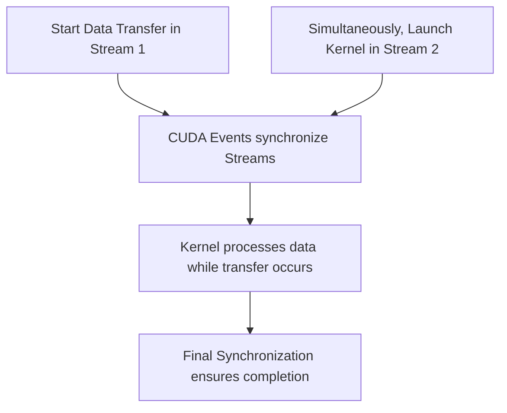
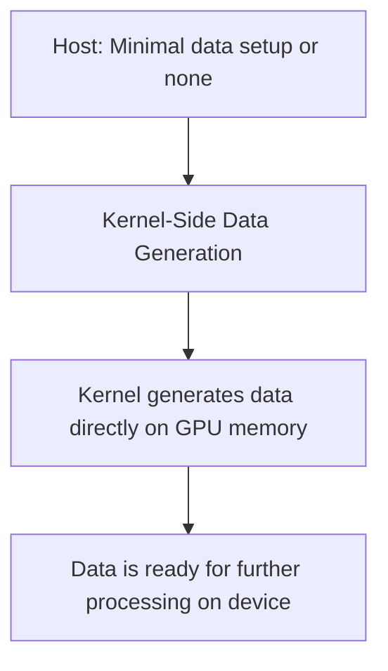

# Day 90: Minimizing Data Transfers

Minimizing data transfers between the host and device is critical for achieving high performance in CUDA applications. PCIe transfers can become a significant bottleneck if not carefully managed, particularly when large single transfers block concurrency. In this lesson, we explore techniques to reduce data transfer overhead by using pinned memory, asynchronous transfers, and even kernel-side data generation. These strategies help hide latency, maximize PCIe bandwidth usage, and improve overall application throughput.

---

## Table of Contents

1. [Overview](#1-overview)  
2. [Importance of Minimizing Data Transfers](#2-importance-of-minimizing-data-transfers)  
3. [Techniques to Minimize Data Transfers](#3-techniques-to-minimize-data-transfers)  
   - [a) Pinned Memory](#a-pinned-memory)  
   - [b) Asynchronous Data Transfers](#b-asynchronous-data-transfers)  
   - [c) Kernel-Side Data Generation](#c-kernel-side-data-generation)  
   - [d) Overlapping Transfers with Computation](#d-overlapping-transfers-with-computation)  
4. [Code Examples](#4-code-examples)  
5. [Conceptual Diagrams](#5-conceptual-diagrams)  
   - [Diagram 1: Pinned Memory & Async Transfer Workflow](#diagram-1-pinned-memory--async-transfer-workflow)  
   - [Diagram 2: Overlapping Data Transfer with Kernel Execution](#diagram-2-overlapping-data-transfer-with-kernel-execution)  
   - [Diagram 3: Kernel-Side Data Generation](#diagram-3-kernel-side-data-generation)  
6. [Common Pitfalls](#6-common-pitfalls)  
7. [References & Further Reading](#7-references--further-reading)  
8. [Conclusion & Next Steps](#8-conclusion--next-steps)

---

## 1. Overview

Data transfers over PCIe between host (CPU) and device (GPU) are relatively slow compared to on-device memory operations. Therefore, minimizing these transfers is essential for achieving high performance. By using pinned memory, asynchronous transfers, and even generating data directly on the GPU, developers can reduce transfer overhead, better overlap communication with computation, and ultimately improve overall application throughput.

---

## 2. Importance of Minimizing Data Transfers

- **Latency Reduction:** Reducing the volume and frequency of data transfers minimizes the latency associated with PCIe communication.
- **Improved Concurrency:** Smaller, asynchronous transfers allow the GPU to overlap communication with computation, keeping the device busy.
- **Enhanced Throughput:** Lower transfer overhead ensures that the GPU's high compute capability is not underutilized due to waiting on data.

---

## 3. Techniques to Minimize Data Transfers

### a) Pinned Memory

Pinned (or page-locked) memory is allocated in host memory such that it is not paged out by the operating system. This results in:
- **Faster Transfers:** Direct memory access (DMA) can occur at higher speeds.
- **Asynchronous Operations:** Enables `cudaMemcpyAsync` to overlap data transfer with kernel execution.

### b) Asynchronous Data Transfers

Using `cudaMemcpyAsync` allows for non-blocking data transfers that can be overlapped with kernel execution in different CUDA streams. This ensures that while data is being copied, the GPU can execute other kernels concurrently.

### c) Kernel-Side Data Generation

When possible, generate data directly on the GPU using kernels rather than transferring data from the host. This technique:
- **Eliminates Transfer Overhead:** No need to transfer data over PCIe.
- **Improves Concurrency:** The GPU produces the data internally, freeing the PCIe bus for other tasks.

### d) Overlapping Transfers with Computation

By coordinating data transfers and kernel launches through streams and events, you can ensure that while one portion of data is being transferred, another portion is being processed. This overlapping maximizes resource utilization and hides transfer latency.

---

## 4. Code Examples

### Example 1: Pinned Memory and Asynchronous Transfer

```cpp
#include <cuda_runtime.h>
#include <stdio.h>

__global__ void processKernel(float* d_data, int N) {
    int idx = blockIdx.x * blockDim.x + threadIdx.x;
    if (idx < N)
        d_data[idx] *= 2.0f;
}

int main() {
    int N = 1 << 20; // 1 million elements
    size_t size = N * sizeof(float);
    float *h_data, *d_data;

    // Allocate pinned host memory
    cudaMallocHost((void**)&h_data, size);
    // Initialize host data
    for (int i = 0; i < N; i++) {
        h_data[i] = (float)i;
    }
    
    // Allocate device memory
    cudaMalloc(&d_data, size);

    // Create a CUDA stream
    cudaStream_t stream;
    cudaStreamCreate(&stream);
    
    // Asynchronously transfer data from host to device
    cudaMemcpyAsync(d_data, h_data, size, cudaMemcpyHostToDevice, stream);
    
    // Launch kernel while transfer is overlapped
    int threads = 256;
    int blocks = (N + threads - 1) / threads;
    processKernel<<<blocks, threads, 0, stream>>>(d_data, N);
    
    // Synchronize stream to ensure operations complete
    cudaStreamSynchronize(stream);
    
    // Cleanup
    cudaFree(d_data);
    cudaFreeHost(h_data);
    cudaStreamDestroy(stream);
    
    return 0;
}
```

### Example 2: Kernel-Side Data Generation

```cpp
#include <cuda_runtime.h>
#include <stdio.h>

__global__ void generateKernel(float* d_data, int N) {
    int idx = blockIdx.x * blockDim.x + threadIdx.x;
    if (idx < N)
        d_data[idx] = idx * 0.5f; // Generate data directly on the GPU
}

int main() {
    int N = 1 << 20;
    size_t size = N * sizeof(float);
    float *d_data;
    cudaMalloc(&d_data, size);

    int threads = 256;
    int blocks = (N + threads - 1) / threads;
    generateKernel<<<blocks, threads>>>(d_data, N);
    cudaDeviceSynchronize();
    
    // Further processing on d_data...
    
    cudaFree(d_data);
    return 0;
}
```

---

## 5. Comprehensive Conceptual Diagrams

### Diagram 1: Pinned Memory & Async Transfer Workflow

```mermaid
flowchart TD
    A[Host: Allocate pinned memory (h_data)]
    B[Initialize h_data with input data]
    C[Device: Allocate memory (d_data)]
    D[Async Transfer: cudaMemcpyAsync from h_data to d_data]
    E[Launch Kernel: processKernel operates on d_data]
    F[Synchronize: Wait for stream to complete]
    
    A --> B
    B --> C
    C --> D
    D --> E
    E --> F
```

**Explanation:**  
This diagram illustrates the workflow where pinned memory enables faster asynchronous transfers, allowing the kernel to run concurrently with the data transfer.

---

### Diagram 2: Overlapping Data Transfer with Computation



**Explanation:**  
The diagram shows two streams: one handling the data transfer and the other launching the kernel. Synchronization via CUDA events ensures that the kernel waits until the necessary data is available, enabling overlap of operations.

---

### Diagram 3: Kernel-Side Data Generation to Avoid PCIe Transfer



**Explanation:**  
This diagram illustrates the concept of generating data directly on the GPU (kernel-side data generation), which eliminates the need for a host-to-device data transfer, thus reducing PCIe overhead.

---

## 6. Common Pitfalls

- **Large Single Transfers:**  
  Transferring a massive block of data in one go can block other operations and hinder concurrency. Splitting data into smaller, asynchronous transfers often yields better performance.
  
- **Ignoring Overlap Opportunities:**  
  Failing to overlap data transfers with kernel execution may leave the GPU idle during data transfer, underutilizing available resources.
  
- **Insufficient Synchronization:**  
  Without proper synchronization (e.g., using CUDA events), kernels might start before data transfers are complete, leading to race conditions or incorrect results.

---

## 7. References & Further Reading

- [CUDA C Best Practices Guide – Data Transfer](https://docs.nvidia.com/cuda/cuda-c-best-practices-guide/index.html#data-transfer)
- [Nsight Systems Documentation](https://docs.nvidia.com/nsight-systems/)
- [CUDA Runtime API – cudaMemcpyAsync](https://docs.nvidia.com/cuda/cuda-runtime-api/group__CUDART__MEMORY.html)

---

## 8. Conclusion & Next Steps

Minimizing data transfers is key to achieving high performance in CUDA applications. By leveraging pinned memory, asynchronous transfers, and kernel-side data generation, you can significantly reduce PCIe overhead and improve concurrency. Profile your application to identify transfer bottlenecks and experiment with splitting large transfers into smaller, overlapping ones. Ensure proper synchronization to prevent race conditions and maximize throughput.

**Next Steps:**
- **Profile your application** using Nsight Systems to observe data transfer overlap.
- **Experiment with transfer sizes** and stream configurations to find the optimal balance.
- **Integrate kernel-side generation** where feasible to bypass PCIe transfers entirely.
- **Document performance gains** and trade-offs to refine your data transfer strategy further.

```
