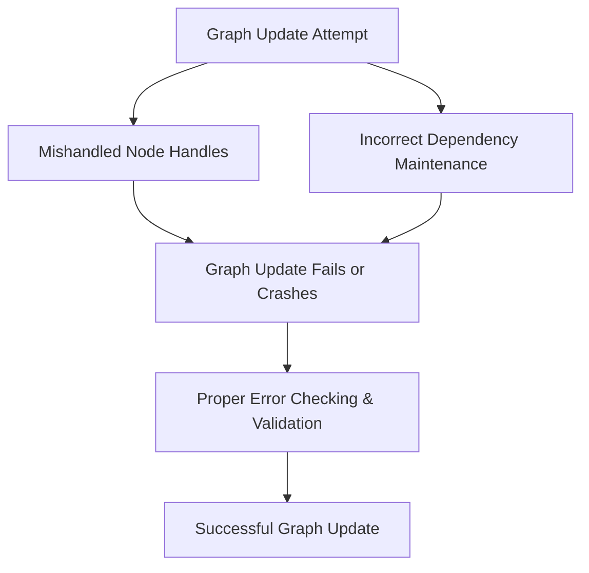

# Day 95: CUDA Graph Updates & Reusability

In large-scale and dynamic GPU applications, CUDA Graphs provide an efficient way to capture and execute a sequence of operations with very low overhead. However, many real-world applications have parameters or data that change over time. Instead of rebuilding the entire graph—which can be expensive—you can update parts of an existing CUDA graph using CUDA Graph Update APIs. This reusability feature is powerful but requires careful management of graph node handles; mishandling these handles can result in crashes or undefined behavior.

In this lesson, we explore how to dynamically update parts of a CUDA graph without performing a full rebuild. We discuss the update mechanisms, common pitfalls, and best practices for reusing CUDA graphs, and provide detailed code examples and conceptual diagrams.

---

## Table of Contents

1. [Overview](#1-overview)  
2. [Introduction to CUDA Graph Updates](#2-introduction-to-cuda-graph-updates)  
3. [Mechanisms for Graph Updates](#3-mechanisms-for-graph-updates)  
   - [a) cudaGraphExecUpdate API](#a-cudagraphexecupdate-api)  
   - [b) Updating Kernel Node Parameters](#b-updating-kernel-node-parameters)  
4. [Pitfalls and Best Practices](#4-pitfalls-and-best-practices)  
5. [Code Example: Dynamic Graph Update](#5-code-example-dynamic-graph-update)  
6. [Comprehensive Conceptual Diagrams](#6-comprehensive-conceptual-diagrams)  
   - [Diagram 1: CUDA Graph Lifecycle with Updates](#diagram-1-cuda-graph-lifecycle-with-updates)  
   - [Diagram 2: Graph Node Update Process](#diagram-2-graph-node-update-process)  
   - [Diagram 3: Pitfalls in Graph Updates](#diagram-3-pitfalls-in-graph-updates)  
7. [References & Further Reading](#7-references--further-reading)  
8. [Conclusion & Next Steps](#8-conclusion--next-steps)

---

## 1. Overview

CUDA Graphs allow you to capture and replay complex GPU work with minimal runtime overhead. However, when conditions change—such as updated kernel parameters or new data pointers—rebuilding the entire graph may be too costly. Instead, you can update parts of the graph dynamically using the CUDA Graph Update API. This enables you to adapt to changing workloads while maintaining the performance benefits of graph execution. A critical challenge in this approach is handling graph node handles correctly to avoid crashes.

---

## 2. Introduction to CUDA Graph Updates

CUDA Graph Updates enable you to modify an already instantiated CUDA graph by replacing or updating specific nodes. This is particularly useful in applications where:
- **Kernel parameters change** over iterations.
- **Data pointers** need to be updated due to memory re-allocation.
- **Conditional branches** require different execution paths without reconstructing the whole graph.

By updating only the affected nodes, you can save significant overhead and achieve better performance in dynamic environments.

---

## 3. Mechanisms for Graph Updates

### a) cudaGraphExecUpdate API

- **cudaGraphExecUpdate:**  
  This API allows you to update a pre-instantiated CUDA graph (`cudaGraphExec_t`) with a modified graph (`cudaGraph_t`). The update can change node parameters (e.g., kernel launch parameters, memory pointers) without a full rebuild.

### b) Updating Kernel Node Parameters

- You can update kernel node parameters such as grid dimensions, block dimensions, or kernel arguments.  
- The process involves:
  1. Creating a modified version of the graph or node.
  2. Calling `cudaGraphExecUpdate` to apply the changes.
- **Important:**  
  Ensure that the updated node’s dependencies remain consistent. Improper handling of node handles can lead to crashes or incorrect behavior.

---

## 4. Pitfalls and Best Practices

- **Mishandling Node Handles:**  
  Incorrectly replacing or updating node handles can lead to crashes. Always verify that the node handles being updated are valid.
  
- **Inconsistent Dependencies:**  
  Updates must preserve the original dependency graph. Changing dependencies without careful consideration may result in synchronization issues.
  
- **Overuse of Updates:**  
  Frequent updates might negate the performance benefits of graph reuse. It is best to update only when necessary.
  
- **Error Checking:**  
  Always check the return status of `cudaGraphExecUpdate` to handle any update errors gracefully.

**Best Practices:**
- **Profile:** Use Nsight Compute or Nsight Systems to ensure that updates reduce overhead.
- **Minimal Changes:** Only update the nodes that require changes; avoid reconstructing large portions of the graph.
- **Testing:** Rigorously test the updated graph under various conditions to ensure stability.

---

## 5. Code Example: Dynamic Graph Update

Below is an example that captures a CUDA graph with a kernel node, then updates the kernel node's arguments without rebuilding the entire graph.

```cpp
#include <cuda_runtime.h>
#include <stdio.h>

__global__ void incrementKernel(float* d_data, int N, float offset) {
    int idx = blockIdx.x * blockDim.x + threadIdx.x;
    if (idx < N)
        d_data[idx] = d_data[idx] + offset;
}

int main() {
    int N = 1 << 20;
    size_t size = N * sizeof(float);
    float *d_data;
    cudaMalloc(&d_data, size);
    cudaMemset(d_data, 0, size);

    // Create a stream for graph capture
    cudaStream_t stream;
    cudaStreamCreate(&stream);

    // Begin graph capture
    cudaStreamBeginCapture(stream, cudaStreamCaptureModeGlobal);
    
    int threads = 256;
    int blocks = (N + threads - 1) / threads;
    float initOffset = 1.0f;
    // Launch kernel with initial offset value
    incrementKernel<<<blocks, threads, 0, stream>>>(d_data, N, initOffset);
    
    // End graph capture and obtain the CUDA graph
    cudaGraph_t graph;
    cudaStreamEndCapture(stream, &graph);

    // Instantiate the graph for execution
    cudaGraphExec_t graphExec;
    cudaGraphInstantiate(&graphExec, graph, NULL, NULL, 0);

    // Launch the graph
    cudaGraphLaunch(graphExec, stream);
    cudaStreamSynchronize(stream);

    // Now, suppose at runtime we need to update the kernel offset to a new value.
    float newOffset = 2.0f;
    // Prepare the new kernel node parameters.
    cudaKernelNodeParams newKernelParams = {0};
    void* newArgs[3] = { (void*)&d_data, (void*)&N, (void*)&newOffset };
    newKernelParams.func = (void*)incrementKernel;
    newKernelParams.gridDim = dim3(blocks);
    newKernelParams.blockDim = dim3(threads);
    newKernelParams.sharedMemBytes = 0;
    newKernelParams.kernelParams = newArgs;

    // Update the graph: assume our graph has one kernel node and we update it.
    cudaGraphNode_t* updatedNodes = NULL;
    size_t numUpdatedNodes = 0;
    cudaError_t updateStatus = cudaGraphExecUpdate(graphExec, graph, NULL, updatedNodes, &numUpdatedNodes);
    if (updateStatus != cudaSuccess) {
        printf("Graph update failed: %s\n", cudaGetErrorString(updateStatus));
    } else {
        printf("Graph updated successfully with %zu nodes updated.\n", numUpdatedNodes);
    }

    // Re-launch the updated graph
    cudaGraphLaunch(graphExec, stream);
    cudaStreamSynchronize(stream);

    // Cleanup
    cudaGraphExecDestroy(graphExec);
    cudaGraphDestroy(graph);
    cudaStreamDestroy(stream);
    cudaFree(d_data);

    return 0;
}
```

**Explanation:**

1. **Graph Capture:**  
   A graph is captured while launching `incrementKernel` with an initial offset of 1.0.
2. **Graph Instantiation and Launch:**  
   The captured graph is instantiated and launched.
3. **Graph Update:**  
   At runtime, we prepare new kernel parameters (changing the offset to 2.0) and update the graph using `cudaGraphExecUpdate`.  
4. **Error Checking:**  
   The return status is checked to ensure that the graph update is successful.
5. **Re-launching the Updated Graph:**  
   The updated graph is then launched again to execute the kernel with the new parameter.

---

## 6. Comprehensive Conceptual Diagrams

### Diagram 1: CUDA Graph Lifecycle with Updates

```mermaid
flowchart TD
    A[Begin Graph Capture]
    B[Launch Kernel(s) with Initial Parameters]
    C[End Graph Capture → Obtain CUDA Graph]
    D[Instantiate Graph (GraphExec)]
    E[Execute Graph (Baseline Run)]
    F[Measure/Determine Need for Update]
    G[Prepare New Kernel Parameters]
    H[Call cudaGraphExecUpdate to update graph]
    I[Re-launch Updated Graph]
    
    A --> B
    B --> C
    C --> D
    D --> E
    E --> F
    F --> G
    G --> H
    H --> I
```

**Explanation:**  
This diagram illustrates the full lifecycle of a CUDA graph with dynamic updates—from capturing the graph, instantiation, execution, to updating nodes and re-launching the updated graph.

---

### Diagram 2: Graph Node Update Process

```mermaid
flowchart LR
    A[Original Kernel Node in Graph]
    B[Kernel Node Parameters (e.g., offset = 1.0)]
    C[Need to Update: New Offset = 2.0]
    D[Prepare new kernel parameters]
    E[Call cudaGraphExecUpdate with new parameters]
    F[Updated Kernel Node now uses offset = 2.0]
    
    A --> B
    B --> C
    C --> D
    D --> E
    E --> F
```

**Explanation:**  
This diagram focuses on the process of updating a kernel node within the CUDA graph. It shows how a specific parameter (the offset) is modified, and the update is applied via the CUDA Graph Update API.

---

### Diagram 3: Pitfalls in Graph Updates



**Explanation:**  
This diagram illustrates the potential pitfalls when updating CUDA graphs—such as mishandling node handles or breaking dependencies—and highlights the importance of proper error checking to ensure a successful graph update.

---

## 7. References & Further Reading

- [CUDA Graphs Documentation](https://docs.nvidia.com/cuda/cuda-c-programming-guide/index.html#cuda-graphs)  
- [CUDA C Programming Guide – Advanced Topics on Graphs](https://docs.nvidia.com/cuda/cuda-c-programming-guide/index.html)  
- [Nsight Systems Documentation](https://docs.nvidia.com/nsight-systems/)  
- [NVIDIA Developer Blog – CUDA Graphs](https://developer.nvidia.com/blog/tag/cuda-graphs/)

---

## 8. Conclusion & Next Steps

Dynamic graph updates allow you to modify parts of a CUDA graph without incurring the full cost of a rebuild, enabling adaptive, high-performance execution in dynamic environments. However, this flexibility comes with the challenge of managing graph node handles and ensuring that dependencies remain consistent. By using the `cudaGraphExecUpdate` API and carefully validating updates, you can achieve efficient graph reusability. 

**Next Steps:**
- **Experiment with graph updates:** Modify kernel parameters and monitor performance improvements.
- **Profile the update process:** Use Nsight Systems to measure the overhead of graph updates.
- **Develop robust error handling:** Ensure that any issues during graph updates are caught and managed gracefully.
- **Document your update strategy:** Create a clear record of how graph updates are implemented and validated in your project.

```
