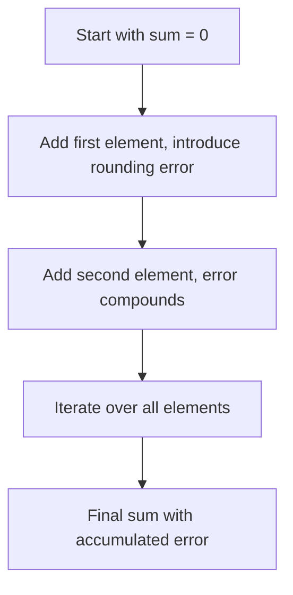
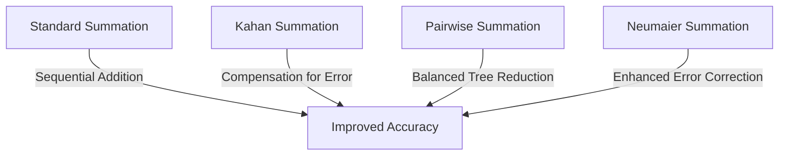
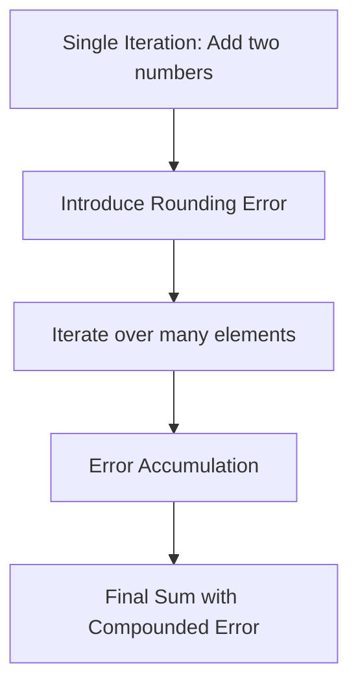

# Day 96: Precision & Numerical Stability

Numerical stability and precision are critical considerations in high-performance computing (HPC), especially when small rounding errors compound over many iterations. This lesson examines how floating-point arithmetic (float vs. double) can lead to error accumulation and discusses methods—such as the Kahan Summation Algorithm—to mitigate these effects. By understanding these issues, you can design algorithms that maintain accuracy even in iterative, large-scale computations.

---

## Table of Contents

1. [Overview](#1-overview)
2. [Introduction to Numerical Precision and Stability](#2-introduction-to-numerical-precision-and-stability)
3. [Rounding Errors and Iterative Accumulation](#3-rounding-errors-and-iterative-accumulation)
4. [Float vs. Double Precision](#4-float-vs-double-precision)
5. [The Kahan Summation Algorithm](#5-the-kahan-summation-algorithm)
6. [Code Examples](#6-code-examples)
   - [a) Standard Summation](#a-standard-summation)
   - [b) Kahan Summation](#b-kahan-summation)
7. [Conceptual Diagrams](#7-conceptual-diagrams)
   - [Diagram 1: Error Accumulation in Standard Summation](#diagram-1-error-accumulation-in-standard-summation)
   - [Diagram 2: Kahan Summation Flow](#diagram-2-kahan-summation-flow)
   - [Diagram 3: Comparison of Float vs. Double Precision](#diagram-3-comparison-of-float-vs-double-precision)
8. [References & Further Reading](#8-references--further-reading)
9. [Conclusion & Next Steps](#9-conclusion--next-steps)

---

## 1. Overview

In computational tasks, especially those involving iterative operations like summing large arrays, even tiny rounding errors can compound, leading to significant inaccuracies. Understanding the difference between float and double precision, and applying algorithms such as Kahan Summation, is essential for maintaining numerical stability in HPC applications.

---

## 2. Introduction to Numerical Precision and Stability

- **Numerical Precision:**  
  Refers to how many significant digits can be represented in a floating-point number.  
  - **Float (single precision):** Typically 32 bits, with around 7 decimal digits of precision.
  - **Double (double precision):** Typically 64 bits, with around 15-16 decimal digits of precision.

- **Numerical Stability:**  
  An algorithm is numerically stable if errors (e.g., due to rounding) do not grow uncontrollably through the computation.

---

## 3. Rounding Errors and Iterative Accumulation

When adding a large sequence of numbers:
- **Rounding errors** occur because the floating-point representation cannot exactly represent every real number.
- **Iterative Accumulation:** In a loop that sums many values, each addition can introduce a small error. These errors accumulate and can lead to significant inaccuracies over time.

---

## 4. Float vs. Double Precision

- **Float:**  
  - Pros: Lower memory usage and faster arithmetic on some GPUs.
  - Cons: Lower precision; higher risk of significant error accumulation in iterative operations.
- **Double:**  
  - Pros: Higher precision and reduced rounding error.
  - Cons: Increased memory usage and potentially slower performance on hardware optimized for single precision.

Choosing between float and double depends on the required accuracy and the performance constraints of your application.

---

## 5. The Kahan Summation Algorithm

The **Kahan Summation Algorithm** is designed to improve the numerical accuracy of the sum of a sequence of floating-point numbers. It maintains a separate compensation (or error) variable to capture and correct for rounding errors.

**Algorithm Steps:**
1. Initialize `sum` to 0.0 and a compensation variable `c` to 0.0.
2. For each element `x` in the sequence:
   - Compute `y = x - c` (adjusting for the error from previous operations).
   - Set `t = sum + y`.
   - Compute the new compensation `c = (t - sum) - y`.
   - Update `sum = t`.
3. Return `sum`.

This algorithm significantly reduces the error introduced by each floating-point addition.

---

## 6. Code Examples

### a) Standard Summation

```cpp
#include <stdio.h>

float standardSum(const float* data, int N) {
    float sum = 0.0f;
    for (int i = 0; i < N; i++) {
        sum += data[i];
    }
    return sum;
}

int main() {
    const int N = 1000000;
    float* data = new float[N];
    // Initialize data (for simplicity, all elements are 0.1f)
    for (int i = 0; i < N; i++) {
        data[i] = 0.1f;
    }
    
    float sum = standardSum(data, N);
    printf("Standard Sum: %f\n", sum);
    
    delete[] data;
    return 0;
}
```

### b) Kahan Summation

```cpp
#include <stdio.h>

float kahanSum(const float* data, int N) {
    float sum = 0.0f;
    float c = 0.0f; // A running compensation for lost low-order bits.
    for (int i = 0; i < N; i++) {
        float y = data[i] - c;
        float t = sum + y;
        c = (t - sum) - y;
        sum = t;
    }
    return sum;
}

int main() {
    const int N = 1000000;
    float* data = new float[N];
    // Initialize data (for simplicity, all elements are 0.1f)
    for (int i = 0; i < N; i++) {
        data[i] = 0.1f;
    }
    
    float sum = kahanSum(data, N);
    printf("Kahan Sum: %f\n", sum);
    
    delete[] data;
    return 0;
}
```

---

## 7. Comprehensive Conceptual Diagrams

### Diagram 1: Error Accumulation in Standard Summation



**Explanation:**  
This diagram shows how each addition in a standard summation can introduce a small error, which compounds over many iterations, resulting in a final sum that may be significantly off from the true value.

---

### Diagram 2: Kahan Summation Flow

```mermaid
flowchart TD
    A[Initialize sum = 0, c = 0]
    B[For each element x in data]
    C[Compute y = x - c]
    D[Calculate t = sum + y]
    E[Update compensation c = (t - sum) - y]
    F[Set sum = t]
    G[Return final sum]
    
    A --> B
    B --> C
    C --> D
    D --> E
    E --> F
    F --> G
```

**Explanation:**  
This diagram outlines the steps in the Kahan Summation Algorithm. By maintaining a compensation variable, the algorithm corrects for the rounding error at each step, leading to a more accurate final sum.

---

### Diagram 3: Comparison of Float vs. Double Precision

```mermaid
flowchart TD
    A[Using Float Precision]
    B[Limited precision (7 digits)]
    C[Higher chance of rounding errors]
    
    D[Using Double Precision]
    E[Higher precision (15-16 digits)]
    F[Lower rounding error accumulation]
    
    A --> B
    B --> C
    D --> E
    E --> F
    C ---|Trade-Off: Memory & Speed| F
```

**Explanation:**  
This diagram contrasts float and double precision, highlighting that while floats consume less memory and may be faster, they are more susceptible to rounding errors. Doubles provide higher precision and reduce cumulative error but at the cost of increased memory usage and potentially slower performance.

---

## 8. References & Further Reading

- [Kahan Summation Algorithm (Wikipedia)](https://en.wikipedia.org/wiki/Kahan_summation_algorithm)
- HPC papers and literature on numerical stability and precision.
- [CUDA C Programming Guide – Floating Point Computations](https://docs.nvidia.com/cuda/cuda-c-programming-guide/index.html#floating-point-computations)

---

## 9. Conclusion & Next Steps

Understanding precision and numerical stability is crucial when designing algorithms that perform iterative computations. Small rounding errors can compound significantly, leading to inaccurate results, especially when using float precision. The Kahan Summation Algorithm provides a robust solution to mitigate these issues, though it comes with some overhead. Depending on your application, choosing between float and double precision is a critical design decision that affects both performance and accuracy.

**Next Steps:**
- **Experiment:** Implement and profile both standard and Kahan summation in your applications.
- **Evaluate:** Determine the trade-offs between performance and accuracy in your specific use case.
- **Extend:** Explore other numerical stabilization techniques if Kahan summation overhead is prohibitive.
- **Document:** Maintain detailed records of numerical accuracy requirements and performance implications for future optimization.

```

```
# Day 96b: Advanced Precision & Error Mitigation Techniques

Building on our exploration of precision and numerical stability in Day 96, this session (Day 96b) dives even deeper into advanced strategies for mitigating error accumulation in iterative computations. When small rounding errors compound over many iterations, the cumulative effect can significantly degrade the accuracy of numerical results. In this lesson, we discuss extended summation techniques, alternative algorithms, and hybrid precision strategies that help preserve numerical stability in high-performance computing (HPC) applications.

---

## Table of Contents

1. [Overview](#1-overview)  
2. [Advanced Summation Techniques](#2-advanced-summation-techniques)  
   - [a) Pairwise Summation](#a-pairwise-summation)  
   - [b) Neumaier Summation](#b-neumaier-summation)  
   - [c) Iterative Refinement and Mixed Precision](#c-iterative-refinement-and-mixed-precision)  
3. [Hybrid Precision Strategies](#3-hybrid-precision-strategies)  
4. [Error Analysis in Iterative Solvers](#4-error-analysis-in-iterative-solvers)  
5. [Code Examples](#5-code-examples)  
   - [a) Pairwise Summation Example](#a-pairwise-summation-example)  
   - [b) Neumaier Summation Example](#b-neumaier-summation-example)  
6. [Comprehensive Conceptual Diagrams](#6-comprehensive-conceptual-diagrams)  
   - [Diagram 1: Comparison of Summation Algorithms](#diagram-1-comparison-of-summation-algorithms)  
   - [Diagram 2: Error Propagation in Iterative Computations](#diagram-2-error-propagation-in-iterative-computations)  
   - [Diagram 3: Hybrid Precision Strategy Flow](#diagram-3-hybrid-precision-strategy-flow)  
7. [References & Further Reading](#7-references--further-reading)  
8. [Conclusion & Next Steps](#8-conclusion--next-steps)

---

## 1. Overview

Even with robust techniques like Kahan Summation, many HPC applications—especially those involving billions of operations—can suffer from error accumulation. Advanced methods such as pairwise summation and Neumaier summation offer improved accuracy by reducing the effect of rounding errors. Moreover, hybrid precision strategies and iterative refinement can further stabilize computations in iterative solvers.

---

## 2. Advanced Summation Techniques

### a) Pairwise Summation

**Pairwise Summation** divides the data into pairs, sums each pair, and then recursively sums the partial results. This balanced approach minimizes the propagation of rounding errors by reducing the number of sequential additions.

**Key Advantages:**
- **Balanced Tree Reduction:** Minimizes depth of the summation tree, thus reducing the error accumulation.
- **Scalability:** Well-suited for parallel implementations.

### b) Neumaier Summation

**Neumaier Summation** is an improvement on Kahan Summation that handles cases where the next element to be added is larger than the current sum. It introduces a slightly different compensation mechanism to capture additional errors.

**Key Advantages:**
- **Robustness:** More robust than Kahan in cases with widely varying magnitudes.
- **Accuracy:** Provides slightly better accuracy when the standard Kahan algorithm might fail.

### c) Iterative Refinement and Mixed Precision

**Iterative Refinement** uses an initial low-precision computation followed by correction steps performed in higher precision to improve the result. In combination with mixed precision (e.g., performing multiplications in FP16 with accumulation in FP32 or even FP64 for the refinement steps), this technique can deliver both performance and high numerical stability.

---

## 3. Hybrid Precision Strategies

Hybrid precision strategies aim to combine the speed advantages of lower-precision arithmetic (FP16) with the accuracy of higher-precision computations (FP32/FP64). For instance:
- **FP16 for Bulk Computation:** Use FP16 for the majority of operations.
- **FP32 Accumulation:** Accumulate results in FP32 to reduce rounding errors.
- **Refinement Iterations:** Use iterative refinement to correct errors introduced during the low-precision phase.

---

## 4. Error Analysis in Iterative Solvers

In iterative solvers (such as those for linear systems or optimization problems), even small errors can compound over many iterations. Analyzing the error propagation:
- **Local Rounding Errors:** Examine the rounding error at each iterative step.
- **Global Accumulation:** Understand how local errors aggregate.
- **Stability Conditions:** Identify conditions under which the algorithm remains stable and strategies to mitigate divergence.

---

## 5. Code Examples

### a) Pairwise Summation Example

```cpp
#include <stdio.h>
#include <stdlib.h>

// Recursive pairwise summation function
float pairwiseSum(const float* data, int start, int end) {
    if (end - start == 1)
        return data[start];
    int mid = start + (end - start) / 2;
    return pairwiseSum(data, start, mid) + pairwiseSum(data, mid, end);
}

int main() {
    const int N = 1000000;
    float* data = (float*)malloc(N * sizeof(float));
    // Initialize data (e.g., all elements are 0.1f)
    for (int i = 0; i < N; i++)
        data[i] = 0.1f;
    float sum = pairwiseSum(data, 0, N);
    printf("Pairwise Sum: %f\n", sum);
    free(data);
    return 0;
}
```

### b) Neumaier Summation Example

```cpp
#include <stdio.h>
#include <stdlib.h>

float neumaierSum(const float* data, int N) {
    float sum = data[0];
    float c = 0.0f;
    for (int i = 1; i < N; i++) {
        float t = sum + data[i];
        if (fabs(sum) >= fabs(data[i]))
            c += (sum - t) + data[i];
        else
            c += (data[i] - t) + sum;
        sum = t;
    }
    return sum + c;
}

int main() {
    const int N = 1000000;
    float* data = (float*)malloc(N * sizeof(float));
    // Initialize data (e.g., all elements are 0.1f)
    for (int i = 0; i < N; i++)
        data[i] = 0.1f;
    float sum = neumaierSum(data, N);
    printf("Neumaier Sum: %f\n", sum);
    free(data);
    return 0;
}
```

---

## 6. Comprehensive Conceptual Diagrams

### Diagram 1: Comparison of Summation Algorithms



**Explanation:**  
This diagram contrasts different summation techniques and shows how each method improves numerical accuracy compared to standard summation.

---

### Diagram 2: Error Propagation in Iterative Computations



**Explanation:**  
This diagram illustrates how a small rounding error in a single iteration can propagate and accumulate over multiple iterations, highlighting the importance of using compensated summation techniques.

---

### Diagram 3: Hybrid Precision Strategy Flow

```mermaid
flowchart TD
    A[Perform Bulk Computation in Low Precision (FP16)]
    B[Accumulate Results in Higher Precision (FP32)]
    C[Apply Iterative Refinement if Needed]
    D[Achieve High Performance with Improved Accuracy]
    
    A --> B
    B --> C
    C --> D
```

**Explanation:**  
This diagram outlines a hybrid precision strategy where most operations are performed in low precision for speed, but critical accumulation is done in high precision. Optionally, iterative refinement steps are applied to further correct errors, yielding a balanced approach to performance and accuracy.

---

## 7. References & Further Reading

- [Kahan Summation Algorithm (Wikipedia)](https://en.wikipedia.org/wiki/Kahan_summation_algorithm)
- HPC literature on pairwise and Neumaier summation.
- [Numerical Analysis Texts on Error Propagation](https://en.wikipedia.org/wiki/Numerical_analysis)
- [CUDA C Programming Guide – Floating Point Computations](https://docs.nvidia.com/cuda/cuda-c-programming-guide/index.html#floating-point-computations)

---

## 8. Conclusion & Next Steps

Accurate numerical computation in HPC requires careful management of rounding errors and iterative error accumulation. Advanced summation techniques such as pairwise and Neumaier summation, along with hybrid precision strategies, offer robust solutions to mitigate these issues. By profiling and understanding the error propagation in your algorithms, you can choose the appropriate technique to balance performance with accuracy.

**Next Steps:**
- **Benchmark:** Compare standard, Kahan, pairwise, and Neumaier summation methods in your specific applications.
- **Profile Error:** Use tools to analyze the numerical error in iterative computations.
- **Hybrid Precision:** Explore combining low-precision computation with high-precision accumulation in real-world kernels.
- **Iterative Refinement:** Investigate iterative refinement techniques for further stability in iterative solvers.
- **Documentation:** Maintain detailed documentation of precision requirements and numerical strategies for future optimization efforts.

```
