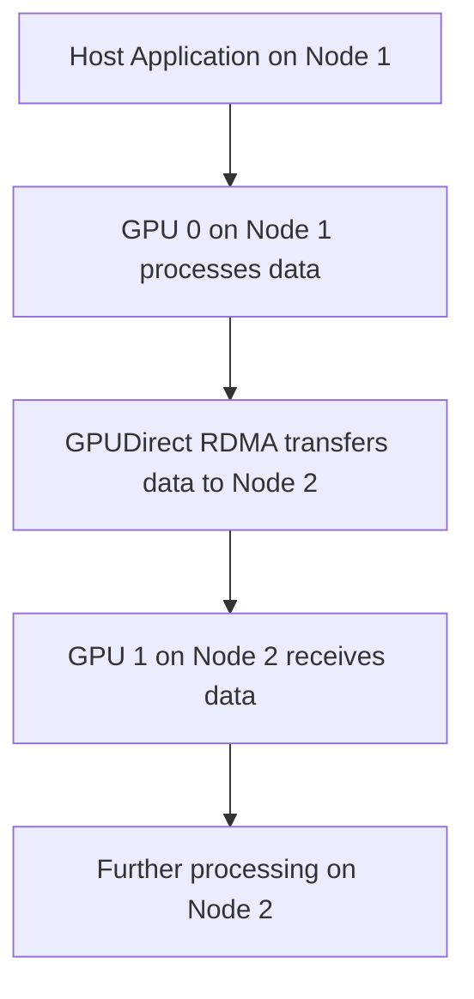

# Day 97: Advanced P2P & Clustering (If Possible)

In large-scale, distributed GPU applications, high-speed data exchange between GPUs is essential for scaling performance. **GPU-GPU RDMA (Remote Direct Memory Access)**—commonly referred to as **GPUDirect RDMA**—enables GPUs to communicate directly with each other or across nodes in a cluster without involving the host CPU. This technique reduces latency and CPU overhead, facilitating real-time and high-throughput computing in multi-GPU and multi-node systems. However, hardware support for GPUDirect RDMA varies, and not all systems or network interfaces (such as Infiniband) support it. In this lesson, we explore advanced P2P and clustering techniques, discuss the challenges and best practices, and provide conceptual diagrams to illustrate the overall architecture.

---

## Table of Contents

1. [Overview](#1-overview)  
2. [Introduction to GPUDirect RDMA](#2-introduction-to-gpudirect-rdma)  
3. [Benefits of Advanced P2P & Clustering](#3-benefits-of-advanced-p2p--clustering)  
4. [Challenges and Pitfalls](#4-challenges-and-pitfalls)  
5. [Implementation Considerations](#5-implementation-considerations)  
   - [a) Setting Up GPU-GPU RDMA](#a-setting-up-gpu-gpu-rdma)  
   - [b) Multi-Node Clustering Strategies](#b-multi-node-clustering-strategies)  
   - [c) Sample Code for P2P Transfer](#c-sample-code-for-p2p-transfer)  
6. [Comprehensive Conceptual Diagrams](#6-comprehensive-conceptual-diagrams)  
   - [Diagram 1: GPUDirect RDMA Data Flow](#diagram-1-gpudirect-rdma-data-flow)  
   - [Diagram 2: Multi-Node Cluster Architecture](#diagram-2-multi-node-cluster-architecture)  
   - [Diagram 3: End-to-End Data Flow in a Cluster](#diagram-3-end-to-end-data-flow-in-a-cluster)  
7. [References & Further Reading](#7-references--further-reading)  
8. [Conclusion & Next Steps](#8-conclusion--next-steps)  

---

## 1. Overview

Real-world applications such as high-performance computing (HPC), deep learning training, and real-time simulations increasingly rely on efficient inter-GPU communication. **GPUDirect RDMA** allows GPUs to bypass the host CPU and exchange data directly, while multi-node clustering extends this capability across several systems in a network. This results in reduced latency, lower CPU overhead, and improved overall system throughput—critical factors for enterprise-level and real-time applications.

---

## 2. Introduction to GPUDirect RDMA

- **GPUDirect RDMA** is a technology that enables direct data transfers between GPUs and external devices (such as network adapters) using RDMA, bypassing the host CPU and memory.  
- It minimizes latency by reducing the number of data copies and CPU interventions.  
- This technology is particularly beneficial in cluster environments where multiple nodes communicate over high-speed networks like Infiniband.

---

## 3. Benefits of Advanced P2P & Clustering

- **Low-Latency Communication:** Direct GPU-to-GPU data transfers reduce latency compared to traditional host-mediated transfers.
- **Reduced CPU Overhead:** Offloading data transfer responsibilities from the CPU frees it to perform other tasks.
- **Scalability:** Enables multi-node scaling in cluster environments, essential for large-scale HPC and distributed deep learning.
- **Improved Throughput:** Higher bandwidth and lower latency contribute to increased overall performance in data-intensive applications.

---

## 4. Challenges and Pitfalls

- **Hardware Support:** Not all GPUs and network adapters support GPUDirect RDMA. Verify compatibility before deployment.
- **Driver and Firmware Versions:** Incompatibilities between GPU drivers, CUDA Toolkit versions, and network adapter firmware can lead to issues.
- **Complex Configuration:** Setting up RDMA requires careful configuration of system BIOS, drivers, and software libraries.
- **Interference in Shared Environments:** In multi-tenant systems, resource contention may affect the predictability of GPU scheduling and RDMA performance.

---

## 5. Implementation Considerations

### a) Setting Up GPU-GPU RDMA

- **Enable GPUDirect RDMA:** Ensure that your system supports GPUDirect RDMA by verifying GPU, network adapter, and driver compatibility.
- **Configure PCIe and Network Settings:** Adjust BIOS settings and install the necessary drivers to enable RDMA.
- **Use cudaMemcpyPeerAsync:** For direct GPU-to-GPU memory transfers, use `cudaMemcpyPeerAsync` to bypass the host.

### b) Multi-Node Clustering Strategies

- **Distributed Frameworks:** Often, multi-node scaling is implemented with frameworks like MPI, which can integrate with GPUDirect RDMA for efficient data exchange.
- **Network Topology:** Use high-speed networks (e.g., Infiniband) to connect nodes. Ensure that the RDMA capabilities are enabled on the network interface.
- **Load Balancing:** Carefully partition data and workload among nodes to avoid bottlenecks.

### c) Sample Code for P2P Transfer

Below is a sample code snippet demonstrating a simple GPU-to-GPU transfer using cudaMemcpyPeerAsync. Note that multi-node setups would typically involve MPI or another communication layer.

```cpp
#include <cuda_runtime.h>
#include <stdio.h>

int main() {
    int N = 1 << 20;
    size_t size = N * sizeof(float);

    // Assume at least two GPUs are present.
    float *d_data0, *d_data1;
    
    // Set device to GPU 0 and allocate memory
    cudaSetDevice(0);
    cudaMalloc(&d_data0, size);
    // Initialize d_data0 (omitted for brevity)
    
    // Set device to GPU 1 and allocate memory
    cudaSetDevice(1);
    cudaMalloc(&d_data1, size);
    
    // Check if GPU 0 can access GPU 1 memory via P2P
    int canAccessPeer;
    cudaDeviceCanAccessPeer(&canAccessPeer, 0, 1);
    if (canAccessPeer) {
        // Enable peer access
        cudaSetDevice(0);
        cudaDeviceEnablePeerAccess(1, 0);
        
        // Perform asynchronous copy from GPU 0 to GPU 1 using cudaMemcpyPeerAsync
        cudaMemcpyPeerAsync(d_data1, 1, d_data0, 0, size);
        cudaDeviceSynchronize();
        printf("P2P transfer completed successfully.\n");
    } else {
        printf("GPUDirect RDMA is not supported between GPU 0 and GPU 1.\n");
    }
    
    // Cleanup
    cudaSetDevice(0);
    cudaFree(d_data0);
    cudaSetDevice(1);
    cudaFree(d_data1);
    
    return 0;
}
```

---

## 6. Comprehensive Conceptual Diagrams

### Diagram 1: GPUDirect RDMA Data Flow

```mermaid
flowchart TD
    A[GPU 0: Source Memory (d_data0)]
    B[GPU 1: Destination Memory (d_data1)]
    C[Direct Peer-to-Peer Transfer via GPUDirect RDMA]
    
    A --> C
    C --> B
```

**Explanation:**  
This diagram shows the direct data transfer from GPU 0 to GPU 1 using GPUDirect RDMA, bypassing the host memory and reducing latency.

---

### Diagram 2: Multi-Node Cluster Architecture with GPUDirect RDMA

```mermaid
flowchart TD
    A[Node 1]
    B[Node 2]
    C[High-Speed RDMA Network (e.g., Infiniband)]
    D[GPUDirect RDMA-enabled GPUs on each node]
    
    A --> C
    B --> C
    D --> A
    D --> B
```

**Explanation:**  
This diagram illustrates a cluster environment where nodes (each containing GPUs) are interconnected via a high-speed RDMA-capable network, enabling efficient inter-node GPU communication.

---

### Diagram 3: End-to-End Data Flow in a Cluster Environment



**Explanation:**  
This diagram provides a complete picture of data flow in a multi-node cluster using GPUDirect RDMA: data is processed on one GPU, transferred directly to a GPU on another node, and then used for further computations.

---

## 7. References & Further Reading

- [GPUDirect RDMA Documentation](https://docs.nvidia.com/cuda/gpudirect-rdma/index.html)  
- [CUDA C Programming Guide – GPU-to-GPU Communication](https://docs.nvidia.com/cuda/cuda-c-programming-guide/index.html)  
- HPC papers and benchmarks on multi-node scaling and GPU clustering  
- [Nsight Systems Documentation](https://docs.nvidia.com/nsight-systems/)

---

## 8. Conclusion & Next Steps

Advanced P2P and clustering techniques such as GPUDirect RDMA provide significant benefits for scaling GPU applications in multi-GPU and multi-node environments. By enabling direct data transfers between GPUs and across nodes, these techniques minimize latency and reduce CPU overhead. However, careful attention must be paid to hardware compatibility, configuration of network interfaces, and proper use of APIs. Experimentation and profiling with tools like Nsight Systems are essential to validate performance improvements.

**Next Steps:**
- **Verify Hardware Support:** Confirm that your GPUs and network adapters support GPUDirect RDMA.
- **Integrate with MPI:** For multi-node scaling, integrate GPUDirect RDMA with MPI or other communication frameworks.
- **Profile Performance:** Use Nsight Systems to analyze the latency and throughput of your inter-GPU and inter-node transfers.
- **Refine Your Configuration:** Optimize PCIe settings and driver configurations to maximize the benefits of RDMA.
- **Document and Test:** Maintain robust documentation and perform extensive testing in your target environment.

```
