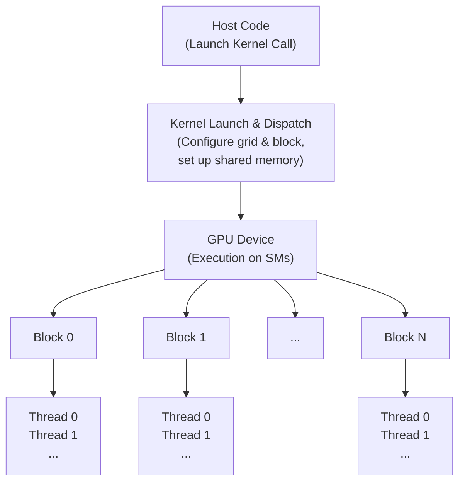
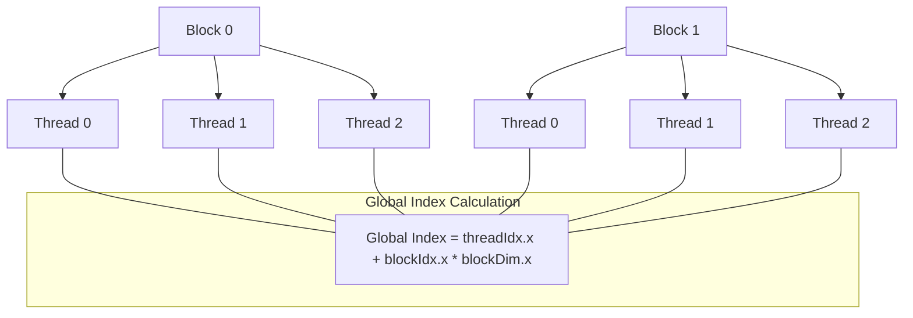

# Day 06: Basic Kernel Launch & Execution

In GPU programming—especially with NVIDIA’s CUDA architecture—a **kernel** is a function that runs on the device (GPU) rather than the host (CPU). Today’s lesson focuses on how kernels are launched from the host and executed on the device. We will explore key concepts, execution models, and detailed examples, accompanied by conceptual diagrams (using Mermaid syntax) to help you visualize the process.

---

## Table of Contents
1. [Overview](#1-overview)  
2. [Understanding CUDA Kernels](#2-understanding-cuda-kernels)  
3. [Kernel Launch Syntax and Execution Configuration](#3-kernel-launch-syntax-and-execution-configuration)  
    - [a) Kernel Launch Syntax](#a-kernel-launch-syntax)  
    - [b) Grid and Block Configuration](#b-grid-and-block-configuration)  
4. [Mapping Threads to Data](#4-mapping-threads-to-data)  
5. [Execution Flow and Synchronization](#5-execution-flow-and-synchronization)  
6. [Conceptual Diagrams](#6-conceptual-diagrams)  
7. [Practical Examples](#7-practical-examples)  
    - [a) Vector Addition Example](#a-vector-addition-example)  
    - [b) Element-Wise Multiplication Example](#b-element-wise-multiplication-example)  
8. [Common Pitfalls](#8-common-pitfalls)  
9. [Debugging and Synchronization Considerations](#9-debugging-and-synchronization-considerations)  
10. [References & Further Reading](#10-references--further-reading)  
11. [Conclusion](#11-conclusion)  
---

## 1. Overview
CUDA kernels are the workhorses of GPU computing, allowing thousands of threads to run in parallel. In this lesson, you will learn:
- How to define and launch kernels using CUDA’s triple-angle bracket syntax.
- How to configure grids and blocks to map computation onto the GPU.
- How thread indexing is used to assign data to individual threads.
- The execution flow of kernels and methods for synchronization.
- Detailed conceptual diagrams that illustrate the kernel launch process and thread organization.
- Common pitfalls and debugging techniques to ensure efficient and error-free execution.

---

## 2. Understanding CUDA Kernels
A **CUDA kernel** is a special function, marked with the `__global__` keyword, that is executed on the GPU. When you launch a kernel, you are not just invoking a function; you are initiating the execution of many threads simultaneously.

### Key Characteristics:
- **Massive Parallelism:** A single kernel launch can execute thousands or even millions of threads concurrently.
- **Device Execution:** Kernels run on the GPU, which is optimized for parallel processing.
- **Data-Parallel Operations:** They are ideal for tasks where the same operation is applied to many data elements (e.g., vector addition, image processing).

**Example Kernel:**
```cpp
__global__ void simpleKernel() {
    int id = threadIdx.x;
    printf("Hello from thread %d\n", id);
}
```
Each thread that executes this kernel prints a message with its thread index.

---

## 3. Kernel Launch Syntax and Execution Configuration

### a) Kernel Launch Syntax
Kernels are launched from host code using the triple angle bracket syntax (`<<<...>>>`). This syntax specifies how many threads and blocks are used for execution.

**Syntax:**
```cpp
kernelName<<<numBlocks, numThreadsPerBlock>>>(arguments);
```
- **`numBlocks`**: The number of blocks in the grid.
- **`numThreadsPerBlock`**: The number of threads in each block.

**Example:**
```cpp
simpleKernel<<<2, 4>>>();
```
This launches 2 blocks with 4 threads per block, totaling 8 threads.

---

### b) Grid and Block Configuration
CUDA’s execution model is hierarchical:
- **Grids:** A grid is a collection of blocks that can be one-, two-, or three-dimensional.
- **Blocks:** Each block is an array of threads. Threads within a block can share memory and synchronize their execution.

**Configuration Examples:**
- **1D Configuration:**  
  ```cpp
  kernel<<<numBlocks, numThreads>>>(...);
  ```
- **2D Configuration:**  
  ```cpp
  dim3 gridDim(numBlocksX, numBlocksY);
  dim3 blockDim(numThreadsX, numThreadsY);
  kernel<<<gridDim, blockDim>>>(...);
  ```
- **3D Configuration:**  
  ```cpp
  dim3 gridDim(numBlocksX, numBlocksY, numBlocksZ);
  dim3 blockDim(numThreadsX, numThreadsY, numThreadsZ);
  kernel<<<gridDim, blockDim>>>(...);
  ```

When configuring, ensure that the total number of threads (blocks × threads per block) adequately covers the data size while respecting the GPU’s hardware limitations.

---

## 4. Mapping Threads to Data
Mapping threads to data elements is crucial for parallel processing. CUDA provides several built-in variables:
- **`threadIdx`**: Index of the thread within its block.
- **`blockIdx`**: Index of the block within the grid.
- **`blockDim`**: Total number of threads in a block.
- **`gridDim`**: Total number of blocks in the grid.

**Global Thread Index Calculation:**
```cpp
int idx = threadIdx.x + blockIdx.x * blockDim.x;
if (idx < N) {
    // Process element at index idx
}
```
This formula assigns a unique index to each thread across the entire grid, allowing each thread to process a specific element of an array.

---

## 5. Execution Flow and Synchronization
### Execution Flow
1. **Kernel Launch:** The host invokes the kernel with specified grid and block dimensions.
2. **Dispatching:** The GPU scheduler distributes blocks to Streaming Multiprocessors (SMs).
3. **Warp Execution:** Threads within each block are grouped into warps (typically 32 threads) that execute instructions in lockstep.
4. **SIMT Model:** CUDA uses a Single Instruction, Multiple Threads (SIMT) model where each thread in a warp executes the same instruction concurrently, unless divergent branching occurs.

### Synchronization
- **Intra-Block Synchronization:** Use `__syncthreads()` to synchronize threads within a block:
  ```cpp
  __syncthreads();
  ```
  This barrier ensures that all threads have reached a certain point before any proceed, which is vital when threads share data.
- **Host-Device Synchronization:** The host uses `cudaDeviceSynchronize()` to wait until all device tasks are complete:
  ```cpp
  cudaDeviceSynchronize();
  ```

---

## 6. Conceptual Diagrams

### Diagram 1: Kernel Launch and Execution Flow


*Explanation:*  
- The host launches the kernel with specific grid and block dimensions.
- The GPU scheduler distributes the blocks across available Streaming Multiprocessors.
- Each block is processed concurrently; within each block, threads execute in groups (warps).

---

### Diagram 2: Thread Indexing Calculation


*Explanation:*  
- Each block’s threads start numbering from 0.
- The global index is computed by adding the block offset (`blockIdx.x * blockDim.x`) to the thread’s local index (`threadIdx.x`), ensuring unique indices across the grid.

---

## 7. Practical Examples

### a) Vector Addition Example
This example demonstrates how to add two vectors in parallel using CUDA.

**Code Example:**
```cpp
#include <cuda_runtime.h>
#include <stdio.h>
#include <cmath>

__global__ void vectorAdd(const float *A, const float *B, float *C, int N) {
    int idx = threadIdx.x + blockIdx.x * blockDim.x;
    if (idx < N) {
        C[idx] = A[idx] + B[idx];
    }
}

int main() {
    int N = 1024;
    size_t size = N * sizeof(float);

    // Allocate host memory
    float *h_A = (float*)malloc(size);
    float *h_B = (float*)malloc(size);
    float *h_C = (float*)malloc(size);

    // Initialize host arrays
    for (int i = 0; i < N; i++) {
        h_A[i] = static_cast<float>(i);
        h_B[i] = static_cast<float>(2 * i);
    }

    // Allocate device memory
    float *d_A, *d_B, *d_C;
    cudaMalloc(&d_A, size);
    cudaMalloc(&d_B, size);
    cudaMalloc(&d_C, size);

    // Copy data from host to device
    cudaMemcpy(d_A, h_A, size, cudaMemcpyHostToDevice);
    cudaMemcpy(d_B, h_B, size, cudaMemcpyHostToDevice);

    // Define execution configuration
    int threadsPerBlock = 256;
    int blocksPerGrid = (N + threadsPerBlock - 1) / threadsPerBlock;

    // Launch the kernel
    vectorAdd<<<blocksPerGrid, threadsPerBlock>>>(d_A, d_B, d_C, N);
    cudaDeviceSynchronize();

    // Copy result back to host
    cudaMemcpy(h_C, d_C, size, cudaMemcpyDeviceToHost);

    // Verify the result
    for (int i = 0; i < N; i++) {
        if (fabs(h_C[i] - (h_A[i] + h_B[i])) > 1e-5) {
            printf("Mismatch at index %d\n", i);
            break;
        }
    }
    printf("Vector addition completed successfully!\n");

    // Free memory
    cudaFree(d_A);
    cudaFree(d_B);
    cudaFree(d_C);
    free(h_A);
    free(h_B);
    free(h_C);

    return 0;
}
```

### b) Element-Wise Multiplication Example
This example performs element-wise multiplication of two vectors.

**Code Example:**
```cpp
#include <cuda_runtime.h>
#include <stdio.h>

__global__ void vectorMultiply(const float *A, const float *B, float *C, int N) {
    int idx = threadIdx.x + blockIdx.x * blockDim.x;
    if (idx < N) {
        C[idx] = A[idx] * B[idx];
    }
}

int main() {
    int N = 1024;
    size_t size = N * sizeof(float);
    float *h_A = (float*)malloc(size);
    float *h_B = (float*)malloc(size);
    float *h_C = (float*)malloc(size);
    float *d_A, *d_B, *d_C;

    // Initialize host arrays
    for (int i = 0; i < N; i++) {
        h_A[i] = static_cast<float>(i);
        h_B[i] = static_cast<float>(i + 1);
    }

    // Allocate device memory
    cudaMalloc(&d_A, size);
    cudaMalloc(&d_B, size);
    cudaMalloc(&d_C, size);

    // Copy data from host to device
    cudaMemcpy(d_A, h_A, size, cudaMemcpyHostToDevice);
    cudaMemcpy(d_B, h_B, size, cudaMemcpyHostToDevice);

    // Launch the kernel
    int threadsPerBlock = 256;
    int blocksPerGrid = (N + threadsPerBlock - 1) / threadsPerBlock;
    vectorMultiply<<<blocksPerGrid, threadsPerBlock>>>(d_A, d_B, d_C, N);
    cudaDeviceSynchronize();

    // Copy result back to host
    cudaMemcpy(h_C, d_C, size, cudaMemcpyDeviceToHost);

    // Print a few results for verification
    for (int i = 0; i < 10; i++) {
        printf("C[%d] = %f\n", i, h_C[i]);
    }

    // Clean up
    cudaFree(d_A);
    cudaFree(d_B);
    cudaFree(d_C);
    free(h_A);
    free(h_B);
    free(h_C);

    return 0;
}
```

---

## 8. Common Pitfalls
When working with CUDA kernels, be mindful of these common pitfalls:

1. **Thread Index Out of Bounds:**  
   Ensure that every thread checks its index before accessing array elements:
   ```cpp
   if (idx < N) { /* Safe access */ }
   ```
   Failing to do so can lead to accessing invalid memory and unpredictable behavior.

2. **Improper Grid/Block Configuration:**  
   Miscalculations in the number of threads or blocks can result in unprocessed data or wasted resources. Always compute:
   ```cpp
   int blocksPerGrid = (N + threadsPerBlock - 1) / threadsPerBlock;
   ```
   to cover the entire data set.

3. **Uncoalesced Memory Access:**  
   Organize data such that consecutive threads access contiguous memory locations to maximize memory throughput.

4. **Ignoring Synchronization Needs:**  
   If threads share data or need to coordinate, failing to use `__syncthreads()` may lead to race conditions and incorrect results.

5. **Kernel Launch Failures:**  
   Always check the result of kernel launches and CUDA API calls using error-checking code:
   ```cpp
   cudaError_t err = cudaGetLastError();
   if (err != cudaSuccess) {
       printf("CUDA Error: %s\n", cudaGetErrorString(err));
   }
   ```

6. **Resource Limitations:**  
   Exceeding the maximum threads per block or shared memory limits can cause kernel launch failures. Consult the CUDA documentation for your hardware's capabilities.

---

## 9. Debugging and Synchronization Considerations
- **Error Checking:**  
  After launching a kernel or calling a CUDA API, always verify no errors occurred:
  ```cpp
  cudaError_t err = cudaGetLastError();
  if (err != cudaSuccess) {
      printf("CUDA Error: %s\n", cudaGetErrorString(err));
  }
  ```
- **Device Synchronization:**  
  Use `cudaDeviceSynchronize()` to ensure that all tasks on the GPU are complete before the host proceeds:
  ```cpp
  cudaDeviceSynchronize();
  ```
- **Intra-Block Synchronization:**  
  Within a kernel, use `__syncthreads()` to coordinate threads that share memory:
  ```cpp
  __syncthreads();
  ```
- **Race Conditions:**  
  Always be mindful of potential race conditions when multiple threads access shared data, and use proper synchronization mechanisms to prevent them.

---

## 10. References & Further Reading
1. **[CUDA C Programming Guide](https://docs.nvidia.com/cuda/cuda-c-programming-guide/index.html)**  
   NVIDIA’s definitive guide covering kernel launch syntax, grid/block configuration, and thread indexing.
2. **[CUDA Best Practices Guide](https://docs.nvidia.com/cuda/cuda-c-best-practices-guide/index.html)**  
   Tips and techniques for optimizing kernel performance and memory access.
3. **"Programming Massively Parallel Processors: A Hands-on Approach" by David B. Kirk and Wen-mei W. Hwu**  
   A comprehensive resource for understanding GPU architectures and parallel programming principles.
4. **[OpenCL Specification](https://www.khronos.org/opencl/)**  
   For insights into parallel programming models beyond CUDA.

---

## 11. Conclusion
Understanding how to launch and execute CUDA kernels is essential to harnessing the power of GPU computing. Today you learned:
- The specialized syntax for launching kernels and configuring grids and blocks.
- How to compute global thread indices to assign data correctly.
- The flow of execution on the GPU, including scheduling, warp execution, and synchronization.
- Common pitfalls and debugging practices to avoid errors and optimize performance.
- Detailed conceptual diagrams to visualize the hierarchical structure and execution flow.

These foundational concepts will serve as building blocks for advanced GPU programming and performance optimization.

---
