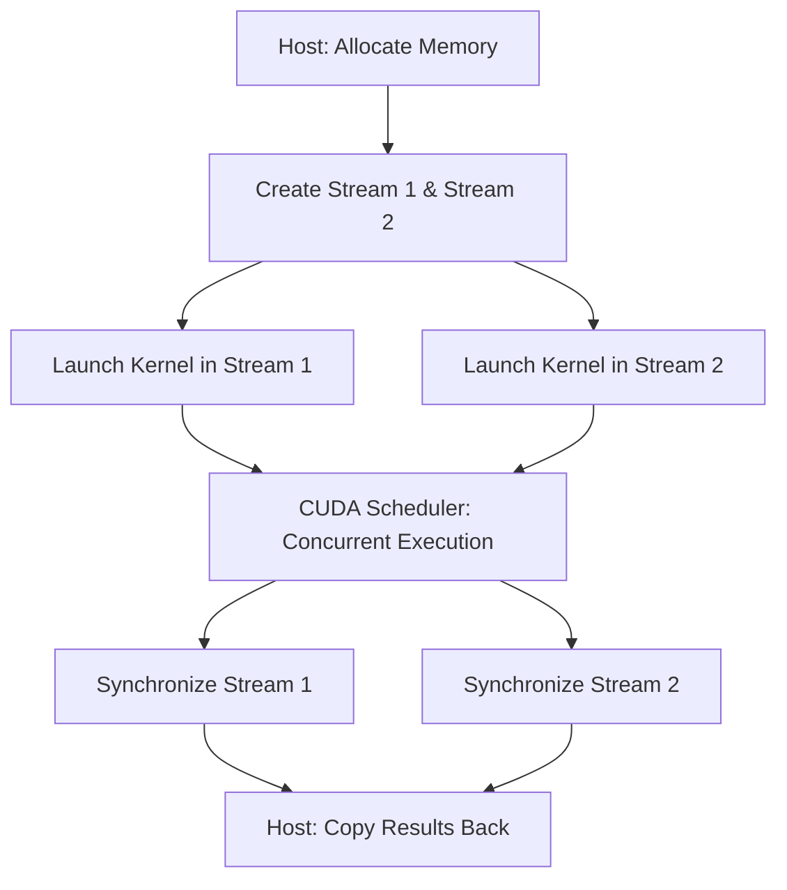
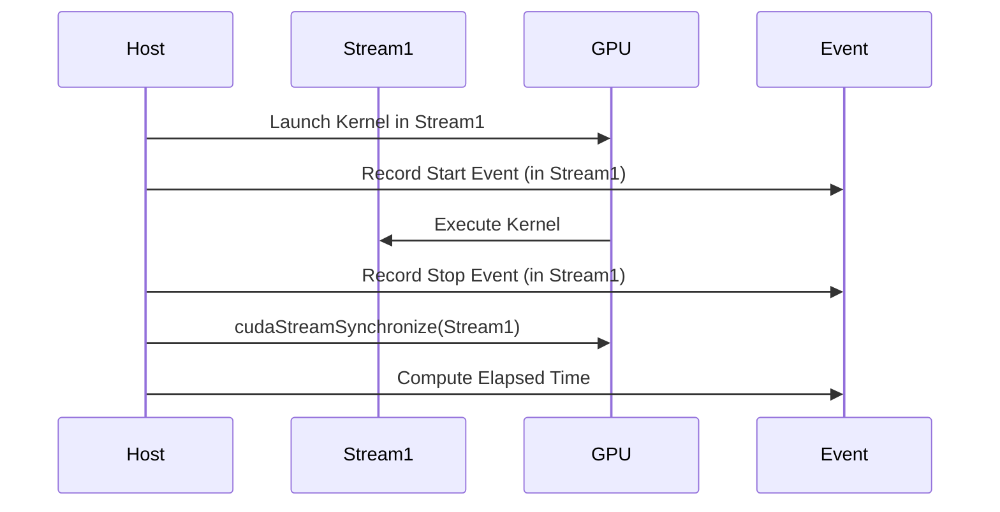

# Day 20: Streams & Concurrency (Basics)

In this capstone lesson, we dive into the basics of **CUDA streams** and **concurrency**. CUDA streams enable **asynchronous execution** of kernels and memory operations, allowing multiple kernels to run concurrently (overlap), which can significantly improve performance when properly managed. In contrast, the default stream is blocking—meaning operations in the default stream execute sequentially. 

This lesson covers:
- An explanation of CUDA streams and how they enable concurrency.
- How to launch kernels in separate streams.
- Measuring overlap and concurrency with CUDA events.

---

## Table of Contents

1. [Overview](#1-overview)  
2. [Understanding CUDA Streams](#2-understanding-cuda-streams)  
3. [Concurrency and Overlap with Streams](#3-concurrency-and-overlap-with-streams)  
4. [Practical Exercise: Launching Kernels in Different Streams](#4-practical-exercise-launching-kernels-in-different-streams)  
    - [a) Sample Kernel Code](#a-sample-kernel-code)  
    - [b) Host Code with Stream Management and Timing](#b-host-code-with-stream-management-and-timing)  
5. [Conceptual Diagrams](#5-conceptual-diagrams)  
6. [References & Further Reading](#6-references--further-reading)  
7. [Conclusion](#7-conclusion)  
8. [Next Steps](#8-next-steps)  

---

## 1. Overview

CUDA streams allow us to **overlap kernel execution and memory transfers**, thus exploiting the full potential of the GPU. By default, operations are issued into the **default stream**, which is **synchronous (blocking)**—meaning that subsequent operations wait until the current operation finishes. By creating and using **multiple streams**, you can run independent tasks concurrently, leading to better utilization of the GPU.

**Key Points:**
- **Default Stream:** All operations occur sequentially.
- **Non-default Streams:** Operations may overlap if there are no interdependencies.
- **Synchronization:** Use events and `cudaStreamSynchronize()` to manage ordering when needed.

---

## 2. Understanding CUDA Streams

A **CUDA stream** is essentially a sequence of operations (kernel launches, memory copies, etc.) that are executed in order on the GPU. Operations in **different streams** can run concurrently if the GPU hardware supports it. 

**Important Functions:**
- `cudaStreamCreate(&stream)`: Creates a new stream.
- `cudaStreamDestroy(stream)`: Destroys a stream.
- `cudaMemcpyAsync(...)`: Performs asynchronous memory transfers that can be associated with a stream.
- `cudaStreamSynchronize(stream)`: Waits for all operations in a stream to complete.
- `cudaEventRecord()`, `cudaEventSynchronize()`, and `cudaEventElapsedTime()`: Tools for measuring timing and verifying concurrency.

---

## 3. Concurrency and Overlap with Streams

**Without Streams (Default Stream):**
- Operations are executed **sequentially**.
- Kernel launches and memory transfers block subsequent operations.

**With Multiple Streams:**
- Operations in different streams can **overlap**.
- For example, two kernels in separate streams can run concurrently if they do not compete for the same resources.

**Pitfall:**
- **Non-default streams require careful synchronization**—if not managed correctly, you might inadvertently serialize operations or cause data hazards.

---

## 4. Practical Exercise: Launching Kernels in Different Streams

We will implement a simple vector addition kernel and launch it in two separate streams. We will then use CUDA events to measure the overlap of execution.

### a) Sample Kernel Code

```cpp
// vectorAddKernel.cu
#include <cuda_runtime.h>
#include <stdio.h>

// Simple vector addition kernel
// Each thread computes one element of the output vector.
__global__ void vectorAddKernel(const float *A, const float *B, float *C, int N) {
    int idx = threadIdx.x + blockIdx.x * blockDim.x;
    if (idx < N) {
        C[idx] = A[idx] + B[idx];
    }
}
```

*Comments:*  
- Each thread calculates its global index and performs element-wise addition.
- This kernel is straightforward and will be used in two different streams.

---

### b) Host Code with Stream Management and Timing

```cpp
// streamConcurrencyExample.cu
#include <cuda_runtime.h>
#include <stdio.h>
#include <stdlib.h>
#include <time.h>

// Declaration of the vector addition kernel
__global__ void vectorAddKernel(const float *A, const float *B, float *C, int N);

// Macro for error checking for brevity.
#define CUDA_CHECK(call) { \
    cudaError_t err = call; \
    if(err != cudaSuccess) { \
        printf("CUDA Error at %s:%d - %s\n", __FILE__, __LINE__, cudaGetErrorString(err)); \
        exit(EXIT_FAILURE); \
    } \
}

int main() {
    int N = 1 << 20; // 1M elements
    size_t size = N * sizeof(float);

    // Allocate unified host memory for input and output arrays.
    float *h_A = (float*)malloc(size);
    float *h_B = (float*)malloc(size);
    float *h_C1 = (float*)malloc(size); // Output for stream 1
    float *h_C2 = (float*)malloc(size); // Output for stream 2

    // Initialize the input arrays.
    srand(time(NULL));
    for (int i = 0; i < N; i++) {
        h_A[i] = (float)(rand() % 100) / 10.0f;
        h_B[i] = (float)(rand() % 100) / 10.0f;
    }

    // Allocate device memory for the arrays.
    float *d_A, *d_B, *d_C1, *d_C2;
    CUDA_CHECK(cudaMalloc((void**)&d_A, size));
    CUDA_CHECK(cudaMalloc((void**)&d_B, size));
    CUDA_CHECK(cudaMalloc((void**)&d_C1, size));
    CUDA_CHECK(cudaMalloc((void**)&d_C2, size));

    // Copy input data from host to device.
    CUDA_CHECK(cudaMemcpy(d_A, h_A, size, cudaMemcpyHostToDevice));
    CUDA_CHECK(cudaMemcpy(d_B, h_B, size, cudaMemcpyHostToDevice));

    // Create two separate streams.
    cudaStream_t stream1, stream2;
    CUDA_CHECK(cudaStreamCreate(&stream1));
    CUDA_CHECK(cudaStreamCreate(&stream2));

    // Set up kernel launch configuration.
    int threadsPerBlock = 256;
    int blocksPerGrid = (N + threadsPerBlock - 1) / threadsPerBlock;

    // Create CUDA events for timing.
    cudaEvent_t start, stop;
    CUDA_CHECK(cudaEventCreate(&start));
    CUDA_CHECK(cudaEventCreate(&stop));

    // Record the start event.
    CUDA_CHECK(cudaEventRecord(start, stream1));
    // Launch vectorAddKernel in stream1.
    vectorAddKernel<<<blocksPerGrid, threadsPerBlock, 0, stream1>>>(d_A, d_B, d_C1, N);
    // Record the stop event on stream1.
    CUDA_CHECK(cudaEventRecord(stop, stream1));

    // In parallel, launch vectorAddKernel in stream2.
    vectorAddKernel<<<blocksPerGrid, threadsPerBlock, 0, stream2>>>(d_A, d_B, d_C2, N);

    // Synchronize streams independently.
    CUDA_CHECK(cudaStreamSynchronize(stream1));
    CUDA_CHECK(cudaStreamSynchronize(stream2));

    // Measure the elapsed time for stream1.
    float milliseconds = 0;
    CUDA_CHECK(cudaEventElapsedTime(&milliseconds, start, stop));
    printf("Stream 1 Kernel Execution Time: %f ms\n", milliseconds);

    // Copy results from device to host.
    CUDA_CHECK(cudaMemcpy(h_C1, d_C1, size, cudaMemcpyDeviceToHost));
    CUDA_CHECK(cudaMemcpy(h_C2, d_C2, size, cudaMemcpyDeviceToHost));

    // Verify a few outputs.
    printf("First 5 elements from stream1 output:\n");
    for (int i = 0; i < 5; i++) {
        printf("%f ", h_C1[i]);
    }
    printf("\n");

    printf("First 5 elements from stream2 output:\n");
    for (int i = 0; i < 5; i++) {
        printf("%f ", h_C2[i]);
    }
    printf("\n");

    // Cleanup: Free device memory, destroy streams and events, free host memory.
    CUDA_CHECK(cudaFree(d_A));
    CUDA_CHECK(cudaFree(d_B));
    CUDA_CHECK(cudaFree(d_C1));
    CUDA_CHECK(cudaFree(d_C2));
    CUDA_CHECK(cudaStreamDestroy(stream1));
    CUDA_CHECK(cudaStreamDestroy(stream2));
    CUDA_CHECK(cudaEventDestroy(start));
    CUDA_CHECK(cudaEventDestroy(stop));
    free(h_A);
    free(h_B);
    free(h_C1);
    free(h_C2);

    return 0;
}
```

*Detailed Comments Explanation:*
- **Memory Allocation:**  
  Host and device memory is allocated for two output arrays (`d_C1` and `d_C2`) so we can compare the results from two streams.
- **Stream Creation:**  
  Two CUDA streams (`stream1` and `stream2`) are created for concurrent kernel execution.
- **Kernel Launch:**  
  The same kernel (`vectorAddKernel`) is launched in two separate streams. The kernel computes element-wise addition.
- **Timing with CUDA Events:**  
  A CUDA event is recorded in stream1 to measure the kernel execution time.
- **Synchronization:**  
  Each stream is synchronized with `cudaStreamSynchronize()` to ensure that kernels complete before results are copied back.
- **Error Checking:**  
  The macro `CUDA_CHECK` ensures that each CUDA API call is checked for errors.
- **Cleanup:**  
  All resources (memory, streams, events) are freed/destroyed appropriately.

---

## 5. Conceptual Diagrams

### Diagram 1: Streams and Concurrency Overview

*Explanation:*  
- Memory is allocated and two streams are created.
- Kernels are launched in separate streams.
- The scheduler executes them concurrently.
- Each stream is synchronized before results are copied back to the host.

### Diagram 2: Measuring Kernel Execution with CUDA Events

*Explanation:*  
- The host records a start event before launching the kernel in stream1.
- A stop event is recorded after kernel launch.
- Synchronization ensures the kernel is finished.
- The elapsed time between events is measured.

---

## 6. References & Further Reading

1. **[CUDA C Programming Guide – Streams](https://docs.nvidia.com/cuda/cuda-c-programming-guide/index.html#streams)**  
   Detailed documentation on CUDA streams.
2. **[CUDA C Best Practices Guide](https://docs.nvidia.com/cuda/cuda-c-best-practices-guide/index.html)**  
   Tips and best practices for using streams and concurrency.
3. **[NVIDIA NSight Compute Documentation](https://docs.nvidia.com/nsight-compute/)**  
   Tools for profiling GPU kernels and stream performance.
4. **"Programming Massively Parallel Processors: A Hands-on Approach" by David B. Kirk and Wen-mei W. Hwu**  
   Provides foundational and advanced concepts in CUDA programming.

---

## 7. Conclusion

In Day 20, you learned the fundamentals of **CUDA streams and concurrency**:
- **Multiple streams allow concurrent kernel execution**, improving performance.
- **Synchronization** using `cudaStreamSynchronize()` and **CUDA events** ensures that the host reads correct and complete results.
- **Debugging and error checking** are essential to ensure correct execution.
- **Conceptual diagrams** illustrate the flow from kernel launch to data retrieval.

By understanding and applying these concepts, you can **optimize your CUDA applications** to run multiple tasks concurrently and efficiently.

---

## 8. Next Steps

- **Experiment:** Modify the host code to launch more kernels concurrently using multiple streams.
- **Profile:** Use NVIDIA NSight Compute and Nsight Systems to monitor stream performance.
- **Optimize:** Explore overlapping memory transfers with kernel execution in different streams.
- **Expand:** Incorporate these patterns into larger, more complex applications such as real-time image processing pipelines.

```
