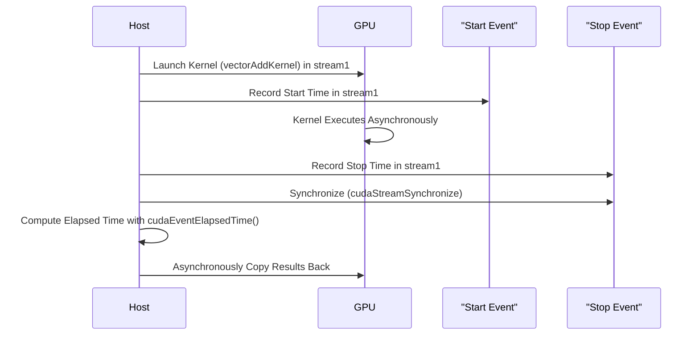

# Day 23: Asynchronous Memory Copy

In this lesson, we explore **asynchronous memory copy** in CUDA. Asynchronous transfers allow data to be copied between host and device concurrently with kernel execution, thus overlapping communication and computation to improve overall performance. To achieve truly asynchronous transfers, using **pinned (page-locked) host memory** is essential.


---

## Table of Contents

1. [Overview](#1-overview)  
2. [Understanding Asynchronous Memory Copy](#2-understanding-asynchronous-memory-copy)  
3. [Pinned (Page-Locked) Memory](#3-pinned-page-locked-memory)  
4. [Using `cudaMemcpyAsync()` and Streams](#4-using-cudamemcpyasync-and-streams)  
5. [Practical Exercise: Asynchronous Data Transfer with Kernel Overlap](#5-practical-exercise-asynchronous-data-transfer-with-kernel-overlap)  
    - [a) Sample Kernel Code](#a-sample-kernel-code)  
    - [b) Host Code with Pinned Memory and Streams](#b-host-code-with-pinned-memory-and-streams)  
6. [Conceptual Diagrams](#6-conceptual-diagrams)  
7. [References & Further Reading](#7-references--further-reading)  
8. [Conclusion](#8-conclusion)  
9. [Next Steps](#9-next-steps)  

---

## 1. Overview

CUDA operations such as kernel launches and memory transfers are by default **asynchronous**, meaning they return control to the CPU immediately. However, to truly achieve concurrency, especially when copying data between host and device, the host memory must be **pinned (page-locked)**. This lesson focuses on how to use **asynchronous memory copies** with pinned memory and CUDA streams to overlap data transfers with kernel execution for better performance.

---

## 2. Understanding Asynchronous Memory Copy

**Asynchronous Memory Copy** allows memory transfers (using `cudaMemcpyAsync()`) to run concurrently with kernel execution. Unlike the synchronous `cudaMemcpy()`, which blocks the host until the transfer is complete, `cudaMemcpyAsync()` initiates the transfer and returns control to the host immediately. This helps hide the latency of memory transfers if they are overlapped with computation.

**Key Points:**
- **Non-blocking:** The call returns immediately; the transfer happens concurrently.
- **Streams:** Transfers are associated with a CUDA stream; different streams can execute concurrently.
- **Overlap:** When combined with kernel execution, data transfers can occur in parallel, leading to improved performance.

---

## 3. Pinned (Page-Locked) Memory

For **asynchronous memory copy** to work effectively, the host memory used for transfers should be **pinned memory**. Pinned memory is allocated using `cudaMallocHost()` (or `cudaHostAlloc()`) and cannot be swapped out by the operating system. This results in:
- **Higher bandwidth:** Faster transfers between host and device.
- **True Asynchrony:** Enables concurrent execution of memory copies and kernels.

**Example Allocation:**
```cpp
float *h_data;
cudaMallocHost((void**)&h_data, size);  // Allocates pinned memory on the host.
```

*Reference:*  
- [CUDA C Programming Guide – Asynchronous Transfers](https://docs.nvidia.com/cuda/cuda-c-programming-guide/index.html#asynchronous-transfers)

---

## 4. Using `cudaMemcpyAsync()` and Streams

**`cudaMemcpyAsync()`** initiates an asynchronous transfer between host and device. It takes an additional parameter: the **CUDA stream** in which the operation is queued. Operations in different streams can overlap.

**Prototype:**
```cpp
cudaError_t cudaMemcpyAsync(void *dst, const void *src, size_t count, cudaMemcpyKind kind, cudaStream_t stream = 0);
```

**Key Steps:**
1. **Allocate Pinned Memory:** Use `cudaMallocHost()` for host memory.
2. **Create CUDA Streams:** Use `cudaStreamCreate()`.
3. **Perform Asynchronous Copy:** Use `cudaMemcpyAsync()` in a stream.
4. **Overlap with Kernel Execution:** Launch kernels in the same or different streams.
5. **Synchronize Streams:** Use `cudaStreamSynchronize()` or `cudaDeviceSynchronize()` to ensure operations are complete before accessing data.

---

## 5. Practical Exercise: Asynchronous Data Transfer with Kernel Overlap

We will implement a vector addition example where data is copied asynchronously using pinned memory and streams. We will also demonstrate how overlapping data transfer with kernel execution improves performance.

### a) Sample Kernel Code

```cpp
// vectorAddKernel.cu
#include <cuda_runtime.h>
#include <stdio.h>

// Kernel for vector addition.
// Each thread calculates one element of the output vector C by adding elements from A and B.
__global__ void vectorAddKernel(const float *A, const float *B, float *C, int N) {
    int idx = threadIdx.x + blockIdx.x * blockDim.x;
    if (idx < N) {
        C[idx] = A[idx] + B[idx];
    }
}
```

*Comments:*  
- This kernel computes a simple vector addition.
- Each thread calculates its global index and then performs element-wise addition.
- It is simple and serves as a baseline for timing experiments.

### b) Host Code with Pinned Memory and Streams

```cpp
// asyncMemoryCopyExample.cu
#include <cuda_runtime.h>
#include <stdio.h>
#include <stdlib.h>
#include <time.h>

// Declaration of the vector addition kernel.
__global__ void vectorAddKernel(const float *A, const float *B, float *C, int N);

// Macro for error checking.
#define CUDA_CHECK(call) {                                      \
    cudaError_t err = call;                                     \
    if (err != cudaSuccess) {                                   \
        printf("CUDA Error at %s:%d - %s\n", __FILE__, __LINE__, cudaGetErrorString(err)); \
        exit(EXIT_FAILURE);                                     \
    }                                                           \
}

int main() {
    int N = 1 << 20;  // 1 million elements.
    size_t size = N * sizeof(float);

    // Allocate pinned host memory for input and output arrays.
    float *h_A, *h_B, *h_C;
    CUDA_CHECK(cudaMallocHost((void**)&h_A, size));  // Pinned memory allocation.
    CUDA_CHECK(cudaMallocHost((void**)&h_B, size));
    CUDA_CHECK(cudaMallocHost((void**)&h_C, size));

    // Initialize the host arrays with random values.
    srand(time(NULL));
    for (int i = 0; i < N; i++) {
        h_A[i] = (float)(rand() % 100) / 10.0f;
        h_B[i] = (float)(rand() % 100) / 10.0f;
    }

    // Allocate device memory for vectors.
    float *d_A, *d_B, *d_C;
    CUDA_CHECK(cudaMalloc((void**)&d_A, size));
    CUDA_CHECK(cudaMalloc((void**)&d_B, size));
    CUDA_CHECK(cudaMalloc((void**)&d_C, size));

    // Create CUDA streams.
    cudaStream_t stream1, stream2;
    CUDA_CHECK(cudaStreamCreate(&stream1));
    CUDA_CHECK(cudaStreamCreate(&stream2));

    // Asynchronously copy data from host to device using streams.
    CUDA_CHECK(cudaMemcpyAsync(d_A, h_A, size, cudaMemcpyHostToDevice, stream1));
    CUDA_CHECK(cudaMemcpyAsync(d_B, h_B, size, cudaMemcpyHostToDevice, stream1));

    // Prefetch memory to device if desired (optional).
    // CUDA_CHECK(cudaMemPrefetchAsync(d_A, size, 0, stream1));
    // CUDA_CHECK(cudaMemPrefetchAsync(d_B, size, 0, stream1));

    // Set up kernel launch configuration.
    int threadsPerBlock = 256;
    int blocksPerGrid = (N + threadsPerBlock - 1) / threadsPerBlock;

    // Create CUDA events for timing.
    cudaEvent_t start, stop;
    CUDA_CHECK(cudaEventCreate(&start));
    CUDA_CHECK(cudaEventCreate(&stop));

    // Record the start event on stream1.
    CUDA_CHECK(cudaEventRecord(start, stream1));

    // Launch the vector addition kernel in stream1.
    vectorAddKernel<<<blocksPerGrid, threadsPerBlock, 0, stream1>>>(d_A, d_B, d_C, N);

    // Record the stop event on stream1.
    CUDA_CHECK(cudaEventRecord(stop, stream1));

    // Meanwhile, you can perform other operations in stream2 if needed.
    // For example, asynchronously copy results from a previous computation, etc.

    // Synchronize the stream to ensure that kernel execution completes.
    CUDA_CHECK(cudaStreamSynchronize(stream1));

    // Calculate the elapsed time between start and stop events.
    float milliseconds = 0;
    CUDA_CHECK(cudaEventElapsedTime(&milliseconds, start, stop));
    printf("Kernel Execution Time (Stream1): %f ms\n", milliseconds);

    // Asynchronously copy the result from device to host.
    CUDA_CHECK(cudaMemcpyAsync(h_C, d_C, size, cudaMemcpyDeviceToHost, stream1));
    CUDA_CHECK(cudaStreamSynchronize(stream1)); // Ensure copy is complete.

    // Verify results by printing the first 10 elements.
    printf("First 10 elements of result vector:\n");
    for (int i = 0; i < 10; i++) {
        printf("%f ", h_C[i]);
    }
    printf("\n");

    // Cleanup: Free device memory, destroy streams and events, free host memory.
    CUDA_CHECK(cudaFree(d_A));
    CUDA_CHECK(cudaFree(d_B));
    CUDA_CHECK(cudaFree(d_C));
    CUDA_CHECK(cudaStreamDestroy(stream1));
    CUDA_CHECK(cudaStreamDestroy(stream2));
    CUDA_CHECK(cudaEventDestroy(start));
    CUDA_CHECK(cudaEventDestroy(stop));
    CUDA_CHECK(cudaFreeHost(h_A));
    CUDA_CHECK(cudaFreeHost(h_B));
    CUDA_CHECK(cudaFreeHost(h_C));

    return 0;
}
```

*Detailed Comments Explanation:*
- **Pinned Memory Allocation:**  
  Pinned (page-locked) memory is allocated using `cudaMallocHost()` for h_A, h_B, and h_C, ensuring that memory transfers are fast and can be overlapped.
- **Device Memory Allocation:**  
  Standard `cudaMalloc()` is used to allocate memory on the GPU.
- **Stream Creation:**  
  Two streams are created; stream1 is used for asynchronous data transfer and kernel launch.
- **Asynchronous Memory Copy:**  
  Data is copied from host to device using `cudaMemcpyAsync()` on stream1, allowing overlap with kernel execution.
- **Kernel Launch:**  
  The `vectorAddKernel` is launched in stream1.  
- **Event Recording:**  
  CUDA events (`start` and `stop`) are recorded in stream1 to measure kernel execution time precisely.
- **Stream Synchronization:**  
  `cudaStreamSynchronize(stream1)` ensures that all operations in stream1 are completed before proceeding.
- **Result Copy & Verification:**  
  The output is asynchronously copied back from device to host, and then the host verifies the first few elements.
- **Resource Cleanup:**  
  All allocated resources (device memory, pinned memory, streams, events) are properly freed/destroyed.

---

## 6. Conceptual Diagrams

### Diagram 1: Unified Memory Transfer and Kernel Execution in Streams

```mermaid
flowchart TD
    A[Host: Allocate Pinned Memory (h_A, h_B, h_C)]
    B[Host: Allocate Device Memory (d_A, d_B, d_C)]
    C[Host: Create CUDA Streams (stream1, stream2)]
    D[Host: Asynchronously copy data from host to device using stream1]
    E[Host: Record Start Event in stream1]
    F[GPU: Launch Kernel in stream1 (vectorAddKernel)]
    G[Host: Record Stop Event in stream1]
    H[GPU: Kernel Executes Asynchronously]
    I[Host: Synchronize stream1 to ensure completion]
    J[Host: Compute elapsed time using events]
    K[Host: Asynchronously copy results from device to host using stream1]
    L[Host: Synchronize and Verify Results]
    
    A --> B
    B --> C
    C --> D
    D --> E
    E --> F
    F --> G
    G --> H
    H --> I
    I --> J
    J --> K
    K --> L
```

*Explanation:*  
- This diagram shows the full workflow: from allocating pinned and device memory to launching a kernel in a stream, recording events, and finally synchronizing and copying results back.
- It emphasizes the asynchronous nature of memory transfers and kernel execution when using streams.

### Diagram 2: Timing with CUDA Events Sequence



*Explanation:*  
- This sequence diagram details how CUDA events are used to time kernel execution.
- It demonstrates the asynchronous nature of kernel launches and the subsequent synchronization to measure elapsed time.

---

## 7. References & Further Reading

1. **CUDA C Programming Guide – Asynchronous Transfers**  
   [CUDA Asynchronous Transfers](https://docs.nvidia.com/cuda/cuda-c-programming-guide/index.html#asynchronous-transfers)
2. **CUDA C Programming Guide – Unified Memory**  
   [CUDA Unified Memory Overview](https://docs.nvidia.com/cuda/cuda-c-programming-guide/index.html#um-overview)
3. **CUDA C Best Practices Guide**  
   [CUDA Best Practices Guide](https://docs.nvidia.com/cuda/cuda-c-best-practices-guide/index.html)
4. **NVIDIA NSight Systems & NSight Compute Documentation**  
   [NVIDIA NSight Compute](https://docs.nvidia.com/nsight-compute/)
5. **"Programming Massively Parallel Processors: A Hands-on Approach" by David B. Kirk and Wen-mei W. Hwu**  
   Comprehensive textbook on CUDA programming.

---

## 8. Conclusion

In Day 23, you have learned:
- **The importance of asynchronous memory transfers** using CUDA streams.
- **How to allocate pinned memory** to achieve higher memory transfer throughput.
- **How to launch kernels and perform memory copies asynchronously** using `cudaMemcpyAsync()`.
- **How to use CUDA events** to measure kernel execution time accurately.
- **Common pitfalls**, such as not using pinned memory and misplacing events, which can lead to inaccurate timing and performance degradation.
- **Conceptual diagrams** that illustrate the overall workflow from data allocation to timing and synchronization.

With these techniques, you can now optimize your CUDA applications by overlapping memory transfers with kernel execution and ensuring precise performance measurements.

---

## 9. Next Steps

- **Experiment:**  
  Try different configurations, such as varying stream counts and data sizes, to see how they affect performance.
- **Profile:**  
  Use NVIDIA NSight Systems to analyze overlapping of memory transfers and kernel execution.
- **Optimize:**  
  Explore additional asynchronous patterns, such as concurrent kernel execution with multiple streams.
- **Expand:**  
  Integrate asynchronous memory copy into larger projects like image processing or deep learning inference pipelines.

```
