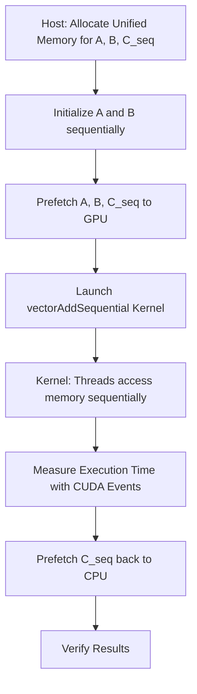
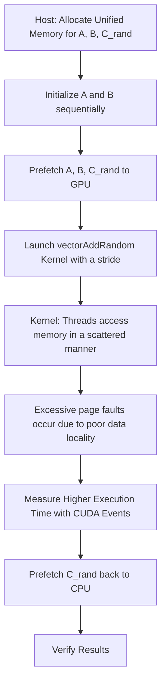

# Day 31: Unified Memory Deep Dive

In this lesson, we dive deep into **Unified Memory** by exploring how to use `cudaMallocManaged()` with multiple kernels and measure the overhead caused by page faults due to poor data locality. Unified memory allows both the CPU and GPU to access the same memory allocation, but if data access patterns are not localized, it can lead to excessive page migrations (i.e., page faults), which in turn can degrade performance.

**Key Learning Objectives:**
- Understand how Unified Memory works, including on-demand page migration.
- Learn to use `cudaMallocManaged()` for memory allocation accessible by both host and device.
- Observe the impact of poor data locality on page-fault overhead by comparing two kernels:
  - One with good data locality (sequential access).
  - One with poor data locality (random access).
- Use CUDA events to measure kernel execution time and estimate page fault overhead.
- Discuss strategies for improving data locality to minimize page migration.

**References:**
- [CUDA Unified Memory Documentation](https://docs.nvidia.com/cuda/cuda-c-programming-guide/index.html#um-overview)
- [CUDA C Programming Guide – Unified Memory](https://docs.nvidia.com/cuda/cuda-c-programming-guide/index.html#um-overview)

---

## Table of Contents

1. [Overview](#overview)
2. [Unified Memory and Page Migration](#unified-memory-and-page-migration)
3. [Practical Exercise: Measuring Page-Fault Overhead](#practical-exercise-measuring-page-fault-overhead)
    - [a) Kernel with Good Data Locality (Sequential Access)](#a-kernel-with-good-data-locality-sequential-access)
    - [b) Kernel with Poor Data Locality (Random Access)](#b-kernel-with-poor-data-locality-random-access)
    - [c) Host Code: Unified Memory Allocation, Kernel Launches, and Timing](#c-host-code-unified-memory-allocation-kernel-launches-and-timing)
4. [Conceptual Diagrams](#conceptual-diagrams)
5. [Common Debugging Pitfalls and Best Practices](#common-debugging-pitfalls-and-best-practices)
6. [References & Further Reading](#references--further-reading)
7. [Conclusion](#conclusion)
8. [Next Steps](#next-steps)

---

## 1. Overview

Unified Memory (allocated with `cudaMallocManaged()`) offers a simplified memory model where the CPU and GPU share the same address space. However, this convenience comes at a cost: when data access patterns lack spatial locality, excessive page migrations occur. These migrations (page faults) can significantly increase the execution time of kernels.

In this lesson, we compare two kernels operating on the same unified memory allocation:
- **Kernel A (Good Data Locality):** Accesses data sequentially.
- **Kernel B (Poor Data Locality):** Accesses data in a random pattern.

We use CUDA events to measure the execution time of each kernel to highlight the overhead due to page migration.

---

## 2. Unified Memory and Page Migration

Unified Memory automatically migrates pages between CPU and GPU on demand. When a kernel accesses a memory page that is not resident on the GPU, a page fault occurs, and the required page is transferred from CPU to GPU memory. If the access pattern is sequential, the GPU can often prefetch contiguous pages, reducing the overhead. However, if the access pattern is random, frequent page faults can occur, leading to excessive migration overhead and poor performance.

---

## 3. Practical Exercise: Measuring Page-Fault Overhead

### a) Kernel with Good Data Locality (Sequential Access)

This kernel performs a simple vector addition by sequentially accessing the unified memory.

```cpp
// kernelSequential.cu
#include <cuda_runtime.h>
#include <stdio.h>

// Kernel A: Sequential vector addition (good data locality).
__global__ void vectorAddSequential(const float *A, const float *B, float *C, int N) {
    int idx = threadIdx.x + blockIdx.x * blockDim.x;
    if (idx < N) {
        C[idx] = A[idx] + B[idx];
    }
}
```

*Comments:*
- Threads access elements in sequential order, which promotes good data locality.
- This minimizes page faults because memory accesses are contiguous.

---

### b) Kernel with Poor Data Locality (Random Access)

This kernel accesses unified memory in a pseudo-random order to simulate poor data locality and induce excessive page migrations.

```cpp
// kernelRandom.cu
#include <cuda_runtime.h>
#include <stdio.h>

// Kernel B: Randomized vector addition (poor data locality).
__global__ void vectorAddRandom(const float *A, const float *B, float *C, int N, int stride) {
    int idx = threadIdx.x + blockIdx.x * blockDim.x;
    if (idx < N) {
        // Compute a pseudo-random index based on a stride to disrupt sequential access.
        int randIdx = (idx * stride) % N;
        C[randIdx] = A[randIdx] + B[randIdx];
    }
}
```

*Comments:*
- Each thread computes a pseudo-random index (`randIdx`) to access memory.
- This random access pattern leads to poor spatial locality and thus higher page fault overhead.

---

### c) Host Code: Unified Memory Allocation, Kernel Launches, and Timing

This host code allocates unified memory, initializes data, launches both kernels, and measures their execution times using CUDA events.

```cpp
// unifiedMemoryPipeline.cu
#include <cuda_runtime.h>
#include <stdio.h>
#include <stdlib.h>
#include <time.h>

// Kernel declarations.
__global__ void vectorAddSequential(const float *A, const float *B, float *C, int N);
__global__ void vectorAddRandom(const float *A, const float *B, float *C, int N, int stride);

// Macro for error checking.
#define CUDA_CHECK(call) {                                        \
    cudaError_t err = call;                                       \
    if(err != cudaSuccess) {                                      \
        printf("CUDA Error at %s:%d - %s\n", __FILE__, __LINE__,    \
               cudaGetErrorString(err));                          \
        exit(EXIT_FAILURE);                                       \
    }                                                             \
}

int main() {
    int N = 1 << 20;  // 1M elements.
    size_t size = N * sizeof(float);

    // Allocate unified memory.
    float *A, *B, *C_seq, *C_rand;
    CUDA_CHECK(cudaMallocManaged(&A, size));
    CUDA_CHECK(cudaMallocManaged(&B, size));
    CUDA_CHECK(cudaMallocManaged(&C_seq, size));
    CUDA_CHECK(cudaMallocManaged(&C_rand, size));

    // Initialize unified memory arrays.
    srand(time(NULL));
    for (int i = 0; i < N; i++) {
        A[i] = (float)(rand() % 100) / 10.0f;
        B[i] = (float)(rand() % 100) / 10.0f;
    }

    // Determine GPU device.
    int device = 0;
    CUDA_CHECK(cudaGetDevice(&device));

    // Prefetch unified memory to GPU.
    CUDA_CHECK(cudaMemPrefetchAsync(A, size, device, NULL));
    CUDA_CHECK(cudaMemPrefetchAsync(B, size, device, NULL));
    CUDA_CHECK(cudaMemPrefetchAsync(C_seq, size, device, NULL));
    CUDA_CHECK(cudaMemPrefetchAsync(C_rand, size, device, NULL));

    // Define kernel launch parameters.
    int threadsPerBlock = 256;
    int blocksPerGrid = (N + threadsPerBlock - 1) / threadsPerBlock;

    // Create CUDA events for timing the sequential kernel.
    cudaEvent_t startSeq, stopSeq;
    CUDA_CHECK(cudaEventCreate(&startSeq));
    CUDA_CHECK(cudaEventCreate(&stopSeq));

    // Record start event for sequential kernel.
    CUDA_CHECK(cudaEventRecord(startSeq, 0));
    vectorAddSequential<<<blocksPerGrid, threadsPerBlock>>>(A, B, C_seq, N);
    CUDA_CHECK(cudaEventRecord(stopSeq, 0));
    CUDA_CHECK(cudaEventSynchronize(stopSeq));

    float timeSeq = 0;
    CUDA_CHECK(cudaEventElapsedTime(&timeSeq, startSeq, stopSeq));
    printf("Sequential Kernel Execution Time: %f ms\n", timeSeq);

    // Create CUDA events for timing the random kernel.
    cudaEvent_t startRand, stopRand;
    CUDA_CHECK(cudaEventCreate(&startRand));
    CUDA_CHECK(cudaEventCreate(&stopRand));

    // Choose a stride to disrupt locality (e.g., 103, a prime number).
    int stride = 103;

    // Record start event for random kernel.
    CUDA_CHECK(cudaEventRecord(startRand, 0));
    vectorAddRandom<<<blocksPerGrid, threadsPerBlock>>>(A, B, C_rand, N, stride);
    CUDA_CHECK(cudaEventRecord(stopRand, 0));
    CUDA_CHECK(cudaEventSynchronize(stopRand));

    float timeRand = 0;
    CUDA_CHECK(cudaEventElapsedTime(&timeRand, startRand, stopRand));
    printf("Random Kernel Execution Time: %f ms\n", timeRand);

    // Prefetch results back to CPU for verification.
    CUDA_CHECK(cudaMemPrefetchAsync(C_seq, size, cudaCpuDeviceId, NULL));
    CUDA_CHECK(cudaMemPrefetchAsync(C_rand, size, cudaCpuDeviceId, NULL));
    CUDA_CHECK(cudaDeviceSynchronize());

    // (Optional) Verify a few results.
    printf("First 10 results (Sequential):\n");
    for (int i = 0; i < 10; i++) {
        printf("%f ", C_seq[i]);
    }
    printf("\nFirst 10 results (Random):\n");
    for (int i = 0; i < 10; i++) {
        printf("%f ", C_rand[i]);
    }
    printf("\n");

    // Cleanup: Free unified memory and destroy events.
    CUDA_CHECK(cudaFree(A));
    CUDA_CHECK(cudaFree(B));
    CUDA_CHECK(cudaFree(C_seq));
    CUDA_CHECK(cudaFree(C_rand));
    CUDA_CHECK(cudaEventDestroy(startSeq));
    CUDA_CHECK(cudaEventDestroy(stopSeq));
    CUDA_CHECK(cudaEventDestroy(startRand));
    CUDA_CHECK(cudaEventDestroy(stopRand));

    return 0;
}
```

**Detailed Comments:**
- **Unified Memory Allocation:**  
  Unified memory for arrays A, B, and two result arrays (one for sequential access and one for random access) is allocated using `cudaMallocManaged()`.
- **Initialization:**  
  The arrays are initialized with random values on the host.
- **Prefetching:**  
  `cudaMemPrefetchAsync()` is used to prefetch the unified memory to the GPU, reducing the overhead of page faults.
- **Kernel Launches:**  
  Two kernels are launched:
  - `vectorAddSequential()` accesses data sequentially (good data locality).
  - `vectorAddRandom()` accesses data in a pseudo-random pattern (poor data locality), using a stride to simulate scattered accesses.
- **Timing:**  
  CUDA events measure the execution time of each kernel separately. The elapsed times are printed to compare overhead.
- **Result Verification:**  
  Optionally, the first 10 elements of each result array are printed.
- **Cleanup:**  
  Unified memory and CUDA events are freed to prevent resource leaks.

---

## 4. Conceptual Diagrams

### Diagram 1: Unified Memory Pipeline with Good Data Locality



*Explanation:*  
- The diagram illustrates the flow for the sequential (good locality) kernel: unified memory is allocated and prefetched, the kernel is launched, and results are verified.

### Diagram 2: Unified Memory Pipeline with Poor Data Locality



*Explanation:*  
- This diagram shows the flow for the random access kernel: unified memory is allocated and prefetched, but the random access pattern leads to excessive page migrations, resulting in higher execution time.

---

## 5. References & Further Reading

1. **CUDA Unified Memory Documentation**  
   [CUDA Unified Memory](https://docs.nvidia.com/cuda/cuda-c-programming-guide/index.html#um-overview)
2. **CUDA C Programming Guide – Unified Memory**  
   [Unified Memory Overview](https://docs.nvidia.com/cuda/cuda-c-programming-guide/index.html#um-overview)
3. **CUDA C Programming Guide – Asynchronous Transfers**  
   [Asynchronous Transfers](https://docs.nvidia.com/cuda/cuda-c-programming-guide/index.html#asynchronous-transfers)
4. **NVIDIA NSight Systems & NSight Compute Documentation**  
   [NVIDIA NSight Systems](https://docs.nvidia.com/nsight-systems/)
5. **"Programming Massively Parallel Processors: A Hands-on Approach" by David B. Kirk and Wen-mei W. Hwu**

---

## 6. Conclusion

In Day 31, we explored the deep intricacies of Unified Memory by:
- Allocating memory using `cudaMallocManaged()` and leveraging unified memory.
- Demonstrating two kernels: one with good data locality (sequential access) and one with poor data locality (random access).
- Measuring the execution time using CUDA events to observe the overhead caused by excessive page migration.
- Providing detailed inline comments and conceptual diagrams to illustrate the pipeline flow.

This exercise emphasizes the importance of data locality in unified memory applications and provides strategies to measure and mitigate page-fault overhead.

---

## 7. Next Steps

- **Optimize Data Locality:**  
  Investigate methods to improve data locality (e.g., restructuring data access patterns) to reduce page faults.
- **Profile with NSight:**  
  Use NVIDIA NSight Systems and NSight Compute to analyze page-fault overhead and optimize your unified memory usage.
- **Extend the Pipeline:**  
  Incorporate additional kernels and data processing steps to build a more complex application.
- **Explore Prefetching Strategies:**  
  Experiment with different prefetching strategies using `cudaMemPrefetchAsync()` to further reduce overhead.

Happy CUDA coding, and continue to refine your unified memory strategies for maximum performance!
```
