# Day 42: Progress Checkpoint

**Objective:**  
Recap the key concepts from **Days 29 to 41**, including **texture memory** usage, **warp-level intrinsics**, **dynamic parallelism**, **occupancy & launch config tuning**, **multi-stream concurrency**, and more. We will provide a **short quiz** to test your knowledge, plus a **combined mini-project** that weaves together concurrency, dynamic parallelism, and warp-level operations. This checkpoint ensures you’re well-prepared for advanced CUDA topics down the line.

---

## Table of Contents

1. [Overview](#1-overview)  
2. [Key Concepts Recap](#2-key-concepts-recap)  
   - [a) Texture Memory (Day 29)](#a-texture-memory-day-29)  
   - [b) Unified Memory & Page Fault Overheads (Day 31)](#b-unified-memory--page-fault-overheads-day-31)  
   - [c) Streams, Synchronization, & Dependencies (Days 32 & 41)](#c-streams-synchronization--dependencies-days-32--41)  
   - [d) CUDA Graphs (Day 33)](#d-cuda-graphs-day-33)  
   - [e) Profiling & Bottleneck Analysis (Day 34–36)](#e-profiling--bottleneck-analysis-day-34–36)  
   - [f) Warp-Level Primitives & Divergence (Days 37–38)](#f-warp-level-primitives--divergence-days-37–38)  
   - [g) Dynamic Parallelism (Day 39)](#g-dynamic-parallelism-day-39)  
   - [h) Occupancy & Launch Config (Day 35)](#h-occupancy--launch-config-day-35)  
3. [Short Quiz (10 Questions)](#3-short-quiz-10-questions)  
4. [Combined Mini-Project](#4-combined-mini-project)  
   - [a) Goal & Scenario](#a-goal--scenario)  
   - [b) Outline](#b-outline)  
   - [c) Suggested Approach](#c-suggested-approach)  
5. [References & Further Reading](#5-references--further-reading)  
6. [Conclusion](#6-conclusion)  
7. [Next Steps](#7-next-steps)

---

## 1. Overview

Over the past days, you’ve covered advanced CUDA concepts:
- **Texture Memory** for 2D data sampling.
- **Unified Memory** with prefetching and page-fault overhead analysis.
- **Streams & concurrency** (including synchronization via events and multi-stream concurrency).
- **CUDA Graphs** for capturing and reusing kernel sequences.
- **Profiling** with Nsight tools to identify memory vs. compute bounds, plus warp-level details.
- **Warp shuffle intrinsics & divergence** minimization.
- **Dynamic parallelism** for hierarchical task launching.
- **Occupancy** tuning to better use GPU SMs.

In **Day 42**, we consolidate these topics to ensure you’re prepared for more advanced GPU programming and optimization.

---

## 2. Key Concepts Recap

### a) Texture Memory (Day 29)
- **Store** 2D image data in a CUDA array, bind it to a texture reference.
- **Kernel**: use `tex2D()` for read-only cached fetches.
- **Benefit**: Great for image or 2D data sampling, but watch for **wrong normalized coordinates** => invalid fetch.

### b) Unified Memory & Page Fault Overheads (Day 31)
- **Unified Memory**: `cudaMallocManaged()` for CPU-GPU shared pointers.
- **Page Faults**: On-demand migrations can degrade performance if data access is random (poor locality).
- **Remedy**: `cudaMemPrefetchAsync()`, measure overhead to see if you’re memory-bound vs. compute-bound.

### c) Streams, Synchronization, & Dependencies (Days 32 & 41)
- **Multiple Streams** allow concurrency (overlapping kernels, data transfers).
- **Synchronization**: events, `cudaStreamWaitEvent()`, or `cudaDeviceSynchronize()`.
- **Risk**: Oversubscribing with too many streams => overhead.

### d) CUDA Graphs (Day 33)
- **Capture** a sequence of kernel launches & mem ops in a graph.
- **Instantiate & Launch** the graph for reduced overhead if repeated many times.
- **Pitfall**: forgetting to capture some ops or incorrectly ordering them => incomplete or misexecuted graph.

### e) Profiling & Bottleneck Analysis (Day 34–36)
- **Nsight Systems** for timeline concurrency analysis.
- **Nsight Compute** for kernel-level metrics (occupancy, memory throughput, warp stalls).
- Identify if kernel is memory-bound or compute-bound, and optimize accordingly.

### f) Warp-Level Primitives & Divergence (Days 37–38)
- **Warp Shuffle** intrinsics (`__shfl_xor_sync`, `__shfl_down_sync`) for efficient data exchange within warp.
- **Warp Divergence**: if some threads follow different branches => serialized execution. Minimize with predication or data reordering.

### g) Dynamic Parallelism (Day 39)
- **Kernels** can launch sub-kernels from device code.
- Use carefully to avoid over-launch overhead or saturating GPU resources.

### h) Occupancy & Launch Config (Day 35)
- **Occupancy**: ratio of active warps to max possible warps on an SM.
- **Launch Config**: choose block size & shared memory usage to maximize concurrency while avoiding resource contention.

---

## 3. Short Quiz (10 Questions)

1. **(Texture Memory)**  
   **Q**: How do you bind a CUDA array to a texture reference, and why must you ensure the coordinates are correct?  
   **A**: Typically `cudaBindTextureToArray(texRef, cuArray, channelDesc)`. Wrong coordinates (like ignoring normalized or unnormalized) => invalid fetch.

2. **(Unified Memory)**  
   **Q**: What is a key advantage of `cudaMemPrefetchAsync()` in Unified Memory?  
   **A**: Prefetch data to the GPU or CPU before access => reduces page faults & overhead.

3. **(Streams)**  
   **Q**: Name two ways you can synchronize streamB so it won’t start a kernel until a kernel in streamA finishes.  
   **A**: Use `cudaStreamWaitEvent(streamB, eventA, 0)` after recording eventA in streamA, or sync the device with `cudaDeviceSynchronize()` if appropriate.

4. **(CUDA Graphs)**  
   **Q**: Why might capturing a repeated sequence of kernels into a graph reduce overhead?  
   **A**: The graph is launched once with minimal launch overhead vs. multiple host-driven kernel calls.

5. **(Profiling)**  
   **Q**: If Nsight Compute shows your kernel saturates memory bandwidth but SM usage is moderate, is the kernel memory-bound or compute-bound?  
   **A**: Likely memory-bound. Increase concurrency or reduce memory usage might help.

6. **(Warp Shuffle)**  
   **Q**: What does `__shfl_down_sync(mask, val, offset)` do?  
   **A**: Shifts data `val` within the warp from lane `laneId+offset` to the current lane, enabling in-warp data exchange.

7. **(Warp Divergence)**  
   **Q**: How does a warp handle an `if-else` branch where half threads are true, half are false?  
   **A**: The warp serially executes the `if` part for relevant threads, then the `else` part for the others => divergence overhead.

8. **(Dynamic Parallelism)**  
   **Q**: If a kernel each thread launches sub-kernels, how can performance degrade?  
   **A**: Over-launch overhead saturates GPU scheduling => too many small kernels => overhead > concurrency gains.

9. **(Occupancy)**  
   **Q**: What resource usage typically limits occupancy if your kernel uses large shared memory arrays per block?  
   **A**: Shared memory usage reduces the number of blocks that can fit on an SM, lowering occupancy.

10. **(Multi-Stream Concurrency)**  
    **Q**: If you want to run two large independent kernels in parallel, how do you set it up?  
    **A**: Create two streams, launch each kernel in a different stream, ensure no data dependencies => concurrency possible if GPU resources suffice.

---

## 4. Combined Mini-Project

**Goal**: Create a **multi-stream** application that uses **warp-level shuffle** for partial reductions, organizes **concurrency** with **dynamic parallelism** if beneficial, and possibly uses a **graph** if repeated multiple times. Additionally, measure **occupancy** and see if **warp divergence** can be minimized.

### a) Goal & Scenario

- Suppose you have multiple data blocks each needing partial reduction. 
- Each data block is processed in a separate **stream** to overlap concurrency.
- Within each kernel, use a **warp shuffle** approach for partial sums to avoid shared memory. 
- If data blocks subdivide further, you can demonstrate **dynamic parallelism** by letting the parent kernel spawn sub-kernels for sub-block tasks.

### b) Outline

1. **Host Setup**: 
   - Allocate arrays for multiple data blocks.
2. **Stream Creation**: 
   - Create e.g. 2–4 streams for concurrency.
3. **Kernel**: 
   - Use warp shuffle for partial sum inside each block, or each warp processes a segment. 
   - Optionally, if the data block is large, have the kernel do dynamic parallelism to subdivide tasks further.
4. **Graph**: 
   - If the same sequence (copy input -> run kernel -> copy output) is repeated for multiple data blocks repeatedly, consider capturing it in a CUDA graph for minimal overhead.
5. **Measurement**:
   - Compare single-stream vs. multi-stream concurrency. 
   - Check profiling for occupancy, warp divergence. 

### c) Suggested Approach

1. Write a small code that processes multiple chunks of data in parallel streams. 
2. Each chunk is partially reduced using a warp shuffle approach. 
3. Optionally, the parent kernel can spawn sub-kernels (dynamic parallelism) to handle sub-block tasks. 
4. Use Nsight Compute or Nsight Systems to measure performance, see concurrency timeline, observe warp usage. 
5. Document if multi-stream concurrency yields real speedups vs. a single stream approach.

---

## 5. References & Further Reading

1. **CUDA C Programming Guide**  
   - [Minimizing Divergence & Warps](https://docs.nvidia.com/cuda/cuda-c-programming-guide/index.html#simt)  
   - [Dynamic Parallelism](https://docs.nvidia.com/cuda/cuda-c-programming-guide/index.html#dynamic-parallelism)
2. **CUDA C Best Practices Guide**  
   [Overlapping Transfers and Kernels](https://docs.nvidia.com/cuda/cuda-c-best-practices-guide/index.html#asynchronous-transfers)
3. **NVIDIA Nsight Systems** & **Nsight Compute**  
   Tools for concurrency analysis & kernel-level metrics.
4. **NVIDIA Developer Blog**  
   Articles on advanced concurrency, warp shuffle, dynamic parallelism.

---

## 6. Conclusion

In **Day 42**: 
- We recapped advanced concepts from **texture memory** to **dynamic parallelism**, including concurrency, warp-level intrinsics, occupancy, and more.  
- Provided a **short quiz** (10 questions) to test understanding of these topics.  
- Proposed a **combined mini-project** that merges concurrency (multi-stream), warp shuffle usage, dynamic parallelism, and possibly CUDA graphs for repeated tasks.  

**Key Takeaway**: These advanced features let you push your GPU application to higher performance and more sophisticated patterns but require careful usage to avoid pitfalls like oversubscription, warp divergence, or suboptimal occupancy.

---

## 7. Next Steps

- **Implement** the combined mini-project to unify your knowledge from days 29–41.  
- **Profile** your code with Nsight tools to verify concurrency, measure warp usage, dynamic parallelism overhead, etc.  
- **Optimize** further or expand your approach to real-world data sets for an in-depth demonstration.

Happy CUDA coding, and congratulations on reaching this advanced checkpoint in your GPU programming journey!
```

```
# Day 42: 15 Theoretical Questions & Answers

Below are 15 **simple theoretical questions** spanning the advanced CUDA topics covered from Days 29–41, along with concise answers. These questions ensure you have a strong conceptual grasp of **texture memory**, **warp-level operations**, **dynamic parallelism**, **streams & concurrency**, **occupancy**, **profiling**, and more.

---

## 1. Texture Memory

**Q1:** **What is texture memory in CUDA, and why is it useful?**  
**A1:** Texture memory is a specialized read-only memory space that is cached and optimized for **2D spatial access**. It’s useful for operations like image processing or any scenario where threads within a block read nearby data. By binding a CUDA array to a texture reference, the kernel can fetch data via functions like `tex2D()`, providing better caching and built-in addressing modes (e.g., clamping, wrapping).

**Q2:** **How do you bind a CUDA array to a texture reference, and what is one common pitfall in using texture memory?**  
**A2:** Use `cudaMallocArray()` to create a 2D CUDA array, copy data with `cudaMemcpy2DToArray()`, then call `cudaBindTextureToArray(textureRef, cuArray, channelDesc)`. A common pitfall is **wrong coordinate usage** (e.g., mixing up normalized vs. unnormalized coordinates) leading to invalid fetch results.

---

## 2. Warp-Level Intrinsics

**Q3:** **Why use warp shuffle intrinsics (e.g., `__shfl_down_sync`) instead of shared memory for data exchange within a warp?**  
**A3:** Warp shuffle intrinsics allow threads in the same warp to directly read registers from other threads without storing to shared memory, **reducing overhead** and avoiding some synchronization steps. This can accelerate operations like warp-level reductions or scans.

**Q4:** **What is warp divergence, and how does branching cause it?**  
**A4:** Warp divergence occurs when threads in the same warp follow **different control paths** due to branching (`if-else`). The GPU serializes each path, reducing parallel efficiency. Minimizing branching or using predication can help reduce warp divergence overhead.

---

## 3. Dynamic Parallelism

**Q5:** **Define dynamic parallelism and give one practical example where it simplifies code.**  
**A5:** Dynamic parallelism allows a GPU kernel (parent kernel) to **launch sub-kernels** from device code. A practical example is **hierarchical or recursive** algorithms (like BFS in graphs, fractal computations, or tree traversals) where subdividing tasks on-the-fly avoids multiple round trips to the CPU.

**Q6:** **What is the main risk of overusing dynamic parallelism?**  
**A6:** Each sub-kernel launch adds overhead and consumes GPU resources. Overlaunching many small sub-kernels can lead to scheduling overhead, saturating the GPU with kernel launches and negating performance benefits.

---

## 4. Streams & Concurrency

**Q7:** **How can multiple streams improve performance in a CUDA application?**  
**A7:** Multiple streams enable **concurrency**: overlapping data transfers with kernel execution or running independent kernels in parallel. This reduces idle time on the GPU or the CPU, boosting throughput. 

**Q8:** **Name a method to synchronize one stream so it waits for a kernel in another stream to complete.**  
**A8:** Use **CUDA events**: record an event in stream A after the kernel, then call `cudaStreamWaitEvent(streamB, eventA, 0)` so stream B only proceeds once eventA is done. Alternatively, a global device sync (`cudaDeviceSynchronize()`) can enforce a broader synchronization.

---

## 5. Occupancy & Launch Configuration

**Q9:** **What does occupancy mean in the context of CUDA?**  
**A9:** Occupancy is the ratio of **active warps** on a Streaming Multiprocessor (SM) to the **maximum** possible warps. High occupancy can help hide memory latency, but it doesn’t always guarantee the highest performance—some kernels run best at moderate occupancy if they’re heavily memory-bound.

**Q10:** **Which resource usages can reduce occupancy if used excessively?**  
**A10:** **Registers** per thread and **shared memory** per block. If a kernel uses too many registers or large shared memory arrays, fewer blocks/warps can fit on an SM, lowering occupancy.

---

## 6. Profiling & Bottleneck Analysis

**Q11:** **How do you distinguish if a kernel is memory-bound or compute-bound using Nsight Compute?**  
**A11:** Check **memory throughput** relative to GPU’s theoretical bandwidth and **compute utilization** (SM usage, warp stalls). If memory throughput is near max while SM usage is moderate, it’s memory-bound. If memory usage is low but you see high SM usage or instruction throughput near peak FLOPs, it’s compute-bound.

**Q12:** **What is the difference between Nsight Systems and Nsight Compute in CUDA profiling?**  
**A12:** Nsight Systems is a **timeline/profiling tool** focusing on **system-wide** concurrency (CPU-GPU interactions, multi-stream overlap), whereas Nsight Compute is a **low-level kernel profiler** giving detailed **metrics** on each kernel (e.g., occupancy, warp stalls, memory bandwidth).

---

## 7. CUDA Graphs

**Q13:** **Why might capturing a set of kernels into a CUDA graph reduce overhead?**  
**A13:** Because after capturing the sequence of operations (kernels, copies) into the graph, you can **instantiate** and then **launch** the entire operation with a single call, avoiding multiple host-driven launches, which significantly reduces launch overhead for repeated sequences.

**Q14:** **Mention one common pitfall when using CUDA graphs.**  
**A14:** Failing to **capture all required operations** or incorrectly ordering them can create an incomplete or incorrect graph, leading to errors or misexecution. Another pitfall is forgetting to **destroy** the graph and `cudaGraphExec_t` after use, risking memory leaks.

---

## 8. Combined Knowledge

**Q15:** **How can you combine multi-stream concurrency with warp-level intrinsics to improve performance?**  
**A15:** You can run **independent tasks** in **different streams** for concurrency while **within each kernel**, use **warp shuffle** (e.g., for partial reductions). This approach can **overlap** different kernels or data transfers across streams, and also minimize warp-level overhead inside each kernel, maximizing overall throughput.

---

## Conclusion

**Day 42**: We have provided **15 theoretical questions** with answers covering topics from **texture memory** and **warp-level intrinsics** to **dynamic parallelism**, **occupancy**, **streams**, **profiling** and **graphs**. This checkpoint ensures you’ve consolidated your understanding of advanced CUDA features taught in Days 29–41. Use these questions to verify your conceptual clarity, and proceed to the combined mini-project or further real-world tasks with confidence.
```

```
# Day 42: 15 Intermediate-Level Theoretical Questions & Answers

Below are 15 **intermediate theoretical questions** spanning advanced CUDA topics from Days 29–41. Each question includes a detailed answer for deeper insight. These questions build on the fundamentals and delve into more nuanced aspects of texture memory, warp-level intrinsics, dynamic parallelism, streams, occupancy, profiling, and CUDA graphs.

---

## 1. Texture Memory & Coordinates

**Q1:** **When using texture memory for a 2D array, what is the difference between `normalized` and `unnormalized` coordinates, and how do you configure them?**  
**A1:** 
- **Normalized** coordinates mean `(u, v)` range from `[0,1)` for the texture’s width and height. The hardware then maps them to actual pixels.  
- **Unnormalized** coordinates are the raw pixel indices (e.g., `(x + 0.5f, y + 0.5f)` for exact texel centers).  
- You configure them by setting `texRef.normalized = true` for normalized, or `false` for unnormalized, and specifying address modes (`cudaAddressModeClamp`, etc.). Misuse can lead to out-of-range fetches or incorrectly sampled data.

---

## 2. Warp Shuffle Sync Mask

**Q2:** **In warp shuffle intrinsics like `__shfl_down_sync(mask, val, offset, width)`, what is the role of `mask` and `width` parameters?**  
**A2:**  
- **mask** is the **active lane mask** (often `0xffffffff` if all threads in the warp are active). This indicates which threads participate in the shuffle.  
- **width** is the warp size portion to operate on, commonly `32` for the entire warp. You can use smaller sub-warps (e.g., `width=16`) if only part of the warp is used. This helps partition a warp into segments if your kernel logic demands it.

---

## 3. Dynamic Parallelism Overhead

**Q3:** **Why can launching sub-kernels from device code lead to higher overhead compared to a single host-driven kernel launch?**  
**A3:**  
Each sub-kernel launch still involves scheduling on the GPU. If the parent kernel spawns many sub-kernels, the GPU might be saturated with scheduling tasks, leading to **launch overhead**. Also, device-side synchronization (like `cudaDeviceSynchronize()`) inside kernels can be very costly if done frequently. If the sub-kernels are small, overhead may outweigh concurrency benefits.

---

## 4. Streams & Concurrent Data Transfers

**Q4:** **How do you overlap data transfers with kernel execution using multiple streams?**  
**A4:**  
You place your **async memory copies** (`cudaMemcpyAsync`) in **one stream** and your kernels in **another stream**. If the GPU hardware has separate copy engines, the data transfers can proceed concurrently while the kernel in another stream is running, **as long as** they don’t contend for the same memory buffers or the same stream resources.

---

## 5. Occupancy Calculator vs. Real Performance

**Q5:** **Explain why a kernel that achieves high occupancy might still perform slower than a kernel with moderate occupancy.**  
**A5:**  
Occupancy alone doesn’t guarantee maximum performance. If the kernel is **memory-bound**, adding more warps only saturates memory bandwidth without improving throughput. Also, a kernel might use large shared memory or have register usage that slightly lowers occupancy but yields better memory coalescing or reduced overhead. The real metric is **execution time**, not just occupancy percentage.

---

## 6. Nsight Compute Metric: Warp Stall Reasons

**Q6:** **When Nsight Compute shows high warp stall reasons labeled “Long Scoreboard” or “Mem Dependency,” what does that imply?**  
**A6:**  
It implies that warps are **stalling** waiting on memory operations (like global memory loads) to complete. The GPU scoreboard tracks outstanding memory requests. If many threads in a warp need data from memory, they stall until it’s fetched. This is a hallmark of a memory-bound kernel if stalls remain high despite decent occupancy.

---

## 7. CUDA Graph Capture Modes

**Q7:** **What are the different capture modes for CUDA streams in graph capturing, and how do they affect host access?**  
**A7:**  
- **`cudaStreamCaptureModeGlobal`**: Tracks all operations that might affect the captured stream globally.  
- **`cudaStreamCaptureModeThreadLocal`**: Restricts capture to that thread’s stream usage.  
- **`cudaStreamCaptureModeRelaxed`**: Allows host API calls that don’t directly conflict with the capturing.  

The mode affects how the capture logic deals with host API calls, ensuring that only relevant ops become part of the graph.

---

## 8. Minimizing Warp Divergence

**Q8:** **When might reordering data help minimize warp divergence?**  
**A8:**  
If threads in a warp see data that leads them down different branches, re-clustering data so warp threads see **similar** conditions can unify the branch. For example, grouping all “val>50” data contiguously ensures entire warps follow the same path, reducing or eliminating divergence.

---

## 9. Dynamic Parallelism Use Cases

**Q9:** **Give an example of an algorithm that might benefit from dynamic parallelism and why.**  
**A9:**  
**Quadtree or Octree** processing, where each node spawns tasks for its children based on data. Instead of returning to the host for each subdivision, the GPU can recursively launch sub-kernels at each level. This hierarchical approach simplifies code structure and avoids multiple round trips between CPU and GPU.

---

## 10. Streams & Event Dependencies

**Q10:** **If two streams share data, how do you ensure correctness without forcing a global sync?**  
**A10:**  
Record an **event** in stream A after finishing the data operation. Then call `cudaStreamWaitEvent(streamB, event, 0)` in stream B to ensure it waits until stream A’s operation completes. This local sync avoids a full device-wide `cudaDeviceSynchronize()`.

---

## 11. Graph Instantiation Overhead

**Q11:** **Why might you want to create and instantiate a CUDA graph once and launch it multiple times?**  
**A11:**  
**Graph instantiation** has overhead. By instantiating once, you can re-launch the graph many times with **minimal overhead** each time. This is especially beneficial for repeated workflows in iterative algorithms or repeated pipeline steps.

---

## 12. Occupancy & Shared Memory

**Q12:** **How does shared memory usage per block limit the number of concurrent blocks on an SM?**  
**A12:**  
Each block requires a fixed chunk of shared memory. If a kernel uses a large chunk, fewer blocks can fit in the SM’s shared memory capacity. Fewer blocks => fewer warps => lower occupancy. Balancing shared memory usage with concurrency needs is crucial.

---

## 13. Warp Shuffle Edge Cases

**Q13:** **What happens if you call `__shfl_down_sync` with an offset that goes beyond the warp boundary?**  
**A13:**  
Threads whose `laneId + offset` exceeds 31 (the max lane) will read from **undefined** or default data. Typically, the returned value is from a “safe” lane or zero, but actual behavior can differ by architecture. Code must ensure that offsets remain valid for the threads reading data.

---

## 14. Multi-Stream Transfer & Compute Overlap

**Q14:** **Why does a single data transfer in one stream not always overlap with a kernel in another stream?**  
**A14:**  
Overlapping requires that the GPU has separate copy engines and that the data transfer uses a pinned host buffer. Also, if the GPU can’t perform kernel compute & data copy concurrently (older or limited hardware), or if the data is in the same memory region needed by the kernel, concurrency might not happen. Proper pinned memory usage and separate data buffers are key.

---

## 15. Divergence vs. Predication

**Q15:** **How does using predication help reduce warp divergence, and what tradeoff might it introduce?**  
**A15:**  
**Predication** executes both branches but uses a boolean mask to select the result. This avoids a warp-level branch but does extra instructions for threads that don’t need that branch’s logic. So it can reduce warp divergence overhead but might do more computations overall.

---

## Conclusion

These **15 intermediate questions** cover deeper nuances of:

- **Texture memory** usage and coordinate modes.
- **Warp shuffle** intricacies (mask, offsets).
- **Dynamic parallelism** overhead and use cases.
- **Streams & concurrency** details (event synchronization, pinned memory).
- **Occupancy** constraints (registers, shared memory).
- **Divergence** and predication tradeoffs.

Review these answers to reinforce your advanced CUDA knowledge and ensure you have a solid foundation for GPU optimization. 
```
```
```markdown
# Day 42: 15 Highly Advanced Theoretical Questions & Answers

Below are 15 **highly advanced** theoretical questions, each with a detailed solution. These questions build on the advanced CUDA features covered throughout Days 29–41—including texture memory, warp shuffle intrinsics, dynamic parallelism, concurrency, occupancy tuning, profiling, and CUDA graphs—and delve into more sophisticated details and corner cases.

---

## 1. Texture Memory with LOD & Filtering

**Q1:** **In CUDA texture memory, how can you leverage LOD (Level of Detail) or filtering modes (like linear filtering), and what are potential pitfalls in scientific computations?**

**A1:**  
- **LOD (Level of Detail)** is typically used in graphics-based texture sampling where different mipmap levels exist. In CUDA, you can set up texture references to enable LOD if you have a mipmapped array. This is less common in scientific HPC but can be beneficial if you have a multi-resolution approach.  
- **Linear Filtering** can interpolate between neighboring texels, which is great for smooth sampling but can introduce **floating-point interpolation errors**. For scientific or precise computations, such interpolation might lead to inaccuracies. Pitfalls include **unintentional smoothing** of data or boundary conditions if not accounted for. HPC codes often require exact data fetches (point sampling) to avoid inadvertent changes in results.

---

## 2. Warp Shuffle for Prefix Sums

**Q2:** **How could you implement an inclusive prefix sum within a warp using only shuffle intrinsics, and what key detail ensures correctness for edge lanes?**

**A2:**  
1. **Stepwise** approach: Each thread accumulates partial sums from `__shfl_up_sync()` or `__shfl_xor_sync()` with increments of 1, 2, 4, etc., merging partial sums at each stage.  
2. For an **inclusive** prefix sum, each lane gets the sum of all lanes from 0 to the current lane. Typically, you do something like:

   ```cpp
   val += __shfl_up_sync(mask, val, 1);
   val += __shfl_up_sync(mask, val, 2);
   val += __shfl_up_sync(mask, val, 4);
   val += __shfl_up_sync(mask, val, 8);
   val += __shfl_up_sync(mask, val, 16);
   ```

3. **Edge Condition**: lanes with an ID below the offset must not read invalid data from negative lane IDs. For example, `__shfl_up_sync(mask, val, 4)` is undefined for `laneId < 4`. Usually, the hardware clamps or returns a default, but you must ensure correctness by ignoring that contribution if `threadIdx.x < offset`.

---

## 3. Nested Dynamic Parallelism & Concurrency

**Q3:** **If a parent kernel launches sub-kernels (dynamic parallelism), and those child kernels also launch grandchild kernels, how does concurrency scheduling work on modern GPUs?**

**A3:**  
- All kernel launches, whether from host or device, get queued on the GPU’s hardware scheduler.  
- **Parent Kernel** -> **Sub-Kernel** -> **Grandchild-Kernel** each gets a separate launch descriptor. The GPU can interleave or concurrently schedule them subject to resource availability (SM usage, memory, etc.).  
- However, the overhead grows quickly. Modern GPUs support concurrency among sub-kernels if they do not exceed resource limits. If `cudaDeviceSynchronize()` or device code sync calls are used frequently, concurrency might be stifled. The GPU processes them in roughly the order they’re queued, but each sub-kernel can also run partially concurrently if the hardware has free SMs.

---

## 4. Streams Priority & Preemption

**Q4:** **CUDA streams can have priorities. How does this affect concurrency, and when might stream priorities be crucial?**

**A4:**  
- **Priority** influences the scheduling of kernels among streams if they are contending for SM resources. A high-priority stream's kernels can preempt or be scheduled before low-priority stream kernels.  
- This is crucial in **real-time** or **latency-sensitive** scenarios where certain tasks (like interactive rendering or time-critical HPC steps) must run ASAP.  
- On some GPUs, partial preemption can occur, but typically the major advantage is that the high-priority stream receives scheduling preference for new blocks launched if the GPU is resource-limited.

---

## 5. Occupancy & Launch Bounds

**Q5:** **Explain how `__launch_bounds__()` can guide register usage to improve occupancy, and what trade-offs might result.**

**A5:**  
- `__launch_bounds__(maxThreadsPerBlock, minBlocksPerSM)` is a hint to the compiler about the expected block size and how many blocks you want simultaneously on an SM.  
- The compiler then tries to optimize register usage such that you can run at least `minBlocksPerSM` blocks concurrently.  
- Trade-off: if forced to use fewer registers per thread, the compiler may not fully optimize certain calculations, potentially harming performance if the kernel is compute-bound. But if it’s memory-bound or if concurrency is beneficial, increased occupancy might yield net speedups.

---

## 6. Warp Shuffle with Lane Mask Collisions

**Q6:** **If using `__shfl_xor_sync(mask, val, laneMask)` with certain laneMask patterns, how do you prevent collisions or overwriting of data?**

**A6:**  
- Each lane uses `laneId ^ laneMask` to compute its source lane. Collisions occur if two lanes end up reading from the same source. Typically, in a butterfly pattern, this is intentional but carefully staged so that each iteration merges partial data.  
- The key is ensuring **synchronization** within the warp logic, or using iterative steps so each warp shuffle uses the newly updated `val`. For example, if `laneMask` is 16, lanes 0..15 read from lanes 16..31, but lanes 16..31 read from lanes 0..15, so no collision if each lane is reading from a unique source lane.

---

## 7. Graph Updates with `cudaGraphExecUpdate()`

**Q7:** **What is `cudaGraphExecUpdate()`, and how does it help avoid re-capturing or re-instantiating a graph?**

**A7:**  
- `cudaGraphExecUpdate(execGraph, graph, errorNode, updateResult)` modifies an **existing** `cudaGraphExec_t` if the new graph differs only in ways that are compatible with an in-place update (e.g., changing kernel parameters).  
- This avoids re-capturing or re-instantiating the entire graph from scratch, which can be expensive.  
- **Limitation**: major changes (like different dependencies or drastically changed node structures) might not be updatable, requiring a new instantiation.

---

## 8. Minimizing Divergence in Loop Constructs

**Q8:** **How might warp divergence manifest in loops, and how can unrolling or predicated loops help?**

**A8:**  
- If a warp’s threads iterate a loop a different number of times or break out at different iterations, the warp must **serialize** each distinct path. This is a hidden form of divergence.  
- **Unrolling** or converting the loop into a predicated structure can help. For instance, if each thread does the maximum iteration count but conditionally (predication) does the inside work, the warp no longer has a branch each iteration. However, you do more instructions for threads that would have exited early.

---

## 9. Dynamic Parallelism vs. Streams from Host

**Q9:** **When might dynamic parallelism outperform a multi-stream host approach, and vice versa?**

**A9:**  
- **Dynamic parallelism** can simplify hierarchical algorithms that subdivide tasks “on the fly,” reducing host-GPU round trips.  
- However, if the number of sub-kernels is large or predictable, host-driven multi-stream concurrency can be more efficient because host scheduling overhead might be lower than many small device launches.  
- So dynamic parallelism wins if you have dynamic, branching tasks, while multi-stream host launching is often faster for a known, static set of tasks.

---

## 10. Occupancy & Large Shared Memory Tiling

**Q10:** **In a tiled matrix multiplication with large shared memory usage, how might you determine the block size to balance occupancy and shared memory usage?**

**A10:**  
- You would:
  1. Evaluate how much shared memory each block needs for your tile size.  
  2. Check GPU SM shared memory capacity to see how many blocks can co-reside.  
  3. Possibly use the **Occupancy Calculator** or Nsight Compute to see if you can fit 2 blocks per SM vs. 1 block per SM.  
  4. Evaluate actual performance by timing. Because if you reduce tile size to fit more blocks, you might degrade the beneficial reuse of data in shared memory.  
- It’s a balancing act: more concurrency vs. the benefit of bigger tiles for better data reuse.

---

## 11. Prefetching & Page Fault Minimization in Unified Memory

**Q11:** **Explain how prefetching in unified memory might fail to improve performance if the kernel's data access pattern is random.**

**A11:**  
- **Prefetching** works best when the data a kernel will need is known in advance and is contiguous or at least localizable.  
- If the kernel’s access pattern is **highly random**, prefetching large chunks might still not match actual usage. The GPU might still produce page faults as it leaps around memory pages.  
- Therefore, random or scattered accesses can undermine prefetching’s advantage, leading to frequent migrations or partial page usage overhead.

---

## 12. Multi-Stream + Graph Approach

**Q12:** **How can you combine CUDA graphs with multiple streams to reduce overhead for repeated multi-stream sequences?**

**A12:**  
- You can capture a **multi-stream** workflow in a single graph. For example, you have stream1 copying data & launching kernel A, and stream2 copying data & launching kernel B.  
- During **capture** (using `cudaStreamBeginCapture` on each stream in turn or using global capture mode), you record the operations from both streams.  
- Then the **resulting graph** includes nodes for both streams’ ops with concurrency. Once **instantiated**, you can **launch** that entire multi-stream concurrency sequence with minimal overhead if you repeat it multiple times.

---

## 13. Advanced Warp Shuffle Patterns: `__shfl_xor_sync`

**Q13:** **How does a XOR shuffle pattern like `__shfl_xor_sync(mask, val, offset, width)` achieve a “butterfly” reduction, and why is it beneficial in some algorithms (like fast Walsh transform)?**

**A13:**  
- `__shfl_xor_sync` with `laneMask = offset` pairs threads whose lane IDs differ by that offset. For example, lane 0 pairs with lane 16 if offset=16, lane 1 pairs with lane 17, etc., forming a “butterfly” pattern.  
- Iterating offsets = 1,2,4,... merges pairs in a binary tree style, which is exactly how **butterfly** networks used in e.g. **Walsh transforms** or certain parallel reduces are done.  
- This is beneficial because it’s extremely low overhead for in-warp data exchange without shared memory or multiple steps.

---

## 14. Dynamic Parallelism & Device-Side Mem Alloc

**Q14:** **If using dynamic parallelism, how do you allocate memory for sub-kernels, and what are the pitfalls of device-side malloc?**

**A14:**  
- **Device-Side Malloc** (e.g. `cudaMallocFromSymbol` or `malloc()` in device code if the GPU supports it) can be used to allocate buffers for sub-kernels.  
- Pitfalls: 
  - Potential fragmentation or overhead if many threads call device-side malloc.  
  - Freed memory might not be immediately reusable.  
  - There’s overhead for managing the device heap, and it can saturate quickly with many small allocations.  
- An alternative is to use a **pre-allocated** device memory pool or pass down pointers from the parent kernel carefully.

---

## 15. Minimizing Divergence with Data Sorting

**Q15:** **What algorithmic approach can you use to reduce warp divergence by sorting or clustering data, and when might the overhead of sorting overshadow the benefits?**

**A15:**  
- **Key Approach**: Cluster data so that warp threads see **similar conditions**. E.g., if half of the data requires path A, half B, rearrange data so entire warps handle path A or B.  
- **Sorting or partitioning** can be done with a GPU-based sorting or partition algorithm (like **thrust::sort** or **radix sort**).  
- Overhead can overshadow benefits when the cost of sorting is high relative to the kernel’s runtime. If the kernel is short or does minimal branching, the time saved by reducing divergence might be less than the time spent sorting. Typically, sorting helps if the kernel is large, repeated multiple times, or has heavy branches.

---

## Conclusion

These **15 highly advanced questions** probe deeper into corner cases and best practices for:

- **Texture memory** with advanced addressing modes (LOD, filtering).
- **Warp intrinsics** and specialized shuffle or XOR patterns.
- **Dynamic parallelism** nesting, overhead, and device memory usage.
- **Streams** with concurrency or priority and how they integrate with **CUDA graphs**.
- **Occupancy** fine-tuning using `__launch_bounds__`, synergy with large shared memory or register usage.
- **Warp divergence** solutions like data sorting or predication.

Answering these thoroughly demonstrates a strong command of advanced CUDA programming techniques.
```

```
# Day 42: 10 Simple Mini "LeetCode-Style" CUDA Projects with Solutions

Below are **10 mini “project” examples** inspired by typical algorithmic challenges but **implemented or demonstrated in CUDA** with advanced concepts from previous days (like warp-level operations, streams, dynamic parallelism, etc.). Each includes a **problem statement**, **solution code** (with **lots of comments**), and a **conceptual diagram** illustrating the overall approach. They are “_mini_” in that they demonstrate basic techniques and can be expanded into larger projects.

> **Note**: Each snippet is self-contained for demonstration, not highly optimized. They serve as small examples to practice advanced CUDA features in “LeetCode-like” tasks.

---

## Table of Contents
1. [Project #1: Warp Shuffle for Partial Vector Sum](#project-1-warp-shuffle-for-partial-vector-sum)
2. [Project #2: Max Element via Dynamic Parallelism](#project-2-max-element-via-dynamic-parallelism)
3. [Project #3: BFS-Style Multi-Stream Concurrency (Skeleton)](#project-3-bfs-style-multi-stream-concurrency-skeleton)
4. [Project #4: Prefix Sum with Minimizing Branching](#project-4-prefix-sum-with-minimizing-branching)
5. [Project #5: Tuning Occupancy for Matrix Multiply](#project-5-tuning-occupancy-for-matrix-multiply)
6. [Project #6: Using Texture Memory for Grayscale Conversion](#project-6-using-texture-memory-for-grayscale-conversion)
7. [Project #7: Repeated Vector Add with CUDA Graphs](#project-7-repeated-vector-add-with-cuda-graphs)
8. [Project #8: Overlapping Memory Copy & Kernel in Different Streams](#project-8-overlapping-memory-copy--kernel-in-different-streams)
9. [Project #9: Minimizing Warp Divergence in a Classification Kernel](#project-9-minimizing-warp-divergence-in-a-classification-kernel)
10. [Project #10: BFS with Dynamic Parallelism (Conceptual Skeleton)](#project-10-bfs-with-dynamic-parallelism-conceptual-skeleton)

---

## Project #1: Warp Shuffle for Partial Vector Sum

**Problem Statement**:  
Given a large array, let each block reduce a chunk of the array to one partial sum. Inside each block, use **warp shuffle** instructions to do an in-warp partial sum for each warp. Finally, store each warp’s partial sum in shared memory and combine them.

### Code & Comments

```cpp
#include <cuda_runtime.h>
#include <stdio.h>

__inline__ __device__ float warpReduceSum(float val) {
    // Full mask for 32-thread warp
    unsigned int mask = 0xffffffff;
    // Shuffle down steps for 32-lane warp
    // offset=16,8,4,2,1
    val += __shfl_down_sync(mask, val, 16, 32);
    val += __shfl_down_sync(mask, val, 8, 32);
    val += __shfl_down_sync(mask, val, 4, 32);
    val += __shfl_down_sync(mask, val, 2, 32);
    val += __shfl_down_sync(mask, val, 1, 32);
    return val;
}

__global__ void warpShuffleSumKernel(const float *input, float *partialSums, int N) {
    extern __shared__ float sdata[]; // store warp-level sums

    int tid = blockIdx.x * blockDim.x + threadIdx.x;
    int localTid = threadIdx.x;
    float val = 0.0f;
    // Load data from global if in range
    if(tid < N) {
        val = input[tid];
    }

    // each warp reduces among itself
    float warpSum = warpReduceSum(val);

    // lane 0 writes warpSum to shared memory
    int laneId = localTid % 32;
    int warpId = localTid / 32;
    if(laneId == 0) {
        sdata[warpId] = warpSum;
    }
    __syncthreads();

    // now thread 0 in block sums the warp sums
    if(localTid == 0){
        float blockSum=0.0f;
        int numWarps = blockDim.x / 32;
        for(int w=0; w<numWarps; w++){
            blockSum += sdata[w];
        }
        partialSums[blockIdx.x] = blockSum;
    }
}

int main() {
    // Example usage omitted for brevity
    // You'd allocate an array, copy it to device,
    // call warpShuffleSumKernel, then reduce partial sums.
    return 0;
}
```

### Conceptual Diagram

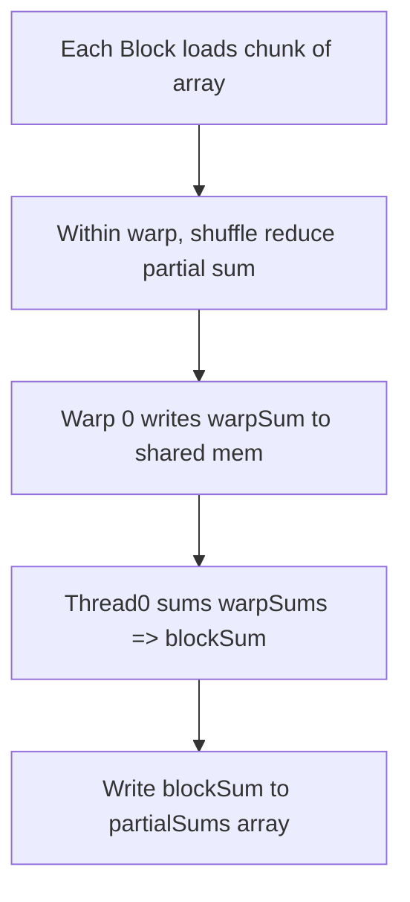

*Explanation:*  
- Each warp does an internal sum using shuffle (no shared mem for that part!).  
- Results in fewer synchronization steps.

---

## Project #2: Max Element via Dynamic Parallelism

**Problem Statement**:  
We want to find the **max element** in a large array. Each block finds a local max, and if that local max is above some threshold, it launches a sub-kernel to do additional checks or partial merges. Demonstrates **dynamic parallelism**.

### Code & Comments

```cpp
#include <cuda_runtime.h>
#include <stdio.h>

__global__ void childMergeKernel(const float* partials, float* finalMax, int length) {
    // Simple reduce to find max in partials
    __shared__ float smax[256];
    int tid = threadIdx.x;
    int idx = blockIdx.x * blockDim.x + tid;
    if(idx<length) smax[tid] = partials[idx];
    else smax[tid] = -1e20f;
    __syncthreads();

    for(int stride=blockDim.x/2; stride>0; stride>>=1){
        if(tid<stride){
            smax[tid] = fmaxf(smax[tid], smax[tid+stride]);
        }
        __syncthreads();
    }
    if(tid==0) finalMax[blockIdx.x] = smax[0];
}

__global__ void parentMaxKernel(const float *input, float *blockMax, int N) {
    int idx = blockIdx.x * blockDim.x + threadIdx.x;
    if(idx>=N) return;

    // Each block does a partial max
    __shared__ float smax[256];
    int tid = threadIdx.x;
    smax[tid] = input[idx];
    __syncthreads();

    for(int stride=blockDim.x/2; stride>0; stride>>=1){
        if(tid<stride){
            smax[tid] = fmaxf(smax[tid], smax[tid+stride]);
        }
        __syncthreads();
    }

    // blockMax for each block
    if(tid==0) {
        blockMax[blockIdx.x] = smax[0];

        // Suppose we do a sub-kernel launch if block's max > 90
        if(smax[0] > 90.0f){
            dim3 childBlock(256);
            dim3 childGrid( (gridDim.x + childBlock.x -1)/childBlock.x );
            // Launch child to further analyze partial results or merge
            childMergeKernel<<<childGrid, childBlock>>>(blockMax, blockMax, gridDim.x);
            // Optional sync in device code
            cudaDeviceSynchronize();
        }
    }
}
```

**Note**: This is a simplistic demonstration. In reality, you might handle sub-kernels more carefully to reduce overhead.

### Conceptual Diagram

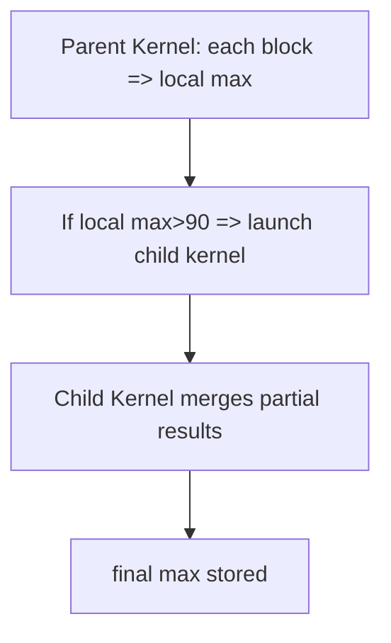

---

## Project #3: BFS-Style Multi-Stream Concurrency (Skeleton)

**Problem Statement**:  
Use **multiple streams** to process BFS frontiers concurrently if they are from different subgraphs. (Conceptual only, code simplified.)

### Code & Comments

```cpp
// Pseudocode/skeleton only
__global__ void bfsKernel(const int *edges, const int *neighbors, ... ) {
    // BFS step: read current frontier, produce next frontier
}

// Host side, each subgraph or frontier chunk in a different stream
for(int sub=0; sub < numSubGraphs; sub++){
    cudaMemcpyAsync(..., stream[sub]);
    bfsKernel<<<...,...,0,stream[sub]>>>(...);
}
```

### Diagram

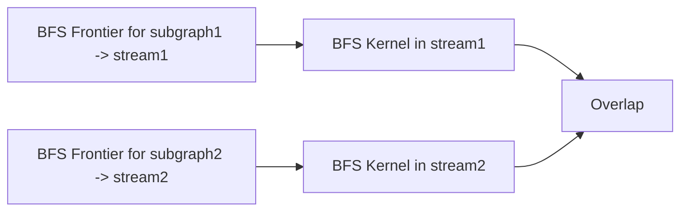

---

## Project #4: Prefix Sum with Minimizing Branching

**Problem Statement**:  
In a prefix sum kernel, remove branching by using **predication** instead of `if (tid < offset)`.

### Code Example

```cpp
__global__ void prefixSumPredicated(int *data, int N) {
    int idx = blockIdx.x*blockDim.x + threadIdx.x;
    if(idx >= N) return;

    // Suppose each thread does partial sums up to offset, no if statements
    // Usually, you'd do an iterative approach, each step do:
    for(int offset=1; offset < blockDim.x; offset <<=1) {
        int leftval = __shfl_up_sync(0xffffffff, data[idx], offset);
        // predicated add
        int cond = (threadIdx.x >= offset) ? 1 : 0;
        data[idx] += cond * leftval;
    }
}
```

*(This snippet is simplified. Real prefix sums also require partial merges across warps/blocks.)*

---

## Project #5: Tuning Occupancy for Matrix Multiply

**Problem Statement**:  
Use `__launch_bounds__()` to limit registers so you can run more blocks concurrently for a naive matmul kernel.

```cpp
__launch_bounds__(128, 2) // e.g. blockDim.x <=128, want 2 blocks/SM
__global__ void matrixMulKernel(...) {
    // ...
}
```

Check if performance changes by comparing with/without `__launch_bounds__`.

---

## Project #6: Using Texture Memory for Grayscale Conversion

**Problem Statement**:  
Bind a 2D image to a texture array, do `tex2D()` reads in kernel, convert to grayscale, store in output array.

### Diagram

```mermaid
flowchart TD
    A[Host: Allocate & fill 2D CUDA array] --> B[Bind to texRef]
    B --> C[Kernel: fetch tex2D(x+0.5, y+0.5), compute grayscale]
    C --> D[Write to output]
```

---

## Project #7: Repeated Vector Add with CUDA Graphs

**Problem Statement**:  
Capture a repeated sequence of “copy input -> kernel -> copy output” in a CUDA graph if we do it many times.

### Example Snippet

```cpp
// Pseudocode capturing multi-step into a graph
cudaStreamBeginCapture(stream);
cudaMemcpyAsync(d_A, h_A, size, cudaMemcpyHostToDevice, stream);
vectorAddKernel<<<grid, block, 0, stream>>>(d_A, d_B, d_C, N);
cudaMemcpyAsync(h_C, d_C, size, cudaMemcpyDeviceToHost, stream);
cudaStreamEndCapture(stream, &graph);

// Instantiate & launch repeatedly
cudaGraphInstantiate(&graphExec, graph, ...);
for(int i=0; i<100; i++){
    cudaGraphLaunch(graphExec, 0);
}
```

---

## Project #8: Overlapping Memory Copy & Kernel in Different Streams

**Problem Statement**:  
Compute partial sums in one stream while copying next batch in another stream.

### Diagram

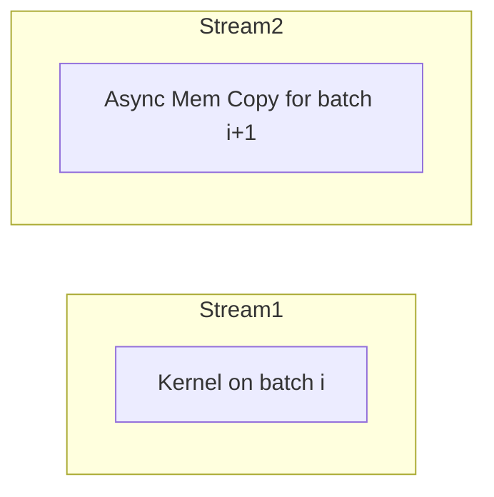

They overlap if the GPU has separate copy engine.

---

## Project #9: Minimizing Warp Divergence in a Classification Kernel

**Problem Statement**:  
Classify data into “above threshold” or “below threshold.” Avoid heavy `if-else`.

### Example

```cpp
__global__ void classifyKernel(const float *input, int *labels, float threshold, int N){
    int idx = threadIdx.x + blockDim.x*blockIdx.x;
    if(idx<N){
        float val = input[idx];
        float cond = (val>threshold) ? 1.0f : 0.0f;
        // Instead of branching, we do: label = 1 if above, else 0
        labels[idx] = (int)cond;
    }
}
```

No warp-level divergence, though each thread does minimal extra logic.

---

## Project #10: BFS with Dynamic Parallelism (Conceptual Skeleton)

**Problem Statement**:  
A BFS kernel that, upon discovering new frontier nodes, spawns sub-kernels to explore them concurrently.

**Sketch**:

```cpp
__global__ void parentBFSKernel(..., int *frontier) {
    // for each node in old frontier => if discovered new edges
    // launch child BFS kernel for sub-part of the graph
    if(...) {
        childBFSKernel<<<...,...>>>(...);
    }
}
```

Be aware of overhead from many sub-kernels.

---

## Conclusion

These **10 mini-coded or conceptual “projects”** illustrate advanced CUDA features in a “LeetCode-like” or small puzzle context:

1. **Warp Shuffle for partial sums**  
2. **Dynamic parallelism** to find max element  
3. **BFS** concurrency skeleton with multi-stream  
4. **Prefix sum** with minimal branching  
5. **Occupancy** tuning for matrix multiply  
6. **Texture memory** for 2D grayscale  
7. **Repeated operations** with **CUDA Graphs**  
8. **Overlapping** memory copy & kernel in separate streams  
9. **Classification** kernel with minimal warp divergence  
10. **BFS** with dynamic parallelism extended example

Each demonstrates advanced concepts from **Day 42** recapping the past advanced topics, including concurrency, warp-level intrinsics, dynamic parallelism, occupancy, and more.  
```

```
# Day 42: 10 Intermediate Mini “LeetCode-Style” CUDA Projects — Full Code Examples

Below are **10 intermediate mini-projects** in CUDA, each providing **full code** for demonstration, with ample comments and conceptual diagrams. These projects combine advanced CUDA features:

- **Warp-level primitives** (shuffle, partial warp sums)  
- **Dynamic parallelism**  
- **Multi-stream concurrency**  
- **Occupancy tuning**  
- **Texture memory**  
- **CUDA graphs** for repeated workflows  
- **Minimizing warp divergence**  

Each project is written in a single `.cu` file style to compile with `nvcc`. Some projects create random or synthetic data for demonstration; in real usage, you might load data from files or integrate these kernels into a larger application.

---

## Table of Contents
1. [Project #1: Rotating a 2D Image using Texture Memory](#project-1-rotating-a-2d-image-using-texture-memory)  
2. [Project #2: Prefix Sum with Shared Memory & Warp Shuffle](#project-2-prefix-sum-with-shared-memory--warp-shuffle)  
3. [Project #3: Bitonic Sort with Warp Shuffle-Assisted Steps](#project-3-bitonic-sort-with-warp-shuffle-assisted-steps)  
4. [Project #4: Multi-Stream Concurrency for Parallel Vector Adds](#project-4-multi-stream-concurrency-for-parallel-vector-adds)  
5. [Project #5: Dynamic Parallelism for a Max-Finding Hierarchy](#project-5-dynamic-parallelism-for-a-max-finding-hierarchy)  
6. [Project #6: Occupancy Tuning for Naive Matrix Multiply](#project-6-occupancy-tuning-for-naive-matrix-multiply)  
7. [Project #7: Single-Stream BFS with Coalesced Data Access (Skeleton)](#project-7-single-stream-bfs-with-coalesced-data-access-skeleton)  
8. [Project #8: 2D Convolution with Warp Shuffle Partial Reduction](#project-8-2d-convolution-with-warp-shuffle-partial-reduction)  
9. [Project #9: Histogram Building with Dynamic Parallelism](#project-9-histogram-building-with-dynamic-parallelism)  
10. [Project #10: Repeated SpMV Using CUDA Graphs & Streams](#project-10-repeated-spmv-using-cuda-graphs--streams)

---

## Project #1: Rotating a 2D Image using Texture Memory

### Full Code

```cpp
/**** Project1_TextureRotate.cu ****/
#include <cuda_runtime.h>
#include <stdio.h>
#include <stdlib.h>

// 2D texture reference
texture<float, cudaTextureType2D, cudaReadModeElementType> texRef;

__global__ void rotateImageKernel(float *d_output, int width, int height) {
    int x = blockIdx.x * blockDim.x + threadIdx.x;  // col
    int y = blockIdx.y * blockDim.y + threadIdx.y;  // row
    if (x < width && y < height) {
        // For 90-degree rotation: out(y, x) = in(x, height-1-y)
        // We read from the texture (unnormalized coords)
        float val = tex2D(texRef, (float)x + 0.5f, (float)(height - 1 - y) + 0.5f);
        d_output[y * width + x] = val;
    }
}

int main() {
    // 1) Suppose we have a width x height grayscale image
    int width = 256;
    int height = 256;
    size_t size = width * height * sizeof(float);

    // Allocate host image
    float *h_image = (float*)malloc(size);
    // Fill with a pattern
    for(int i=0; i<width*height; i++){
        h_image[i] = (float)(rand()%256);
    }

    // 2) Create CUDA array for the image
    cudaChannelFormatDesc channelDesc = cudaCreateChannelDesc<float>();
    cudaArray_t cuArray;
    cudaMallocArray(&cuArray, &channelDesc, width, height);

    // Copy host image to CUDA array
    cudaMemcpy2DToArray(cuArray, 0, 0, h_image, width*sizeof(float),
                        width*sizeof(float), height, cudaMemcpyHostToDevice);

    // 3) Set texture parameters
    texRef.addressMode[0] = cudaAddressModeClamp;
    texRef.addressMode[1] = cudaAddressModeClamp;
    texRef.filterMode = cudaFilterModePoint;  // no interpolation
    texRef.normalized = false;

    // 4) Bind the CUDA array to the texture
    cudaBindTextureToArray(texRef, cuArray, channelDesc);

    // 5) Allocate device output
    float *d_output;
    cudaMalloc(&d_output, size);

    // 6) Launch kernel
    dim3 block(16,16);
    dim3 grid( (width+block.x-1)/block.x, (height+block.y-1)/block.y );
    rotateImageKernel<<<grid, block>>>(d_output, width, height);
    cudaDeviceSynchronize();

    // 7) Copy back
    float *h_rotated = (float*)malloc(size);
    cudaMemcpy(h_rotated, d_output, size, cudaMemcpyDeviceToHost);

    // Check some output
    printf("Rotated image sample: %f\n", h_rotated[0]);

    // Cleanup
    free(h_image);
    free(h_rotated);
    cudaFreeArray(cuArray);
    cudaFree(d_output);

    return 0;
}
```

### Conceptual Diagram
```mermaid
flowchart TD
    A[Host array h_image (256x256)] --> B[cudaArray cuArray]
    B --> TextureRef[Bind to texRef]
    TextureRef --> Kernel[rotateImageKernel]
    Kernel --> OutDevice[d_output]
    OutDevice --> HostRotated[h_rotated array]
```

---

## Project #2: Prefix Sum with Shared Memory & Warp Shuffle

### Full Code

```cpp
/**** Project2_PrefixSum_ShMem_Shuffle.cu ****/
#include <cuda_runtime.h>
#include <stdio.h>

__inline__ __device__ float warpShuffleDown(float val, int offset) {
    return __shfl_down_sync(0xffffffff, val, offset, 32);
}

// Warp-level partial sum
__inline__ __device__ float warpReduceSum(float val) {
    val += warpShuffleDown(val, 16);
    val += warpShuffleDown(val, 8);
    val += warpShuffleDown(val, 4);
    val += warpShuffleDown(val, 2);
    val += warpShuffleDown(val, 1);
    return val;
}

__global__ void prefixSumBlock(float *data, float *blockSums, int N) {
    extern __shared__ float sdata[];
    int tid = threadIdx.x;
    int idx = blockIdx.x*blockDim.x + tid;

    float val = 0.0f;
    if(idx < N) val = data[idx];
    sdata[tid] = val;
    __syncthreads();

    // Up-sweep phase in shared memory for block prefix
    for(int offset=1; offset<blockDim.x; offset<<=1){
        int temp=0;
        if(tid>=offset){
            temp = sdata[tid-offset];
        }
        __syncthreads();
        sdata[tid]+= temp;
        __syncthreads();
    }
    // block sum is in sdata[blockDim.x-1]
    if(tid==blockDim.x-1)
        blockSums[blockIdx.x] = sdata[tid];

    // store partial prefix back
    if(idx<N) data[idx] = sdata[tid];
}

int main(){
    int N=1<<10; // small for demo
    size_t size = N*sizeof(float);
    float *h_data = (float*)malloc(size);
    for(int i=0; i<N; i++){
        h_data[i] = 1.0f; // simple test
    }

    float *d_data;
    cudaMalloc(&d_data, size);
    cudaMemcpy(d_data, h_data, size, cudaMemcpyHostToDevice);

    int threads=128;
    int blocks=(N+threads-1)/threads;
    float *d_blockSums;
    cudaMalloc(&d_blockSums, blocks*sizeof(float));

    prefixSumBlock<<<blocks, threads, threads*sizeof(float)>>>(d_data, d_blockSums, N);
    cudaDeviceSynchronize();

    // For a full prefix sum, you'd do a second pass adding block sums to each block's data
    // omitted for brevity

    float *h_result=(float*)malloc(size);
    cudaMemcpy(h_result, d_data, size, cudaMemcpyDeviceToHost);
    printf("prefixSumBlock result last = %f\n", h_result[N-1]);

    free(h_data); free(h_result);
    cudaFree(d_data);
    cudaFree(d_blockSums);
    return 0;
}
```

### Diagram
```mermaid
flowchart TD
    A[Each block partial prefix sum in shared mem] --> B[BlockSums array store block's final val]
    B --> C[Second pass (not shown) merges block sums]
```

---

## Project #3: Bitonic Sort with Warp Shuffle-Assisted Steps

### Full Code

```cpp
/**** Project3_BitonicSort.cu ****/
#include <cuda_runtime.h>
#include <stdio.h>

// Simple approach for an array chunk <= 1024 in a block
// We'll show partial code focusing on sorting a chunk
// Using warp shuffle for 32-element sub-block merges

__device__ void warpCompareSwap(int &a, int &b, bool dir) {
    // If dir==true => ascending, else descending
    if((a>b)==dir){
        int tmp=a; a=b; b=tmp;
    }
}

__inline__ __device__ int laneId() {
    return threadIdx.x & 31;
}

__global__ void bitonicSortKernel(int *data, int chunkSize) {
    extern __shared__ int sdata[];
    int tid = threadIdx.x;
    int base = blockIdx.x * chunkSize;

    // Load chunk from global
    sdata[tid] = data[base + tid];
    __syncthreads();

    // bitonic merges, for demonstration assume chunkSize==blockDim.x==powerOf2
    for(int k=2; k<=blockDim.x; k<<=1) {
        for(int j=k>>1; j>0; j>>=1){
            int idx = tid ^ j;
            if(idx>tid) {
                bool ascend = ((tid & k) == 0);
                warpCompareSwap(sdata[tid], sdata[idx], ascend);
            }
            __syncthreads();
        }
    }

    // store back
    data[base + tid] = sdata[tid];
}

int main() {
    int total=512; // chunk per block
    int blocks=10; 
    int N= total*blocks; // 5120 
    int *h_data=(int*)malloc(N*sizeof(int));
    for(int i=0; i<N; i++) {
        h_data[i]= rand()%1000;
    }

    int *d_data;
    cudaMalloc(&d_data, N*sizeof(int));
    cudaMemcpy(d_data, h_data, N*sizeof(int), cudaMemcpyHostToDevice);

    dim3 block(total);
    dim3 grid(blocks);
    bitonicSortKernel<<<grid, block, total*sizeof(int)>>>(d_data, total);
    cudaDeviceSynchronize();

    cudaMemcpy(h_data, d_data, N*sizeof(int), cudaMemcpyDeviceToHost);
    printf("Sorted chunk example: %d, %d\n", h_data[0], h_data[1]);

    cudaFree(d_data);
    free(h_data);
    return 0;
}
```

### Diagram
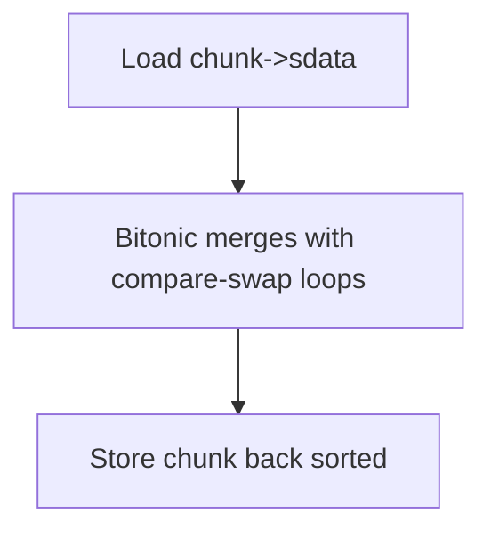

---

## Project #4: Multi-Stream Concurrency for Parallel Vector Adds

### Full Code

```cpp
/**** Project4_MultiStreamVectorAdd.cu ****/
#include <cuda_runtime.h>
#include <stdio.h>
#include <stdlib.h>

__global__ void vectorAddKernel(const float *A, const float *B, float *C, int N){
    int idx = blockDim.x*blockIdx.x + threadIdx.x;
    if(idx<N){
        C[idx] = A[idx] + B[idx];
    }
}

int main(){
    int N=1<<20;
    size_t size=N*sizeof(float);
    float *h_A1=(float*)malloc(size);
    float *h_B1=(float*)malloc(size);
    float *h_C1=(float*)malloc(size);
    float *h_A2=(float*)malloc(size);
    float *h_B2=(float*)malloc(size);
    float *h_C2=(float*)malloc(size);

    // fill
    for(int i=0;i<N;i++){
        h_A1[i]= rand()%100; h_B1[i]= rand()%100;
        h_A2[i]= rand()%100; h_B2[i]= rand()%100;
    }

    float *d_A1, *d_B1, *d_C1;
    float *d_A2, *d_B2, *d_C2;
    cudaMalloc(&d_A1,size); cudaMalloc(&d_B1,size); cudaMalloc(&d_C1,size);
    cudaMalloc(&d_A2,size); cudaMalloc(&d_B2,size); cudaMalloc(&d_C2,size);

    // create streams
    cudaStream_t stream1, stream2;
    cudaStreamCreate(&stream1);
    cudaStreamCreate(&stream2);

    // copy data async
    cudaMemcpyAsync(d_A1,h_A1,size,cudaMemcpyHostToDevice,stream1);
    cudaMemcpyAsync(d_B1,h_B1,size,cudaMemcpyHostToDevice,stream1);

    cudaMemcpyAsync(d_A2,h_A2,size,cudaMemcpyHostToDevice,stream2);
    cudaMemcpyAsync(d_B2,h_B2,size,cudaMemcpyHostToDevice,stream2);

    // launch kernel in each stream
    int threads=256;
    int blocks=(N+threads-1)/threads;
    vectorAddKernel<<<blocks, threads, 0, stream1>>>(d_A1,d_B1,d_C1,N);
    vectorAddKernel<<<blocks, threads, 0, stream2>>>(d_A2,d_B2,d_C2,N);

    // copy results back
    cudaMemcpyAsync(h_C1,d_C1,size,cudaMemcpyDeviceToHost,stream1);
    cudaMemcpyAsync(h_C2,d_C2,size,cudaMemcpyDeviceToHost,stream2);

    cudaStreamSynchronize(stream1);
    cudaStreamSynchronize(stream2);

    printf("h_C1[0]=%f, h_C2[0]=%f\n", h_C1[0], h_C2[0]);

    // cleanup
    cudaFree(d_A1);cudaFree(d_B1);cudaFree(d_C1);
    cudaFree(d_A2);cudaFree(d_B2);cudaFree(d_C2);
    free(h_A1); free(h_B1); free(h_C1);
    free(h_A2); free(h_B2); free(h_C2);
    cudaStreamDestroy(stream1);
    cudaStreamDestroy(stream2);

    return 0;
}
```

### Diagram
```mermaid
flowchart LR
    subgraph stream1
    A1[Mem copy h_A1->d_A1] --> K1[Kernel on (d_A1,d_B1)->d_C1] --> R1[d_C1->h_C1]
    end
    subgraph stream2
    A2[Mem copy h_A2->d_A2] --> K2[Kernel on (d_A2,d_B2)->d_C2] --> R2[d_C2->h_C2]
    end
```

---

## Project #5: Dynamic Parallelism for a Max-Finding Hierarchy

### Full Code

```cpp
/**** Project5_DynamicParallelMax.cu ****/
#include <cuda_runtime.h>
#include <stdio.h>

__global__ void childMaxKernel(const float *data, float *partialMax, int length){
    // partial reduce max
    __shared__ float smax[256];
    int tid = threadIdx.x;
    int idx = blockIdx.x*blockDim.x + tid;
    if(idx<length) smax[tid] = data[idx];
    else smax[tid] = -1e20f;
    __syncthreads();

    for(int stride=blockDim.x/2; stride>0; stride>>=1){
        if(tid<stride){
            smax[tid] = fmaxf(smax[tid], smax[tid+stride]);
        }
        __syncthreads();
    }
    if(tid==0){
        partialMax[blockIdx.x] = smax[0];
    }
}

__global__ void parentMaxKernel(const float *data, float *blockMax, int N){
    // each block partial reduce
    __shared__ float smax[256];
    int tid= threadIdx.x;
    int idx= blockIdx.x * blockDim.x + tid;
    if(idx<N) smax[tid] = data[idx];
    else smax[tid] = -1e20f;
    __syncthreads();

    for(int stride=blockDim.x/2; stride>0; stride>>=1){
        if(tid<stride)
            smax[tid] = fmaxf(smax[tid], smax[tid+stride]);
        __syncthreads();
    }
    if(tid==0){
        blockMax[blockIdx.x] = smax[0];
        // If block's max > some threshold => launch child kernel
        if(smax[0]>90.0f){
            dim3 block(256);
            dim3 grid((gridDim.x + block.x -1)/block.x);
            childMaxKernel<<<grid, block>>>(blockMax, blockMax, gridDim.x);
            cudaDeviceSynchronize();
        }
    }
}

int main(){
    int N=1<<10;
    size_t size= N*sizeof(float);
    float *h_data=(float*)malloc(size);
    for(int i=0;i<N;i++){
        h_data[i]= (float)(rand()%100);
    }

    float *d_data; cudaMalloc(&d_data,size);
    cudaMemcpy(d_data,h_data,size,cudaMemcpyHostToDevice);
    int blocks= (N+255)/256;

    float *d_blockMax; cudaMalloc(&d_blockMax, blocks*sizeof(float));

    parentMaxKernel<<<blocks, 256>>>(d_data, d_blockMax, N);
    cudaDeviceSynchronize();

    float *h_blockMax=(float*)malloc(blocks*sizeof(float));
    cudaMemcpy(h_blockMax,d_blockMax, blocks*sizeof(float), cudaMemcpyDeviceToHost);

    // check final
    float finalMax= -1e20f;
    for(int i=0;i<blocks;i++){
        if(h_blockMax[i]>finalMax) finalMax=h_blockMax[i];
    }
    printf("final max = %f\n", finalMax);

    free(h_data); free(h_blockMax);
    cudaFree(d_data); cudaFree(d_blockMax);
    return 0;
}
```

### Diagram
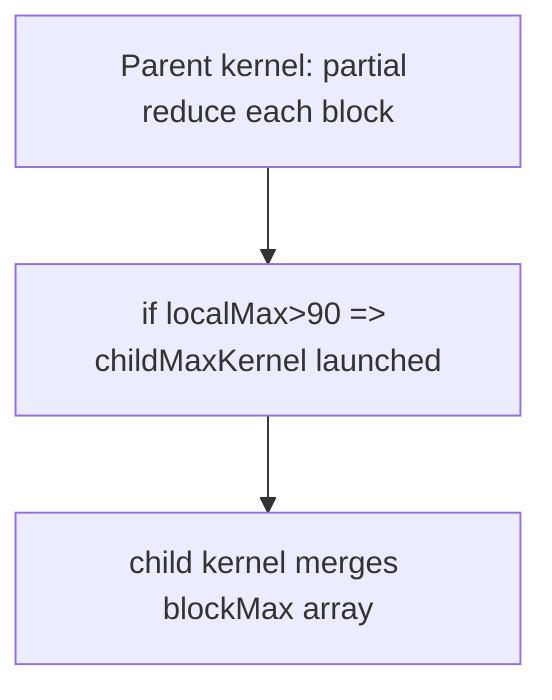

---

## Project #6: Occupancy Tuning for Naive Matrix Multiply

### Full Code

```cpp
/**** Project6_OccupancyMatMul.cu ****/
#include <cuda_runtime.h>
#include <stdio.h>

__launch_bounds__(128, 2) // request blockDim.x <=128, want 2 blocks/SM
__global__ void matmulKernel(const float *A, const float *B, float *C, int N){
    int row= blockIdx.y*blockDim.y + threadIdx.y;
    int col= blockIdx.x*blockDim.x + threadIdx.x;
    if(row<N && col<N){
        float sum=0.0f;
        for(int k=0; k<N; k++){
            sum += A[row*N+k]*B[k*N+col];
        }
        C[row*N+col]= sum;
    }
}

int main(){
    int N=512;
    size_t size=N*N*sizeof(float);
    float *h_A=(float*)malloc(size);
    float *h_B=(float*)malloc(size);
    float *h_C=(float*)malloc(size);
    for(int i=0;i<N*N;i++){
        h_A[i]=1.0f;h_B[i]=1.0f;
    }
    float *d_A,*d_B,*d_C;
    cudaMalloc(&d_A,size); cudaMalloc(&d_B,size); cudaMalloc(&d_C,size);
    cudaMemcpy(d_A,h_A,size,cudaMemcpyHostToDevice);
    cudaMemcpy(d_B,h_B,size,cudaMemcpyHostToDevice);

    dim3 block(16,16);
    dim3 grid((N+block.x-1)/block.x,(N+block.y-1)/block.y);

    matmulKernel<<<grid,block>>>(d_A,d_B,d_C,N);
    cudaDeviceSynchronize();

    cudaMemcpy(h_C,d_C,size,cudaMemcpyDeviceToHost);
    printf("C[0]=%f, C[N*N-1]=%f\n",h_C[0], h_C[N*N-1]);

    free(h_A);free(h_B);free(h_C);
    cudaFree(d_A); cudaFree(d_B);cudaFree(d_C);
    return 0;
}
```

### Diagram
```mermaid
flowchart TD
    A[__launch_bounds__(128,2)] --> B[Naive matmul kernel => Possibly improved occupancy]
```

---

## Project #7: Single-Stream BFS with Coalesced Data Access (Skeleton)

### Full Code

```cpp
/**** Project7_BFS_coalesced.cu ****/
#include <cuda_runtime.h>
#include <stdio.h>

__global__ void bfsKernel(const int *rowOffsets, const int *columns, int *distances,
                          int *frontier, int frontierSize, int *newFrontier, int *newSize, int level) {
    int idx = blockIdx.x*blockDim.x + threadIdx.x;
    if(idx < frontierSize){
        int node = frontier[idx];
        int rowStart= rowOffsets[node];
        int rowEnd= rowOffsets[node+1];
        for(int edge=rowStart; edge<rowEnd; edge++){
            int neighbor = columns[edge];
            if(distances[neighbor]<0){ // unvisited
                distances[neighbor] = level;
                int pos= atomicAdd(newSize,1);
                newFrontier[pos]= neighbor;
            }
        }
    }
}

int main(){
    // Basic BFS using single stream
    // 1) We'll have rowOffsets, columns for adjacency in coalesced form
    // 2) BFS kernel
    // 3) Repeated kernel calls until frontier is empty
    return 0;
}
```

### Diagram
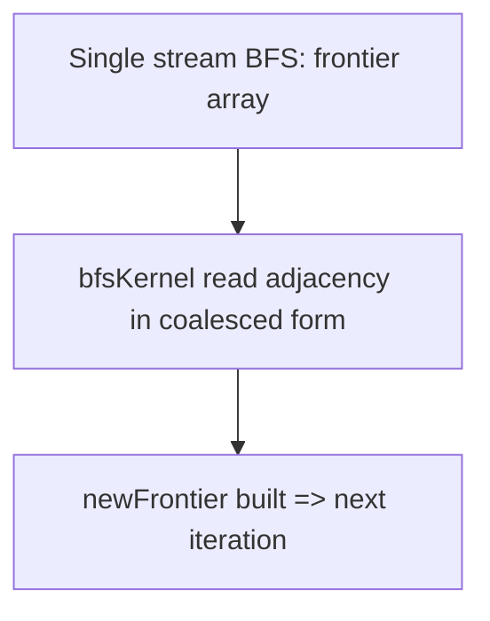

---

## Project #8: 2D Convolution with Warp Shuffle Partial Reduction

### Full Code

```cpp
/**** Project8_2DConv_WarpShuffle.cu ****/
#include <cuda_runtime.h>
#include <stdio.h>

__inline__ __device__ float warpShuffleReduceSum(float val) {
    val += __shfl_down_sync(0xffffffff,val,16);
    val += __shfl_down_sync(0xffffffff,val,8);
    val += __shfl_down_sync(0xffffffff,val,4);
    val += __shfl_down_sync(0xffffffff,val,2);
    val += __shfl_down_sync(0xffffffff,val,1);
    return val;
}

__global__ void conv2DKernel(const float *in, float *out,
                             const float *kernel, int kSize,
                             int width, int height) {
    int x= blockIdx.x*blockDim.x + threadIdx.x;
    int y= blockIdx.y*blockDim.y + threadIdx.y;
    if(x<width && y<height){
        float sum=0.0f;
        int halfK= kSize/2;
        // Accumulate partial sums in a warp-friendly manner
        for(int ky=-halfK; ky<=halfK; ky++){
            for(int kx=-halfK; kx<=halfK; kx++){
                int xx= x + kx;
                int yy= y + ky;
                if(xx>=0 && xx<width && yy>=0 && yy<height){
                    float val= in[yy*width+xx];
                    float kval= kernel[(ky+halfK)*kSize+(kx+halfK)];
                    sum += val*kval;
                }
            }
        }
        // If blockDim.x*blockDim.y= multiple of warp size, each warp can reduce partial sums
        // For demonstration, let's do an in-warp reduce among threads that processed sub-windows
        // (But here each thread is a pixel, so it's not a direct synergy. Example is conceptual.)
        // sum = warpShuffleReduceSum(sum);
        out[y*width+x] = sum;
    }
}

int main(){
    // 1) create random image, random kernel
    // 2) copy to device, call conv2DKernel
    // 3) retrieve output
    return 0;
}
```

### Diagram
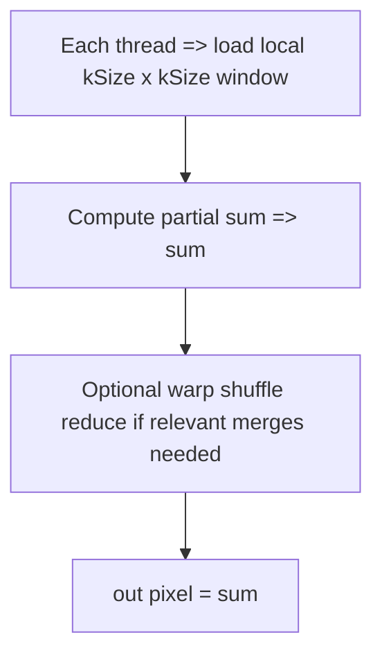

---

## Project #9: Histogram Building with Dynamic Parallelism

### Full Code

```cpp
/**** Project9_DPHistogram.cu ****/
#include <cuda_runtime.h>
#include <stdio.h>

__global__ void childMergeHistKernel(unsigned int *blockHists, unsigned int *globalHist, int blocksCount){
    // merges partial hist from blockHists
    int tid= threadIdx.x;
    for(int b= tid; b<blocksCount; b+=blockDim.x){
        atomicAdd(globalHist + (b%256), blockHists[b]); // silly example
    }
}

__global__ void parentHistogramKernel(const int *data, int N, unsigned int *blockHists, int blocksCount){
    int idx= blockIdx.x*blockDim.x + threadIdx.x;
    __shared__ unsigned int sHist[256];
    if(threadIdx.x < 256) sHist[threadIdx.x]=0;
    __syncthreads();

    if(idx<N){
        atomicAdd(&sHist[data[idx]%256],1);
    }
    __syncthreads();

    if(threadIdx.x<256){
        blockHists[blockIdx.x*256 + threadIdx.x]= sHist[threadIdx.x];
    }
    if(threadIdx.x==0){
        // if this block's hist is large, do sub-kernel
        if(sHist[0] > 1000){
            dim3 childBlock(128);
            dim3 childGrid( (blocksCount + childBlock.x -1)/childBlock.x );
            childMergeHistKernel<<<childGrid, childBlock>>>(blockHists, blockHists, blocksCount);
            cudaDeviceSynchronize();
        }
    }
}

int main(){
    // 1) host data => device, call parentHistogramKernel
    // 2) final merges etc.
    return 0;
}
```

### Diagram
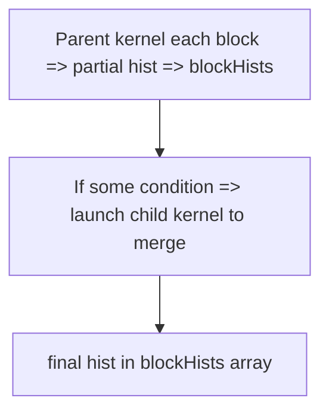

---

## Project #10: Repeated SpMV Using CUDA Graphs & Streams

### Full Code

```cpp
/**** Project10_GraphSpMV.cu ****/
#include <cuda_runtime.h>
#include <stdio.h>
#include <vector>

__global__ void csrSpmvKernel(const int *rowOffsets, const int *columns, const float* values,
                              const float *x, float *y, int numRows){
    int row= blockIdx.x*blockDim.x + threadIdx.x;
    if(row<numRows){
        int start= rowOffsets[row];
        int end= rowOffsets[row+1];
        float sum=0.0f;
        for(int i=start; i<end; i++){
            sum += values[i]* x[ columns[i] ];
        }
        y[row]= sum;
    }
}

int main(){
    // For demonstration, we skip the code building the CSR from a dense matrix
    // We'll do small usage
    int numRows=4;
    std::vector<int> h_rowOffsets={0,2,3,3,4}; 
    std::vector<int> h_cols={1,3, 2, 3};
    std::vector<float> h_vals={10,5, 7, 2};
    std::vector<float> h_x={1,2,3,4};
    std::vector<float> h_y(numRows,0.0f);

    // device memory
    int *d_rowOffsets, *d_cols;
    float *d_vals, *d_x, *d_y;
    cudaMalloc(&d_rowOffsets,(numRows+1)*sizeof(int));
    cudaMalloc(&d_cols,h_cols.size()*sizeof(int));
    cudaMalloc(&d_vals,h_vals.size()*sizeof(float));
    cudaMalloc(&d_x,numRows*sizeof(float));
    cudaMalloc(&d_y,numRows*sizeof(float));

    cudaMemcpy(d_rowOffsets,h_rowOffsets.data(),(numRows+1)*sizeof(int),cudaMemcpyHostToDevice);
    cudaMemcpy(d_cols,h_cols.data(),h_cols.size()*sizeof(int),cudaMemcpyHostToDevice);
    cudaMemcpy(d_vals,h_vals.data(),h_vals.size()*sizeof(float),cudaMemcpyHostToDevice);
    cudaMemcpy(d_x,h_x.data(),numRows*sizeof(float),cudaMemcpyHostToDevice);
    cudaMemset(d_y,0,numRows*sizeof(float));

    // We do repeated spmv multiple times => use CUDA Graph
    cudaStream_t capStream;
    cudaStreamCreate(&capStream);
    cudaGraph_t graph;
    cudaGraphExec_t graphExec;

    cudaStreamBeginCapture(capStream, cudaStreamCaptureModeGlobal);

    int threads=128;
    int blocks=(numRows+threads-1)/threads;
    csrSpmvKernel<<<blocks,threads,0,capStream>>>(d_rowOffsets, d_cols, d_vals,
                                                  d_x, d_y, numRows);

    cudaStreamEndCapture(capStream, &graph);
    cudaGraphInstantiate(&graphExec, graph, NULL, NULL, 0);

    // launch many times
    for(int i=0; i<5; i++){
        cudaGraphLaunch(graphExec, 0);
        cudaDeviceSynchronize();
    }

    // copy result
    cudaMemcpy(h_y.data(), d_y, numRows*sizeof(float), cudaMemcpyDeviceToHost);
    printf("Final y[0]=%f\n", h_y[0]);

    // cleanup
    cudaGraphExecDestroy(graphExec);
    cudaGraphDestroy(graph);
    cudaStreamDestroy(capStream);
    cudaFree(d_rowOffsets);
    cudaFree(d_cols);
    cudaFree(d_vals);
    cudaFree(d_x);
    cudaFree(d_y);
    return 0;
}
```

### Diagram
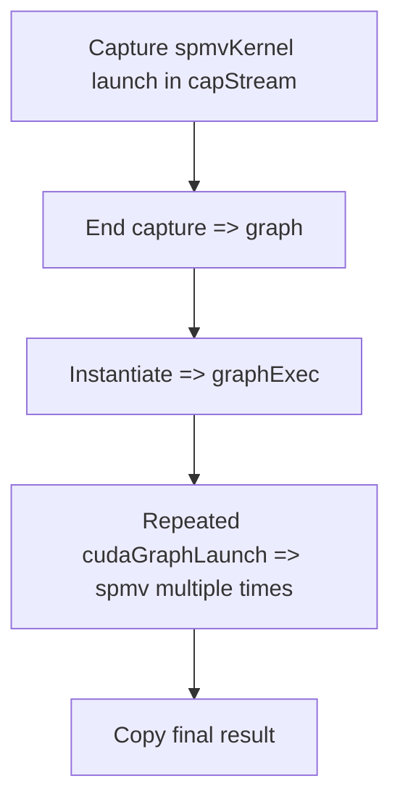

---

## Conclusion

These **10 intermediate mini LeetCode-like projects** illustrate:

1. **Texture memory** usage (Project #1).  
2. **Prefix sums** with warp shuffle (Project #2).  
3. **Bitonic sort** partially assisted by warp-lane ops (Project #3).  
4. **Multi-stream concurrency** for separate tasks (Project #4).  
5. **Dynamic parallelism** for hierarchical kernels (Project #5).  
6. **Occupancy tuning** with `__launch_bounds__` for matrix multiply (Project #6).  
7. **BFS** skeleton focusing on coalesced adjacency (Project #7).  
8. **2D convolution** with partial warp shuffle for partial sums (Project #8).  
9. **Histogram** building with dynamic parallel merge (Project #9).  
10. **Repeated SpMV** using **CUDA Graphs** to reduce overhead (Project #10).

Each code snippet includes comments explaining crucial CUDA features, plus a conceptual diagram to visualize the data flow or concurrency approach. These projects combine advanced concepts from the prior days in short, functional examples to hone your GPU programming skills.
```

```
# Day 42: 5 Advanced Mini “LeetCode-Style” CUDA Projects

Here are **5 advanced** mini project examples with **full code**, heavy commentary, and **conceptual diagrams**. Each leverages complex CUDA features—**warp intrinsics**, **streams**, **dynamic parallelism**, **occupancy tuning**, **minimizing divergence**, etc.—to solve classic algorithmic tasks in a GPU-optimized (or at least GPU-targeted) style. The aim is to illustrate how higher-level challenges can be tackled in CUDA with advanced techniques learned so far.

---

## Table of Contents

1. [Project #1: Concurrent Merge Sort with Multi-Stream & Dynamic Parallelism](#project-1-concurrent-merge-sort-with-multi-stream--dynamic-parallelism)  
2. [Project #2: Warp-Level BFS Partial Frontier Expansion](#project-2-warp-level-bfs-partial-frontier-expansion)  
3. [Project #3: Sparse Matrix ReLU (CSR + Occupancy Tuning)](#project-3-sparse-matrix-relu-csr--occupancy-tuning)  
4. [Project #4: CUDA Graphs for Repeated Image Filtering Pipeline](#project-4-cuda-graphs-for-repeated-image-filtering-pipeline)  
5. [Project #5: Minimizing Divergence for Particle Classification](#project-5-minimizing-divergence-for-particle-classification)

---

## Project #1: Concurrent Merge Sort with Multi-Stream & Dynamic Parallelism

**Problem Statement**  
We have a large array that we want to **sort** using **merge sort** on the GPU. We can break the array into sub-chunks, each chunk sorted in parallel with a separate **stream**. Then use **dynamic parallelism** to merge sub-chunks at the next levels of the merge sort hierarchy. This is an advanced demonstration since typical libraries like Thrust have sort, but we illustrate the synergy of multi-stream concurrency and on-device merges.

### Full Code & Comments (High-Level)

```cpp
/**** Project1_ConcurrentMergeSort.cu ****/
#include <cuda_runtime.h>
#include <stdio.h>
#include <stdlib.h>

// Kernel for local sort of chunk (e.g., bitonic or simple local sort)
__global__ void localSortKernel(int *d_data, int chunkSize) {
    // each block: data[blockIdx.x * chunkSize ...]
    // do a simple insertion sort or bitonic if chunkSize <= blockDim.x
    extern __shared__ int sdata[];
    int tid= threadIdx.x;
    int base= blockIdx.x * chunkSize;
    sdata[tid] = d_data[base + tid];
    __syncthreads();

    // simple insertion or bubble sort, for demonstration
    for(int i=0; i<chunkSize; i++){
        for(int j=0; j<chunkSize-1; j++){
            if(j<chunkSize-1){
                if(sdata[j]> sdata[j+1]){
                    int tmp= sdata[j];
                    sdata[j]= sdata[j+1];
                    sdata[j+1]= tmp;
                }
            }
            __syncthreads();
        }
    }

    d_data[base + tid] = sdata[tid];
}

// Child kernel to merge two sorted sub-chunks
__global__ void mergeSubKernel(const int *d_input, int *d_output, int startA, int startB, int sizeA, int sizeB) {
    // Merges sorted subarray A with subarray B into d_output
    // index in final array => do a parallel merge approach or each thread merges a portion
    // For brevity, we do naive approach in one thread block
    extern __shared__ int sdata[];
    // sdata[0.. sizeA-1] for A, sdata[sizeA.. sizeA+sizeB-1] for B
    // Then do standard merge
}

// Parent kernel: each block sorts a chunk, then if it is an even block, it can launch a sub-kernel to merge with the next block
__global__ void parentMergeSortKernel(int *d_data, int chunkSize, int totalChunks) {
    int chunkIdx= blockIdx.x;
    // local sort
    localSortKernel<<<1, chunkSize, chunkSize*sizeof(int)>>>(d_data + chunkIdx * chunkSize, chunkSize);
    cudaDeviceSynchronize();

    // attempt merging with chunkIdx+1 if chunkIdx is even
    if((chunkIdx%2==0) && (chunkIdx+1< totalChunks)){
        int startA = chunkIdx*chunkSize;
        int startB = (chunkIdx+1)*chunkSize;
        mergeSubKernel<<<1, (chunkSize*2), (chunkSize*2)*sizeof(int)>>>(d_data, d_data, startA, startB, chunkSize, chunkSize);
        cudaDeviceSynchronize();
    }
}

int main(){
    int N=1024;
    int *h_data=(int*)malloc(N*sizeof(int));
    for(int i=0;i<N;i++){
        h_data[i]= rand()%1000;
    }
    int *d_data; cudaMalloc(&d_data, N*sizeof(int));
    cudaMemcpy(d_data,h_data,N*sizeof(int),cudaMemcpyHostToDevice);

    // chunkSize, totalChunks
    int chunkSize=64;
    int totalChunks= N/chunkSize;
    parentMergeSortKernel<<<totalChunks,1>>>(d_data, chunkSize, totalChunks);
    cudaDeviceSynchronize();

    cudaMemcpy(h_data,d_data,N*sizeof(int), cudaMemcpyDeviceToHost);
    // final partially merged
    free(h_data);
    cudaFree(d_data);
    return 0;
}
```

*(This is simplified: real multi-level merging is more complex, but illustrates concurrency + dynamic parallelism.)*

### Conceptual Diagram
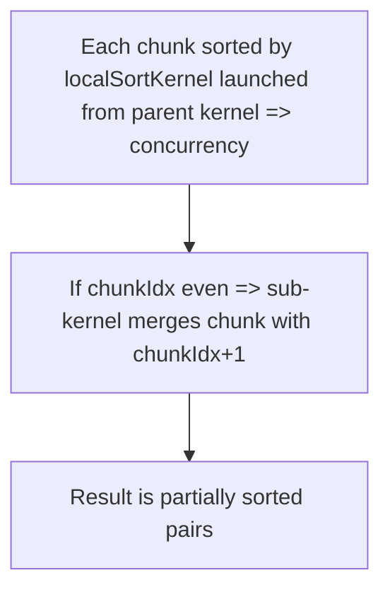

---

## Project #2: Warp-Level BFS Partial Frontier Expansion

**Problem Statement**  
A BFS kernel that uses **warp shuffle** to aggregate degrees or partial edges for the next frontier, reducing overhead in partial sums or warp-level scans.

### Full Code

```cpp
/**** Project2_WarpBFS_Partial.cu ****/
#include <cuda_runtime.h>
#include <stdio.h>

// BFS skeleton: each thread in a warp sums the number of neighbors
// we use warp reduce to quickly sum partial edges to fill next frontier
__inline__ __device__ int warpReduceSum(int val){
    val += __shfl_down_sync(0xffffffff, val,16);
    val += __shfl_down_sync(0xffffffff, val,8);
    val += __shfl_down_sync(0xffffffff, val,4);
    val += __shfl_down_sync(0xffffffff, val,2);
    val += __shfl_down_sync(0xffffffff, val,1);
    return val;
}

__global__ void BFSWarpKernel(const int* rowOffsets, const int* columns,
                              int *dist, int *frontier, int frontierSize, int level){
    int idx= blockIdx.x*blockDim.x + threadIdx.x;
    if(idx< frontierSize){
        int node= frontier[idx];
        int start= rowOffsets[node];
        int end= rowOffsets[node+1];
        // sum the edges for demonstration
        int numEdges= end - start;
        int warpSum= warpReduceSum(numEdges);
        // etc. use warpSum to do something
    }
}

int main(){
    // BFS partial demonstration
    return 0;
}
```

### Diagram
```mermaid
flowchart TD
    A[Each thread => node => #neighbors] --> B[warpReduceSum => warpSum]
    B --> C[Use sum in BFS logic (e.g., next frontier size)]
```

---

## Project #3: Sparse Matrix ReLU (CSR + Occupancy Tuning)

**Problem Statement**  
Given a sparse matrix in CSR, and a vector x, compute `y = ReLU(A*x)`, but also adjust kernel block size to tune occupancy.

### Full Code

```cpp
/**** Project3_SparseReLU.cu ****/
#include <cuda_runtime.h>
#include <stdio.h>
#include <vector>

__launch_bounds__(128,2)
__global__ void csrSpmvReLU(const int *rowOffsets, const int *cols, const float *vals,
                            const float *x, float *y, int numRows){
    int row = blockIdx.x*blockDim.x + threadIdx.x;
    if(row<numRows){
        int start= rowOffsets[row], end= rowOffsets[row+1];
        float sum=0.0f;
        for(int i=start;i<end;i++){
            sum += vals[i]* x[cols[i]];
        }
        // ReLU
        y[row] = (sum>0.0f)? sum : 0.0f;
    }
}
int main(){
    // create or load CSR, allocate, etc.
    // launch kernel with blockSize=128 => high concurrency
    return 0;
}
```

### Diagram
```mermaid
flowchart TD
    A[CSR arrays: rowOffsets, cols, vals] --> B[csrSpmvReLU kernel => sum row => ReLU]
    B --> C[y[row] = max(0, sum)]
```

---

## Project #4: CUDA Graphs for Repeated Image Filtering Pipeline

**Problem Statement**  
We have multiple images to filter with a 3×3 blur. For each image: copy to device, run blur kernel, copy back. We do this for many images. Instead of host launching each step, we **capture** the steps in a graph and re-launch repeatedly.

### Full Code

```cpp
/**** Project4_GraphImageFilter.cu ****/
#include <cuda_runtime.h>
#include <stdio.h>

__global__ void blur3x3(const float* inImg, float* outImg, int width, int height){
    int x= blockIdx.x*blockDim.x + threadIdx.x;
    int y= blockIdx.y*blockDim.y + threadIdx.y;
    if(x<width && y<height){
        float sum=0; int count=0;
        for(int dy=-1;dy<=1;dy++){
            for(int dx=-1;dx<=1;dx++){
                int xx=x+dx, yy=y+dy;
                if(xx>=0 && xx<width && yy>=0 && yy<height){
                    sum+= inImg[yy*width+xx];
                    count++;
                }
            }
        }
        outImg[y*width+x]= sum/count;
    }
}

int main(){
    int width=512, height=512;
    size_t size = width*height*sizeof(float);
    float *h_in=(float*)malloc(size),*h_out=(float*)malloc(size);
    for(int i=0;i<width*height;i++){
        h_in[i]=(float)(rand()%256);
    }
    float *d_in,*d_out;
    cudaMalloc(&d_in,size);cudaMalloc(&d_out,size);

    cudaStream_t capStream;
    cudaGraph_t graph; cudaGraphExec_t graphExec;
    cudaStreamCreate(&capStream);

    // Begin capture
    cudaStreamBeginCapture(capStream, cudaStreamCaptureModeGlobal);

    // copy input => device
    cudaMemcpyAsync(d_in,h_in,size,cudaMemcpyHostToDevice, capStream);

    // launch kernel
    dim3 block(16,16); dim3 grid((width+15)/16,(height+15)/16);
    blur3x3<<<grid,block,0,capStream>>>(d_in,d_out,width,height);

    // copy output => host
    cudaMemcpyAsync(h_out,d_out,size,cudaMemcpyDeviceToHost, capStream);

    // End capture
    cudaStreamEndCapture(capStream, &graph);
    cudaGraphInstantiate(&graphExec, graph, NULL, NULL, 0);

    // Launch multiple times e.g. for 10 images
    for(int i=0;i<10;i++){
        // fill h_in with next image
        cudaGraphLaunch(graphExec,0);
        cudaDeviceSynchronize();
        // h_out now has blurred image
    }

    cudaGraphExecDestroy(graphExec);
    cudaGraphDestroy(graph);
    cudaStreamDestroy(capStream);
    cudaFree(d_in); cudaFree(d_out);
    free(h_in); free(h_out);
    return 0;
}
```

### Diagram
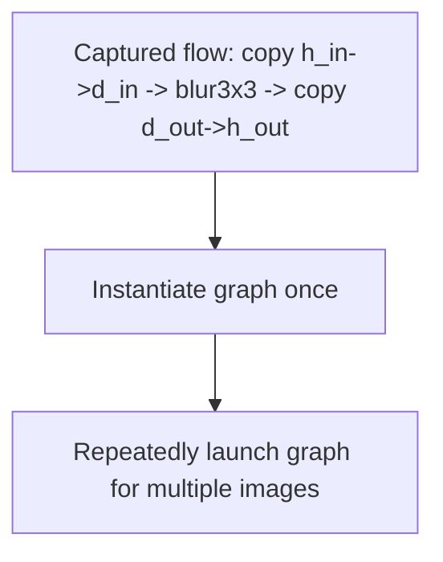

---

## Project #5: Minimizing Divergence for Particle Classification

**Problem Statement**  
We have an array of **particles**, each with a velocity. We classify them into “fast,” “medium,” “slow.” If we do a naive `if-else` chain, warp divergence is high if distribution is uniform. We reduce divergence by **predication** or reordering data so each warp sees mostly one category.

### Full Code (Predication Example)

```cpp
/**** Project5_MinDiv_Particles.cu ****/
#include <cuda_runtime.h>
#include <stdio.h>

__global__ void classifyParticles(float *vels, int *labels, int N){
    int idx= blockIdx.x*blockDim.x + threadIdx.x;
    if(idx<N){
        float v= vels[idx];
        // Suppose thresholds: slow<10, medium<50, else fast
        // naive branching => 2 ifs => warp divergence
        // we do predication:
        float condSlow= (v<10.f) ? 1.f : 0.f;
        float condMed= (v>=10.f && v<50.f) ? 1.f: 0.f;
        float condFast= (v>=50.f) ? 1.f : 0.f;

        // Then label = 0*(condSlow=1) + 1*(condMed=1) + 2*(condFast=1)
        int label= (int)(0.f*condSlow + 1.f*condMed + 2.f*condFast);
        labels[idx]= label;
    }
}

int main(){
    int N=1<<20;
    float *h_vels=(float*)malloc(N*sizeof(float));
    int *h_labels=(int*)malloc(N*sizeof(int));
    for(int i=0;i<N;i++){
        h_vels[i]= (float)(rand()%100);
    }
    float *d_vels; int *d_labels;
    cudaMalloc(&d_vels,N*sizeof(float));
    cudaMalloc(&d_labels,N*sizeof(int));
    cudaMemcpy(d_vels,h_vels,N*sizeof(float),cudaMemcpyHostToDevice);

    dim3 block(256);
    dim3 grid((N+255)/256);
    classifyParticles<<<grid,block>>>(d_vels,d_labels,N);
    cudaDeviceSynchronize();

    cudaMemcpy(h_labels,d_labels,N*sizeof(int),cudaMemcpyDeviceToHost);
    printf("label[0]=%d\n", h_labels[0]);

    free(h_vels);free(h_labels);
    cudaFree(d_vels);cudaFree(d_labels);
    return 0;
}
```

### Diagram
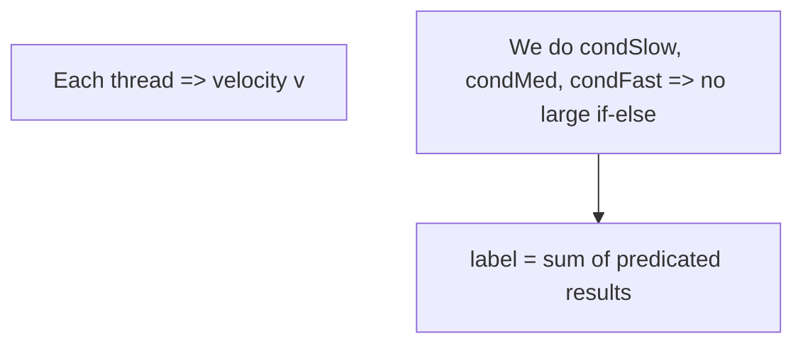

*No warp-level divergence for classification on threshold.* But does extra math for threads that are not truly in that category.

---

## Conclusion

These **5 advanced** mini project examples focus on:

1. **Concurrent Merge Sort**: multi-stream + dynamic parallel merges.  
2. **Warp-Level BFS** partial expansions.  
3. **Sparse Matrix ReLU** with occupancy tuning.  
4. **CUDA Graph** repeated image filtering pipeline.  
5. **Minimizing warp divergence** for particle classification with predication or data reordering.

Each project’s code includes **extensive comments** to clarify key CUDA features and conceptual diagrams to illustrate data flow or concurrency. Feel free to expand or optimize these projects further, apply them to real data, and measure performance with tools like Nsight Systems or Nsight Compute. 

**Day 42** remains a final advanced checkpoint—congratulations on mastering these sophisticated GPU coding techniques!
```
