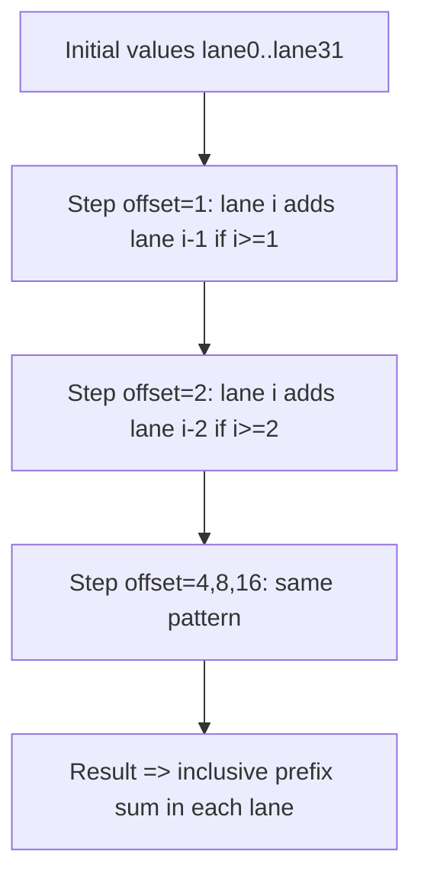

# Day 44: Advanced Warp Intrinsics (Scan, etc.)

**Objective:**  
Explore **warp-wide prefix sums (scan)** using `__shfl_down_sync()` or other shuffle intrinsics to avoid shared memory overhead for small or warp-local scans. We will demonstrate a warp-level prefix sum function, explain how to handle lane alignment, and discuss pitfalls such as **misaligned warp sync** that can lead to incorrect partial sums.

**Key References**:
- [CUDA C Programming Guide – “Shuffle and Cooperative Groups”](https://docs.nvidia.com/cuda/cuda-c-programming-guide/index.html#shuffle-intrinsics)
- [“Programming Massively Parallel Processors” by Kirk & Hwu – Warp Intrinsics and Cooperative Groups Chapter]  
- [NVIDIA Developer Blog – Warp Intrinsics for Scans & Reductions](https://developer.nvidia.com/blog/)

---

## Table of Contents

1. [Overview](#1-overview)  
2. [Warp Shuffle for Prefix Sums](#2-warp-shuffle-for-prefix-sums)  
   - [a) Basic Idea](#a-basic-idea)  
   - [b) Handling Lane IDs](#b-handling-lane-ids)  
3. [Implementation Example: Warp-Wide Prefix Sum](#3-implementation-example-warp-wide-prefix-sum)  
   - [a) Code Snippet & Explanation](#a-code-snippet--explanation)  
   - [b) Observing Misalignment Pitfalls](#b-observing-misalignment-pitfalls)  
4. [Conceptual Diagrams](#4-conceptual-diagrams)  
5. [Common Pitfalls & Best Practices](#5-common-pitfalls--best-practices)  
6. [References & Further Reading](#6-references--further-reading)  
7. [Conclusion](#7-conclusion)  
8. [Next Steps](#8-next-steps)

---

## 1. Overview

**Warp intrinsics** like `__shfl_xor_sync`, `__shfl_down_sync`, etc. allow threads within the same warp (32 threads) to exchange data efficiently via register cross-access. **Prefix sums** (or scans) can be computed within a warp without using shared memory, saving memory bandwidth and synchronization. However, correct usage requires careful handling of:

- **Lane ID** (0..31).
- **Offsets** in partial sum steps.
- Ensuring no divergence or partially active lanes if you rely on a full warp.

---

## 2. Warp Shuffle for Prefix Sums

### a) Basic Idea

A typical parallel prefix sum merges partial sums by shifting data from lane `i - offset` to lane `i` and adding it:

1. **Step 1**: each lane has an initial value.  
2. **Step 2**: `offset = 1`; lane `i` adds the value from lane `i - 1`.  
3. **Step 3**: `offset = 2`; lane `i` adds the partial sum from lane `i - 2`.  
4. **Continuing** doubling offset => 4, 8, 16 … up to 32.  

### b) Handling Lane IDs

Because a warp is 32 threads, lane ID 0..31. If `i - offset` is negative, the lane gets 0 or must skip. Typically, you do:

```cpp
float left = (laneId >= offset) ? __shfl_up_sync(mask, val, offset, 32) : 0.0f;
val += left;
```

This uses **predication** to ensure lanes below the offset do not fetch invalid data.

---

## 3. Implementation Example: Warp-Wide Prefix Sum

### a) Code Snippet & Explanation

```cpp
/**** day44_WarpPrefixSum.cu ****/
#include <cuda_runtime.h>
#include <stdio.h>

// warp-wide prefix sum function
__inline__ __device__ float warpPrefixSum(float val) {
    unsigned mask = 0xffffffff; // assume full warp active
    // 5 steps for 32-lane warp
    for(int offset = 1; offset < 32; offset <<= 1) {
        float n = __shfl_up_sync(mask, val, offset, 32);
        // only add if laneId >= offset
        int laneId = threadIdx.x & 31; 
        if(laneId >= offset) {
            val += n;
        }
    }
    return val; 
}

__global__ void warpScanKernel(const float *input, float *output, int N) {
    int idx = blockIdx.x * blockDim.x + threadIdx.x;
    if(idx < N){
        float val = input[idx];
        float prefix = warpPrefixSum(val);
        output[idx] = prefix;
    }
}

int main(){
    int N=64; // small for demonstration
    size_t size=N*sizeof(float);
    float *h_in=(float*)malloc(size);
    float *h_out=(float*)malloc(size);
    for(int i=0;i<N;i++){
        h_in[i]=1.0f; // simple test
    }

    float *d_in, *d_out;
    cudaMalloc(&d_in,size);
    cudaMalloc(&d_out,size);
    cudaMemcpy(d_in,h_in,size,cudaMemcpyHostToDevice);

    dim3 block(32); // exactly one warp
    dim3 grid((N+31)/32);
    warpScanKernel<<<grid,block>>>(d_in,d_out,N);
    cudaDeviceSynchronize();

    cudaMemcpy(h_out,d_out,size,cudaMemcpyDeviceToHost);
    for(int i=0;i<32;i++){
        printf("h_out[%d]=%f ", i, h_out[i]);
    }
    printf("\n");

    free(h_in);free(h_out);
    cudaFree(d_in); cudaFree(d_out);
    return 0;
}
```

**Explanation**:
- We assume **one warp** per block with `blockDim.x=32`.  
- The `warpPrefixSum()` function does an **up-sweep** style approach using `__shfl_up_sync`.  
- If `laneId<offset`, skip adding to avoid reading from negative lane.  
- This yields an **inclusive** prefix sum within the warp.

### b) Observing Misalignment Pitfalls

- If the blockDim.x != 32 or some lanes aren’t active, you might get **misaligned warp sync** or partial results.  
- Another pitfall arises if you have multiple warps in the same block—**prefix sums** are not warp-wide stable unless each warp is handled independently.

---

## 4. Conceptual Diagrams

### Diagram 1: Warp-Wide Scan Steps



**Explanation**:  
Each lane accumulates partial sums from smaller-lane indices in a doubling manner. 

---

## 5. Common Pitfalls & Best Practices

1. **Active Lanes**  
   - Ensure all 32 lanes are **active** to avoid partial warp usage or pass the correct mask to `__shfl_*_sync`.  
2. **Multiple Warps**  
   - If you have `blockDim.x>32`, handle each warp’s prefix sum separately. Possibly store partial sums in shared memory for further merges.  
3. **Exclusive vs. Inclusive**  
   - The code snippet shows an inclusive scan. An exclusive scan requires a small tweak (shifting values in some step).  
4. **Performance**  
   - Warp-level prefix sums are very fast for up to 32 elements. For larger arrays, you combine block-level or warp-level partial sums in shared memory, or do multi-pass approach.  
5. **Divergence**  
   - The `if (laneId >= offset)` can cause minimal branching within the warp, but it’s typically a uniform condition except at boundary lanes. Overheads are small compared to typical shared memory approaches.

---

## 6. References & Further Reading

1. **CUDA C Programming Guide – Shuffle and Cooperative Groups**  
   [Shuffle Documentation](https://docs.nvidia.com/cuda/cuda-c-programming-guide/index.html#shuffle)  
2. **NVIDIA Developer Blog** – Articles on warp shuffle prefix sums & BFS usage.  
3. **“Programming Massively Parallel Processors” by Kirk & Hwu** – Warp-level parallel scan examples.

---

## 7. Conclusion

**Day 44**: 
- We introduced **advanced warp intrinsics** for **scan** (prefix sums) within a warp using `__shfl_down_sync()`.  
- We explained how each lane merges partial sums from earlier lanes in iterative steps.  
- We highlighted the risk of **misaligned warp sync** or partial lane usage leading to incorrect sums if some lanes are inactive or the blockDim.x is not 32.  
- The warp-based approach can drastically reduce shared memory usage and synchronization overhead for small partial sums.

**Key Takeaway**:  
**Warp-level prefix sums** are extremely fast and minimal overhead, but must be used with caution: ensuring full warp usage and correct offsets. For larger arrays, typically you combine warp prefix sums within blocks or across multiple blocks in multi-stage scans.

---

## 8. Next Steps

1. **Integrate** warp prefix sums into a larger block-level or multi-block prefix sum approach.  
2. **Compare** performance of warp shuffle scans vs. shared-memory scans in your real workloads.  
3. **Extend** to other warp-level operations (like warp-level BFS expansions or partial reduce for matrix columns).  
4. **Optimize** further using concurrency if the array can be chunked among multiple warps/blocks.
```
