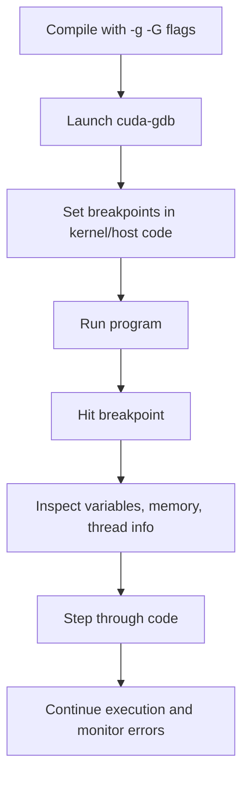

# Day 57: Robust Error Handling & Debugging

**Objective:**  
Day 57 focuses on establishing a robust framework for error handling and advanced debugging in CUDA applications. In GPU programming, errors can occur at many stages—memory allocation, kernel launches, asynchronous operations, and library calls. A robust error-handling system is essential for quickly identifying and fixing issues. Additionally, using tools like `cuda-gdb` for advanced debugging can help trace errors in device code, especially when release builds (optimized builds) hide errors if not properly checked.

**Key References:**  
- [CUDA Runtime Error Handling](https://docs.nvidia.com/cuda/cuda-runtime-api/group__CUDART__ERROR.html)  
- [cuda-gdb Documentation](https://docs.nvidia.com/cuda/cuda-gdb/index.html)  

---

## Table of Contents

1. [Overview](#1-overview)  
2. [Importance of Robust Error Handling](#2-importance-of-robust-error-handling)  
3. [Error Checking Macros](#3-error-checking-macros)  
   - [a) Macro Definitions](#a-macro-definitions)  
   - [b) Example Usage](#b-example-usage)  
4. [Advanced Debugging with cuda-gdb](#4-advanced-debugging-with-cuda-gdb)  
   - [a) Setup and Common Commands](#a-setup-and-common-commands)  
   - [b) Debugging Strategies in cuda-gdb](#b-debugging-strategies-in-cuda-gdb)  
5. [Pitfalls of Release Builds and How to Mitigate Them](#5-pitfalls-of-release-builds-and-how-to-mitigate-them)  
6. [Mermaid Diagrams for Error Handling Flow](#6-mermaid-diagrams-for-error-handling-flow)  
7. [Conclusion and Next Steps](#7-conclusion-and-next-steps)

---

## 1. Overview

Robust error handling in CUDA involves checking the return status of every API call and kernel launch. This includes:
- **CUDA Runtime API calls:** e.g., `cudaMalloc()`, `cudaMemcpy()`, `cudaDeviceSynchronize()`.
- **Library calls:** e.g., cuBLAS, cuFFT, cuRAND routines.
- **Kernel launches:** Often errors occur asynchronously; hence, error checking after `cudaDeviceSynchronize()` is important.

Without robust error handling, subtle bugs may go unnoticed, particularly in release builds where aggressive optimization may inline or remove error-checking code.

---

## 2. Importance of Robust Error Handling

- **Early Detection:** Catch errors immediately where they occur.
- **Debugging Aid:** Detailed error messages help isolate the faulty component.
- **Preventing Undefined Behavior:** Unchecked errors can lead to undefined behavior and crash later in the execution.
- **Release Build Challenges:** Optimized (release) builds may inline or omit error-checking code; explicit error checking macros ensure errors are still caught even in high-performance builds.

---

## 3. Error Checking Macros

### a) Macro Definitions

A common practice is to wrap CUDA API calls with error-checking macros. For example:

```cpp
// Error checking macro for CUDA Runtime API calls
#define CUDA_CHECK(call)                                                        \
    do {                                                                        \
        cudaError_t err = call;                                                 \
        if (err != cudaSuccess) {                                               \
            fprintf(stderr, "CUDA Error at %s:%d - %s\n", __FILE__, __LINE__,    \
                    cudaGetErrorString(err));                                   \
            exit(EXIT_FAILURE);                                                 \
        }                                                                       \
    } while (0)

// Error checking macro for cuBLAS calls
#define CUBLAS_CHECK(call)                                                      \
    do {                                                                        \
        cublasStatus_t status = call;                                           \
        if (status != CUBLAS_STATUS_SUCCESS) {                                  \
            fprintf(stderr, "cuBLAS Error at %s:%d - code %d\n", __FILE__, __LINE__, status); \
            exit(EXIT_FAILURE);                                                 \
        }                                                                       \
    } while (0)

// Error checking macro for cuFFT calls
#define CUFFT_CHECK(call)                                                       \
    do {                                                                        \
        cufftResult status = call;                                              \
        if (status != CUFFT_SUCCESS) {                                          \
            fprintf(stderr, "cuFFT Error at %s:%d - code %d\n", __FILE__, __LINE__, status); \
            exit(EXIT_FAILURE);                                                 \
        }                                                                       \
    } while (0)
```

### b) Example Usage

Below is a simple CUDA kernel launch with error checking integrated:

```cpp
// File: error_handling_example.cu
#include <cuda_runtime.h>
#include <stdio.h>

// Use our CUDA_CHECK macro to verify each call
#define CUDA_CHECK(call)                                                        \
    do {                                                                        \
        cudaError_t err = call;                                                 \
        if (err != cudaSuccess) {                                               \
            fprintf(stderr, "CUDA Error at %s:%d - %s\n", __FILE__, __LINE__,    \
                    cudaGetErrorString(err));                                   \
            exit(EXIT_FAILURE);                                                 \
        }                                                                       \
    } while (0)

__global__ void sampleKernel(float *data, int N) {
    int idx = blockIdx.x * blockDim.x + threadIdx.x;
    if (idx < N) {
        data[idx] = data[idx] * 2.0f;
    }
}

int main() {
    int N = 1 << 20; // 1 million elements
    size_t size = N * sizeof(float);
    float *h_data = (float*)malloc(size);

    // Initialize host data
    for (int i = 0; i < N; i++) {
        h_data[i] = 1.0f;
    }

    float *d_data;
    CUDA_CHECK(cudaMalloc(&d_data, size));
    CUDA_CHECK(cudaMemcpy(d_data, h_data, size, cudaMemcpyHostToDevice));

    int threadsPerBlock = 256;
    int blocksPerGrid = (N + threadsPerBlock - 1) / threadsPerBlock;
    sampleKernel<<<blocksPerGrid, threadsPerBlock>>>(d_data, N);
    CUDA_CHECK(cudaGetLastError());
    CUDA_CHECK(cudaDeviceSynchronize());

    CUDA_CHECK(cudaMemcpy(h_data, d_data, size, cudaMemcpyDeviceToHost));
    printf("Sample output: h_data[0] = %f\n", h_data[0]);

    CUDA_CHECK(cudaFree(d_data));
    free(h_data);

    return 0;
}
```

**Explanation:**  
- We wrap every CUDA API call with `CUDA_CHECK()`, ensuring that if any call fails, we get a detailed error message along with file and line number.
- The kernel launch is followed by `cudaGetLastError()` and `cudaDeviceSynchronize()` to capture asynchronous errors.
- This approach ensures that errors are caught early, even in release builds.

---

## 4. Advanced Debugging with cuda-gdb

### a) Setup and Common Commands

**Setup:**  
- Compile your code with debug symbols using the `-g -G` flags:
  ```bash
  nvcc -g -G error_handling_example.cu -o error_handling_example
  ```
- Launch cuda-gdb:
  ```bash
  cuda-gdb ./error_handling_example
  ```

**Common Commands in cuda-gdb:**
- `break sampleKernel`: Set a breakpoint in the kernel.
- `run`: Start the program.
- `info threads`: List active threads.
- `thread <id>`: Switch to a specific thread.
- `print variable`: Print the value of a variable.
- `step`: Step into a function.
- `next`: Step over a function call.
- `continue`: Resume execution until the next breakpoint.

### b) Debugging Strategies in cuda-gdb

- **Conditional Breakpoints:**  
  Use conditions to break only on specific thread/block indices, e.g.,  
  ```bash
  break sampleKernel if threadIdx.x == 0 && blockIdx.x == 0
  ```
- **Inspecting Device Memory:**  
  Use `print` and memory read commands to inspect device variables.
- **Watch Variables:**  
  Set watches on variables to monitor their changes over iterations.
- **Understanding Concurrency:**  
  Use `info threads` to see how different threads are executing, especially when dealing with divergent paths.

---

## 5. Pitfalls of Release Builds and How to Mitigate Them

- **Optimization Hiding Errors:**  
  In release builds, aggressive optimizations may inline or remove error-checking code. Explicit error-checking macros (like those defined above) ensure errors are caught regardless of optimization level.
- **Asynchronous Errors:**  
  Kernel launches are asynchronous; always call `cudaDeviceSynchronize()` after kernel launches and check for errors using `cudaGetLastError()`.
- **Limited Debug Information:**  
  Compile with `-g -G` when debugging to include device debug symbols, but note that this may reduce performance.

---

## 6. Mermaid Diagrams for Error Handling Flow

### Diagram 1: CUDA Error Checking Flow

```mermaid
flowchart TD
    A[API Call (e.g., cudaMalloc)]
    B[Return Error Code]
    C{Is error code cudaSuccess?}
    D[Proceed with execution]
    E[Print error message with file and line info]
    F[Exit program]
    A --> B
    B --> C
    C -- Yes --> D
    C -- No --> E
    E --> F
```

**Explanation:**  
Every API call returns an error code. The macro checks the code; if it is not success, it prints an error message and exits. Otherwise, the program continues.

### Diagram 2: Debugging with cuda-gdb Flow



**Explanation:**  
This diagram shows the typical workflow in cuda-gdb: compile with debug symbols, launch cuda-gdb, set breakpoints, run, inspect and step through code, and continue execution to identify issues.

---

## 7. Conclusion and Next Steps

**Conclusion:**  
Robust error handling and debugging are critical in CUDA programming. By integrating error-checking macros into every CUDA API call and employing advanced debugging techniques with cuda-gdb, you can catch errors early and avoid issues that may only surface in release builds. This robust approach ensures that both development and production builds maintain reliability and performance.

**Next Steps:**
1. **Integrate error-checking macros** into all your CUDA projects.
2. **Practice using cuda-gdb** to step through device code and inspect thread states.
3. **Experiment with conditional breakpoints and watches** to monitor critical variables.
4. **Profile your release builds** with error checks enabled to ensure that optimizations do not mask errors.
5. **Review the CUDA Runtime Error Handling documentation** for further details on error codes and their meanings.

Happy debugging and robust CUDA coding!
```
