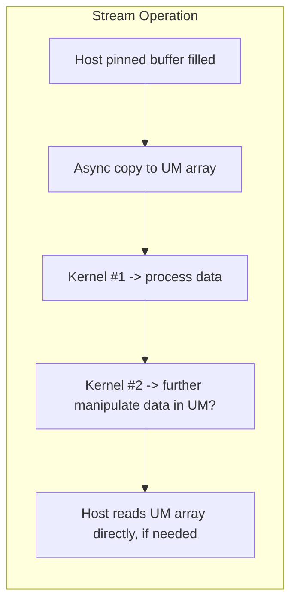

# Day 64: Pinned + Unified Memory Hybrid

In this lesson, we explore an approach that combines **pinned (page-locked) memory** for high-speed data transfers and **unified memory** for simplified memory management during intermediate computations. While pinned memory is essential for fast, asynchronous host-to-device transfers, unified memory automates data migration for intermediate results. We will also discuss the risks of overcomplicating the memory usage model and how to keep your design straightforward and effective.

---

## Table of Contents

1. [Overview](#1-overview)  
2. [Pinned Memory vs. Unified Memory](#2-pinned-memory-vs-unified-memory)  
3. [Hybrid Approach: Why Combine Them?](#3-hybrid-approach-why-combine-them)  
   - [a) Fast Input Streaming](#a-fast-input-streaming)  
   - [b) Automated Intermediate Storage](#b-automated-intermediate-storage)  
4. [Implementation Steps](#4-implementation-steps)  
   - [a) Host Pinned Buffers for Input](#a-host-pinned-buffers-for-input)  
   - [b) Unified Memory for Intermediate Arrays](#b-unified-memory-for-intermediate-arrays)  
   - [c) Kernel Computation & Data Flows](#c-kernel-computation--data-flows)  
5. [Code Example](#5-code-example)  
   - [Explanation & Comments](#explanation--comments)  
6. [Performance Considerations & Common Pitfalls](#6-performance-considerations--common-pitfalls)  
7. [Conceptual Diagrams](#7-conceptual-diagrams)  
8. [References & Further Reading](#8-references--further-reading)  
9. [Conclusion](#9-conclusion)  
10. [Next Steps](#10-next-steps)

---

## 1. Overview

Mixing **pinned (page-locked) memory** and **unified memory** can yield a best-of-both-worlds scenario:  
- **Pinned** (page-locked) host buffers allow **fast, asynchronous** transfers from the CPU to the GPU.  
- **Unified Memory** (UM) provides a **simplified management model**, letting the GPU move data on-demand between host and device for intermediate storage, reducing the need for manual `cudaMemcpy`.

However, if not carefully designed, the combined memory model can become confusing, introducing complexity with minimal gains. In this lesson, we show how to keep the design straightforward and highlight scenarios where a pinned-plus-unified approach excels.

---

## 2. Pinned Memory vs. Unified Memory

- **Pinned (Page-Locked) Memory**  
  - **Primary Benefit:** Faster host-device transfers, crucial for streaming large or real-time data.  
  - **Drawback:** Allocating large pinned buffers can impact system performance and reduce host memory availability.

- **Unified Memory (UM)**  
  - **Primary Benefit:** Automatic data migration, simpler code as arrays can be accessed from both host and device.  
  - **Drawback:** Can trigger page faults during kernel execution, which may cause performance unpredictability for large data sets.

Combining pinned memory for input streaming and unified memory for intermediate or final results can balance speed of transfers with ease of usage for intermediate arrays.

---

## 3. Hybrid Approach: Why Combine Them?

### a) Fast Input Streaming

- **Pinned Buffers on Host:**  
  The host can asynchronously send chunks of incoming data to the GPU while the device is concurrently processing the previous batch. This is ideal for real-time data feeds or HPC pipelines with high data throughput requirements.

### b) Automated Intermediate Storage

- **Unified Memory for Computation:**  
  Intermediate arrays in UM can be seamlessly accessed by both the host and the device without manually orchestrating `cudaMemcpy`. This can simplify algorithms that require partial host interaction between kernels.

---

## 4. Implementation Steps

### a) Host Pinned Buffers for Input

1. **Allocate** pinned (page-locked) host buffers with `cudaMallocHost()` or `cudaHostAlloc()`.  
2. **Asynchronously** transfer each data chunk to the GPU via `cudaMemcpyAsync()` into a UM or standard device buffer.

### b) Unified Memory for Intermediate Arrays

1. **Declare** arrays with `cudaMallocManaged()` for storing intermediate results.  
2. **Access** these arrays on both the CPU and GPU without explicit transfers. The driver handles on-demand migration.

### c) Kernel Computation & Data Flows

1. **Producer Kernel**: Possibly reading data from the pinned buffer or directly from a UM array.  
2. **Consumer Kernel**: Writes intermediate results to a UM array. The host can then read or modify these results without a manual copy.  
3. **Sync**: Ensure host does not read UM arrays until the kernel completes. Use events or stream synchronization calls if needed.

---

## 5. Code Example

```cpp
// File: pinned_unified_hybrid.cu
#include <cuda_runtime.h>
#include <stdio.h>
#include <stdlib.h>

// Kernel that processes data from pinned buffer, writing results to a unified memory array
__global__ void processKernel(const float *inputPinned, float *umIntermediate, int N) {
    int idx = blockIdx.x * blockDim.x + threadIdx.x;
    if (idx < N) {
        // Example computation: multiply by 2.5
        umIntermediate[idx] = inputPinned[idx] * 2.5f;
    }
}

int main() {
    int N = 1 << 20; // 1 million elements
    size_t size = N * sizeof(float);

    // Allocate pinned host memory for input streaming
    float *h_pinned;
    cudaMallocHost((void**)&h_pinned, size);

    // Initialize pinned buffer with some random data
    for (int i = 0; i < N; i++) {
        h_pinned[i] = (float)(rand() % 100);
    }

    // Allocate unified memory for intermediate results
    float *umIntermediate;
    cudaMallocManaged(&umIntermediate, size);

    // Transfer pinned data asynchronously to the device
    // (unified memory pointer can be used as device storage)
    cudaMemcpyAsync(umIntermediate, h_pinned, size, cudaMemcpyHostToDevice);

    // Define kernel launch parameters
    int threadsPerBlock = 256;
    int blocksPerGrid = (N + threadsPerBlock - 1) / threadsPerBlock;

    // Launch kernel in default stream
    processKernel<<<blocksPerGrid, threadsPerBlock>>>(umIntermediate, umIntermediate, N);
    cudaDeviceSynchronize();

    // The results are now in umIntermediate.
    // We can read it directly on the host without an explicit copy
    // because unified memory migrates data automatically.
    printf("First 10 results after processing:\n");
    for (int i = 0; i < 10; i++) {
        printf("%f ", umIntermediate[i]);
    }
    printf("\n");

    // Cleanup
    cudaFreeHost(h_pinned);
    cudaFree(umIntermediate);

    return 0;
}
```

### Explanation & Comments

1. **Pinned Buffer Allocation**: `cudaMallocHost` ensures page-locked memory for faster transfers.  
2. **Unified Memory Allocation**: `cudaMallocManaged` for intermediate array (`umIntermediate`).  
3. **Asynchronous Transfer**: `cudaMemcpyAsync` moves data from pinned host buffer to `umIntermediate`.  
4. **Kernel Launch**: Reads from (and writes to) the same `umIntermediate` pointer.  
5. **Access on Host**: Because `umIntermediate` is UM, no manual copy is required; the array is automatically available.

---

## 6. Performance Considerations & Common Pitfalls

- **Data Migration Overhead**:  
  Unified memory may incur page faults if the host attempts to read data before the GPU finishes. Ensure proper synchronization or device synchronization calls when needed.
  
- **Over-Complication**:  
  Managing pinned buffers, unified memory arrays, and concurrency can become confusing if not carefully documented. Keep your design as simple as possible.
  
- **Oversubscription**:  
  Allocating large pinned buffers can degrade host performance. Similarly, large UM allocations can trigger frequent page migrations if frequently accessed on the CPU.

- **Mixed Access Patterns**:  
  If the GPU modifies UM data repeatedly while the host occasionally reads it, watch out for repeated page migrations.

---

## 7. Conceptual Diagrams

### Diagram 1: Pinned + Unified Memory Data Flow

```mermaid
flowchart TD
    A[Host: Pinned Buffer (h_pinned)]
    B[Async Transfer -> GPU (unified array)]
    C[Kernel executes, reading/writing UM array]
    D[Host reads UM array after kernel completes (no explicit copy)]
    
    A --> B
    B --> C
    C --> D
```

**Explanation**:  
- Host uses pinned buffer for input streaming.  
- Data is transferred asynchronously to the unified array (`umIntermediate`).  
- Kernel reads and writes to the UM array.  
- Host automatically sees updated data in UM once the kernel completes.

### Diagram 2: Hybrid Workflow with Multiple Kernels



*Explanation*:  
Multiple kernels can operate on the unified memory array in sequence, with pinned memory handling the host input streaming.

---

## 8. References & Further Reading

- [Unified Memory Programming Guide](https://docs.nvidia.com/cuda/cuda-c-programming-guide/index.html#um-unified-memory)  
- [Pinned Memory and Transfer Optimization](https://docs.nvidia.com/cuda/cuda-c-best-practices-guide/index.html#pinned-memory)  
- [Nsight Systems for Analyzing Memory Transfers](https://developer.nvidia.com/nsight-systems)

---

## 9. Conclusion

Using **pinned memory for input streaming** and **unified memory for intermediate results** can simplify code and improve data transfer efficiency. However, combining these approaches requires careful orchestration—an overly complex design may generate confusion and degrade performance. By ensuring synchronized data flows and leveraging the strengths of each memory model, you can build robust pipelines that efficiently handle real-time data updates and on-demand host interactions.

---

## 10. Next Steps

1. **Extend to Multi-Stream Pipelines**:  
   Incorporate multiple streams for concurrency between input processing kernels and intermediate computations.
2. **Profile**:  
   Use Nsight Systems or Nsight Compute to measure whether pinned memory transfers or UM page migrations become bottlenecks.
3. **Experiment with Buffer Strategies**:  
   Try double buffering with pinned memory for continuous real-time data feeds, storing final results in UM for host usage.
4. **Scale**:  
   Investigate multi-GPU or cluster setups if the data set or feed grows beyond a single GPU’s capacity.
5. **Performance Tuning**:  
   Balance the size of pinned buffers and UM arrays to minimize overhead, ensuring you avoid oversubscription.

```
