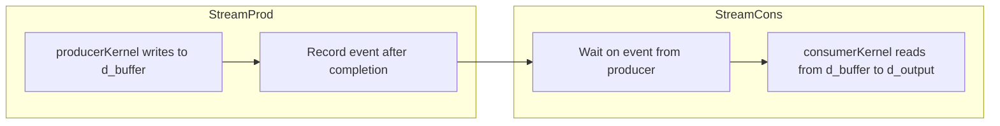
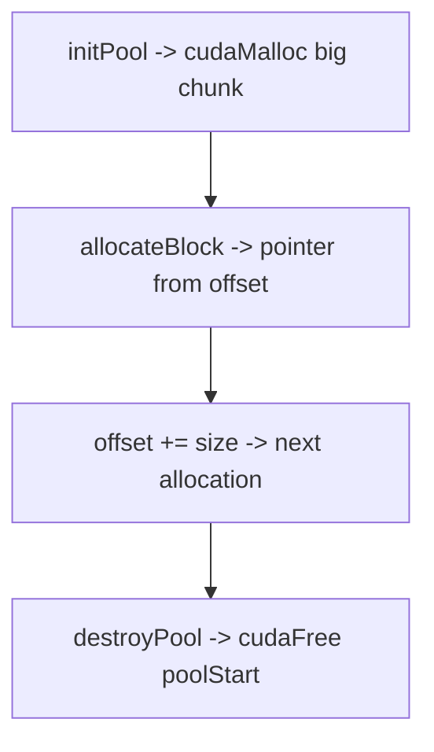
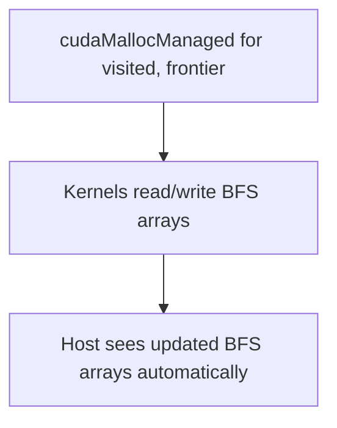
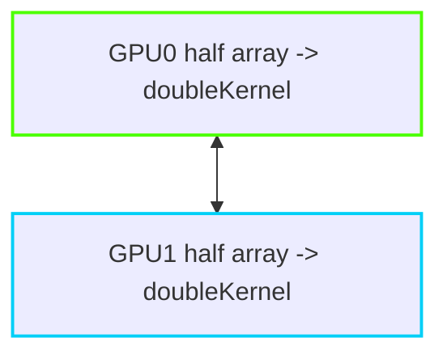
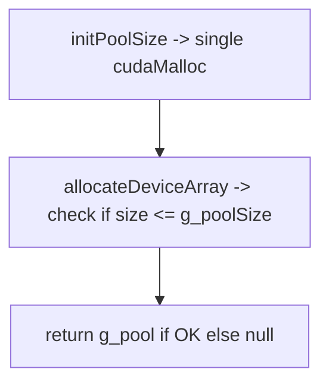
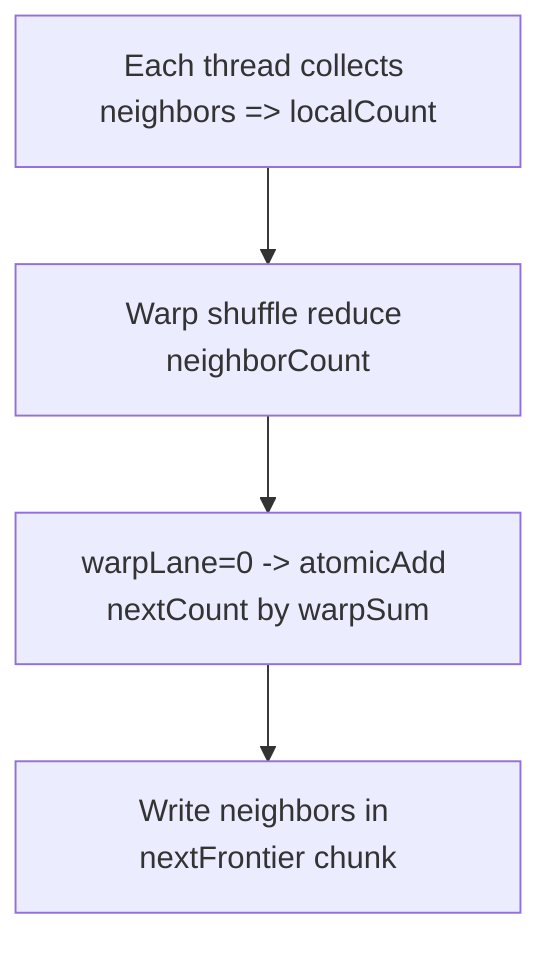
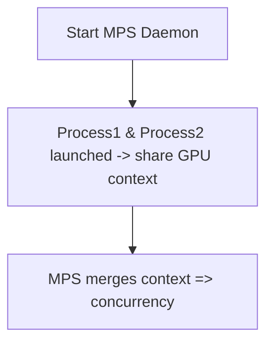
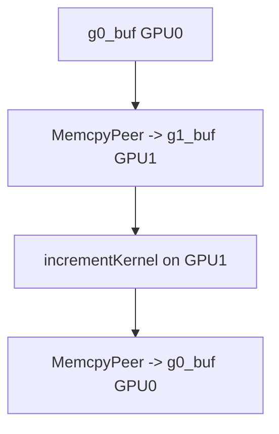
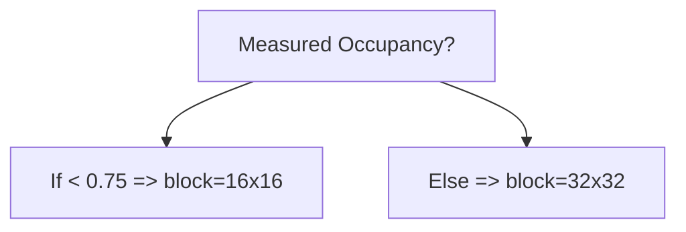
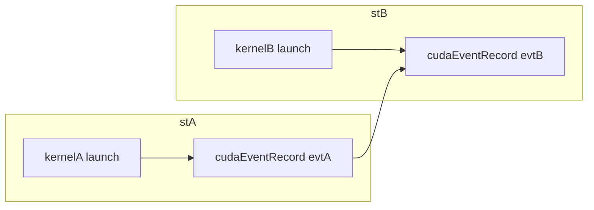

# Day 70: Progress Checkpoint

As we wrap up Day 70, it’s time to consolidate and recap key lessons from **Days 57 to 69**, focusing on concurrency patterns, advanced memory strategies, and multi-GPU approaches. We’ll highlight how small concurrency oversights can cause big issues and emphasize the need for methodical debugging and profiling to ensure correctness and performance in complex GPU workloads.

---

## Table of Contents

1. [Overview](#1-overview)  
2. [Key Highlights from Days 57–69](#2-key-highlights-from-days-57-69)  
   - [a) Concurrency Patterns and Synchronization](#a-concurrency-patterns-and-synchronization)  
   - [b) Advanced Memory Techniques](#b-advanced-memory-techniques)  
   - [c) Multi-GPU Scaling](#c-multi-gpu-scaling)  
3. [Common Concurrency Oversights](#3-common-concurrency-oversights)  
4. [Lessons Learned](#4-lessons-learned)  
5. [Conceptual Diagram](#5-conceptual-diagram)  
6. [References & Further Reading](#6-references--further-reading)  
7. [Conclusion](#7-conclusion)  
8. [Next Steps](#8-next-steps)

---

## 1. Overview

In this **Progress Checkpoint**, we revisit the advanced topics covered in **Days 57–69**:
- **Robust Error Handling & Debugging** (Day 57)  
- **Handling Large Data Sets** (Day 58)  
- **MPS & Multi-Process Service** (Day 59)  
- **Multi-Stream Data Processing** (Day 60)  
- **Device Libraries & Unified Memory** (Day 55–63 in some references, but continuing the advanced memory usage through Days 64–66)  
- **Occupancy-Based Tuning** (Days 65 & 66)  
- **Multi-GPU & P2P** (Days 46, 66, 69 – if cross-referenced), and more.

The recurring theme is how concurrency and memory management intricacies can significantly impact performance and correctness. Even minor oversight in synchronization can lead to data corruption or suboptimal performance. This checkpoint ensures we consolidate these insights into a cohesive mental model.

---

## 2. Key Highlights from Days 57–69

### a) Concurrency Patterns and Synchronization
- **Producer-Consumer (Day 63)**: Showed how different kernels can pipeline data via multiple streams, ensuring correctness through events.  
- **Cooperative Groups (Days 45 & 65)**: Provided grid-wide synchronization for advanced patterns like multi-block reductions, requiring hardware support and proper kernel design.  
- **Concurrency Oversubscription**: Learned that launching too many streams or ignoring resource limits can degrade performance.

### b) Advanced Memory Techniques
- **Pinned + Unified Memory Hybrid (Days 64)**: Combined pinned memory for fast input streaming with unified memory for simplified intermediate storage.  
- **Custom Allocators & Memory Pools (Day 68)**: Emphasized reusing device memory to reduce overhead from frequent `cudaMalloc/cudaFree`, but noted thread safety concerns.  
- **Occupancy Tuning**: Realized that large data sets require balancing block size, register usage, and shared memory for maximum warp concurrency (Days 65–66).

### c) Multi-GPU Scaling
- **Peer-to-Peer (Days 66, 69)**: Allowed direct transfers between GPUs, bypassing the host for partial merges or pipeline stages.  
- **MPS (Day 59)**: Enabled multiple processes to share a single GPU context, reducing overhead in multi-tenant HPC environments.  
- **Data Partitioning**: Found that domain decomposition or sub-range splitting is key for effectively distributing large problems across GPUs.

---

## 3. Common Concurrency Oversights

1. **Missing Sync**: Launching consumer kernels before producer results are valid can cause data corruption.  
2. **Underestimating Resource Limits**: Concurrency illusions arise if the GPU cannot physically maintain enough SM resources for all streams or blocks.  
3. **Error Handling**: Without robust checks, asynchronous errors can remain undetected until data corruption surfaces.  
4. **Oversubscription**: Excessive streams or multi-GPU tasks can saturate PCIe or system memory bandwidth, undermining concurrency gains.

---

## 4. Lessons Learned

- **Unified Memory vs. Manual Memory**: While UM simplifies code, large data sets or frequent CPU-GPU data touches may incur page fault overhead. Pinning or custom allocators can help but add complexity.  
- **Concurrency Patterns**: Patterns like Producer-Consumer, multi-stream pipelines, and cooperative groups yield major speedups if properly synchronized.  
- **Multi-GPU**: Splitting tasks across GPUs or enabling P2P offers huge scaling potential but requires rigorous partitioning and synchronization strategies.  
- **Occupancy**: Tools like Nsight Compute’s occupancy analysis guide adjustments to block size and register usage. Real performance must always be tested, not just theoretical metrics.

---

## 5. Conceptual Diagram

```mermaid
flowchart LR
    subgraph Advanced Topics Recap
    A[Concurrency Patterns] -->|streams, events| B
    B[Advanced Memory] -->|Pinned, UM, Pools| C
    C[Multi-GPU P2P & Occupancy Tuning]
    end
    subgraph Pitfalls
    D[Missing sync => data race]
    E[Resource oversubscription]
    F[Complex memory leads to confusion]
    end
    Advanced Topics Recap --> Pitfalls
```

**Explanation:**  
1. Concurrency patterns, advanced memory usage, and multi-GPU scaling form the advanced HPC triad.  
2. Pitfalls like missing sync calls or oversubscription remain the main risks in each domain.

---

## 6. References & Further Reading

- [CUDA C Programming Guide – Streams & Concurrency](https://docs.nvidia.com/cuda/cuda-c-programming-guide/index.html#concurrent-kernel-execution)  
- [Nsight Compute – Occupancy Analysis](https://docs.nvidia.com/nsight-compute/)  
- [NVIDIA Developer Blog – Memory Pools & MPS Articles](https://developer.nvidia.com/blog)  
- [Multi-GPU Best Practices – Domain Decomposition Approaches](https://docs.nvidia.com/deploy/multi-gpu.html)

---

## 7. Conclusion

**Day 70** marks a **Progress Checkpoint** summarizing concurrency patterns, advanced memory strategies, and multi-GPU usage from the past lessons. We observed how small oversights in synchronization or resource usage can lead to big issues in correctness or performance. By combining robust error handling, carefully tuned concurrency models, and memory management best practices, we can maintain high throughput and scalability in complex GPU workloads.

---

## 8. Next Steps

1. **Revisit Past Code**: Check your concurrency patterns for potential race conditions or resource oversubscription.  
2. **Profile**: Use Nsight Systems or Nsight Compute on your advanced code to identify occupancy, memory bandwidth, and concurrency stalls.  
3. **Refine Memory Approaches**: If you used pinned memory or UM, ensure that your usage is truly beneficial – watch for hidden overheads or page faults.  
4. **Scale Up**: Investigate multi-GPU domain decompositions or P2P merges if your data set outgrows a single GPU.  
5. **Keep It Simple**: Resist the temptation to over-engineer memory pools or concurrency; keep your designs maintainable and thoroughly tested.

```

```
1. **Q**: What is the main benefit of using pinned (page-locked) host memory in CUDA applications?  
   **A**: Pinned memory allows faster and asynchronous data transfers between host and device, reducing transfer latency and often enabling overlap of communication and computation through streams.

2. **Q**: Why might an application prefer to use a memory pool or custom allocator instead of repeated calls to `cudaMalloc` and `cudaFree`?  
   **A**: Memory pools reduce the overhead of frequent allocations/deallocations by reusing a pre-allocated chunk of device memory, thus minimizing runtime costs and potential fragmentation from multiple `cudaMalloc` calls.

3. **Q**: In a multi-stream pipeline, what concurrency pitfall commonly arises if you forget to record or wait on synchronization events?  
   **A**: The consumer kernel might start reading data before the producer kernel finishes writing, causing data corruption or incomplete results. Proper event recording and stream waiting ensure correct data availability.

4. **Q**: Why might occupancy-based tuning not always guarantee the best performance for a large kernel like matrix multiplication?  
   **A**: While high occupancy can hide latency, it sometimes forces lower register usage (via spill or partial unroll) which may hurt performance. Real-world testing is needed to confirm improvements, as pure occupancy metrics do not always reflect actual speedups.

5. **Q**: When combining pinned memory for input streaming and unified memory (UM) for intermediate results, what is a potential drawback?  
   **A**: This hybrid design can become overly complex, leading to confusion regarding data movement. UM may trigger page faults for intermediate data if the CPU accesses it prematurely, requiring careful synchronization and planning.

6. **Q**: What is a primary use case for CUDA MPS (Multi-Process Service)?  
   **A**: MPS consolidates multiple processes into one GPU context, reducing context-switch overhead in multi-tenant or multi-user HPC environments. It allows multiple processes to more efficiently share a single GPU, improving concurrency under certain workloads.

7. **Q**: Why is it crucial to check GPU hardware and driver compatibility before enabling peer-to-peer (P2P) communication between two GPUs?  
   **A**: Not all GPU architectures and system PCIe/NVLink topologies support P2P. If the devices or driver do not support it, attempts to enable peer access can fail, preventing direct GPU↔GPU transfers.

8. **Q**: In a producer-consumer concurrency pattern with multiple streams, how do you ensure the consumer kernel does not run too soon?  
   **A**: Record an event in the producer stream after its kernel completes, then use `cudaStreamWaitEvent` in the consumer stream, guaranteeing the consumer kernel launches only after the producer’s data is ready.

9. **Q**: What is a common cause of race conditions when implementing BFS (Breadth-First Search) on the GPU with adjacency lists?  
   **A**: The heavy use of atomic operations (for marking visited nodes or appending to the frontier) can lead to race conditions if not carefully managed. Additionally, uncoalesced random memory accesses often complicate concurrency and hamper performance.

10. **Q**: How does Nsight Compute’s occupancy analysis help tune performance?  
   **A**: It reveals whether kernels are limited by register usage, shared memory allocations, or other resource constraints that reduce active warps per SM. Developers can then adjust block size, register constraints, or shared memory usage to raise occupancy and potentially boost performance.

---

**Below are 10 intermediate-level theoretical questions** in a leetcode-style Q&A format that reference the key topics from **Day 70** – focusing on concurrency patterns, advanced memory approaches, multi-GPU scaling, and HPC best practices taught in Days 57–69.

---

1. **Q**: When implementing a multi-stream producer-consumer pipeline, how can you overlap data transfers and kernel execution while ensuring correctness?

   **A**: Use separate CUDA streams for the producer and consumer kernels, record an event in the producer stream after its kernel finishes, and instruct the consumer stream to wait on that event. This guarantees that the consumer kernel only starts after the producer’s data is valid, while allowing transfers and kernel execution to run concurrently for maximum overlap.

2. **Q**: Why does using pinned (page-locked) host memory speed up host-to-device transfers, and what is a potential downside of allocating large pinned buffers?

   **A**: Pinned memory avoids the overhead of paging in host RAM, enabling DMA (Direct Memory Access) to the GPU for faster and asynchronous transfers. However, large pinned allocations can degrade overall system performance or starve the OS of pageable memory, leading to potential CPU-side performance issues or memory constraints.

3. **Q**: In a multi-GPU setup, under what conditions would you enable peer-to-peer (P2P) access, and how do you confirm that two GPUs support it?

   **A**: You enable P2P when you want GPUs to exchange data directly without passing through the host (e.g., partial merges or domain decompositions). You confirm by calling `cudaDeviceCanAccessPeer(int* canAccess, int device, int peerDevice)` for both device pair directions. If it returns true, you can call `cudaDeviceEnablePeerAccess(peerDevice, 0)` to enable direct memory access.

4. **Q**: How does using a memory pool or custom allocator reduce overhead compared to repeated `cudaMalloc/cudaFree` calls?

   **A**: A memory pool pre-allocates a large region of device memory once and subdivides it among multiple requests, thus avoiding frequent allocation/deallocation calls to the CUDA runtime. This significantly reduces the overhead and potential fragmentation that can occur with many small or dynamic allocations over time.

5. **Q**: What pitfalls may arise when combining pinned memory for input streaming with unified memory (UM) for intermediate results?

   **A**: Although pinned memory accelerates data transfers and UM simplifies on-demand data migration, the combination can become overcomplicated. Page faults or unintentional host accesses to UM can cause unpredictable performance, and ensuring proper synchronization between pinned buffers, UM arrays, and kernel usage can become nontrivial.

6. **Q**: In a producer-consumer concurrency pattern using multi-GPU scaling, how do you handle data distribution if one GPU needs partial results from another GPU?

   **A**: After the producing GPU finishes partial computation and writes its results, you either transfer results via peer-to-peer memory (if supported) or copy them back to the host and then to the consuming GPU. You synchronize via host-based checks or events to ensure the consuming GPU does not access invalid data.

7. **Q**: Why can raising occupancy through the use of `-maxrregcount` or `__launch_bounds__()` sometimes degrade kernel performance instead of improving it?

   **A**: Limiting registers per thread can increase occupancy, but if the kernel actually needs more registers for efficient computation, it may cause register spills into local memory. That can drive up memory traffic and stall the kernel, offsetting any gains from higher occupancy.

8. **Q**: During BFS or PageRank on the GPU, what are typical reasons for performance bottlenecks despite high concurrency?

   **A**: Graph algorithms often involve irregular data access patterns with adjacency lists, leading to uncoalesced and random memory accesses. Warp divergence can also arise when some threads process high-degree nodes while others handle low-degree nodes, causing load imbalance. Additionally, repeated atomic operations for frontier updates or visited checks can become a bottleneck.

9. **Q**: If you are debugging a multi-stream pipeline for real-time data processing, why is it crucial to track errors immediately after API calls or kernel launches?

   **A**: In asynchronous CUDA execution, errors can remain undetected if you do not check error codes after calls. By recording the error status with macros like `CUDA_CHECK(...)` and synchronizing or checking with `cudaGetLastError()`, you can pinpoint issues early (e.g., invalid memory writes or kernel config errors) rather than discovering them after data corruption or performance degradation.

10. **Q**: What are the benefits and trade-offs of using Nsight Compute’s occupancy analysis for an advanced matrix multiplication kernel?

   **A**: Nsight Compute’s occupancy analysis helps identify if kernels are register- or shared memory-limited, guiding adjustments to block size or resource usage for potentially higher concurrency. The trade-off is that focusing solely on raising occupancy can overlook other performance factors like memory bandwidth or shared memory conflicts. Ultimately, real-world performance must be tested to confirm the improvements from occupancy-based tuning.

---

**Below are 10 hard/advanced theoretical questions** in a “LeetCode-style” format, designed to test knowledge of **advanced concurrency patterns, memory usage, multi-GPU scaling, and HPC best practices** from Days 57–69. Each question is accompanied by an in-depth answer, reflecting the complexities and nuances of high-performance GPU computing.

---

1. **Q**: In a multi-stream, multi-GPU pipeline where GPU A’s kernel results must flow into GPU B’s kernel in near real-time, how can you minimize latency if both GPUs support Peer-to-Peer (P2P)?  
   **A**:  
   • Enable P2P for both devices (`cudaSetDevice(0)` → `cudaDeviceEnablePeerAccess(1,0)` and vice versa).  
   • Use asynchronous kernel execution on GPU A, followed by a P2P transfer (`cudaMemcpyPeerAsync`) from GPU A’s buffer to GPU B’s input buffer.  
   • Start GPU B’s kernel in a separate stream after the P2P transfer event is recorded.  
   • This avoids host staging, reduces overhead, and ensures data arrives directly in GPU B’s memory with minimal latency.  
   • Properly coordinate with CUDA events to confirm GPU A’s kernel completes before initiating the P2P transfer.  

2. **Q**: Why might a concurrency-based approach using multi-stream Producer-Consumer patterns experience lower throughput if the GPU is oversubscribed by too many concurrent streams?  
   **A**:  
   • Each stream consumes scheduler and SM resources, and beyond a certain point, the GPU cannot efficiently parallelize them.  
   • Bandwidth contention on PCIe or memory bus can create bottlenecks.  
   • Context-switch overhead among too many in-flight kernels or transfers negates concurrency gains.  
   • Properly balancing concurrency (streams) with actual hardware resource limits is essential for optimal performance.  

3. **Q**: Describe a scenario where using pinned memory for input streaming and unified memory (UM) for intermediate results can lead to subtle data race or performance issues, and how to mitigate them.  
   **A**:  
   • Scenario: The host streams data into the GPU using pinned memory in stream A, while kernels in stream B read and update UM arrays. If the CPU reads or writes the same UM arrays before the kernel completes, page faults or partial updates can occur, causing unpredictable performance or data inconsistencies.  
   • Mitigation: Record events after finishing kernel updates, use `cudaStreamWaitEvent` for host- or CPU-side sync, or rely on `cudaDeviceSynchronize` for correctness. Also, consider chunked or double buffering for UM arrays so that the kernel can safely operate on one buffer while the host interacts with another.  

4. **Q**: In an advanced BFS implementation on a large graph where warp divergence is significant (due to variable node degrees), how can you reduce or hide the performance penalty while keeping concurrency high?  
   **A**:  
   • Partition adjacency lists and reorder nodes so that similarly high-degree or low-degree vertices cluster, potentially reducing warp divergence.  
   • Employ a two-phase frontier approach: filter out high-degree nodes or process them separately with specialized kernels.  
   • Use sub-warp or tile-level partitioning with cooperative groups if available.  
   • Perform atomic-limited BFS expansions (like a warp-level aggregator) to reduce the overhead of single-thread atomic collisions.  

5. **Q**: Why does forcing higher occupancy with `-maxrregcount` in a heavily unrolled matrix multiplication kernel occasionally degrade performance despite raising the warp count?  
   **A**:  
   • Capping register usage can cause register spills into local memory, increasing memory traffic and latency.  
   • The kernel might rely on many registers per thread for intermediate values. Restricting them results in frequent loads/stores to local memory, overshadowing any benefit from more warps in flight.  
   • Real performance is better measured by kernel time, not just occupancy metrics.  

6. **Q**: In a large HPC application using MPS (Multi-Process Service) to share a GPU across multiple user processes, what concurrency illusions or oversights might lead to suboptimal throughput or user experience?  
   **A**:  
   • Users might assume they each get full GPU concurrency; however, MPS merges contexts, so heavy usage from one process can cause resource contention for others.  
   • Insufficient partitioning or scheduling control in MPS can cause one job to overshadow smaller tasks, or degrade overall concurrency if one process saturates memory.  
   • Large pinned allocations or UM usage from multiple processes might hamper real concurrency.  

7. **Q**: Explain how a custom memory pool or allocator can fail under dynamic parallelism if not carefully designed for thread safety, and how to fix it.  
   **A**:  
   • Under dynamic parallelism, child kernels might attempt to allocate from the custom pool concurrently, leading to partial overlaps or pointer misalignment if no lock or atomic increments are used to manage the free list or offset.  
   • The fix requires concurrency-safe atomic operations, locks, or specialized suballocator logic to track segments accurately. Another approach is to rely on the CUDA driver’s `cudaMallocAsync` pool if it is compatible with dynamic parallelism in your environment.  

8. **Q**: When performing a grid-wide reduction using cooperative groups, what conditions can cause the final reduction (often in block 0) to read incomplete partial sums, and how do you avoid them?  
   **A**:  
   • If the kernel calls `this_grid().sync()` before all partial sums are actually written or if certain threads skip synchronization, partial sums might be invalid when block 0 aggregates them.  
   • Ensuring every block fully commits data to global memory and calls `this_grid().sync()` is mandatory. Also confirm that the hardware supports cooperative groups at the grid level.  

9. **Q**: In multi-GPU BFS or PageRank workloads with P2P, how can load imbalance hamper performance, and what advanced concurrency technique can mitigate that?  
   **A**:  
   • Some GPUs might process subgraphs with more edges or higher-degree nodes, taking longer than others, causing idle resources.  
   • Techniques like dynamic work-stealing among GPUs or frontier rebalancing can reduce load imbalance. This might involve partitioning the graph adaptively based on real-time node expansions and using P2P to relocate partial frontiers.  

10. **Q**: Provide a scenario where pinned memory drastically benefits real-time data streaming, yet implementing occupancy-based kernel tuning has little net effect. Why might that be?  
   **A**:  
   • Scenario: Real-time data feed from the host fills pinned buffers asynchronously, and the GPU runs a moderate-intensity kernel that quickly processes each chunk. The pipeline is host transfer-limited.  
   • In such a pipeline, pinned memory usage does yield big gains by overlapping host transfers with GPU compute, but occupancy-based tweaks on the kernel might only yield minimal improvements if the kernel is short-lived or overshadowed by the feed transfer overhead.  
   • The real bottleneck remains the network or I/O speed feeding the pinned buffers.  

---


# Day 70: Easy Practical Coding Questions (LeetCode-Style)  
Below are **10 easy-level coding questions** in a LeetCode-style format. Each question focuses on a **practical GPU programming scenario** derived from **Days 57–69** – touching on concurrency patterns, advanced memory usage, multi-GPU scaling, and HPC best practices. Each question includes a **short code snippet**, a requested **task**, a sample **answer**, and a **schematic diagram** (in Mermaid) illustrating the logic flow.

---

## 1. Pinned Memory Transfer for Real-Time Input

**Question**  
You have a host buffer `h_data` that needs to be streamed to the GPU repeatedly for real-time processing. You want to use pinned (page-locked) memory for faster transfers. The code snippet below is missing the allocation of pinned memory. Complete the code so it allocates and frees pinned memory properly, then transfers data to the device.

```cpp
// Q1_pinned_memory_example.cu
#include <cuda_runtime.h>
#include <stdio.h>
#include <stdlib.h>

int main() {
    int N = 1 << 20; // 1 million elements
    size_t size = N * sizeof(float);
    float *h_data;    // host buffer
    float *d_data;    // device buffer

    // TODO: Allocate pinned memory for h_data

    // Initialize pinned host memory
    for (int i = 0; i < N; i++) {
        h_data[i] = (float)i;
    }

    cudaMalloc(&d_data, size);

    // Transfer pinned memory to device
    cudaMemcpy(d_data, h_data, size, cudaMemcpyHostToDevice);

    // ... kernel execution omitted ...

    // TODO: Free pinned memory
    cudaFree(d_data);
    return 0;
}
```

**Task**  
Fill in the missing lines to allocate pinned memory via `cudaMallocHost()` and release it with `cudaFreeHost()`.

**Answer**  
A simple solution is:

```cpp
// ...
float *h_data;
// Allocate pinned memory
cudaMallocHost((void**)&h_data, size);

// Initialize pinned host memory
for (int i = 0; i < N; i++) {
    h_data[i] = (float)i;
}

float *d_data;
cudaMalloc(&d_data, size);
cudaMemcpy(d_data, h_data, size, cudaMemcpyHostToDevice);

// (Kernel code if needed) ...

// Free pinned memory
cudaFreeHost(h_data);
cudaFree(d_data);
return 0;
```

**Diagram (Mermaid)**
```mermaid
flowchart LR
    A[Host pinned buffer h_data allocated] --> B[Initialize data]
    B --> C[Device buffer allocated (d_data)]
    C --> D[cudaMemcpy from pinned host to device]
    D --> E[Kernel or other usage]
    E --> F[Free pinned memory and device memory]
```

---

## 2. Multi-Stream Producer-Consumer (Basic)

**Question**  
You have two streams: `streamProd` (producer) generating data in a device buffer `d_buffer`, and `streamCons` (consumer) reading the results and performing an operation. The event synchronization is missing. Insert code to record an event in `streamProd` and make `streamCons` wait on it, ensuring the consumer does not start too soon.

```cpp
// Q2_multi_stream_example.cu
#include <cuda_runtime.h>
#include <stdio.h>

__global__ void producerKernel(float *buffer, int N) {
    int idx = blockIdx.x * blockDim.x + threadIdx.x;
    if (idx < N) {
        buffer[idx] = (float)idx;
    }
}

__global__ void consumerKernel(const float *buffer, float *output, int N) {
    int idx = blockIdx.x * blockDim.x + threadIdx.x;
    if (idx < N) {
        output[idx] = buffer[idx] * 2.0f;
    }
}

int main() {
    int N = 1024;
    size_t size = N * sizeof(float);
    float *d_buffer, *d_output;
    cudaMalloc(&d_buffer, size);
    cudaMalloc(&d_output, size);

    cudaStream_t streamProd, streamCons;
    cudaStreamCreate(&streamProd);
    cudaStreamCreate(&streamCons);

    producerKernel<<<(N+255)/256, 256, 0, streamProd>>>(d_buffer, N);

    // TODO: Insert event record and make streamCons wait on it

    consumerKernel<<<(N+255)/256, 256, 0, streamCons>>>(d_buffer, d_output, N);

    cudaStreamSynchronize(streamProd);
    cudaStreamSynchronize(streamCons);

    cudaFree(d_buffer);
    cudaFree(d_output);
    cudaStreamDestroy(streamProd);
    cudaStreamDestroy(streamCons);
    return 0;
}
```

**Task**  
Add `cudaEventRecord()` in `streamProd`, and use `cudaStreamWaitEvent()` in `streamCons`, ensuring correct concurrency.

**Answer**  
```cpp
// ...
cudaEvent_t event;
cudaEventCreate(&event);

// Launch producer kernel
producerKernel<<<(N+255)/256, 256, 0, streamProd>>>(d_buffer, N);

// Record event after producer finishes
cudaEventRecord(event, streamProd);

// Make consumer stream wait for the event
cudaStreamWaitEvent(streamCons, event, 0);

consumerKernel<<<(N+255)/256, 256, 0, streamCons>>>(d_buffer, d_output, N);
// ...
```

**Diagram (Mermaid)**


---

## 3. BFS Frontier Update with Atomic Checking

**Question**  
Fill in the BFS kernel snippet below to mark a neighbor as visited using an atomic operation (`atomicCAS`) before appending it to the next frontier with `atomicAdd`. The BFS adjacency data is in `d_offsets`/`d_cols`, and `visited` is a device array of 0/1 flags.

```cpp
// Q3_bfs_atomic_example.cu
__global__ void bfsKernel(const int* d_offsets, const int* d_cols,
                          int* visited, const int* frontier, int frontierSize,
                          int* nextFrontier, int* nextCount, int N) {
    int idx = blockIdx.x * blockDim.x + threadIdx.x;
    if (idx < frontierSize) {
        int node = frontier[idx];
        int start = d_offsets[node];
        int end = d_offsets[node + 1];
        for (int offset = start; offset < end; offset++) {
            int neighbor = d_cols[offset];
            // TODO: Mark neighbor visited and append to nextFrontier
        }
    }
}
```

**Task**  
Insert an atomic check to set `visited[neighbor]` to 1 if it was 0, then use `atomicAdd(nextCount, 1)` to get a position to store `neighbor` in `nextFrontier`.

**Answer**  
```cpp
int oldVal = atomicCAS(&visited[neighbor], 0, 1);
if (oldVal == 0) {
    // neighbor was unvisited
    int pos = atomicAdd(nextCount, 1);
    nextFrontier[pos] = neighbor;
}
```

**Diagram (Mermaid)**
```mermaid
flowchart TD
    A[current BFS frontier loop]
    B[for each neighbor => atomicCAS(visited[neighbor], 0, 1)?]
    C[atomicAdd to nextCount => store neighbor in nextFrontier]

    A --> B
    B --> C
```

---

## 4. Simple Memory Pool: Allocate and Reuse

**Question**  
Complete this code snippet so that a memory pool `initPool` does one big `cudaMalloc` for 4 MB, and `allocateBlock` returns a pointer offset from `poolStart`. The pool must be freed in `destroyPool`.

```cpp
// Q4_memory_pool_example.cu
#include <cuda_runtime.h>
#include <stdio.h>

struct DevicePool {
    char* poolStart;
    size_t poolSize;
    size_t offset;
};

void initPool(DevicePool &dp) {
    // TODO: allocate 4 MB device memory
    // set dp.offset = 0
}

void* allocateBlock(DevicePool &dp, size_t size) {
    // TODO: return a pointer from dp.poolStart + dp.offset
    // update dp.offset
}

void destroyPool(DevicePool &dp) {
    // TODO: free dp.poolStart
}

// ...
```

**Task**  
Fill in the logic for `initPool`, `allocateBlock`, and `destroyPool`.

**Answer**  
```cpp
void initPool(DevicePool &dp) {
    dp.poolSize = 4 * 1024 * 1024; // 4 MB
    cudaMalloc((void**)&dp.poolStart, dp.poolSize);
    dp.offset = 0;
}

void* allocateBlock(DevicePool &dp, size_t size) {
    if (dp.offset + size > dp.poolSize) return nullptr;
    void* ptr = (void*)(dp.poolStart + dp.offset);
    dp.offset += size;
    return ptr;
}

void destroyPool(DevicePool &dp) {
    cudaFree(dp.poolStart);
    dp.poolStart = nullptr;
    dp.offset = 0;
    dp.poolSize = 0;
}
```

**Diagram (Mermaid)**


---

## 5. Occupancy Tuning with Launch Bounds

**Question**  
Insert a `__launch_bounds__()` attribute in the matrix multiply kernel so that each block has at most 128 threads, with at least 2 blocks per SM. This helps raise occupancy if register usage is high.

```cpp
// Q5_occ_bounds_example.cu
__global__ void matrixMulKernel(const float* A, const float* B, float* C, int N) {
    // Tiled matrix multiply logic omitted
}
```

**Task**  
Decorate `matrixMulKernel` with `__launch_bounds__(128, 2)`.

**Answer**  
```cpp
__launch_bounds__(128, 2)
__global__ void matrixMulKernel(const float* A, const float* B, float* C, int N) {
    // Tiled matrix multiply logic ...
}
```

**Diagram (Mermaid)**
```mermaid
flowchart LR
    A[__launch_bounds__(128,2) -> block limit]
    B[Compiler tries to reduce register usage or shape the kernel]
    C[Raised occupancy if feasible]
    
    A --> B --> C
```

---

## 6. Simple BFS Frontier in UM

**Question**  
You want to store BFS arrays (`frontier`, `visited`) in unified memory so the CPU can read the BFS progress without extra copies. Insert `cudaMallocManaged()` calls for `frontier` and `visited`. Then, in a BFS kernel, we read from `frontier`, mark `visited[neighbor]`, etc.

```cpp
// Q6_um_bfs_example.cu
#include <cuda_runtime.h>
#include <stdio.h>

int main() {
    int N = 1024;
    // TODO: Use cudaMallocManaged for visited, frontier
    // BFS logic etc.
}
```

**Task**  
Fill in the code to allocate `visited` and `frontier` with `cudaMallocManaged()`, ensuring host reads can see the updated BFS arrays directly.

**Answer**  
```cpp
int *visited, *frontier;
cudaMallocManaged(&visited, N * sizeof(int));
cudaMallocManaged(&frontier, N * sizeof(int));

// Initialize as needed
for (int i = 0; i < N; i++) {
    visited[i] = 0;
    frontier[i] = -1;
}

// BFS kernel usage ...
// Host can read visited, frontier directly

cudaFree(visited);
cudaFree(frontier);
```

**Diagram (Mermaid)**


---

## 7. Basic Multi-GPU Data Split

**Question**  
Fill in code to split an array of 2 million floats between two GPUs: GPU 0 handles the first half, GPU 1 handles the second half. Then, each GPU runs a kernel to double its portion. Freed device memory at the end.

```cpp
// Q7_multi_gpu_split.cu
int main() {
    int N = 2000000;
    size_t halfSize = (N / 2) * sizeof(float);

    float *d_gpu0, *d_gpu1;

    // TODO: Set device 0, allocate d_gpu0
    // TODO: Set device 1, allocate d_gpu1

    // TODO: Memset or copy data for each half
    // Launch kernels, synchronize
    // Clean up
}
```

**Task**  
Fill in the device set calls, `cudaMalloc` for each half, some initialization (like `cudaMemset`), and a simple kernel.

**Answer**  
```cpp
int main() {
    int N = 2000000;
    size_t halfN = N / 2;
    size_t halfSize = halfN * sizeof(float);

    float *d_gpu0, *d_gpu1;

    cudaSetDevice(0);
    cudaMalloc(&d_gpu0, halfSize);
    cudaMemset(d_gpu0, 0, halfSize);

    cudaSetDevice(1);
    cudaMalloc(&d_gpu1, halfSize);
    cudaMemset(d_gpu1, 0, halfSize);

    // Launch a kernel on each GPU
    cudaSetDevice(0);
    doubleKernel<<<(halfN+255)/256, 256>>>(d_gpu0, halfN);

    cudaSetDevice(1);
    doubleKernel<<<(halfN+255)/256, 256>>>(d_gpu1, halfN);

    cudaSetDevice(0);
    cudaDeviceSynchronize();
    cudaSetDevice(1);
    cudaDeviceSynchronize();

    cudaFree(d_gpu0);
    cudaFree(d_gpu1);
    return 0;
}
```
```cpp
// Example doubleKernel
__global__ void doubleKernel(float *data, int size) {
    int idx = blockIdx.x*blockDim.x + threadIdx.x;
    if(idx < size) {
        data[idx] *= 2.0f;
    }
}
```

**Diagram (Mermaid)**


---

## 8. Minimal Device Allocator for Repeated Ops

**Question**  
Complete the code for `allocateDeviceArray(size_t size)` that reuses a single static pointer if the requested `size` is <= a pre-allocated block. Return it on subsequent calls, ignoring partial frees.

```cpp
// Q8_minimal_allocator.cu
static void *g_pool = nullptr;
static size_t g_poolSize = 0;

void initPoolSize(size_t poolSize) {
    // ...
}
void* allocateDeviceArray(size_t size) {
    // ...
}
```

**Task**  
Fill `initPoolSize` with `cudaMalloc(&g_pool, poolSize)`. Fill `allocateDeviceArray` to do a naive check: if `size <= g_poolSize`, return `g_pool`; else return nullptr.

**Answer**  
```cpp
void initPoolSize(size_t poolSize) {
    cudaMalloc(&g_pool, poolSize);
    g_poolSize = poolSize;
}

void* allocateDeviceArray(size_t size) {
    if (size <= g_poolSize) {
        return g_pool; // naive reuse
    }
    return nullptr;
}
```

**Diagram (Mermaid)**


---

## 9. Checking GPU for P2P Support

**Question**  
Fill in logic to check if GPU 0 and 1 can do P2P. If yes, enable peer access. Print a message accordingly.

```cpp
// Q9_p2p_check.cu
int main() {
    int canAccess01, canAccess10;
    // TODO: check if device 0 can access 1, and device 1 can access 0
    // if both true, do cudaDeviceEnablePeerAccess
}
```

**Task**  
Use `cudaDeviceCanAccessPeer()` in both directions, then `cudaSetDevice()` and `cudaDeviceEnablePeerAccess()`.

**Answer**  
```cpp
int canAccess01, canAccess10;
cudaDeviceCanAccessPeer(&canAccess01, 0, 1);
cudaDeviceCanAccessPeer(&canAccess10, 1, 0);

if (canAccess01 && canAccess10) {
    cudaSetDevice(0);
    cudaDeviceEnablePeerAccess(1, 0);
    cudaSetDevice(1);
    cudaDeviceEnablePeerAccess(0, 0);
    printf("P2P enabled between GPU 0 and 1.\n");
} else {
    printf("P2P not supported.\n");
}
```

**Diagram (Mermaid)**
```mermaid
flowchart LR
    A[cudaDeviceCanAccessPeer(0,1)] & cudaDeviceCanAccessPeer(1,0)]
    B[if both true -> enable peer access]
    A --> B
```

---

## 10. Occupancy Check Using Launch Bounds

**Question**  
Add a kernel for a large reduction that uses `__launch_bounds__(128, 2)` to hint occupancy. Provide the host code snippet that launches it with block size 128. Show how you’d interpret occupancy from Nsight Compute.

```cpp
// Q10_occ_reduction_example.cu
__global__ void occReductionKernel(const float* input, float* output, int N) {
    // ...
}
```

**Task**  
Decorate the kernel with `__launch_bounds__(128,2)`, launch it with block size 128, and note in a comment how you’d interpret Nsight’s occupancy data.

**Answer**  
```cpp
__launch_bounds__(128, 2)
__global__ void occReductionKernel(const float* input, float* output, int N) {
    extern __shared__ float sdata[];
    int idx = blockIdx.x * blockDim.x + threadIdx.x;
    // basic partial reduction ...
}

int main() {
    int N = 1 << 20;
    size_t size = N * sizeof(float);
    float *d_in, *d_out;
    cudaMalloc(&d_in, size);
    cudaMalloc(&d_out, size);

    dim3 block(128);
    dim3 grid((N + block.x - 1)/block.x);
    occReductionKernel<<<grid, block, block.x * sizeof(float)>>>(d_in, d_out, N);
    cudaDeviceSynchronize();

    // Nsight Compute: Check “Achieved Occupancy” vs. “Theoretical Occupancy”
    // and see if register usage or shared mem are limiting factors.
    return 0;
}
```

**Diagram (Mermaid)**
```mermaid
flowchart TD
    A[User sets __launch_bounds__(128,2)]
    B[Kernel runs with block size=128]
    C[Nsight Compute: measure occupancy]
    A --> B --> C
```

---


# Day 70: Intermediate Practical Coding Questions (LeetCode-Style)

Below are **10 intermediate-level coding questions** in a LeetCode-inspired format, targeting the **advanced topics** from **Days 57–69** such as concurrency, advanced memory usage, multi-GPU scaling, and HPC patterns. Each question provides:

- A **short code snippet** with missing or incomplete logic.  
- A **task** describing what to fill in or correct.  
- A **solution** showing a possible answer.  
- A **schematic diagram** in Mermaid syntax.  
- **Comments** in the code to clarify the logic.

If any question’s prompt is not sufficient, we may continue in a subsequent message.

---

## 1. Multi-Stream Device-to-Device Transfers

**Question**  
You have two device arrays, `d_src` and `d_dest`, each with size 1 million floats. You want to **copy** data from `d_src` to `d_dest` using a **separate stream** from the main kernel stream. Fill in the missing lines to asynchronously transfer data in `streamCopy`.

```cpp
// Q1_multistream_d2d.cu

#include <cuda_runtime.h>
#include <stdio.h>

__global__ void processKernel(float* data, int N) {
    int idx = blockIdx.x * blockDim.x + threadIdx.x;
    // For demonstration, just increment
    if (idx < N) data[idx] += 1.0f;
}

int main() {
    int N = 1000000;
    size_t size = N * sizeof(float);
    float *d_src, *d_dest;

    // Allocate device memory
    cudaMalloc(&d_src, size);
    cudaMalloc(&d_dest, size);

    // ... (host initialization to d_src omitted)...

    // Streams for kernel processing and data copy
    cudaStream_t streamProc, streamCopy;
    cudaStreamCreate(&streamProc);
    cudaStreamCreate(&streamCopy);

    // Launch a kernel in streamProc
    processKernel<<<(N+255)/256, 256, 0, streamProc>>>(d_src, N);

    // TODO: asynchronously copy from d_src to d_dest in streamCopy

    // Wait for both streams to finish
    cudaStreamSynchronize(streamProc);
    cudaStreamSynchronize(streamCopy);

    // Cleanup
    cudaFree(d_src);
    cudaFree(d_dest);
    cudaStreamDestroy(streamProc);
    cudaStreamDestroy(streamCopy);
    return 0;
}
```

**Task**  
Insert code that performs an asynchronous **device-to-device** copy (`cudaMemcpyAsync`) from `d_src` to `d_dest` in `streamCopy`. Then ensure synchronization.

**Answer**  
```cpp
// ...
// asynchronously copy from d_src to d_dest in streamCopy
cudaMemcpyAsync(d_dest, d_src, size, cudaMemcpyDeviceToDevice, streamCopy);
// ...
```

**Diagram (Mermaid)**
```mermaid
flowchart LR
    subgraph streamProc
    K1[processKernel(d_src)]
    end

    subgraph streamCopy
    C1[cudaMemcpyAsync(d_src->d_dest)]
    end

    K1 --> C1
```

*Comments*  
- `streamProc` executes the kernel on `d_src`.  
- `streamCopy` asynchronously copies results to `d_dest`.  
- Both streams are synchronized at the end for correctness.

---

## 2. Double Buffering with Pinned Memory

**Question**  
You want to **double-buffer** a host array so that while the GPU processes `h_bufferA` (already transferred to device), the CPU simultaneously fills `h_bufferB` with new data. Fill in the concurrency logic:

```cpp
// Q2_double_buffer_example.cu

#include <cuda_runtime.h>
#include <stdio.h>

// Kernel for processing data
__global__ void processData(float *d_data, int N) {
    int idx = blockIdx.x * blockDim.x + threadIdx.x;
    if (idx < N) {
        d_data[idx] *= 2.0f;
    }
}

int main(){
    int N=1<<20;
    size_t size = N * sizeof(float);

    float *h_bufferA, *h_bufferB;
    // TODO: allocate both with cudaMallocHost

    float *d_data;
    cudaMalloc(&d_data, size);

    // Streams for CPU fill and GPU process
    cudaStream_t streamCPU, streamGPU;
    cudaStreamCreate(&streamCPU);
    cudaStreamCreate(&streamGPU);

    // ...
    // CPU asynchronously fills h_bufferA
    // Transfer to device, launch kernel
    // Meanwhile CPU fills h_bufferB
    // Then swap roles
    // TODO: complete logic

    cudaFree(d_data);
    // free pinned buffers
    cudaStreamDestroy(streamCPU);
    cudaStreamDestroy(streamGPU);
    return 0;
}
```

**Task**  
Use pinned memory for both buffers. In the typical double-buffer scheme:  
1. Fill `h_bufferA`, copy to `d_data`, run kernel.  
2. While kernel runs, fill `h_bufferB` on the CPU in `streamCPU`.  
3. Swap.  
4. Stop after a few rounds.

**Answer**  
A simplified solution:

```cpp
// ...
cudaMallocHost((void**)&h_bufferA, size);
cudaMallocHost((void**)&h_bufferB, size);

// Fill h_bufferA
for(int i=0; i<N; i++) { h_bufferA[i] = (float)i; }

// Copy h_bufferA -> d_data, run kernel (in streamGPU)
cudaMemcpyAsync(d_data, h_bufferA, size, cudaMemcpyHostToDevice, streamGPU);
processData<<<(N+255)/256, 256, 0, streamGPU>>>(d_data, N);

// Meanwhile fill h_bufferB in host code (can be done in parallel with GPU)
for(int i=0; i<N; i++) { h_bufferB[i] = (float)i + 1000.0f; }

// Wait GPU
cudaStreamSynchronize(streamGPU);

// Next round: copy h_bufferB -> d_data
cudaMemcpyAsync(d_data, h_bufferB, size, cudaMemcpyHostToDevice, streamGPU);
processData<<<(N+255)/256, 256, 0, streamGPU>>>(d_data, N);

// ...
cudaStreamSynchronize(streamGPU);

cudaFreeHost(h_bufferA);
cudaFreeHost(h_bufferB);
```

**Diagram (Mermaid)**
```mermaid
flowchart LR
    subgraph Round1
    R1A[Host fill h_bufferA]
    R1B[cudaMemcpyAsync A->d_data, kernel(d_data)]
    end

    subgraph Parallel
    P1[While GPU runs => Host fill h_bufferB]
    end

    subgraph Round2
    R2A[cudaMemcpyAsync B->d_data, kernel(d_data)]
    end

    R1A --> R1B
    R1B --> P1
    P1 --> R2A
```

*Comments*  
- The CPU fills `h_bufferB` while the GPU processes data from `h_bufferA`.  
- After synchronization, roles swap for the next iteration.

---

## 3. BFS with Cooperative Groups (Grid Sync)

**Question**  
You have a BFS kernel that does partial sums in each block. You want a grid-level sync so that block 0 can finalize. Fill in the kernel snippet to use `cooperative_groups::grid_group` and `grid.sync()`.

```cpp
// Q3_bfs_coop_groups.cu
#include <cooperative_groups.h>
namespace cg = cooperative_groups;

__global__ void bfsCoopKernel(int *frontier, int *nextFrontier, int *partialCounts, int N) {
    // ...
    // after local BFS logic, sync grid so block 0 can finalize
    // TODO: insert grid sync
    // block 0 merges partialCounts
}
```

**Task**  
Use `cg::grid_group grid = cg::this_grid();` and call `grid.sync()` after partial BFS expansions.

**Answer**  
```cpp
__global__ void bfsCoopKernel(int *frontier, int *nextFrontier, int *partialCounts, int N) {
    cg::grid_group grid = cg::this_grid();
    int idx = blockIdx.x * blockDim.x + threadIdx.x;
    // BFS partial expansions, store counts in partialCounts[blockIdx.x]

    // Synchronize entire grid
    grid.sync();

    // if blockIdx.x == 0, do a final pass merging partialCounts
    // ...
}
```

**Diagram (Mermaid)**
```mermaid
flowchart TD
    A[Each block -> BFS partial sums]
    B[grid.sync() => all partial data is valid]
    C[Block0 merges partialCounts => final BFS update]

    A --> B
    B --> C
```

*Comments*  
- This approach requires hardware support for grid sync.  
- After partial expansions, block 0 merges global results.

---

## 4. Memory Pool Freed List

**Question**  
Add a minimal **free list** logic to the custom pool. The snippet below has a simple `struct Chunk {size_t size; bool used;}` for each chunk. Fill in the naive `myMalloc(size_t size)` that finds the first free chunk with enough size, or extends the pool if none found.

```cpp
// Q4_pool_free_list.cu
struct Chunk {
    size_t size;
    bool used;
    char* ptr;
};

struct DevicePool {
    char* base;
    size_t totalSize;
    std::vector<Chunk> chunks; // host-managed for demonstration
};

// TODO: implement myMalloc
```

**Task**  
Implement a naive `myMalloc(size_t size)` that iterates `chunks` to find a free chunk of sufficient size, sets `used=true`, returns `ptr`. If not found, extends from pool base.

**Answer**  
```cpp
void* myMalloc(DevicePool &dp, size_t size) {
    for (auto &ch : dp.chunks) {
        if (!ch.used && ch.size >= size) {
            ch.used = true;
            return ch.ptr;
        }
    }
    // If no existing free chunk is big enough
    size_t currentOffset = 0;
    for (auto &ch : dp.chunks) {
        currentOffset += ch.size;
    }
    if (currentOffset + size > dp.totalSize) {
        return nullptr; // no space
    }
    Chunk newCh;
    newCh.size = size;
    newCh.used = true;
    newCh.ptr  = dp.base + currentOffset;
    dp.chunks.push_back(newCh);
    return newCh.ptr;
}
```

**Diagram (Mermaid)**
```mermaid
flowchart TD
    A[myMalloc(size)] --> B[Check chunks for free+big enough]
    B -- found chunk --> C[Set used=true, return ptr]
    B -- no chunk --> D[Extend offset, create new chunk if space]
    D --> C
```

*Comments*  
- This example is simplified and managed partly on the host.  
- Real device memory pools might track offsets or free-lists in device code.

---

## 5. Intra-Warp BFS Minimizing Atomics

**Question**  
Complete the kernel snippet to reduce atomic usage by storing frontier expansions in warp registers first. Each warp aggregates neighbors, then does fewer atomic ops. Insert `__shfl_sync` usage to unify neighbor counts in a warp.

```cpp
// Q5_intra_warp_bfs.cu
__global__ void warpAggregateBFS(const int* offsets, const int* cols,
                                 int* visited, int* frontier, int frontierSize,
                                 int* nextFrontier, int* nextCount) {
    // ...
    // warp-level aggregation of neighbors
    // reduce atomic ops by combining neighborCount in a warp
}
```

**Task**  
Use a warp shuffle approach to sum partial `neighborCount` within the warp, then do a single `atomicAdd(nextCount, warpSum)` to reserve space in `nextFrontier`. For brevity, the code outline:

**Answer**  
```cpp
int warpLane = threadIdx.x & 31;
int neighborCount = localCount; // each thread's found neighbors
#pragma unroll
for (int offset = 16; offset > 0; offset >>= 1) {
    int val = __shfl_down_sync(0xffffffff, neighborCount, offset);
    neighborCount += val;
}

// warpLane=0 does one atomicAdd
if (warpLane == 0) {
    int pos = atomicAdd(nextCount, neighborCount);
    // This pos is the start offset in nextFrontier
}
```

**Diagram (Mermaid)**


*Comments*  
- Minimizing atomic usage at the thread level improves BFS performance by consolidating partial neighbor expansions inside a warp.

---

## 6. MPS Multi-Process Code Skeleton

**Question**  
You have multiple processes each running the same kernel on the same GPU, hoping to use MPS for concurrency. Show how you’d create a minimal MPS environment, referencing `nvidia-cuda-mps-control`, then run your app in separate processes.

```bash
# Q6_mps_example.sh
# TODO: illustrate commands to enable MPS, run two processes concurrently
```

**Task**  
Provide the shell commands to enable MPS, then launch two processes concurrently that share the GPU.

**Answer**  
```bash
# Start the MPS control daemon
sudo nvidia-cuda-mps-control -d

# Set environment variables (if needed)
export CUDA_MPS_PIPE_DIRECTORY=/tmp/nvidia-mps
export CUDA_MPS_LOG_DIRECTORY=/tmp/nvidia-mps

# Launch two separate processes concurrently
./myGpuApp &  # process 1
./myGpuApp &  # process 2

# (Both processes share one GPU context under MPS)
```

**Diagram (Mermaid)**


*Comments*  
- Each process runs the same code, but MPS merges their GPU context.  
- Potential concurrency illusions or resource contention must be managed.

---

## 7. Ping-Pong Between 2 GPUs with P2P

**Question**  
You want to demonstrate “ping-pong” data exchange between 2 GPUs that support P2P. Fill in the snippet to transfer data from GPU0 to GPU1 using `cudaMemcpyPeerAsync`, then do the reverse after a kernel modifies it.

```cpp
// Q7_pingpong_p2p.cu
#include <cuda_runtime.h>
#include <stdio.h>

__global__ void incrementKernel(float* data, int N) {
    int idx = blockIdx.x * blockDim.x + threadIdx.x;
    if (idx < N) data[idx] += 1.0f;
}

int main() {
    int N=1024;
    size_t size = N * sizeof(float);
    float *g0_buf, *g1_buf;

    // Assume P2P is enabled
    // ...
    // Allocate on GPU0 -> g0_buf
    // Allocate on GPU1 -> g1_buf

    // 1) Copy g0_buf -> g1_buf
    // 2) Kernel on GPU1 increments g1_buf
    // 3) Copy back from GPU1 -> g0_buf
}
```

**Task**  
Use `cudaSetDevice(0)` and `cudaMemcpyPeerAsync(..., 0, g0_buf, 0, ...)` or from GPU0 to GPU1 with correct peer device IDs. Then launch the kernel on GPU1, and copy back.

**Answer**  
```cpp
// 1) Copy g0_buf to g1_buf
cudaSetDevice(0);
cudaMemcpyPeerAsync(g1_buf, 1, g0_buf, 0, size);

// 2) Kernel on GPU1
cudaSetDevice(1);
incrementKernel<<<(N+255)/256, 256>>>(g1_buf, N);

// 3) Copy g1_buf -> g0_buf
cudaMemcpyPeerAsync(g0_buf, 0, g1_buf, 1, size);
```

**Diagram (Mermaid)**


*Comments*  
- Each step uses the correct device ID.  
- The kernel modifies data on GPU1, then the result returns to GPU0.

---

## 8. Occupancy-Limited Kernel Adjusting Block Size

**Question**  
Add logic in a matrix multiplication code to decide block size between 16 or 32 based on an occupancy check. If 16 yields higher occupancy (via Nsight or a prior check), pick 16; otherwise pick 32. For demonstration, fill in the pseudo-logic:

```cpp
// Q8_dyn_block_matrixmul.cu
int main() {
    // ...
    // Suppose we read from a config or a pre-check that 16x16 is better if occupancy < 75%
    // else 32x32

    // TODO: choose block dimension accordingly
}
```

**Task**  
Write a simple if condition: if occupancy < 0.75f, pick `dim3 block(16,16)`, else pick `dim3 block(32,32)`.

**Answer**  
```cpp
float measuredOccupancy = 0.72f; // from prior analysis or config
dim3 block;
if (measuredOccupancy < 0.75f) {
    block = dim3(16, 16);
} else {
    block = dim3(32, 32);
}
```

**Diagram (Mermaid)**


*Comments*  
- Real code might measure or store occupancy data from a prior run, then choose block size dynamically for subsequent runs.

---

## 9. Combining MPS with Multi-Stream

**Question**  
In an HPC cluster, you run multiple processes under MPS. Each process uses multi-stream concurrency. Fill in the snippet to record usage of streams while MPS merges GPU contexts. Show how you might log concurrency with `cudaEventRecord` for each stream for debugging.

```cpp
// Q9_mps_multistream.cu
int main() {
    // MPS is assumed active
    // ...
    cudaStream_t stA, stB;
    cudaStreamCreate(&stA);
    cudaStreamCreate(&stB);

    // Launch kernels in stA, stB
    // Record events, log concurrency
    // ...
}
```

**Task**  
Place `cudaEventRecord()` after each kernel in both streams, log the times to show concurrency.

**Answer**  
```cpp
cudaEvent_t evtA, evtB;
cudaEventCreate(&evtA);
cudaEventCreate(&evtB);

// Kernel in stA
kernelA<<<gridA, blockA, 0, stA>>>(...);
cudaEventRecord(evtA, stA);

// Kernel in stB
kernelB<<<gridB, blockB, 0, stB>>>(...);
cudaEventRecord(evtB, stB);

cudaStreamSynchronize(stA);
cudaStreamSynchronize(stB);

// Measure times
float timeA, timeB;
cudaEventElapsedTime(&timeA, evtA, evtA); // Typically you need start/end events
cudaEventElapsedTime(&timeB, evtB, evtB);

printf("Stream A event time= %f ms, Stream B event time= %f ms\n", timeA, timeB);
```

**Diagram (Mermaid)**


*Comments*  
- With MPS, multiple processes also share the GPU context. Logging events helps to see concurrency if the kernels overlap.

---

## 10. BFS Partitioning Across GPUs

**Question**  
You want to **partition** a BFS problem across two GPUs. Each GPU holds a portion of the graph adjacency. Fill in the code snippet to show how you do partial expansions on GPU0, then partial expansions on GPU1, merging frontiers if P2P is enabled.

```cpp
// Q10_bfs_multi_gpu.cu
// Omitted adjacency structures for brevity

__global__ void bfsPartialKernel(...) {
    // partial BFS for assigned nodes
}

int main() {
    // Suppose GPU0 has nodes [0..(split-1)], GPU1 has nodes [split..(N-1)]
    // ...
    // partial BFS expansions, merging frontier across P2P or via host
    // TODO: fill in
}
```

**Task**  
Show a simplified approach: each GPU does BFS on its subgraph, we gather/merge frontiers if P2P is enabled.

**Answer**  
```cpp
// GPU0 partial BFS
cudaSetDevice(0);
bfsPartialKernel<<<...>>>(...);
cudaDeviceSynchronize();

// GPU1 partial BFS
cudaSetDevice(1);
bfsPartialKernel<<<...>>>(...);
cudaDeviceSynchronize();

// Merge frontiers
if (p2pEnabled) {
    // Copy frontier from GPU1 -> GPU0 with cudaMemcpyPeer
} else {
    // Copy frontier from GPU1 -> host -> GPU0
}
```

**Diagram (Mermaid)**
```mermaid
flowchart TD
    A[GPU0 BFS partial subgraph]
    B[GPU1 BFS partial subgraph]
    C[Merged frontier => next BFS iteration]
    A --> C
    B --> C
```

*Comments*  
- Each GPU expands BFS on its portion.  
- The frontiers are merged via peer-to-peer if supported, or via host if not.

---
```

```
# Day 70: Very Hard/Advanced Practical Coding Questions (LeetCode-Style)

Below are **10 very hard/advanced GPU programming questions** referencing concepts from **Days 57–69** – such as concurrency patterns, advanced memory, multi-GPU scaling, BFS expansions, occupancy tuning, dynamic parallelism, and more. Each question provides:

- **A code snippet** with missing logic or complex parts to fill in.  
- **A task** describing the advanced requirement.  
- **A solution** snippet.  
- **A schematic diagram** in Mermaid syntax.  
- **Brief comments** explaining the code.

---

## 1. Multi-GPU BFS with Dynamic Parallelism and P2P

**Question**  
You want to run a BFS in which **child kernels** launched via dynamic parallelism expand frontiers on multiple GPUs. Each GPU holds part of the graph, and you use **P2P** to exchange partial frontier data. Fill in missing lines in the snippet that show how the child kernel can launch expansions on device 1 from device 0 if P2P is enabled.

```cpp
// Q1_multi_gpu_bfs_dynamic.cu
#include <cuda_runtime.h>
#include <stdio.h>

// BFS child kernel on GPU 0 can push partial results to GPU 1 via P2P
__global__ void childBFSKernel(const int *offsets, const int *cols,
                               int *visited, int frontierSize,
                               int *frontier, int *nextFrontier, int *nextCount,
                               /* ??? p2p arguments ??? */) {
    // TODO: some BFS logic
    // Potentially do a cudaLaunchDevice on GPU1? or copy frontier to GPU1
}

__global__ void parentKernel(/* ??? */) {
    // (Simplified: dynamic parallelism logic)
    // childBFSKernel<<<1, 64>>>(...);
}

int main() {
    // Assume 2 GPUs with P2P enabled
    // partial BFS code
    // TODO: fill in advanced steps for dynamic parallelism and P2P
    return 0;
}
```

**Task**  
Insert the logic to:  
1. Enable dynamic parallelism so the child kernel can “push” expansions to GPU 1.  
2. Use `cudaMemcpyPeerAsync` or a specialized approach to copy partial frontiers from GPU 0 to GPU 1 within the child kernel.  
3. Provide minimal code showing how you’d build and launch parentKernel with the correct device settings.

**Answer**  
```cpp
// Pseudocode solution:

// childBFSKernel - on GPU0, after partial BFS expansions, do a peer copy to GPU1
__global__ void childBFSKernel(const int *offsets, const int *cols,
                               int *visited, int frontierSize,
                               int *frontier, int *nextFrontier, int *nextCount,
                               float *remoteFrontierOnGPU1, int remoteDeviceID) {
    int idx = blockIdx.x * blockDim.x + threadIdx.x;
    if (idx < frontierSize) {
        // BFS logic
        // Suppose we find newFrontier elements, store them in nextFrontier
    }
    // Example: after building partial expansions, transfer them to GPU1
    if (threadIdx.x == 0) {
        // Peer copy from GPU0's nextFrontier -> remoteFrontierOnGPU1 on GPU1
        cudaMemcpyPeerAsync(remoteFrontierOnGPU1, remoteDeviceID,
                            nextFrontier, /*deviceID0*/ 0,
                            sizeof(int)*(*nextCount), 0);
    }
}

__global__ void parentKernel(int *d_offsets, int *d_cols, int *visited,
                             int *frontier, int frontierSize,
                             int *nextFrontier, int *nextCount,
                             float *gpu1Frontier, int remoteDevice) {
    // Launch child kernel from device code (dynamic parallelism)
    // example: each block might handle a BFS iteration
    childBFSKernel<<<1, 256>>>(d_offsets, d_cols, visited,
                               frontierSize, frontier, nextFrontier, nextCount,
                               gpu1Frontier, remoteDevice);
}

int main() {
    // Assume we set device 0 for parent kernel
    cudaSetDevice(0);
    // enable dynamic parallelism compile settings
    // allocate adjacency, frontiers, etc.
    // launch parentKernel<<<1,1>>>(...);

    cudaDeviceSynchronize();
    return 0;
}
```

**Diagram (Mermaid)**
```mermaid
flowchart TD
    A[Parent kernel on GPU0] --> B[childBFSKernel <<<...>>> (dynamic parallel)]
    B --> C[Build partial BFS expansions]
    C --> D[Peer copy frontier to GPU1 if needed]
```

*Comments*  
- This advanced approach uses **dynamic parallelism** plus **P2P**.  
- Real code must handle concurrency carefully and ensure driver/hardware support.

---

## 2. Occupancy-Limited Kernel with Parallel Cooperative Groups

**Question**  
We have a **large reduction kernel** that must synchronize across the entire grid using cooperative groups. Additionally, we want to enforce a max block size of 128 threads to keep occupancy high. Insert the code that uses `__launch_bounds__(128, 4)` plus `cg::grid_group` to sync partial sums across all blocks.

```cpp
// Q2_occ_cg_reduction.cu
#include <cooperative_groups.h>
namespace cg = cooperative_groups;

__global__ void bigReductionKernel(const float *input, float *partialSums, int N) {
    // TODO
}

int main() {
    // ...
    // ensure cooperative launch, small block=128
}
```

**Task**  
Decorate the kernel with `__launch_bounds__(128,4)` for occupancy constraints, use `cg::grid_group grid = cg::this_grid(); grid.sync();` for grid-level sync, then finalize partial sums in blockIdx.x == 0.

**Answer**  
```cpp
__launch_bounds__(128,4)
__global__ void bigReductionKernel(const float *input, float *partialSums, int N) {
    cg::grid_group grid = cg::this_grid();

    extern __shared__ float sdata[];
    int tid = threadIdx.x;
    int idx = blockIdx.x * blockDim.x + tid;

    float val = (idx < N) ? input[idx] : 0.0f;
    sdata[tid] = val;
    __syncthreads();

    // block-level reduction
    for(int s=blockDim.x/2; s>0; s>>=1) {
        if(tid < s) sdata[tid] += sdata[tid + s];
        __syncthreads();
    }

    if(tid == 0) {
        partialSums[blockIdx.x] = sdata[0];
    }

    // grid sync
    grid.sync();

    // final pass in block 0
    if(blockIdx.x == 0) {
        // reuse sdata for partial sums
        if(tid < gridDim.x) {
            sdata[tid] = partialSums[tid];
        }
        __syncthreads();
        // reduce again
        for(int s=blockDim.x/2; s>0; s>>=1) {
            if(tid < s && tid+s<gridDim.x) {
                sdata[tid] += sdata[tid + s];
            }
            __syncthreads();
        }
        if(tid == 0) partialSums[0] = sdata[0];
    }
}
```

**Diagram (Mermaid)**
```mermaid
flowchart TD
    A[Per-block partial sums -> partialSums]
    B[grid.sync()]
    C[Block 0 final pass => partialSums[0]]
    
    A --> B
    B --> C
```

*Comments*  
- Occupancy is boosted by limiting the block size.  
- Cooperative groups enable a second pass across partial sums in the same kernel.

---

## 3. Producer-Consumer with Double Buffering + MPS

**Question**  
Two separate processes run under MPS. Each uses double buffering for streaming data. Show how you’d create pinned buffers A/B in each process, asynchronously copy to device in `streamProd`, run a kernel in `streamComp`, and revert to the next buffer. Fill the code to orchestrate double-buffer usage in each process.

```cpp
// Q3_mps_dbl_buf.cu
int main() {
    // MPS assumed
    float *h_bufA, *h_bufB; // pinned
    float *d_data;
    cudaStream_t streamProd, streamComp;
    // ...
    // TODO: pinned host alloc, cycle A/B
}
```

**Task**  
Give a minimal approach showing pinned allocation, asynchronous copies in `streamProd`, kernel in `streamComp`, then swap buffers, all under MPS concurrency.

**Answer**  
```cpp
cudaMallocHost((void**)&h_bufA, size);
cudaMallocHost((void**)&h_bufB, size);

cudaMalloc(&d_data, size);

cudaStreamCreate(&streamProd);
cudaStreamCreate(&streamComp);

// Round 1: fill h_bufA, copy to d_data in streamProd
cudaMemcpyAsync(d_data, h_bufA, size, cudaMemcpyHostToDevice, streamProd);
// kernel in streamComp
myKernel<<<grid,block,0,streamComp>>>(d_data, ...);

// Meanwhile fill h_bufB on CPU
// Round 2: wait for streamComp, copy h_bufB -> d_data, new kernel, etc.

cudaStreamSynchronize(streamProd);
cudaStreamSynchronize(streamComp);

// repeated cycles...

cudaFreeHost(h_bufA);
cudaFreeHost(h_bufB);
cudaFree(d_data);
```

**Diagram (Mermaid)**
```mermaid
flowchart LR
    subgraph Round1
    A1[Fill h_bufA] --> A2[cudaMemcpyAsync to d_data in streamProd]
    A2 --> A3[kernel in streamComp => myKernel(d_data)]
    end
    subgraph Round2
    B1[Fill h_bufB parallel on CPU]
    B2[cudaMemcpyAsync h_bufB->d_data => streamProd]
    B3[kernel => streamComp again]
    end
    A3 --> B1
    B2 --> B3
```

*Comments*  
- Under MPS, multiple processes can each do a similar cycle, concurrency is merged.  
- Each round uses pinned memory for faster transfers.

---

## 4. BFS Frontier Over Decomposed Graph on 2 GPUs

**Question**  
Complete a BFS approach where GPU0 does BFS on nodes [0..split-1], GPU1 on [split..N-1]. After each BFS level, peer copy partial frontiers for cross-edge expansions. Provide the skeleton for each BFS iteration.

```cpp
// Q4_bfs_2gpu_decomp.cu
int main() {
    // adjacency splitted for GPU0 & GPU1
    // each BFS iteration:
    // 1) GPU0 BFS partial
    // 2) GPU1 BFS partial
    // 3) Transfer frontier data if cross edges
}
```

**Task**  
Insert code that for each BFS iteration:  
- Launch BFS partial kernel on GPU0  
- Launch BFS partial kernel on GPU1  
- Use P2P to share new frontier if needed

**Answer**  
```cpp
for (int level = 0; level < MAX_LEVELS; level++) {
    // GPU0 partial BFS
    cudaSetDevice(0);
    bfsPartialKernel<<<...>>>(frontier0, nextFrontier0, ...);
    // GPU1 partial BFS
    cudaSetDevice(1);
    bfsPartialKernel<<<...>>>(frontier1, nextFrontier1, ...);

    // Wait for partial BFS
    cudaSetDevice(0);
    cudaDeviceSynchronize();
    cudaSetDevice(1);
    cudaDeviceSynchronize();

    // Exchange frontier if cross edges
    if (p2pEnabled) {
        // Peer copy nextFrontier0 -> GPU1 area if any cross edges
        cudaMemcpyPeerAsync(gpu1Buffer, 1, nextFrontier0, 0, sizeX);
        // and vice versa
    }
    // Merge frontiers or proceed with next iteration
}
```

**Diagram (Mermaid)**
```mermaid
flowchart TD
    A[GPU0 BFS partial -> frontier0]
    B[GPU1 BFS partial -> frontier1]
    C[P2P transfer cross-edge frontier]
    A --> C
    B --> C
```

*Comments*  
- Each iteration does partial BFS expansions, merges frontiers across GPUs.  
- The approach must handle load balancing and cross edges carefully.

---

## 5. Dynamic Memory Pool with Atomic Sub-Allocations

**Question**  
Fill in logic for a device-based custom pool that uses a global offset in device memory, incremented by `atomicAdd` to return sub-blocks. Show how a kernel can call `deviceAllocate(pool, size)` to get a pointer from `poolStart + atomicAdd(...)`.

```cpp
// Q5_atomic_device_pool.cu
__device__ struct DevicePool {
    char* poolStart;
    size_t poolSize;
    size_t* offset;
};

__device__ void* deviceAllocate(DevicePool *dp, size_t size) {
    // TODO: use atomicAdd on dp->offset, check bounds
}
```

**Task**  
Implement `deviceAllocate` with `atomicAdd`, returning `dp->poolStart + oldOffset`.

**Answer**  
```cpp
__device__ void* deviceAllocate(DevicePool *dp, size_t size) {
    size_t oldOffset = atomicAdd(dp->offset, size);
    if (oldOffset + size > dp->poolSize) {
        // OOM
        return nullptr;
    }
    return (void*)(dp->poolStart + oldOffset);
}
```

**Diagram (Mermaid)**
```mermaid
flowchart LR
    A[offset = atomicAdd(dp->offset, size)]
    B[Check if offset+size <= poolSize]
    C[Return ptr at dp->poolStart+offset]
    A --> B
    B --> C
```

*Comments*  
- Each thread calling `deviceAllocate` obtains a distinct sub-block.  
- This approach can hamper concurrency if many threads call it simultaneously.

---

## 6. Warp-Level BFS Frontier Aggregation

**Question**  
Complete the kernel snippet that uses warp shuffle instructions to quickly combine neighbor expansions before writing them to `nextFrontier`. Each warp collects neighbors in registers and does a warp-level prefix sum to offset atomic usage.

```cpp
// Q6_warp_bfs_frontier.cu
__global__ void warpAggBFS(const int* offsets, const int* cols,
                           int* frontier, int frontierSize,
                           int* visited, int* nextFrontier, int* nextCount) {
    // TODO: warp shuffle approach
}
```

**Task**  
Implement logic in each warp to gather neighbors in local arrays, do a warp prefix, then do one atomicAdd for the entire warp. Use `__shfl_up_sync`.

**Answer**  
```cpp
int lane = threadIdx.x & 31;
int warpId = (blockIdx.x * blockDim.x + threadIdx.x) >> 5;
__shared__ int warpCounts[32]; // example usage

int localCount = 0;
int neighborBuf[8]; // a small buffer of neighbor IDs

// gather neighbors ...
// then do warp prefix sum
for(int offset=1; offset<32; offset<<=1) {
    int n = __shfl_up_sync(0xffffffff, localCount, offset);
    if(lane >= offset) localCount += n;
}
if(lane == 31) warpCounts[warpId % 32] = localCount;

// single atomicAdd for the warp
// ...
```

**Diagram (Mermaid)**
```mermaid
flowchart TD
    A[Threads gather neighbors -> localCount]
    B[__shfl_up_sync to prefix sum in warp]
    C[One atomicAdd => nextCount]
    D[Write neighbors in nextFrontier chunk]

    A --> B
    B --> C
    C --> D
```

*Comments*  
- This advanced BFS approach reduces atomic overhead by combining expansions at warp-level.  
- We do not show the entire BFS detail due to complexity.

---

## 7. Occupancy Tuning with Blocked Register Usage

**Question**  
You have a tile-based matrix multiplication kernel that uses heavy register usage. Insert code to limit registers to 64 per thread using `-maxrregcount=64`. Then show how you’d compare the actual performance vs. occupancy improvements.

```bash
# Q7_occ_tuning_mmul.sh
nvcc -o mmulOcc mmul.cu  # TODO: apply -maxrregcount=64
# measure performance
```

**Task**  
Write the compile line with `-maxrregcount=64`, note how you’d measure final performance vs. baseline.

**Answer**  
```bash
nvcc mmul.cu -o mmulOcc -maxrregcount=64 -arch=sm_75
./mmulOcc
# Compare runtime with baseline:
# nvcc mmul.cu -o mmulBase
# ./mmulBase
```

**Diagram (Mermaid)**
```mermaid
flowchart LR
    A[Compile kernel with -maxrregcount=64 => potential increased occupancy]
    B[Measure performance => compare with baseline]
    A --> B
```

*Comments*  
- This is a build script approach, not a direct code snippet in CUDA, but demonstrates advanced occupancy tuning.  
- Real HPC pipelines might do multiple builds with different flags to find the best performance.

---

## 8. Multi-GPU PageRank Partial Summations

**Question**  
Insert logic for a multi-GPU PageRank iteration. Each GPU processes its subgraph, accumulates partial rank sums, then merges across GPUs using `cudaMemcpyPeerAsync` or host merging if P2P is unavailable.

```cpp
// Q8_pageRank_multi.cu
int main() {
    // partial adjacency assigned to GPU0, GPU1
    // each iteration: GPU0 partial pageRank, GPU1 partial pageRank
    // gather partial ranks
}
```

**Task**  
Sketch code where each GPU runs a partial PageRank kernel, writes partial rank to `d_partialRank0` or `d_partialRank1`, merges them by peer copying or fallback to CPU. Show how you’d do repeated iterations.

**Answer**  
```cpp
for(int iter=0; iter<maxIter; iter++){
    // GPU0 partial
    cudaSetDevice(0);
    pageRankKernel<<<...>>>(graphPart0, rank0, partialRank0);
    // GPU1 partial
    cudaSetDevice(1);
    pageRankKernel<<<...>>>(graphPart1, rank1, partialRank1);

    // sync both
    cudaSetDevice(0); cudaDeviceSynchronize();
    cudaSetDevice(1); cudaDeviceSynchronize();

    // merge partial ranks
    if (p2pEnabled) {
        // copy partialRank1 -> GPU0
        cudaMemcpyPeerAsync(d_mergedRank + offset, 0, partialRank1, 1, size2);
        // combine partialRank0 + partialRank1 => new global rank array
    } else {
        // copy partial ranks to host, combine, then copy back
    }

    // Check convergence or continue iteration
}
```

**Diagram (Mermaid)**
```mermaid
flowchart TD
    A[GPU0 partial PageRank => partialRank0]
    B[GPU1 partial PageRank => partialRank1]
    C[Merge partial ranks => global rank]
    A --> C
    B --> C
```

*Comments*  
- Each iteration requires partial expansions on both GPUs, merges them.  
- Real code must carefully partition adjacency and offset node indices.

---

## 9. Cooperative Groups Grid Sync for BFS Final Merge

**Question**  
Fill in code for BFS that uses a **cooperative groups** `grid.sync()` so each block writes partial visited counts, then block0 merges them in the same kernel pass. The snippet is partially complete:

```cpp
// Q9_bfs_coop_merge.cu
#include <cooperative_groups.h>
namespace cg = cooperative_groups;

__global__ void coopBFSKernel(...) {
    cg::grid_group g = cg::this_grid();
    // per-block BFS logic
    // g.sync() => finalize partial merges in block0
}
```

**Task**  
Insert code showing partial BFS expansions, storing partial frontier sizes in `blockCounts[blockIdx.x]`, then after `g.sync()`, block0 aggregates them for a final BFS update.

**Answer**  
```cpp
__global__ void coopBFSKernel(const int* offsets, const int* cols,
                              int* visited, int frontierSize,
                              int* frontier, int* nextFrontier, int* blockCounts,
                              int N) {
    cg::grid_group g = cg::this_grid();
    int idx = blockIdx.x * blockDim.x + threadIdx.x;
    // BFS partial expansions, count neighbors
    __shared__ int localCount;
    if(threadIdx.x==0) localCount=0;
    __syncthreads();

    if(idx<frontierSize){
        // for adjacency...
        atomicAdd(&localCount, someCount);
    }
    __syncthreads();
    if(threadIdx.x==0) blockCounts[blockIdx.x] = localCount;

    // sync entire grid
    g.sync();
    // block0 merges
    if(blockIdx.x==0 && threadIdx.x<gridDim.x){
        // sum blockCounts, etc.
    }
}
```

**Diagram (Mermaid)**
```mermaid
flowchart TD
    A[Block-level BFS expansions => localCount]
    B[g.sync() => all partial counts ready]
    C[Block0 merges blockCounts => final BFS update]

    A --> B
    B --> C
```

*Comments*  
- This advanced BFS kernel does partial expansions in each block, then merges the final BFS frontier in block0.

---

## 10. Dynamic Parallelism + Memory Pool for Real-Time Processing

**Question**  
Complete a kernel using dynamic parallelism that calls a custom `deviceAllocate` function from a device-based memory pool to store intermediate results. Show how `childKernel<<<>>>` uses that memory.

```cpp
// Q10_dyn_mem_pool.cu
__device__ DevicePool g_pool; // custom device pool
__device__ void childKernel(float *data, int N);

__global__ void parentKernel(...) {
   // ??? calls childKernel<<<...>>>() in device code
   // ??? calls deviceAllocate() for intermediate buffer
}
```

**Task**  
Insert logic in `parentKernel` to allocate a device buffer from `g_pool`, then launch `childKernel<<<>>>` using dynamic parallelism, passing the allocated pointer for real-time computations.

**Answer**  
```cpp
__global__ void parentKernel(int N) {
    // allocate from g_pool
    size_t size = N * sizeof(float);
    float* devBuf = (float*) deviceAllocate(&g_pool, size);
    if(devBuf == nullptr) return;

    // dynamic parallel kernel launch
    dim3 grid((N+255)/256);
    dim3 block(256);
    childKernel<<<grid, block>>>(devBuf, N);
}

__device__ void childKernel(float *data, int N) {
    int idx = blockIdx.x * blockDim.x + threadIdx.x;
    if (idx < N) {
        data[idx] += 3.14f;
    }
}
```

**Diagram (Mermaid)**
```mermaid
flowchart TD
    A[parentKernel -> deviceAllocate from g_pool]
    B[Launch childKernel<<<...>>>(devBuf)]
    C[childKernel updates devBuf data]

    A --> B --> C
```

*Comments*  
- If the memory pool is not thread-safe, concurrency issues may arise.  
- This approach merges **dynamic parallelism** and a **device-based memory pool** for advanced real-time HPC patterns.

---


```
