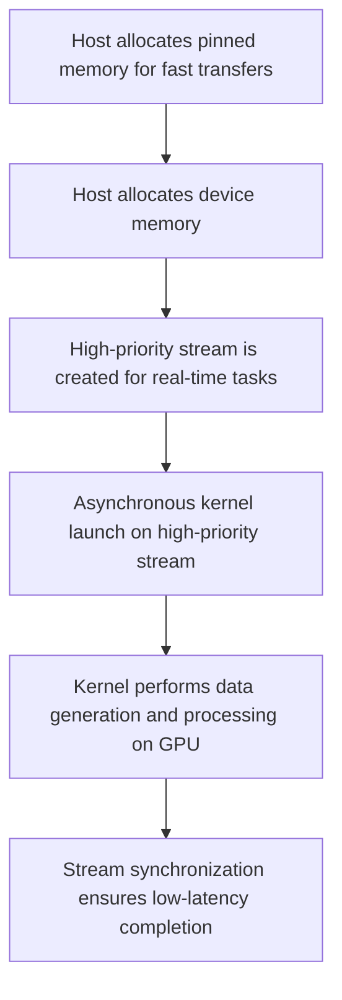
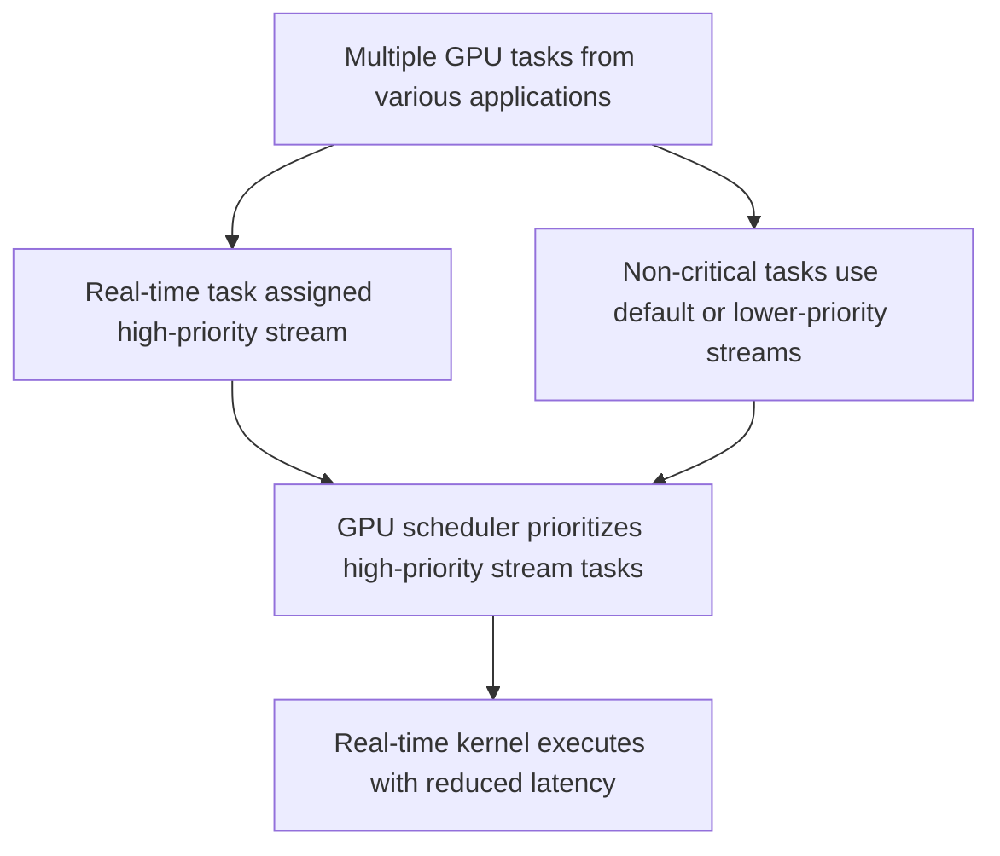

# Day 93: Real-Time GPU Computing Techniques

When applications have real-time constraints, ensuring low-latency and deterministic performance becomes essential. Real-time GPU computing techniques aim to minimize execution latency and maximize predictability, even in a shared or multi-tenant environment. This lesson explores various low-latency execution patterns, the challenges posed by GPU scheduling unpredictability in shared environments, and strategies to overcome these issues. We draw insights from NVIDIA’s documentation on real-time GPU computing and discuss best practices for achieving predictable performance.

---

## Table of Contents

1. [Overview](#1-overview)  
2. [Real-Time Constraints in GPU Computing](#2-real-time-constraints-in-gpu-computing)  
3. [Challenges in a Shared Environment](#3-challenges-in-a-shared-environment)  
4. [Low-Latency Execution Patterns](#4-low-latency-execution-patterns)  
   - [a) Asynchronous Operations and Streams](#a-asynchronous-operations-and-streams)  
   - [b) Pinned Memory and Zero-Copy](#b-pinned-memory-and-zero-copy)  
   - [c) Kernel Fusion for Reduced Overhead](#c-kernel-fusion-for-reduced-overhead)  
   - [d) Prioritizing Tasks and Dedicated GPU Resources](#d-prioritizing-tasks-and-dedicated-gpu-resources)  
5. [Practical Code Example](#5-practical-code-example)  
6. [Conceptual Diagrams](#6-conceptual-diagrams)  
   - [Diagram 1: Real-Time Execution Flow](#diagram-1-real-time-execution-flow)  
   - [Diagram 2: Asynchronous & Pinned Memory Workflow](#diagram-2-asynchronous--pinned-memory-workflow)  
   - [Diagram 3: Task Prioritization in a Shared Environment](#diagram-3-task-prioritization-in-a-shared-environment)  
7. [References & Further Reading](#7-references--further-reading)  
8. [Conclusion & Next Steps](#8-conclusion--next-steps)

---

## 1. Overview

Real-time GPU computing requires techniques that minimize latency, ensuring that each operation meets strict time constraints. Unlike batch processing, real-time tasks cannot tolerate high variability in execution time. Key challenges include unpredictable scheduling when the GPU is shared, overhead from data transfers, and the complexity of managing concurrent operations. In this lesson, we discuss methods to achieve low-latency execution through careful design and tuning.

---

## 2. Real-Time Constraints in GPU Computing

Real-time applications—such as autonomous vehicle systems, financial trading, and interactive simulations—demand:
- **Deterministic Execution:** Consistent response times across executions.
- **Low Latency:** Minimal delay between input and processing results.
- **Prioritized Scheduling:** Guaranteeing that critical tasks are executed without interference.

For GPU-based systems, meeting these constraints involves optimizing both the kernel execution and the data transfer between host and device.

---

## 3. Challenges in a Shared Environment

In a shared GPU environment:
- **Scheduling Unpredictability:** Multiple applications or processes may compete for GPU resources, leading to variable kernel launch latencies.
- **Resource Contention:** Shared memory bandwidth and compute units can become bottlenecks if not managed properly.
- **Interference:** Background processes and system-level tasks may preempt GPU tasks, causing delays in real-time workloads.

Addressing these challenges often requires:
- Isolating critical real-time tasks.
- Using dedicated streams and prioritizing operations.
- Leveraging hardware and driver features designed for low-latency execution.

---

## 4. Low-Latency Execution Patterns

### a) Asynchronous Operations and Streams

Using **multiple CUDA streams** allows you to overlap data transfers with kernel execution. Asynchronous calls (e.g., `cudaMemcpyAsync`) let the GPU work on one task while another data transfer is in progress, reducing overall latency.

### b) Pinned Memory and Zero-Copy

- **Pinned Memory:** Allocating page-locked host memory (using `cudaMallocHost`) improves the speed of data transfers by enabling faster Direct Memory Access (DMA).
- **Zero-Copy:** In some scenarios, accessing host memory directly from the GPU can eliminate explicit transfers entirely, though with some trade-offs in access speed.

### c) Kernel Fusion for Reduced Overhead

Merging multiple small kernels into a single, larger kernel (kernel fusion) can significantly reduce launch overhead, a critical factor in real-time scenarios. However, this must be balanced to avoid excessive resource consumption.

### d) Prioritizing Tasks and Dedicated GPU Resources

- **Task Prioritization:** Assign higher priority to real-time tasks using stream priorities or dedicated GPU instances if available.
- **Resource Reservation:** Where possible, reserve a portion of GPU resources exclusively for real-time operations to avoid interference from non-critical tasks.

---

## 5. Practical Code Example

Below is a simple example that demonstrates asynchronous data transfer using pinned memory, followed by a fused kernel that processes data in a low-latency manner.

```cpp
#include <cuda_runtime.h>
#include <stdio.h>

// Fused kernel: Generate and process data
__global__ void realTimeKernel(float* d_data, int N) {
    int idx = blockIdx.x * blockDim.x + threadIdx.x;
    if (idx < N) {
        // Kernel-side data generation (simulate sensor data)
        float generated = idx * 0.001f;
        // Process data immediately (e.g., apply a simple transformation)
        d_data[idx] = generated * 2.0f;
    }
}

int main() {
    int N = 1 << 20; // 1 million elements
    size_t size = N * sizeof(float);
    float* h_data;
    
    // Allocate pinned memory on host for fast transfers
    cudaMallocHost((void**)&h_data, size);
    
    // Initialize host memory (if needed) - in this case, it's generated on the device.
    
    float* d_data;
    cudaMalloc(&d_data, size);
    
    // Create a high-priority stream for real-time tasks
    cudaStream_t rtStream;
    cudaStreamCreateWithPriority(&rtStream, cudaStreamNonBlocking, -1); // Highest priority
    
    // Asynchronously prefetch or initialize data (simulate minimal transfer)
    // In this case, we may not need to transfer data since the kernel generates it.
    
    // Launch realTimeKernel on the high-priority stream
    int threads = 256;
    int blocks = (N + threads - 1) / threads;
    realTimeKernel<<<blocks, threads, 0, rtStream>>>(d_data, N);
    
    // Synchronize the stream to ensure kernel completion
    cudaStreamSynchronize(rtStream);
    
    // Optionally, copy results back for verification
    // cudaMemcpy(h_data, d_data, size, cudaMemcpyDeviceToHost);
    
    // Cleanup
    cudaFree(d_data);
    cudaFreeHost(h_data);
    cudaStreamDestroy(rtStream);
    
    return 0;
}
```

---

## 6. Comprehensive Conceptual Diagrams

### Diagram 1: Real-Time Execution Flow



**Explanation:**  
This diagram shows the overall flow for a real-time task: using pinned memory, launching a kernel asynchronously in a high-priority stream, and synchronizing to ensure the task completes with minimal latency.

---

### Diagram 2: Asynchronous & Pinned Memory Workflow

```mermaid
flowchart TD
    A[Host: Allocate pinned memory]
    B[Initiate asynchronous data transfer (if needed)]
    C[Kernel: Operate on device memory without blocking]
    D[Overlap data generation/processing with data transfer]
    E[Final synchronization to guarantee completion]
    
    A --> B
    B --> C
    C --> D
    D --> E
```

**Explanation:**  
This diagram details how asynchronous transfers and pinned memory work together to minimize data transfer delays, allowing the kernel to execute concurrently with data movement.

---

### Diagram 3: Task Prioritization in a Shared Environment



**Explanation:**  
This diagram illustrates how assigning a high-priority stream for real-time tasks helps ensure that these tasks are scheduled preferentially over other non-critical tasks, reducing latency in a shared GPU environment.

---

## 7. References & Further Reading

- [CUDA C Best Practices Guide – Data Transfer](https://docs.nvidia.com/cuda/cuda-c-best-practices-guide/index.html#data-transfer)
- [Nsight Systems Documentation](https://docs.nvidia.com/nsight-systems/)
- [NVIDIA Documentation on Real-Time GPU Computing](https://developer.nvidia.com/blog/real-time-gpu-computing/)
- [CUDA Runtime API – cudaMemcpyAsync](https://docs.nvidia.com/cuda/cuda-runtime-api/group__CUDART__MEMORY.html)

---

## 8. Conclusion & Next Steps

For real-time GPU computing, minimizing data transfers and ensuring low-latency execution are paramount. Techniques such as using pinned memory, asynchronous transfers, and kernel-side data generation, combined with high-priority streams, can significantly reduce latency and improve predictability. However, in a shared environment, scheduling unpredictability can still be a challenge. Careful profiling, prioritization, and synchronization are essential to meet real-time constraints.

**Next Steps:**
- **Profile your application** with Nsight Systems to measure real-time performance.
- **Experiment with stream priorities** and asynchronous transfer sizes.
- **Consider kernel-side data generation** for tasks with strict latency requirements.
- **Implement fallback strategies** for scheduling unpredictability in shared environments.
- **Document and iterate** on your approach to continuously refine low-latency patterns.

```
