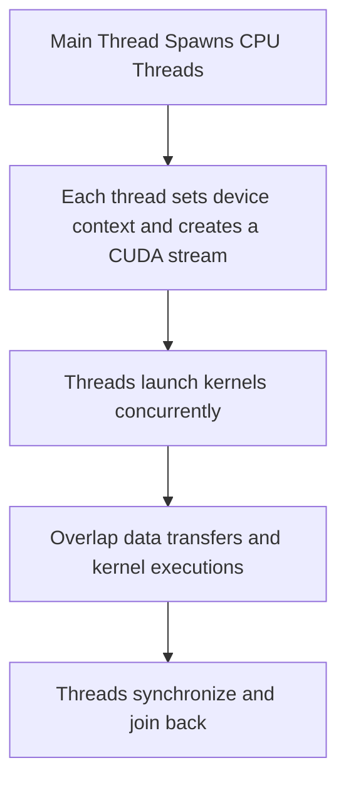
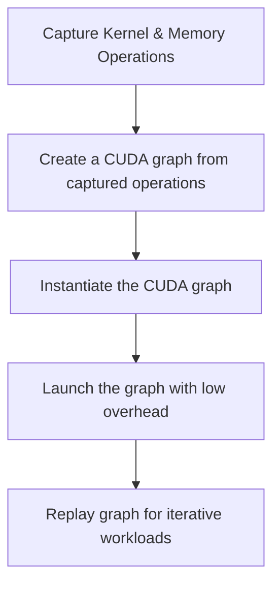
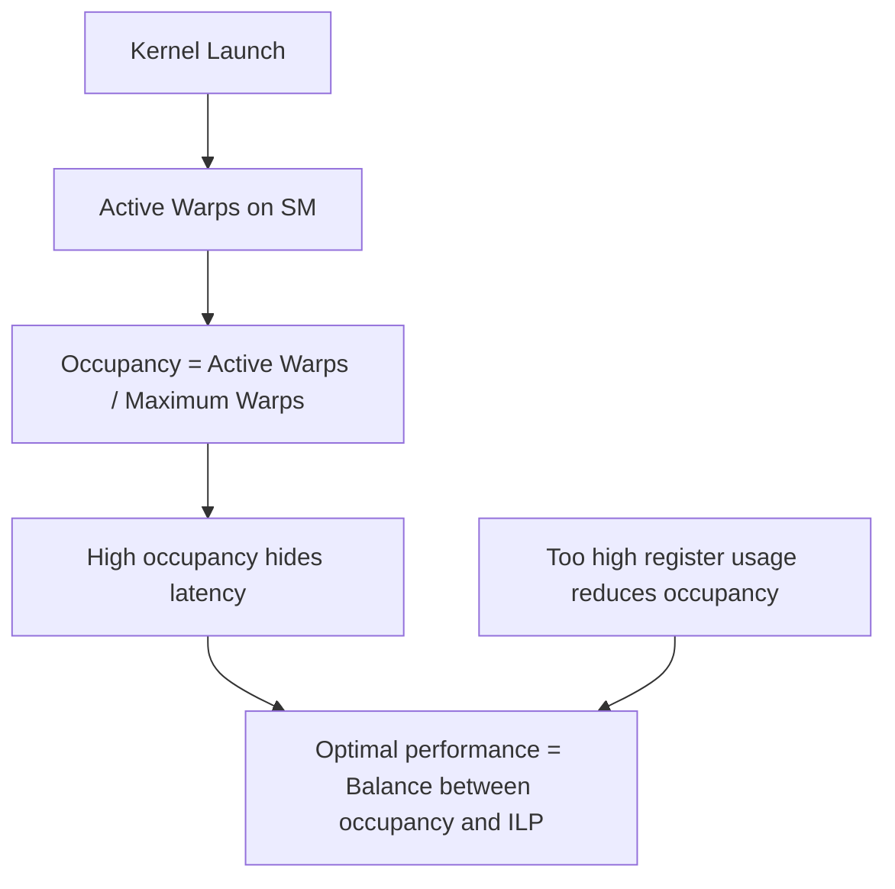
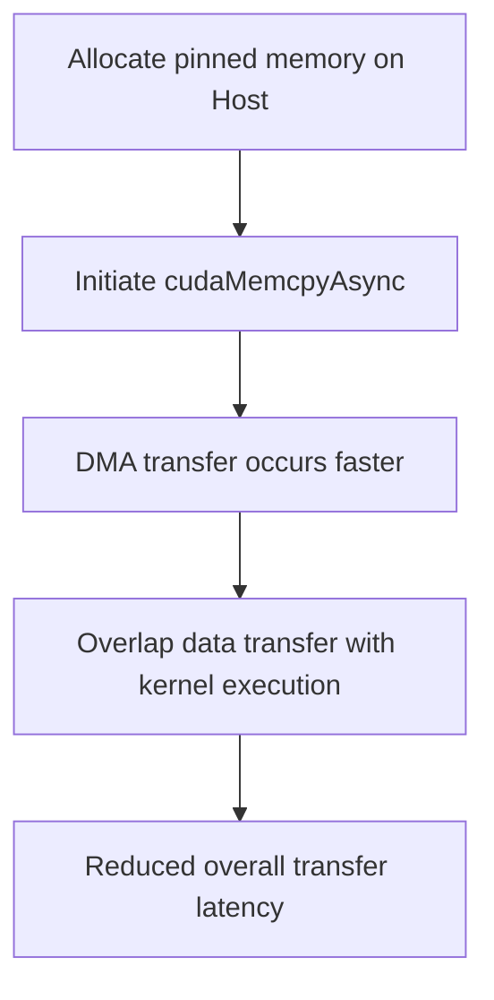
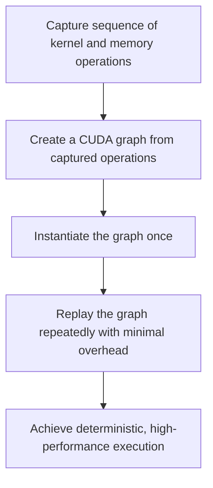
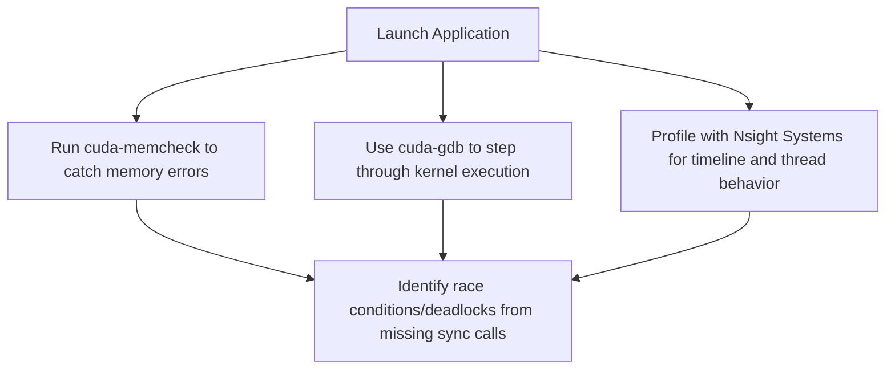
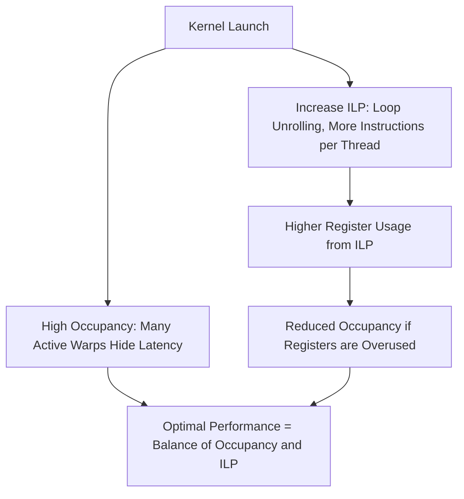
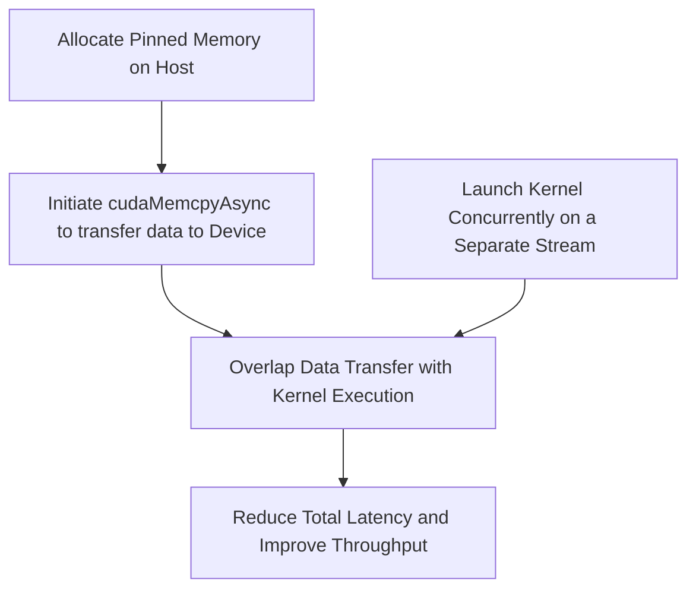
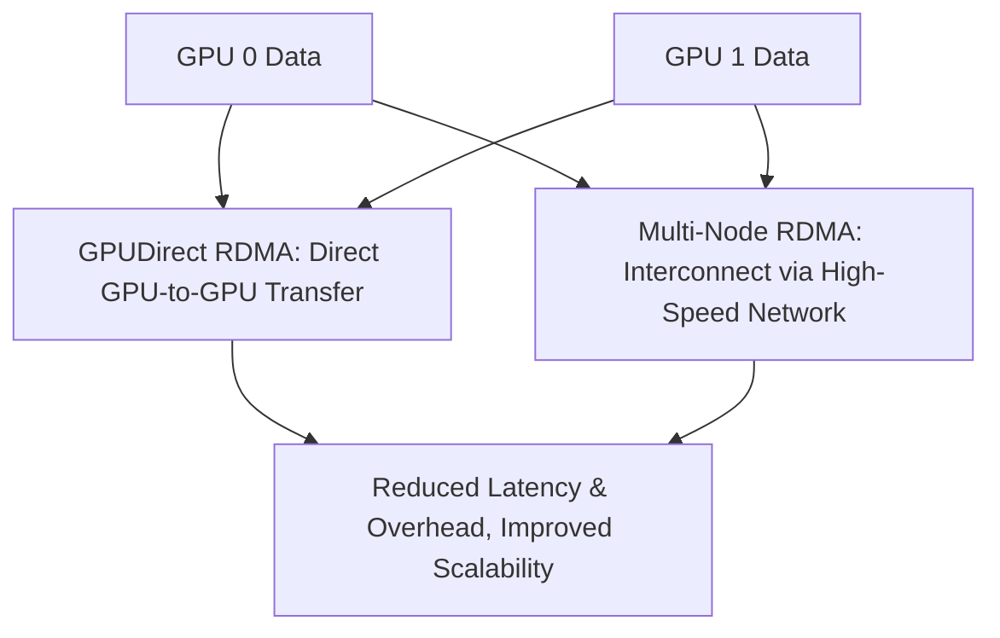

# Day 98: Progress Checkpoint – Advanced Topics Recap

This progress checkpoint summarizes the advanced topics covered in Days 85 through 97. These topics address critical aspects of high-performance GPU computing, including detailed debugging, host multithreading, dynamic CUDA graphs, precision management, advanced memory management, and multi-node scaling. Mastery of these concepts is essential; neglecting them can lead to major issues in large-scale applications.

---

## Table of Contents

1. [Overview](#1-overview)
2. [Summary of Topics (Days 85–97)](#2-summary-of-topics-days-85-97)
   - [Day 85: Instruction Throughput Profiling](#day-85-instruction-throughput-profiling)
   - [Day 86: Occupancy vs. ILP](#day-86-occupancy-vs-ilp)
   - [Day 87: Custom Memory Allocators](#day-87-custom-memory-allocators)
   - [Day 88: Kernel Fusion & Loop Fusion](#day-88-kernel-fusion--loop-fusion)
   - [Day 89: Algorithmic Optimizations (Tiling, Blocking)](#day-89-algorithmic-optimizations-tiling-blocking)
   - [Day 90: Minimizing Data Transfers](#day-90-minimizing-data-transfers)
   - [Day 91: Enterprise-Level Code Structure](#day-91-enterprise-level-code-structure)
   - [Day 92: Advanced Debugging (Races & Deadlocks)](#day-92-advanced-debugging-races--deadlocks)
   - [Day 93: Real-Time GPU Computing Techniques](#day-93-real-time-gpu-computing-techniques)
   - [Day 94: Host Multithreading + GPU Coordination](#day-94-host-multithreading--gpu-coordination)
   - [Day 95: CUDA Graph Updates & Reusability](#day-95-cuda-graph-updates--reusability)
   - [Day 96: Precision & Numerical Stability](#day-96-precision--numerical-stability)
   - [Day 96b: Advanced Precision & Error Mitigation Techniques](#day-96b-advanced-precision--error-mitigation-techniques)
   - [Day 97: Advanced P2P & Clustering](#day-97-advanced-p2p--clustering)
3. [Conclusion & Next Steps](#3-conclusion--next-steps)

---

## 1. Overview

Days 85 through 97 cover advanced topics essential for the development of robust, high-performance GPU applications. These sessions dive into microarchitectural performance profiling, synchronization challenges, memory management techniques, precision handling, dynamic graph updates, and distributed computing across multiple GPUs and nodes. Integrating these techniques ensures that large-scale applications run efficiently and reliably.

---

## 2. Summary of Topics (Days 85–97)

### Day 85: Instruction Throughput Profiling
- **Focus:** Measure how effectively your kernel executes machine-level instructions.
- **Key Points:**
  - Use Nsight Compute to track achieved FLOPS, instruction mix, and pipeline efficiency.
  - Understand the utilization of special function units and differences between FP32 and FP64.

### Day 86: Occupancy vs. ILP
- **Focus:** Balance the benefits of high occupancy with the advantages of increased Instruction-Level Parallelism.
- **Key Points:**
  - High occupancy hides memory latency but can suffer if forced ILP increases register usage too much.
  - Profiling and iterative tuning are essential to find the optimal balance.

### Day 87: Custom Memory Allocators
- **Focus:** Extend your custom memory pool design to support stream-ordered allocations.
- **Key Points:**
  - Use atomic operations (e.g., atomicAdd) to manage a global offset in a memory pool.
  - Mitigate race conditions when multiple streams allocate concurrently.
  - Consider cudaMallocAsync for stream-specific allocations.

### Day 88: Kernel Fusion & Loop Fusion
- **Focus:** Merge multiple small kernels or loops to reduce launch overhead and improve data locality.
- **Key Points:**
  - Fusion can reduce global memory accesses and synchronization overhead.
  - Over-fusion risks increased register and shared memory usage, which may lower occupancy.

### Day 89: Algorithmic Optimizations (Tiling, Blocking)
- **Focus:** Optimize algorithms (matrix multiplication, convolution) by partitioning data into manageable tiles.
- **Key Points:**
  - Tiling improves cache performance and data reuse.
  - Over-tiling can lead to management overhead that offsets the benefits.
  - Iterative tuning is required to choose the optimal tile size.

### Day 90: Minimizing Data Transfers
- **Focus:** Reduce PCIe transfer overhead using pinned memory, asynchronous transfers, and kernel-side data generation.
- **Key Points:**
  - Pinned memory speeds up transfers via DMA.
  - Asynchronous transfers (cudaMemcpyAsync) allow overlapping communication with computation.
  - Generating data on the GPU can eliminate the need for transfers entirely.

### Day 91: Enterprise-Level Code Structure
- **Focus:** Organize large CUDA projects using a multi-file, multi-module approach with separate compilation and linking.
- **Key Points:**
  - Use header files to define interfaces and source files for implementation.
  - Properly set NVCC flags (e.g., -rdc=true) to avoid linker errors.
  - A robust build system (e.g., CMake) is crucial for maintainability and portability.

### Day 92: Advanced Debugging (Races & Deadlocks)
- **Focus:** Diagnose and resolve race conditions and deadlocks in complex multi-stream or multi-block scenarios.
- **Key Points:**
  - Incorrect use of __syncthreads() in divergent code paths can lead to deadlocks.
  - Tools like cuda-memcheck, cuda-gdb, and Nsight Systems are invaluable for debugging.
  - Ensure consistent synchronization and correct ordering across threads.

### Day 93: Real-Time GPU Computing Techniques
- **Focus:** Achieve low-latency, deterministic execution for real-time applications.
- **Key Points:**
  - Use high-priority streams and asynchronous operations to minimize latency.
  - Techniques like kernel-side data generation and pinned memory further reduce delays.
  - Special considerations are required in shared environments to avoid scheduling unpredictability.

### Day 94: Host Multithreading + GPU Coordination
- **Focus:** Leverage multiple CPU threads to launch kernels and manage streams concurrently.
- **Key Points:**
  - Use C++ threads to set device contexts and create individual CUDA streams.
  - Proper synchronization is crucial to avoid CPU thread contention.
  - Balance the number of threads with available CPU cores for optimal performance.

### Day 95: CUDA Graph Updates & Reusability
- **Focus:** Dynamically update parts of a CUDA graph without a full rebuild.
- **Key Points:**
  - The cudaGraphExecUpdate API allows for modifying graph node parameters.
  - Maintain correct graph node handles to avoid crashes.
  - Graph updates enable adaptability to changing conditions with minimal overhead.

### Day 96: Precision & Numerical Stability
- **Focus:** Understand and mitigate error accumulation in floating-point computations.
- **Key Points:**
  - Small rounding errors can compound over iterations.
  - Compare float and double precision; choose based on accuracy requirements.
  - The Kahan Summation Algorithm can significantly reduce error accumulation.

### Day 96b: Advanced Precision & Error Mitigation Techniques
- **Focus:** Dive deeper into advanced techniques beyond Kahan summation.
- **Key Points:**
  - Explore pairwise and Neumaier summation for enhanced accuracy.
  - Hybrid precision strategies combine the speed of low precision with high-precision accumulation.
  - Iterative refinement can correct errors from the low-precision phase.

### Day 97: Advanced P2P & Clustering
- **Focus:** Enable high-speed, low-latency data transfers between GPUs and across nodes using GPUDirect RDMA.
- **Key Points:**
  - Direct GPU-to-GPU transfers reduce PCIe overhead.
  - Multi-node clustering with GPUDirect RDMA enables scalable, distributed GPU computing.
  - Hardware compatibility and proper configuration are critical for success.

---

## 3. Conclusion & Next Steps

The advanced topics covered from Days 85 through 97 are crucial for building large-scale, high-performance GPU applications. They address fine-grained performance profiling, resource management, synchronization, precision control, dynamic graph updates, and scalable multi-GPU techniques. Missing these techniques can lead to major issues such as race conditions, deadlocks, inefficient resource usage, and numerical inaccuracies, all of which can cripple large applications.

**Next Steps:**
- **Integrate these techniques** into your project designs and continuously profile your applications using tools like Nsight Compute and Nsight Systems.
- **Experiment and iterate:** Tuning occupancy, ILP, and memory management parameters is key to achieving optimal performance.
- **Ensure robust synchronization:** Properly manage host multithreading and CUDA graph updates to prevent crashes and deadlocks.
- **Prioritize precision:** Choose the right precision level and summation method for your application's accuracy requirements.
- **Scale your applications:** Leverage GPUDirect RDMA and clustering techniques for multi-GPU and multi-node deployments.


```

```
# Day 98: Progress Checkpoint – Easy Theoretical Quiz

Below are 10 easy-level LeetCode-style theoretical questions along with detailed solutions. These questions recap advanced debugging, host multithreading, CUDA graphs, and precision topics covered in Days 85–97. Each question is accompanied by a comprehensive Mermaid diagram that illustrates the key concepts.

---

### 1. What is the purpose of advanced debugging in CUDA?

**Answer:**  
Advanced debugging in CUDA is used to diagnose complex issues such as race conditions and deadlocks in multi-stream or multi-block applications. Tools like cuda-gdb, cuda-memcheck, and Nsight Systems help trace execution, inspect memory accesses, and verify that synchronization primitives are correctly applied.

**Mermaid Diagram:**

```mermaid
flowchart TD
    A[Start Debugging]
    B[Use cuda-memcheck to detect memory errors]
    C[Launch cuda-gdb for step-by-step debugging]
    D[Profile with Nsight Systems for timeline analysis]
    E[Identify race conditions or deadlocks]
    F[Fix synchronization (e.g., proper __syncthreads())]
    
    A --> B
    B --> C
    C --> D
    D --> E
    E --> F
```

---

### 2. Why is host multithreading important for GPU coordination?

**Answer:**  
Host multithreading allows multiple CPU threads to concurrently manage CUDA streams and launch kernels. This increases throughput by overlapping CPU preparation and GPU execution, ensuring that the GPU remains fully utilized even when managing multiple tasks.

**Mermaid Diagram:**



---

### 3. What are CUDA graphs and how do they benefit application performance?

**Answer:**  
CUDA graphs allow you to capture a sequence of kernel launches and memory operations as a graph, which can be instantiated and replayed with minimal overhead. They reduce kernel launch latency and enforce explicit dependencies, thereby improving performance and predictability in repetitive workflows.

**Mermaid Diagram:**



---

### 4. How does numerical precision affect iterative computations in GPU applications?

**Answer:**  
Numerical precision determines the number of significant digits used in calculations. In iterative computations, small rounding errors can accumulate over many iterations, leading to significant inaccuracies. Choosing between float (lower precision) and double (higher precision) is crucial, and algorithms like Kahan summation can mitigate error accumulation.

**Mermaid Diagram:**

```mermaid
flowchart TD
    A[Iterative Computation Begins]
    B[Perform floating-point addition (float vs. double)]
    C[Small rounding errors introduced]
    D[Errors accumulate over iterations]
    E[Final result deviates from true value]
    
    A --> B
    B --> C
    C --> D
    D --> E
```

---

### 5. What is the Kahan Summation Algorithm used for?

**Answer:**  
The Kahan Summation Algorithm is used to reduce the error accumulation in the summation of floating-point numbers. It maintains a compensation variable to correct for small rounding errors at each addition, leading to a more accurate final result.

**Mermaid Diagram:**

```mermaid
flowchart TD
    A[Initialize sum = 0, compensation c = 0]
    B[For each element x in data]
    C[Compute adjusted value: y = x - c]
    D[Update sum: t = sum + y]
    E[Update compensation: c = (t - sum) - y]
    F[Set sum = t]
    G[Final accurate sum = sum + c]
    
    A --> B
    B --> C
    C --> D
    D --> E
    E --> F
    F --> G
```

---

### 6. What role does occupancy play in kernel performance?

**Answer:**  
Occupancy refers to the ratio of active warps on an SM to the maximum number of warps supported. High occupancy helps hide memory latency by allowing the GPU to switch between warps. However, maximizing occupancy without considering other factors (such as instruction-level parallelism) may not always lead to optimal performance.

**Mermaid Diagram:**



---

### 7. What is the significance of using pinned memory in data transfers?

**Answer:**  
Pinned (page-locked) memory enables faster data transfers between the host and device by allowing direct memory access (DMA). It also supports asynchronous transfers, which can overlap with kernel execution, thereby reducing overall data transfer latency.

**Mermaid Diagram:**



---

### 8. What is a cooperative group and how does it aid synchronization?

**Answer:**  
Cooperative groups are an API that allows threads to form groups beyond the traditional block level, including grid-level synchronization. They enable fine-grained control of synchronization, which is essential for complex collective operations across multiple blocks.

**Mermaid Diagram:**

```mermaid
flowchart TD
    A[Threads within a block form a cooperative group]
    B[Invoke cooperative_groups::this_grid() for grid-level sync]
    C[Call grid.sync() to synchronize all threads in the grid]
    D[Ensure correct order of operations across blocks]
    
    A --> B
    B --> C
    C --> D
```

---

### 9. How does GPU-to-GPU (P2P) communication benefit multi-GPU applications?

**Answer:**  
GPU-to-GPU communication using P2P allows direct data transfers between GPUs without involving the host, reducing latency and CPU overhead. This is particularly useful in multi-GPU and multi-node systems for scaling applications and improving data throughput.

**Mermaid Diagram:**

```mermaid
flowchart TD
    A[GPU 0 holds data]
    B[GPU 1 holds data]
    C[Direct P2P transfer (cudaMemcpyPeerAsync)]
    D[Bypass host, reduce latency]
    E[Improved throughput and scalability]
    
    A --> C
    B --> C
    C --> D
    D --> E
```

---

### 10. Why is it important to use CUDA graphs for repetitive workflows?

**Answer:**  
CUDA graphs capture a series of operations into a single, replayable entity, drastically reducing kernel launch overhead for repetitive tasks. They provide deterministic execution and allow efficient replays of complex workflows, which is crucial for iterative applications and real-time processing.

**Mermaid Diagram:**



---

## 10. Conclusion & Next Steps

These 10 easy theoretical questions recap fundamental concepts from Days 85–97, including advanced debugging, host multithreading, CUDA graphs, precision management, and P2P communication. Mastery of these topics is essential to build robust, high-performance GPU applications.

**Next Steps:**
- Review these concepts and verify your understanding with practical coding exercises.
- Explore advanced profiling and debugging tools to further refine your applications.
- Experiment with different synchronization and memory management techniques to optimize performance.

```

```
# Day 98: Progress Checkpoint – Intermediate Theoretical Quiz

Below are 10 intermediate-level LeetCode-style theoretical questions along with detailed solutions. These questions review key concepts from advanced debugging, multi-threaded host code, CUDA graphs, cooperative groups, precision management, and multi-GPU communication (Days 85–97). Each question is accompanied by a comprehensive Mermaid diagram to illustrate the underlying ideas.

---

### 1. How do advanced debugging tools (e.g., cuda-gdb, cuda-memcheck, Nsight Systems) help identify race conditions and deadlocks in CUDA applications?

**Answer:**  
Advanced debugging tools provide:
- **Detailed Timeline Analysis:** Nsight Systems shows the exact timing and sequence of kernel launches, data transfers, and synchronization events.
- **Memory Error Detection:** cuda-memcheck identifies out-of-bound accesses and race conditions by monitoring concurrent memory operations.
- **Step-by-Step Execution:** cuda-gdb enables stepping through kernel code, allowing developers to inspect the execution paths of individual threads and verify that all threads reach synchronization points.
- **Visualization of Divergence:** These tools help reveal divergent paths where some threads might skip synchronization calls (e.g., __syncthreads()), leading to deadlocks.

**Mermaid Diagram:**



---

### 2. What are the benefits and challenges of using multi-threaded host code for GPU coordination?

**Answer:**  
**Benefits:**
- **Increased Throughput:** Multiple CPU threads can concurrently launch kernels and manage streams.
- **Overlapping Work:** Allows simultaneous data transfers, kernel launches, and host-side computation.
- **Improved Responsiveness:** Critical for real-time or interactive applications.

**Challenges:**
- **CPU Thread Contention:** Excessive threads can lead to scheduling overhead and resource contention.
- **Complex Synchronization:** Managing multiple device contexts and synchronizing between threads requires careful design.
- **Proper Context Management:** Each thread must correctly set the device context to avoid conflicts.

**Mermaid Diagram:**

```mermaid
flowchart TD
    A[Main Thread Spawns Multiple CPU Threads]
    B[Each Thread Sets Its Device Context (cudaSetDevice)]
    C[Each Thread Creates Its Own CUDA Stream]
    D[Threads Launch Kernels Concurrently]
    E[Threads Overlap Data Transfer & Computation]
    F[Threads Synchronize Locally and Join]
    
    A --> B
    B --> C
    C --> D
    D --> E
    E --> F
```

---

### 3. How do CUDA graphs improve performance for repetitive workflows?

**Answer:**  
CUDA graphs capture a sequence of kernel launches and memory operations into a single graph, which can be instantiated and replayed repeatedly with minimal launch overhead. This leads to:
- **Reduced Latency:** Fewer individual kernel launches.
- **Deterministic Execution:** Explicit dependencies ensure predictable operation order.
- **Reusability:** Graphs can be updated dynamically if only certain nodes need to change.

**Mermaid Diagram:**

```mermaid
flowchart TD
    A[Capture Kernel and Memory Operations]
    B[Create a CUDA Graph from the Captured Operations]
    C[Instantiate the Graph (cudaGraphExec_t)]
    D[Replay the Graph Repeatedly]
    E[Achieve Deterministic, Low-Overhead Execution]
    
    A --> B
    B --> C
    C --> D
    D --> E
```

---

### 4. What is the role of cooperative groups in achieving grid-level synchronization?

**Answer:**  
Cooperative groups extend synchronization beyond a single block by grouping threads across the entire grid. They provide:
- **Grid-Level Synchronization:** Using `cg::this_grid()` and `grid.sync()` to synchronize all threads.
- **Enhanced Synchronization Control:** Allowing complex collective operations like global reductions.
- **Avoidance of Deadlocks:** Ensuring that all threads reach the synchronization point, even across multiple blocks.

**Mermaid Diagram:**

```mermaid
flowchart TD
    A[Threads in Multiple Blocks Start Execution]
    B[Create Grid-Level Cooperative Group (cg::this_grid())]
    C[Each Block Performs Local Computation]
    D[All Blocks Call grid.sync() for Global Synchronization]
    E[Global Reduction or Collective Operation Proceeds]
    
    A --> B
    B --> C
    C --> D
    D --> E
```

---

### 5. How does the choice between float and double precision affect numerical stability in iterative computations?

**Answer:**  
- **Float Precision:**  
  - **Pros:** Lower memory usage and faster computations.
  - **Cons:** Limited to about 7 decimal digits; rounding errors are more pronounced, which can accumulate over many iterations.
- **Double Precision:**  
  - **Pros:** Provides around 15–16 decimal digits; significantly reduces rounding error accumulation.
  - **Cons:** Higher memory usage and potentially slower performance on hardware optimized for single precision.

Techniques like compensated summation (e.g., Kahan algorithm) can mitigate the error accumulation when using float precision.

**Mermaid Diagram:**

```mermaid
flowchart TD
    A[Perform Iterative Computation]
    B[Float Precision: Lower Memory, Fast but Less Accurate]
    C[Double Precision: Higher Memory, Slower but More Accurate]
    D[Error Accumulation in Float]
    E[Use Compensation Techniques (e.g., Kahan)]
    
    A --> B
    A --> C
    B --> D
    D --> E
```

---

### 6. What is the impact of occupancy on GPU kernel performance, and how can it interact with ILP?

**Answer:**  
- **Occupancy:**  
  - Refers to the ratio of active warps to the maximum supported warps. High occupancy helps hide memory latency.
- **Instruction-Level Parallelism (ILP):**  
  - Increasing ILP (e.g., through loop unrolling) can reduce the number of cycles per thread but may increase register usage.
  
**Interaction:**  
High ILP may reduce the per-thread workload but can lower occupancy if register pressure increases. Optimal performance requires balancing occupancy and ILP.

**Mermaid Diagram:**



---

### 7. How do asynchronous data transfers with pinned memory improve overall performance?

**Answer:**  
Pinned memory enables faster data transfers by allowing direct DMA, and asynchronous transfers (using `cudaMemcpyAsync`) allow these transfers to overlap with kernel execution. This overlap minimizes idle GPU time and reduces overall PCIe transfer latency.

**Mermaid Diagram:**



---

### 8. What benefits does GPUDirect RDMA offer in multi-GPU and multi-node clustering environments?

**Answer:**  
GPUDirect RDMA allows GPUs to directly transfer data between each other or with network interfaces, bypassing the host CPU. This results in:
- **Lower Latency:** Faster data exchange due to reduced CPU intervention.
- **Reduced Overhead:** Less burden on the host, freeing CPU resources for other tasks.
- **Improved Scalability:** Efficient multi-GPU and multi-node communication for distributed computing.

**Mermaid Diagram:**



---

### 9. How do dynamic graph updates contribute to application performance?

**Answer:**  
Dynamic graph updates allow modifications to an already instantiated CUDA graph without requiring a complete rebuild. This enables:
- **Adaptability:** Changing kernel parameters or data pointers on the fly.
- **Reduced Overhead:** Avoids the cost of full graph reconstruction.
- **Reusability:** Graphs can be updated incrementally, maintaining efficient execution for iterative or adaptive workflows.

**Mermaid Diagram:**

```mermaid
flowchart TD
    A[Capture Initial CUDA Graph]
    B[Instantiate Graph (GraphExec)]
    C[Run Graph for Baseline Execution]
    D[Detect Need for Update (e.g., parameter change)]
    E[Update Specific Node Parameters with cudaGraphExecUpdate]
    F[Re-launch Updated Graph]
    
    A --> B
    B --> C
    C --> D
    D --> E
    E --> F
```

---

### 10. What is iterative refinement in the context of numerical precision, and why is it important?

**Answer:**  
Iterative refinement is a process where an initial approximate solution (often computed in lower precision) is progressively improved by calculating and correcting the error in higher precision. It is important because:
- **Accuracy:** It improves the final solution accuracy without sacrificing the speed benefits of low-precision arithmetic.
- **Error Correction:** Helps mitigate the impact of rounding errors and error accumulation in iterative computations.

**Mermaid Diagram:**

```mermaid
flowchart TD
    A[Initial Computation in Low Precision (e.g., FP16)]
    B[Compute Residual/Error in Higher Precision (FP32/FP64)]
    C[Update the Solution with Correction]
    D[Repeat Until Convergence]
    E[Final Accurate Result Achieved]
    
    A --> B
    B --> C
    C --> D
    D --> E
```

---

## Conclusion & Next Steps

These 10 intermediate theoretical questions reinforce the core concepts from Days 85–97, covering advanced debugging, host multithreading, CUDA graphs, precision handling, and GPU-to-GPU communication. They provide a solid foundation for understanding and troubleshooting complex GPU applications.

**Next Steps:**
- Deepen your practical understanding by implementing related code examples.
- Use profiling and debugging tools to validate these concepts in real applications.
- Continue exploring how these techniques interact in large-scale, high-performance systems.

```

```
# Day 98: Progress Checkpoint – Hard Theoretical Quiz

Below are 10 hard-level LeetCode-style theoretical questions along with detailed solutions that cover advanced debugging, host multithreading, CUDA graphs, precision, multi-GPU communication, and other topics from Days 85–97. Each question is followed by a comprehensive Mermaid diagram illustrating the core concepts.

---

### 1. How can divergent control flow within a kernel lead to a deadlock when using __syncthreads(), and what steps would you take to debug and fix such an issue?

**Solution:**  
Divergent control flow causes some threads in a block to skip the __syncthreads() barrier, while others execute it. Since __syncthreads() requires that every thread in the block reaches the barrier, missing calls lead to a deadlock where the threads that reached __syncthreads() wait indefinitely.

**Debugging Steps:**
- **Use cuda-memcheck** to detect deadlocks and race conditions.
- **Inspect control flow** in the kernel code, ensuring that all threads follow the same execution path around __syncthreads().
- **Leverage cuda-gdb** to step through the kernel and identify which threads are not reaching the synchronization.
- **Refactor the code** so that __syncthreads() is called unconditionally by all threads.

**Mermaid Diagram:**

```mermaid
flowchart TD
    A[Kernel Start]
    B[Evaluate Condition]
    C1[Branch 1: Calls __syncthreads()]
    C2[Branch 2: Skips __syncthreads()]
    D[Threads waiting at barrier]
    E[Deadlock Occurs]
    
    A --> B
    B -- True --> C1
    B -- False --> C2
    C1 --> D
    C2 -.-> E
    D --> E
```

---

### 2. Explain the trade-offs between increasing Instruction-Level Parallelism (ILP) through loop unrolling and maintaining high occupancy. How would you decide on the optimal balance using profiling metrics?

**Solution:**  
Increasing ILP via loop unrolling can reduce the total number of loop iterations and expose more parallelism within each thread, but it increases register usage per thread. Higher register usage may decrease occupancy because fewer threads can run concurrently on an SM.  
**Metrics to Consider:**
- **Register Usage:** Check with Nsight Compute to see if unrolling causes register spilling.
- **Occupancy:** Monitor the active warp occupancy.
- **Execution Time:** Measure overall kernel performance.
**Optimal Balance:** Achieved by iterative tuning—experiment with different unrolling factors while monitoring the trade-off between decreased instruction count and lowered occupancy.

**Mermaid Diagram:**

```mermaid
flowchart TD
    A[Loop Unrolling Increases ILP]
    B[Higher Register Usage per Thread]
    C[Lower Occupancy]
    D[Reduced Loop Iterations]
    E[Shorter Execution per Thread]
    F[Optimal Performance]
    
    A --> D
    A --> B
    B --> C
    D --> F
    C --> F
```

---

### 3. In a multi-threaded host application managing multiple CUDA streams, how do you ensure that device contexts and stream creations do not lead to race conditions? Describe the synchronization mechanisms you would employ.

**Solution:**  
Each CPU thread must call `cudaSetDevice()` to establish the correct device context before creating and using its own CUDA streams. To prevent race conditions:
- **Per-Thread Streams:** Each thread creates and manages its own CUDA stream independently.
- **Thread Synchronization:** Use standard C++ thread synchronization (e.g., mutexes, condition variables) if shared data between threads is accessed.
- **Minimal Cross-Thread Interaction:** Design the application so that threads do not interfere with each other’s stream management.
- **Profiling and Tuning:** Monitor CPU thread scheduling to avoid oversubscription.

**Mermaid Diagram:**

```mermaid
flowchart TD
    A[Main Thread Spawns Multiple CPU Threads]
    B[Each Thread Calls cudaSetDevice()]
    C[Each Thread Creates Its Own CUDA Stream]
    D[Threads Launch Kernels Independently]
    E[Threads Synchronize Locally (cudaStreamSynchronize)]
    F[Threads Join Back]
    
    A --> B
    B --> C
    C --> D
    D --> E
    E --> F
```

---

### 4. Describe the process of updating a CUDA graph using cudaGraphExecUpdate. What potential pitfalls must be avoided to ensure the updated graph remains valid?

**Solution:**  
The process involves:
- **Capturing a CUDA Graph:** Initially capture a sequence of operations into a CUDA graph.
- **Instantiating the Graph:** Create a graph executable (cudaGraphExec_t) from the captured graph.
- **Modifying Node Parameters:** Prepare new kernel node parameters (e.g., updated arguments, grid dimensions).
- **Calling cudaGraphExecUpdate:** Update the existing graph executable with the new parameters.
**Pitfalls:**
- **Incorrect Node Handle Management:** Failing to correctly reference and update the node handles can lead to crashes.
- **Broken Dependencies:** Changing node parameters without preserving dependency relationships may lead to synchronization issues.
- **Insufficient Error Checking:** Always verify the return status of cudaGraphExecUpdate to handle errors.

**Mermaid Diagram:**

```mermaid
flowchart TD
    A[Capture initial CUDA graph]
    B[Instantiate graph executable (graphExec)]
    C[Identify node(s) to update]
    D[Prepare new node parameters]
    E[Call cudaGraphExecUpdate to modify graphExec]
    F[Graph executable updated successfully]
    
    A --> B
    B --> C
    C --> D
    D --> E
    E --> F
```

---

### 5. How does the Kahan Summation Algorithm mitigate rounding errors in floating-point summation, and in what scenarios might it still be insufficient?

**Solution:**  
The Kahan Summation Algorithm reduces error by maintaining a separate compensation variable that captures lost low-order bits during each addition. This helps correct the running sum by adjusting for rounding errors.  
**Limitations:**
- **Performance Overhead:** The algorithm introduces extra arithmetic operations, which may slow down performance.
- **Extreme Variance:** When the magnitude of summands varies widely, even Kahan may not fully compensate for the errors.
- **Repeated Iterations:** In extremely iterative processes, error accumulation might still occur, requiring even more sophisticated techniques like iterative refinement.

**Mermaid Diagram:**

```mermaid
flowchart TD
    A[Initialize sum = 0, c = 0]
    B[For each element x, compute y = x - c]
    C[Update sum: t = sum + y]
    D[Compute new c = (t - sum) - y]
    E[Update sum = t]
    F[Repeat for all elements → Reduced rounding error]
    
    A --> B
    B --> C
    C --> D
    D --> E
    E --> F
```

---

### 6. Explain the concept of iterative refinement in a hybrid precision strategy. How does it improve the accuracy of a solution computed in low precision?

**Solution:**  
Iterative refinement involves:
- **Initial Low-Precision Computation:** Compute an approximate solution using low-precision arithmetic (e.g., FP16).
- **Error Computation:** Calculate the residual error between the low-precision solution and the true solution in higher precision (FP32 or FP64).
- **Correction Step:** Update the solution iteratively using the high-precision error, thereby refining the initial result.
This process leverages the speed of low precision while mitigating its accuracy limitations through periodic high-precision corrections.

**Mermaid Diagram:**

```mermaid
flowchart TD
    A[Compute initial solution in low precision]
    B[Compute residual error in high precision]
    C[Correct the solution with high-precision error]
    D[Iterate until convergence]
    E[Final refined solution]
    
    A --> B
    B --> C
    C --> D
    D --> E
```

---

### 7. In a multi-GPU system, how do you ensure fault tolerance when using GPUDirect RDMA for inter-GPU communication?

**Solution:**  
Fault tolerance in multi-GPU GPUDirect RDMA systems can be achieved by:
- **Hardware Verification:** Ensuring that all GPUs and network interfaces support GPUDirect RDMA.
- **Redundancy:** Implementing redundancy in data transfers so that if one transfer fails, alternative paths (e.g., host-mediated transfers) can be used.
- **Monitoring Metrics:** Continuously monitoring transfer latency and error rates using profiling tools.
- **Error Recovery Mechanisms:** Incorporating fallback strategies that automatically retry transfers or switch to alternate communication paths.
- **Synchronization:** Ensuring proper synchronization across GPUs to detect incomplete transfers.
  
**Mermaid Diagram:**

```mermaid
flowchart TD
    A[GPUDirect RDMA enabled GPUs]
    B[Initiate direct GPU-to-GPU transfer]
    C[Monitor transfer metrics (latency, errors)]
    D{Transfer Successful?}
    E[If Yes, proceed with computation]
    F[If No, fallback to host-mediated transfer]
    G[Synchronize and merge data]
    
    A --> B
    B --> C
    C --> D
    D -- Yes --> E
    D -- No --> F
    E --> G
    F --> G
```

---

### 8. How can advanced occupancy tuning be used to balance register usage and memory latency, and what role do compiler flags like -maxrregcount play?

**Solution:**  
Advanced occupancy tuning involves adjusting kernel launch parameters to maximize the number of active warps on an SM.  
- **Register Usage:** Reducing the register count per thread (using `-maxrregcount`) increases occupancy, but excessive reduction may cause register spilling, increasing memory latency.
- **Memory Latency:** High occupancy helps hide memory latency, but if unrolling or other optimizations increase register usage, occupancy can drop.
- **Balancing Act:** Profiling tools help determine if reducing register count improves performance without incurring excessive spilling.
  
**Mermaid Diagram:**

```mermaid
flowchart TD
    A[Kernel Code with Loop Unrolling]
    B[High Register Usage per Thread]
    C[Use -maxrregcount to Limit Registers]
    D[Increased Occupancy]
    E[Potential Register Spilling]
    F[Measure Performance via Nsight Compute]
    G[Optimal Balance Achieved]
    
    A --> B
    B --> C
    C --> D
    D --> F
    B --> E
    E --> F
    F --> G
```

---

### 9. Describe a scenario where improper graph updates lead to crashes. How would you diagnose and correct such issues using CUDA Graph Update APIs?

**Solution:**  
A scenario might involve updating a kernel node’s parameters (e.g., changing grid dimensions or kernel arguments) without preserving the original dependency relationships. This can result in invalid memory accesses or synchronization errors, leading to crashes.  
**Diagnosis:**
- **Error Checking:** Monitor return values from `cudaGraphExecUpdate` to detect update failures.
- **Review Dependencies:** Ensure that updated nodes maintain the correct order and that all node handles are valid.
- **Debugging:** Use cuda-gdb and Nsight Systems to trace the execution flow and inspect node handles.
  
**Correction:**
- **Rebuild Partially:** Update only the necessary parameters while keeping the dependency graph intact.
- **Validation:** Re-instantiate the graph after updates and test with small workloads.
  
**Mermaid Diagram:**

```mermaid
flowchart TD
    A[Initial CUDA Graph Captured]
    B[Attempt to Update Kernel Node Parameters]
    C[Node Dependencies Broken]
    D[cudaGraphExecUpdate Fails/Crashes]
    E[Diagnose via Error Codes and Debugging Tools]
    F[Preserve Node Dependencies and Correct Node Handles]
    G[Graph Update Succeeds]
    
    A --> B
    B --> C
    C --> D
    D --> E
    E --> F
    F --> G
```

---

### 10. In enterprise-level CUDA projects, how does separate compilation and linking ensure modularity, and what issues can arise if NVCC flags are misconfigured?

**Solution:**  
Separate compilation and linking allow developers to split the project into multiple source files, promoting modularity, easier maintenance, and independent testing. NVCC flags like `-rdc=true` enable relocatable device code, and `-arch=sm_xx` specifies the target architecture.  
**Issues if Misconfigured:**
- **Undefined Symbols:** Without `-rdc=true`, device code may not link properly, causing undefined symbol errors.
- **Linker Errors:** Incorrect architecture flags may lead to binary incompatibilities.
- **Maintenance Challenges:** Inconsistent flags across modules can lead to difficult-to-debug runtime errors.
  
**Mermaid Diagram:**

```mermaid
flowchart TD
    A[Source Files Organized into Modules]
    B[Header Files Define Interfaces]
    C[NVCC Compiles Each Module Separately (-rdc=true)]
    D[Object Files Generated]
    E[Linker Combines Modules into Final Executable]
    F[Correct NVCC Flags Ensure Compatibility]
    G[Misconfiguration Leads to Undefined Symbols and Linker Errors]
    
    A --> B
    B --> C
    C --> D
    D --> E
    E --> F
    F --- G
```

---

## Conclusion & Next Steps

These 10 hard theoretical questions address advanced topics such as graph updates, occupancy tuning, multi-threaded host coordination, precision strategies, and enterprise-level code organization. By mastering these concepts, you can design robust and efficient GPU applications that scale from single-node systems to multi-node clusters while maintaining numerical accuracy and performance.

**Next Steps:**
- Implement and profile these advanced techniques in your projects.
- Use profiling tools (Nsight Compute, Nsight Systems) to validate your optimizations.
- Continue to refine your synchronization and precision strategies.
- Document best practices to ensure maintainability in large-scale projects.

```

```
# Day 98: Progress Checkpoint – Highly Advanced Theoretical Quiz (God Mode)

Below are 10 highly advanced/expert-level theoretical questions designed in a LeetCode-style format. These questions cover the most challenging aspects of advanced CUDA programming—including debugging, occupancy versus ILP trade-offs, dynamic CUDA graph updates, mixed precision iterative refinement, fault-tolerant cooperative reductions, multi-node GPUDirect RDMA, host multithreading with dynamic graph updates, and enterprise-level design. Each question is accompanied by a detailed solution and a comprehensive Mermaid diagram to illustrate the key concepts.

---

### 1. Advanced Deadlock Debugging in Divergent Kernels

**Question:**  
In a complex kernel with nested conditional branches and multiple __syncthreads() calls, describe an advanced strategy to detect and resolve a deadlock caused by divergent control flow. How would you employ cuda-gdb and Nsight Systems to pinpoint the problem, and what modifications would you implement to ensure all threads reach the synchronization barrier?

**Solution:**  
Divergent control flow that causes some threads to skip __syncthreads() leads to deadlock. An advanced strategy involves:
- **Using cuda-memcheck and cuda-gdb:**  
  - Run the kernel under cuda-memcheck to flag potential deadlock warnings.
  - Use cuda-gdb to step through the kernel, examining thread execution paths and verifying that every thread in each block reaches __syncthreads().
- **Nsight Systems Profiling:**  
  - Visualize the timeline of kernel execution to identify blocks that hang.
- **Code Modification:**  
  - Refactor conditional branches so that __syncthreads() is called unconditionally by all threads, even if the work performed in each branch differs.
  - For example, compute the condition and then use an if-else that both include a __syncthreads() outside the branch.

**Mermaid Diagram:**

```mermaid
flowchart TD
    A[Kernel Start]
    B[Evaluate Divergent Condition]
    C[Branch A: Compute and call __syncthreads()]
    D[Branch B: Compute but skip __syncthreads()]
    E[Deadlock occurs when some threads wait indefinitely]
    F[Use cuda-gdb: Step through threads to see divergence]
    G[Nsight Systems: Visualize timeline, identify hanging blocks]
    H[Refactor code: Move __syncthreads() after condition]
    I[All threads call __syncthreads() unconditionally]
    J[Deadlock resolved]

    A --> B
    B -- True --> C
    B -- False --> D
    C --> E
    D --> E
    E --> F
    F --> G
    G --> H
    H --> I
    I --> J
```

---

### 2. Balancing ILP and Occupancy Under Register Constraints

**Question:**  
Explain how aggressive loop unrolling to increase ILP can lead to register spilling and reduced occupancy. What advanced profiling metrics would you use to decide on the optimal unrolling factor, and how would you adjust compilation flags (like -maxrregcount) to achieve a balance?

**Solution:**  
Loop unrolling increases ILP by reducing loop overhead but increases register usage per thread. Excessive register usage may force the compiler to spill registers to local memory, which increases latency and reduces occupancy. To decide on the optimal unrolling factor:
- **Profile with Nsight Compute:**  
  - Monitor register usage per thread.
  - Check occupancy and note if kernel performance degrades due to register spilling.
- **Use Compiler Flags:**  
  - Experiment with `-maxrregcount` to limit register usage.
- **Iterative Tuning:**  
  - Adjust unrolling factors iteratively, comparing throughput and occupancy metrics until a balance is achieved.

**Mermaid Diagram:**

```mermaid
flowchart TD
    A[Apply Loop Unrolling for ILP]
    B[Increase in Register Usage]
    C[Possible Register Spilling]
    D[Reduced Occupancy]
    E[Profile with Nsight Compute]
    F[Measure Register Usage and Occupancy]
    G[Adjust -maxrregcount and Unroll Factor]
    H[Balance ILP and Occupancy]
    
    A --> B
    B --> C
    C --> D
    D --> H
    A --> E
    E --> F
    F --> G
    G --> H
```

---

### 3. Dynamic CUDA Graph Update in Multi-Threaded Environments

**Question:**  
Describe how to update a CUDA graph dynamically in a multi-threaded host application. How do you ensure that node handles are correctly managed and that dependency relationships remain consistent? What tools would you use to diagnose and validate the update process?

**Solution:**  
To update a CUDA graph dynamically:
- **Capture a CUDA Graph:** Initially capture the graph using cudaStreamBeginCapture.
- **Instantiate Graph Executable:** Create a graphExec handle.
- **Prepare New Parameters:** For nodes that need updating (e.g., changing kernel arguments), prepare new kernel parameters.
- **Call cudaGraphExecUpdate:** Update the graph executable while preserving dependency relationships.
- **Error Checking:** Check the return status of cudaGraphExecUpdate to catch issues.
- **Thread Safety:** Ensure that the graph update process is protected by host-side synchronization mechanisms (e.g., mutexes) if accessed by multiple threads.
- **Diagnosis Tools:** Use cuda-gdb and Nsight Systems to inspect the graph nodes and verify that dependencies remain intact after the update.

**Mermaid Diagram:**

```mermaid
flowchart TD
    A[Capture initial CUDA graph]
    B[Instantiate GraphExec from captured graph]
    C[Multi-threaded context: Multiple threads may request updates]
    D[Prepare new kernel parameters for updated nodes]
    E[Call cudaGraphExecUpdate]
    F[Check return status and validate node handles]
    G[Use cuda-gdb/Nsight Systems to profile graph execution]
    H[Graph updated correctly with preserved dependencies]
    
    A --> B
    B --> C
    C --> D
    D --> E
    E --> F
    F --> G
    G --> H
```

---

### 4. Iterative Refinement with Mixed Precision and Error Correction

**Question:**  
How does iterative refinement improve numerical accuracy in iterative solvers using mixed precision? Explain how you would integrate high-precision correction steps into a low-precision computation pipeline and validate its effectiveness with hardware counters.

**Solution:**  
Iterative refinement works by:
- **Initial Low-Precision Computation:** Compute the solution using low precision (e.g., FP16) for speed.
- **Residual Calculation:** Compute the residual (error) in higher precision (e.g., FP32).
- **Correction:** Update the solution using the high-precision residual.
- **Iteration:** Repeat the process until convergence.
- **Validation:** Use hardware counters and profiling tools (like Nsight Compute) to measure the accuracy improvements and the additional computational overhead.

**Mermaid Diagram:**

```mermaid
flowchart TD
    A[Compute initial solution in FP16]
    B[Calculate residual error in FP32]
    C[Apply correction to the solution]
    D[Iterate until convergence]
    E[Monitor error using hardware counters]
    F[Final refined solution with high accuracy]
    
    A --> B
    B --> C
    C --> D
    D --> E
    E --> F
```

---

### 5. Fault-Tolerant Cooperative Reduction in Multi-Block Environments

**Question:**  
Design a fault-tolerant global reduction algorithm using grid-level cooperative groups that detects and compensates for missing partial results due to block failures. How would you implement a recovery mechanism using an atomic counter?

**Solution:**  
- **Local Reduction:** Each block computes a partial sum and sets a flag (using an atomic counter) to indicate completion.
- **Global Synchronization:** Use grid-level cooperative groups to synchronize all blocks.
- **Fault Detection:** In block 0, check the atomic counter to determine if all blocks completed their computation.
- **Recovery Mechanism:** If some blocks failed (or are delayed), proceed with the available partial results, possibly applying a corrective measure or fallback.
- **Atomic Operations:** Use atomicAdd or atomicCAS to safely update the counter.

**Mermaid Diagram:**

```mermaid
flowchart TD
    A[Each block performs local reduction]
    B[Each block sets its completion flag via atomicAdd]
    C[Grid-level synchronization using cooperative groups]
    D[Block 0 checks atomic counter for total completions]
    E{All blocks complete?}
    F[If Yes, perform final reduction]
    G[If No, proceed with available results and log warning]
    H[Final reduction produces global sum]
    
    A --> B
    B --> C
    C --> D
    D --> E
    E -- Yes --> F
    E -- No --> G
    F --> H
    G --> H
```

---

### 6. Multi-Node Communication with GPUDirect RDMA

**Question:**  
In a multi-node cluster environment, how do you design a robust communication strategy using GPUDirect RDMA? What mechanisms would you implement to handle hardware heterogeneity and ensure consistent low-latency data transfers?

**Solution:**  
- **Hardware Verification:** Check each node’s GPU and network adapter for GPUDirect RDMA support.
- **Redundant Paths:** Implement fallback mechanisms (e.g., host-mediated transfers) if RDMA is unavailable on a particular node.
- **Load Balancing:** Distribute data transfer loads evenly among nodes.
- **Monitoring and Profiling:** Continuously monitor latency and error rates using network and GPU profiling tools.
- **Dynamic Configuration:** Adjust communication parameters dynamically based on real-time performance metrics.
- **Synchronization:** Use MPI or similar frameworks to coordinate multi-node data transfers.

**Mermaid Diagram:**

```mermaid
flowchart TD
    A[Node Verification: Check GPUDirect RDMA support]
    B[Enable GPUDirect RDMA on compatible nodes]
    C[Implement fallback for nodes without RDMA support]
    D[Distribute data transfers evenly among nodes]
    E[Monitor transfer latency and errors]
    F[Adjust communication parameters dynamically]
    G[Synchronize multi-node transfers via MPI]
    H[Achieve low-latency, robust data exchange]
    
    A --> B
    A --> C
    B --> D
    C --> D
    D --> E
    E --> F
    F --> G
    G --> H
```

---

### 7. Balancing Occupancy and ILP in a Dynamic Kernel

**Question:**  
How can you design a dynamic kernel that adjusts its unrolling factor based on real-time occupancy measurements to balance ILP and occupancy? Explain the feedback mechanism and how compiler flags might be used in conjunction.

**Solution:**  
- **Real-Time Profiling:** Use hardware counters via Nsight Compute to measure occupancy and register usage.
- **Dynamic Adjustment:** Incorporate a feedback loop in the host code that adjusts the unrolling factor (or kernel variant) based on occupancy data.
- **Multiple Kernel Versions:** Prepare versions of the kernel with different unrolling factors.
- **Compiler Flags:** Use `-maxrregcount` to constrain register usage, and select the kernel variant that provides optimal performance based on the current occupancy.
- **Feedback Loop:** Continuously monitor and adjust in an iterative tuning phase.

**Mermaid Diagram:**

```mermaid
flowchart TD
    A[Launch Kernel Variant with Initial Unrolling Factor]
    B[Profile Kernel Occupancy and Register Usage]
    C[Evaluate Performance Metrics]
    D{Is Occupancy Optimal?}
    E[If No, adjust unrolling factor using -maxrregcount]
    F[Select alternative kernel variant]
    G[Iterate until optimal balance is achieved]
    H[Final kernel configuration deployed]
    
    A --> B
    B --> C
    C --> D
    D -- No --> E
    E --> F
    F --> G
    G --> D
    D -- Yes --> H
```

---

### 8. Hybrid Precision in Iterative Solvers

**Question:**  
Explain how you would implement a hybrid precision iterative solver that uses low-precision arithmetic for the bulk of computation and high-precision arithmetic for correction. What safeguards would you introduce to monitor error accumulation?

**Solution:**  
- **Low-Precision Phase:** Compute an approximate solution using FP16 for speed.
- **High-Precision Correction:** Compute the residual error in FP32/FP64 and correct the solution iteratively.
- **Error Monitoring:** Use threshold checks and hardware counters to monitor error levels.
- **Fallback Mechanism:** If the error exceeds a certain threshold, switch entirely to high precision for subsequent iterations.
- **Iterative Refinement Loop:** Repeat the low-precision computation followed by high-precision correction until convergence is reached.

**Mermaid Diagram:**

```mermaid
flowchart TD
    A[Compute initial solution in low precision (FP16)]
    B[Calculate residual error in high precision (FP32)]
    C[Check error against threshold]
    D{Error Acceptable?}
    E[If Yes, update solution and iterate]
    F[If No, switch to full high precision]
    G[Iterative refinement until convergence]
    H[Final accurate solution achieved]
    
    A --> B
    B --> C
    C --> D
    D -- Yes --> E
    D -- No --> F
    E --> G
    F --> G
    G --> H
```

---

### 9. Advanced Graph Reusability and Update Strategy

**Question:**  
How can you design a CUDA graph update strategy that allows for partial updates of kernel parameters while preserving the graph's dependency structure? What checks would you implement to prevent crashes due to mishandled node handles?

**Solution:**  
- **Graph Capture and Instantiation:** Capture the initial CUDA graph and instantiate a graphExec.
- **Selective Update:** Identify only those nodes that require parameter changes and prepare new kernel parameters.
- **Dependency Preservation:** Ensure that the update does not alter the dependency relationships among nodes.
- **Error Checking:** Use robust error checking after calling `cudaGraphExecUpdate` and verify updated node handles.
- **Fallback:** If the update fails, consider rebuilding only the affected subgraph.
- **Validation:** Use cuda-gdb and Nsight Systems to validate the update process.

**Mermaid Diagram:**

```mermaid
flowchart TD
    A[Capture initial CUDA graph]
    B[Instantiate GraphExec]
    C[Identify nodes for update]
    D[Prepare new kernel parameters]
    E[Call cudaGraphExecUpdate]
    F[Check updated node handles and dependencies]
    G{Update Successful?}
    H[If Yes, continue execution]
    I[If No, rebuild affected subgraph]
    
    A --> B
    B --> C
    C --> D
    D --> E
    E --> F
    F --> G
    G -- Yes --> H
    G -- No --> I
```

---

### 10. Enterprise-Level Code Organization Impact on Debugging

**Question:**  
Discuss how an enterprise-level code structure, with separate compilation and module organization, impacts the debugging and performance profiling of large CUDA applications. What are the benefits and potential pitfalls of this approach?

**Solution:**  
**Benefits:**
- **Modularity:** Each module can be developed, tested, and profiled independently.
- **Maintainability:** Code separation improves readability and simplifies long-term maintenance.
- **Targeted Profiling:** Allows for isolating performance bottlenecks in specific modules.
  
**Pitfalls:**
- **Linker Errors:** Misconfigured NVCC flags (e.g., missing -rdc=true) can cause undefined symbols and linker errors.
- **Integration Complexity:** Ensuring consistent compilation settings across modules is critical.
- **Debugging Overhead:** Debugging across multiple files may require additional tools and careful tracking of device symbols.

**Mermaid Diagram:**

```mermaid
flowchart TD
    A[Modular Code Organization]
    B[Separate Compilation of Modules]
    C[Independent Testing and Profiling]
    D[Targeted Debugging and Optimization]
    E[Consistent NVCC Flag Usage (e.g., -rdc=true)]
    F[Potential Linker Errors if Misconfigured]
    G[Integrated Build System (e.g., CMake)]
    
    A --> B
    B --> C
    C --> D
    A --> E
    E --> F
    A --> G
    G --> D
```

---

## Conclusion & Next Steps

These 10 highly advanced theoretical questions challenge your deep understanding of CUDA's advanced topics—spanning debugging, synchronization, precision, multi-GPU strategies, dynamic graph updates, and enterprise-level code organization. Mastery of these concepts is crucial for designing robust, high-performance GPU applications.

**Next Steps:**
- Implement and profile these techniques in real projects.
- Use advanced debugging tools (cuda-gdb, Nsight Systems) to validate your solutions.
- Continuously refine synchronization, precision, and resource management strategies.
- Ensure robust error checking and fallback mechanisms in dynamic environments.
- Document best practices and integration strategies for enterprise-level development.

```
