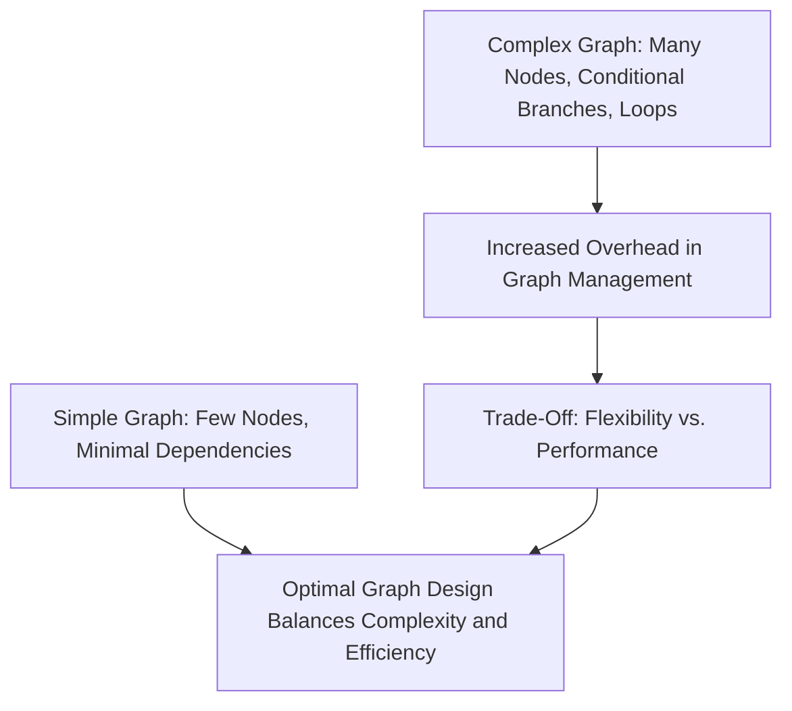

# Day 99: Graph API for Complex DAG Workloads

In modern GPU computing, many applications require complex workflows that consist of multiple kernels, memory transfers, and conditional operations. CUDA Graphs allow you to capture and execute these workflows as directed acyclic graphs (DAGs), reducing kernel launch overhead and enabling more predictable performance. However, designing a complex DAG—with conditional branches and loop structures—requires careful planning, as overcomplicating the graph can introduce significant overhead and make debugging more challenging.

This lesson explores how to build a multi-kernel DAG using CUDA Graphs, including handling conditional branches and loops. We also discuss the trade-offs involved and provide practical examples along with comprehensive conceptual diagrams.

---

## Table of Contents

1. [Overview](#1-overview)
2. [Understanding CUDA Graphs for DAG Workloads](#2-understanding-cuda-graphs-for-dag-workloads)
3. [Building a Multi-Kernel DAG](#3-building-a-multi-kernel-dag)
   - [a) Capturing Graphs](#a-capturing-graphs)
   - [b) Conditional Branches and Loops](#b-conditional-branches-and-loops)
4. [Pitfalls: Overcomplicating the Graph](#4-pitfalls-overcomplicating-the-graph)
5. [Code Example: Multi-Kernel DAG with Conditional Update](#5-code-example-multi-kernel-dag-with-conditional-update)
6. [Comprehensive Conceptual Diagrams](#6-comprehensive-conceptual-diagrams)
   - [Diagram 1: Overall DAG Workflow](#diagram-1-overall-dag-workflow)
   - [Diagram 2: Conditional Branching in a Graph](#diagram-2-conditional-branching-in-a-graph)
   - [Diagram 3: Loop Simulation via Graph Reuse](#diagram-3-loop-simulation-via-graph-reuse)
7. [References & Further Reading](#7-references--further-reading)
8. [Conclusion & Next Steps](#8-conclusion--next-steps)

---

## 1. Overview

CUDA Graphs provide a framework to capture and replay a sequence of operations—such as kernel launches and memory transfers—as a single executable entity. This capability is especially useful for repetitive or complex workflows. On Day 99, we focus on building complex DAGs that incorporate conditional branches and loops. These constructs enable dynamic behavior in your application but also increase the risk of incurring overhead if the graph becomes too complex.

---

## 2. Understanding CUDA Graphs for DAG Workloads

A CUDA graph is a collection of nodes that represent kernels, memory operations, and other tasks, connected by dependency edges that define execution order. When you capture a CUDA graph:
- **Nodes:** Represent individual operations (kernel launches, memcpys, etc.).
- **Edges:** Define dependencies; a node cannot begin until all its predecessors have completed.
- **Graph Instantiation:** Once captured, a CUDA graph can be instantiated into an executable object (`cudaGraphExec_t`) and launched with minimal overhead.

The power of CUDA Graphs lies in their ability to minimize runtime overhead and provide deterministic execution in complex workflows.

---

## 3. Building a Multi-Kernel DAG

### a) Capturing Graphs

The typical workflow involves:
1. Creating a CUDA stream.
2. Beginning graph capture with `cudaStreamBeginCapture()`.
3. Executing a series of operations (kernels, memcpys) on the stream.
4. Ending capture with `cudaStreamEndCapture()` to produce a CUDA graph.

### b) Conditional Branches and Loops

Although CUDA Graphs do not natively support dynamic conditional branches or loops within a single graph, you can simulate these behaviors by:
- **Dynamic Graph Updates:** Using the `cudaGraphExecUpdate` API to modify nodes based on runtime conditions.
- **Graph Reuse:** Capturing multiple graphs and selecting the appropriate one based on conditional logic in host code.
- **Loop Simulation:** Replaying a graph multiple times to mimic iterative behavior.

These techniques allow you to incorporate dynamic behavior into your DAG without reconstructing the entire graph each time.

---

## 4. Pitfalls: Overcomplicating the Graph

- **Excessive Complexity:** A graph with too many nodes and dependencies may introduce overhead that negates the benefits of reduced kernel launch latency.
- **Maintenance Difficulty:** Complex graphs are harder to update and debug.  
- **Graph Update Errors:** Mishandling node updates or failing to preserve dependency relationships can lead to crashes.

The key is to strike a balance between dynamic flexibility and simplicity.

---

## 5. Code Example: Multi-Kernel DAG with Conditional Update

Below is an example demonstrating how to capture a CUDA graph that includes a kernel node, and then update that node dynamically based on a runtime condition (simulating a conditional branch).

```cpp
#include <cuda_runtime.h>
#include <stdio.h>

// Sample kernel that increments data by an offset.
__global__ void incrementKernel(float* d_data, int N, float offset) {
    int idx = blockIdx.x * blockDim.x + threadIdx.x;
    if (idx < N) {
        d_data[idx] += offset;
    }
}

int main() {
    int N = 1 << 20;
    size_t size = N * sizeof(float);
    float *d_data;
    cudaMalloc(&d_data, size);
    cudaMemset(d_data, 0, size);

    // Create a CUDA stream for graph capture.
    cudaStream_t stream;
    cudaStreamCreate(&stream);

    // Define initial kernel parameters.
    int threads = 256;
    int blocks = (N + threads - 1) / threads;
    float initOffset = 1.0f;

    // Capture the CUDA graph.
    cudaStreamBeginCapture(stream, cudaStreamCaptureModeGlobal);
    // Launch the kernel with the initial offset.
    incrementKernel<<<blocks, threads, 0, stream>>>(d_data, N, initOffset);
    cudaStreamEndCapture(stream, &graph);

    // Instantiate the captured graph.
    cudaGraphExec_t graphExec;
    cudaGraphInstantiate(&graphExec, graph, NULL, NULL, 0);

    // Launch the graph.
    cudaGraphLaunch(graphExec, stream);
    cudaStreamSynchronize(stream);

    // Suppose we now need to update the kernel offset to a new value.
    float newOffset = 2.0f;
    // Prepare new kernel node parameters (for simplicity, assume graph has one node).
    cudaKernelNodeParams newKernelParams = {0};
    void* newArgs[3] = { (void*)&d_data, (void*)&N, (void*)&newOffset };
    newKernelParams.func = (void*)incrementKernel;
    newKernelParams.gridDim = dim3(blocks);
    newKernelParams.blockDim = dim3(threads);
    newKernelParams.sharedMemBytes = 0;
    newKernelParams.kernelParams = newArgs;

    // Update the graph with the new parameters.
    size_t numUpdatedNodes;
    cudaGraphExecUpdate(graphExec, graph, NULL, NULL, &numUpdatedNodes);
    printf("Graph updated: %zu node(s) modified.\n", numUpdatedNodes);

    // Re-launch the updated graph.
    cudaGraphLaunch(graphExec, stream);
    cudaStreamSynchronize(stream);

    // Cleanup.
    cudaGraphExecDestroy(graphExec);
    cudaGraphDestroy(graph);
    cudaStreamDestroy(stream);
    cudaFree(d_data);

    return 0;
}
```

**Explanation:**
- The graph is captured with an initial kernel launch using an offset of 1.0.
- The graph is instantiated and launched.
- Later, the kernel's offset is updated to 2.0 using the CUDA Graph Update API.
- Proper error checking and node management are required to ensure the update succeeds.

---

## 6. Comprehensive Conceptual Diagrams

### Diagram 1: CUDA Graph Lifecycle with Updates

```mermaid
flowchart TD
    A[Begin Graph Capture]
    B[Execute Kernel(s) with Initial Parameters]
    C[End Graph Capture → Obtain CUDA Graph]
    D[Instantiate Graph (GraphExec)]
    E[Execute Graph for Baseline Run]
    F[Detect Need for Parameter Update]
    G[Prepare New Kernel Parameters]
    H[Call cudaGraphExecUpdate to Update Node(s)]
    I[Re-launch Updated Graph]
    
    A --> B
    B --> C
    C --> D
    D --> E
    E --> F
    F --> G
    G --> H
    H --> I
```

**Explanation:**  
This diagram shows the entire lifecycle of a CUDA graph from capture, instantiation, execution, dynamic update, and re-launch.

---

### Diagram 2: Conditional Branching via Graph Updates

```mermaid
flowchart TD
    A[Initial Graph with Kernel Node (offset = initOffset)]
    B[Runtime Condition: Need to change offset]
    C[Prepare new parameters (offset = newOffset)]
    D[Update Kernel Node using cudaGraphExecUpdate]
    E[Graph now reflects new parameter]
    F[Re-launch Graph with Updated Node]
    
    A --> B
    B --> C
    C --> D
    D --> E
    E --> F
```

**Explanation:**  
This diagram details how a conditional change (such as a new offset) is applied to a CUDA graph by updating the relevant node without reconstructing the entire graph.

---

### Diagram 3: Complexity and Overhead in Graphs



**Explanation:**  
This diagram highlights the trade-off when designing complex CUDA graphs. While adding conditional branches and loops increases flexibility, it can also lead to management overhead, emphasizing the need for a balanced design.

---

## 7. References & Further Reading

- [CUDA Graphs Documentation](https://docs.nvidia.com/cuda/cuda-c-programming-guide/index.html#cuda-graphs)
- [Nsight Systems Documentation](https://docs.nvidia.com/nsight-systems/)
- [CUDA C Programming Guide – Advanced Topics](https://docs.nvidia.com/cuda/cuda-c-programming-guide/index.html)
- [NVIDIA Developer Blog – CUDA Graphs](https://developer.nvidia.com/blog/tag/cuda-graphs/)

---

## 8. Conclusion & Next Steps

Advanced graph updates enable dynamic, adaptive GPU workflows with minimal overhead. This "God Mode" level understanding of CUDA Graph APIs helps you efficiently update and reuse graphs in complex scenarios. Mastery of these techniques allows for the design of highly adaptive, high-performance applications capable of responding to dynamic workloads without incurring the full cost of rebuilding graphs.

**Next Steps:**
- **Experiment:** Implement dynamic graph updates in your projects and measure the performance impact.
- **Profile:** Use Nsight Systems to analyze graph execution and update overhead.
- **Refine:** Continuously optimize graph structures to balance flexibility with efficiency.
- **Document:** Maintain detailed records of graph update strategies and observed performance gains.

```
