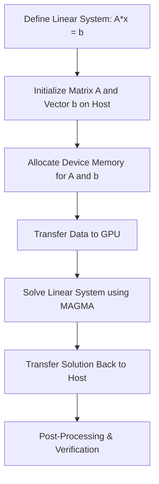

# Day 110: HPC Tools & Libraries (MAGMA, etc.)

High-performance computing (HPC) often demands advanced linear algebra capabilities that can fully leverage GPU acceleration. NVIDIA's ecosystem provides several libraries to address these needs, and one notable example is **MAGMA** (Matrix Algebra on GPU and Multicore Architectures). MAGMA is designed to provide high-performance implementations of complex linear algebra routines on heterogeneous architectures. However, integrating such libraries can be challenging, particularly due to potential library/hardware version mismatches that may lead to build or runtime errors.

In this lesson, we will explore the key concepts behind HPC tools and libraries for GPU-accelerated linear algebra, with a focus on MAGMA. We will discuss its advantages, common pitfalls related to version mismatches, and best practices for integrating and optimizing MAGMA in your HPC workflows.

---

## Table of Contents

1. [Overview](#1-overview)  
2. [HPC Tools & Libraries for GPU Linear Algebra](#2-hpc-tools--libraries-for-gpu-linear-algebra)  
3. [Introduction to MAGMA](#3-introduction-to-magma)  
4. [Key Challenges: Version Mismatches](#4-key-challenges-version-mismatches)  
5. [Best Practices for Integration](#5-best-practices-for-integration)  
6. [Code Example: Solving a Linear System Using MAGMA](#6-code-example-solving-a-linear-system-using-magma)  
7. [Conceptual Diagrams](#7-conceptual-diagrams)  
   - [Diagram 1: MAGMA Integration Workflow](#diagram-1-magma-integration-workflow)  
   - [Diagram 2: Handling Version Mismatches](#diagram-2-handling-version-mismatches)  
   - [Diagram 3: HPC Linear Algebra Pipeline](#diagram-3-hpc-linear-algebra-pipeline)  
8. [References & Further Reading](#8-references--further-reading)  
9. [Conclusion & Next Steps](#9-conclusion--next-steps)

---

## 1. Overview

Advanced HPC applications in domains like computational fluid dynamics, climate modeling, and large-scale simulations require efficient and scalable linear algebra routines. MAGMA is one such library that accelerates advanced linear algebra computations on GPUs and multicore CPUs. It provides routines for solving linear systems, eigenvalue problems, and performing matrix factorizations, among others. Proper integration of MAGMA into your application can lead to significant performance improvements, but it requires careful management of library versions and hardware compatibility.

---

## 2. HPC Tools & Libraries for GPU Linear Algebra

To achieve high performance in HPC, you can leverage several libraries and tools:
- **MAGMA:** Offers state-of-the-art implementations of complex linear algebra routines tailored for GPUs and multicore architectures.
- **cuBLAS and cuSOLVER:** NVIDIA’s libraries for dense and sparse linear algebra.
- **Eigen, Armadillo:** High-level C++ libraries that can offload computations to GPUs using backend libraries.
- **MPI & OpenMP:** For parallelizing computations across nodes and within multicore systems.

---

## 3. Introduction to MAGMA

MAGMA is an open-source project that provides GPU-accelerated linear algebra routines. It is designed to achieve high performance on heterogeneous architectures by combining the computational power of GPUs with the flexibility of multicore CPUs. MAGMA supports a wide range of operations, including:
- Matrix factorizations (LU, QR, Cholesky)
- Eigenvalue and singular value decompositions
- Solving linear systems

MAGMA’s design allows it to outperform traditional CPU-only libraries (like LAPACK) on large-scale problems. However, its integration requires careful attention to library versions and hardware compatibility.

---

## 4. Key Challenges: Version Mismatches

One of the most common challenges when using MAGMA (and similar HPC libraries) is managing version mismatches:
- **Library Dependencies:** Ensure that the version of MAGMA you are using is compatible with your CUDA Toolkit, GPU drivers, and any other dependent libraries (e.g., cuBLAS).
- **Hardware Compatibility:** Some routines in MAGMA are optimized for specific GPU architectures. Using an unsupported or outdated GPU may result in suboptimal performance or build errors.
- **Build Environment:** Incorrect compiler flags or inconsistent build configurations can lead to linker errors, undefined symbols, or runtime crashes.

---

## 5. Best Practices for Integration

- **Consistent Environment:** Always use a consistent set of versions for the CUDA Toolkit, MAGMA, and GPU drivers.
- **Read Documentation:** Refer to the [MAGMA website](https://icl.utk.edu/magma/) and its installation guides for version compatibility.
- **Use a Robust Build System:** Employ CMake or similar build systems to manage compilation and linking. Ensure that all modules use the correct NVCC flags (e.g., `-rdc=true`) when needed.
- **Incremental Testing:** Integrate MAGMA into your project in small steps and test each component thoroughly before full-scale integration.
- **Performance Profiling:** Use tools like Nsight Systems and Nsight Compute to measure performance and verify that MAGMA routines provide the expected speedups.

---

## 6. Code Example: Solving a Linear System Using MAGMA

Below is a simplified example demonstrating how to use MAGMA to solve a linear system \( Ax = b \). Note that this example assumes you have MAGMA installed and configured correctly.

```cpp
#include <stdio.h>
#include <stdlib.h>
#include "magma_v2.h"
#include "magma_lapack.h"

int main() {
    magma_init();  // Initialize MAGMA

    magma_int_t N = 1024; // Matrix size
    magma_int_t lda = N;
    magma_int_t ldb = N;
    magma_int_t info;
    magma_int_t *ipiv;
    
    // Allocate host memory for matrix A and right-hand side b
    float *h_A = (float*) malloc( N * N * sizeof(float) );
    float *h_B = (float*) malloc( N * sizeof(float) );
    ipiv = (magma_int_t*) malloc( N * sizeof(magma_int_t) );

    // Initialize matrix A and vector b (for demonstration, using random values)
    for (int i = 0; i < N * N; i++) {
        h_A[i] = ((float) rand()) / RAND_MAX;
    }
    for (int i = 0; i < N; i++) {
        h_B[i] = ((float) rand()) / RAND_MAX;
    }

    // Allocate device memory for matrix A and vector b
    float *d_A, *d_B;
    magma_smalloc(&d_A, N * N);
    magma_smalloc(&d_B, N);

    // Transfer data to the GPU
    magma_ssetmatrix(N, N, h_A, lda, d_A, lda, magma_stream());
    magma_ssetvector(N, h_B, 1, d_B, 1, magma_stream());

    // Solve the linear system A*x = b using MAGMA's sgesv
    magma_sgesv(N, 1, d_A, lda, ipiv, d_B, ldb, &info);

    if (info == 0) {
        printf("Linear system solved successfully.\n");
    } else {
        printf("Error solving linear system: info = %d\n", info);
    }

    // Transfer solution back to host
    magma_sgetvector(N, d_B, 1, h_B, 1, magma_stream());

    // (Optional) Print first 10 values of the solution
    for (int i = 0; i < 10; i++) {
        printf("x[%d] = %f\n", i, h_B[i]);
    }

    // Cleanup
    magma_free(d_A);
    magma_free(d_B);
    free(h_A);
    free(h_B);
    free(ipiv);
    magma_finalize(); // Finalize MAGMA

    return 0;
}
```

**Explanation:**
- **Initialization:** MAGMA is initialized using `magma_init()`.
- **Memory Allocation:** Host memory for matrix \( A \) and vector \( b \) is allocated and initialized.
- **Data Transfer:** The matrix and vector are transferred from host to device.
- **Solving the System:** MAGMA's `magma_sgesv` routine solves the linear system.
- **Result Retrieval:** The solution is copied back to host memory for verification.
- **Cleanup:** All allocated resources are freed, and MAGMA is finalized.

---

## 7. Comprehensive Conceptual Diagrams

### Diagram 1: HPC Workflow for GPU-Accelerated Linear Algebra



**Explanation:**  
This diagram shows the overall workflow for solving a linear system using MAGMA, from initialization and data transfer to computation and result retrieval.

---

### Diagram 2: Memory Transfer and Computation Flow

```mermaid
flowchart TD
    A[Host Memory: Matrix A, Vector b]
    B[cudaMemcpy (or MAGMA Set Functions) transfers data to GPU]
    C[GPU: MAGMA sgesv Routine solves the system]
    D[Result transferred back to Host]
    
    A --> B
    B --> C
    C --> D
```

**Explanation:**  
This diagram emphasizes the critical steps of data movement and GPU computation in the MAGMA workflow, highlighting the role of efficient memory transfers.

---

### Diagram 3: Handling Version Mismatches and Build Dependencies

```mermaid
flowchart TD
    A[CUDA Toolkit Version]
    B[MAGMA Library Version]
    C[GPU Driver Version]
    D[Consistent Build Environment using CMake]
    E[Proper NVCC Flags (-rdc=true, etc.)]
    F[Successful Compilation & Linking]
    G[Runtime Stability]
    
    A --> D
    B --> D
    C --> D
    D --> E
    E --> F
    F --> G
```

**Explanation:**  
This diagram outlines the importance of maintaining a consistent build environment by ensuring that the CUDA Toolkit, MAGMA, and GPU driver versions are compatible. Using a robust build system like CMake and proper compiler flags is essential to avoid version mismatches that can lead to build or runtime errors.

---

## 8. References & Further Reading

- [MAGMA Project Homepage](https://icl.utk.edu/magma/)  
- [NVIDIA AMGX and Mixed Precision Resources](https://developer.nvidia.com/amgx)  
- [CUDA C Programming Guide – Memory Hierarchy and Performance](https://docs.nvidia.com/cuda/cuda-c-programming-guide/index.html#memory-hierarchy)
- HPC conference proceedings (SC, IEEE) on GPU-accelerated linear algebra

---

## 9. Conclusion & Next Steps

Optimizing advanced linear algebra operations using HPC tools like MAGMA can significantly boost performance in scientific and engineering applications. This lesson provided a step-by-step approach to solving a linear system using MAGMA, emphasizing data transfer efficiency, robust version management, and the importance of maintaining a consistent build environment. 

**Next Steps:**
- **Experiment with Other Routines:** Explore additional MAGMA routines for eigenvalue problems or matrix factorizations.
- **Profile Performance:** Use tools like Nsight Compute to analyze the performance of MAGMA routines in your application.
- **Integrate with MPI:** Extend your implementation to multi-node environments for distributed HPC applications.
- **Document Best Practices:** Record configuration settings and performance metrics to guide future optimizations.

```
